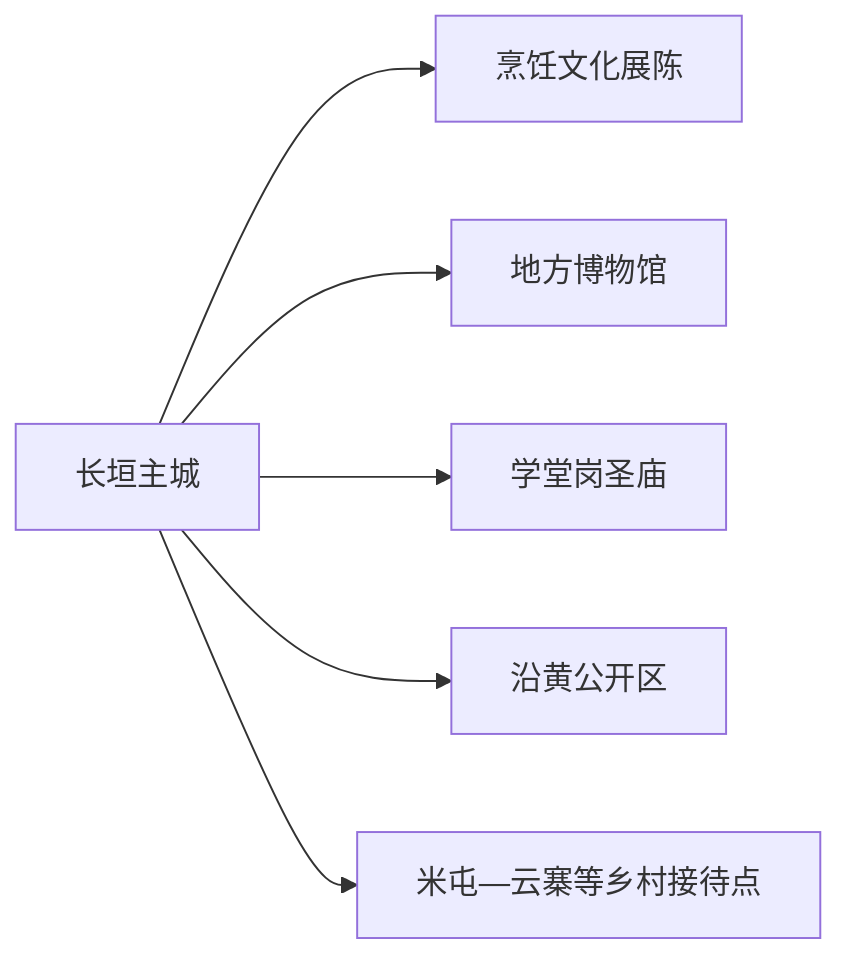
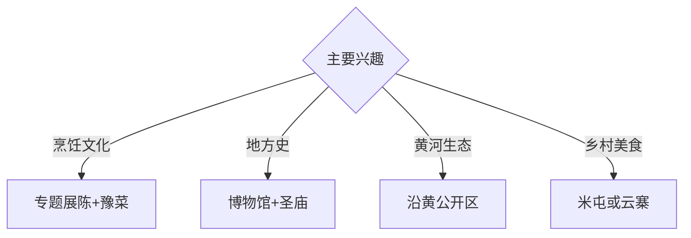

# 长垣旅行指南

长垣位于河南东北部黄河沿岸，以豫菜与厨师文化、历史遗存、沿黄湿地和特色产业城市观察形成旅行线索。固定快照中的 **Changyuan / GeoNames 1815476** 对应现行长垣市；城市文化空间、沿黄公开区和乡村接待点宜分组安排。

## 城市速览

| 项目 | 信息 |
|---|---|
| 主线 | 烹饪文化—长垣文博—学堂岗圣庙—沿黄湿地 |
| 停留 | 主城1天；沿黄或乡村美食另加半天至1天 |
| 住宿 | 长垣主城便于餐饮、文博与公路换乘 |
| 交通 | 公路与铁路衔接，沿黄和乡村点位宜约车或自驾 |
| 风险 | 黄河水情、堤防工程、湿地保护、产业园生产和农田边界 |

## 城市格局与游览区域

主城集中住宿、餐饮和公共文化空间；学堂岗圣庙等历史点位适合与主城组合。沿黄湿地、堤防和乡村接待点距离更远，按官方开放区与道路安排；起重、防腐和医疗器械等产业园以生产为主，公众参观通过明确预约的展示空间完成。

## 主要景点

| 景点 | 区域 | 类型 | 核心体验 | 用时 | 环境 | 体力 | 研究价值 | 拥挤 | 优先级 |
|---|---|---|---|---:|---|---|---|---|---|
| 中国烹饪文化博物馆或更新后公开展陈 | 主城 | 专题博物馆 | 烹饪史、厨师文化与豫菜技艺 | 2–3小时 | 室内 | 低 | 很高 | 团体时中 | A |
| 长垣市博物馆或地方展陈 | 主城 | 博物馆 | 地方历史、黄河文化与城市发展 | 2小时 | 室内 | 低 | 高 | 团体时中 | A |
| 学堂岗圣庙公开区 | 城郊 | 古建筑 | 儒学传统、地方教育与古建空间 | 1–2小时 | 混合 | 低 | 很高 | 节假日中 | A |
| 黄河湿地正式开放区 | 沿黄方向 | 湿地与河流 | 黄河生态、候鸟与滩区地貌 | 半天 | 室外 | 低中 | 高 | 观鸟季中 | A |
| 长垣中央公园等城市公共空间 | 主城 | 城市公园 | 城市格局、居民生活与休憩 | 1–2小时 | 室外 | 低 | 中 | 傍晚中 | B |
| 米屯或云寨正规乡村接待点 | 市域乡村 | 美食与乡村 | 地方餐饮、村落生活与农旅体验 | 半天 | 混合 | 低 | 高 | 节假日中 | B |
| 恼里等正规乡村旅游点 | 东部乡村 | 乡村与非遗 | 村庄风貌、地方技艺与田园 | 半天 | 混合 | 低中 | 中 | 周末中 | B |

## 美食与餐饮

长垣是著名厨师之乡，豫菜宴席、传统烹饪技艺和乡村美食是核心体验。优先选择菜单、价格和食品经营信息清晰的餐馆，可提前说明人数、预算与忌口；主题宴席适合多人分享，单人旅行可选择小份菜与地方小吃。

## 经典行程

### 一日城市基础线
**路线**：烹饪文化展陈—豫菜午餐—地方博物馆—中央公园。**逻辑**：从核心技艺进入地方史与现代城市。**预约锚点**：两馆开放和餐厅订位。**休息**：主城。**删除条件**：专题展陈更新未开放时增加地方文博与餐饮体验。

### 烹饪文化线
**路线**：专题展陈—正规烹饪体验或讲解—午餐—地方食品选购。**逻辑**：把历史、技法与餐桌体验连成一线。**预约锚点**：展馆、课程和餐厅。**休息**：主城商业区。**删除条件**：体验暂停时保留展陈和正式餐饮。

### 州城文脉线
**路线**：地方博物馆—学堂岗圣庙公开区—午餐—主城公共文化空间。**逻辑**：用文物与古建补足厨师文化之外的城市史。**预约锚点**：展馆和古建开放。**休息**：主城。**删除条件**：古建维护时改馆内专题展。

### 沿黄生态线
**路线**：主城—黄河湿地正式入口—观景或观鸟点—返城。**逻辑**：在管理边界内观察河流与湿地。**预约锚点**：开放区、水情和车辆。**休息**：正规服务点。**删除条件**：洪水、大雾、强风或湿地保护管控时取消。

### 乡村美食线
**路线**：米屯或云寨正规接待点—村落公共空间—预约午餐—返城。**逻辑**：把地方菜放回乡村生活与生产环境。**预约锚点**：接待、餐饮和车辆。**休息**：正规经营点。**删除条件**：农忙、接待暂停或道路管控时改主城餐饮。

### 亲子低体力线
**路线**：烹饪文化展陈—午休—地方博物馆—中央公园短线。**逻辑**：室内知识配轻量城市活动。**预约锚点**：亲子讲解或课程。**休息**：两馆与公园。**删除条件**：儿童体力不足时缩短公园段。

### 雨天线
**路线**：烹饪文化展陈—午餐—地方博物馆—正规室内文化活动。**逻辑**：以文博和餐饮保持完整体验。**预约锚点**：馆舍和餐厅开放。**休息**：主城。**删除条件**：道路积水时就近返宿。

## 住宿区域

长垣主城适合公路、铁路抵离，餐饮选择和公共服务集中；沿黄与乡村住宿按合法经营、消防、夜间道路和天气响应能力选择。以美食为主的行程住主城更便于晚餐后返回。

## 市内交通

长垣站、长垣东站服务不同铁路方向，订票后核对实际到发站。主城用公交、出租车和网约车；沿黄湿地、学堂岗和乡村点位提前确认城乡班次或预约返程。

## 不同旅行者须知

美食旅行者提前订位并说明忌口；历史兴趣者优先地方展陈与学堂岗圣庙；亲子家庭选择烹饪主题和城市公园；观鸟者准备望远镜并依湿地季节性开放安排。

## 行前核对

- 核对烹饪文化展陈、地方博物馆、学堂岗圣庙、湿地与乡村接待。
- 核对铁路站点、餐厅订位、黄河水情、观鸟季节和返程。
- 黄河堤防与工程区、湿地核心保护区、起重及防腐等生产园区、医疗器械生产区和农田按正式开放边界进入。

## 来源与更新记录

| 来源 | 支持内容 | 核验日期 |
|---|---|---|
| [长垣市政府采购文件：中国烹饪文化博物馆提升](https://jinshui.zfcg.henan.gov.cn/cmsweb81e27e/nas/webfile2024/changyuan/rootfiles/2024/12/23/15a2161beba34cf294fdfc23c60d731a.pdf) | 烹饪文化博物馆及更新项目 | 2026-09-01 |
| [河南省民政厅：长垣美食与乡村发展](https://mzt.henan.gov.cn/2025/01-09/3109881.html) | 厨师之乡、美食名城与乡村旅游 | 2026-09-01 |
| [GeoNames 1815476](https://www.geonames.org/1815476/) | Changyuan 固定人口点与位置 | 2026-09-01 |

| 日期 | 更新 |
|---|---|
| 2026-09-01 | 首次完成长垣旅行研究；建立烹饪、文博、沿黄与乡村路线。 |

