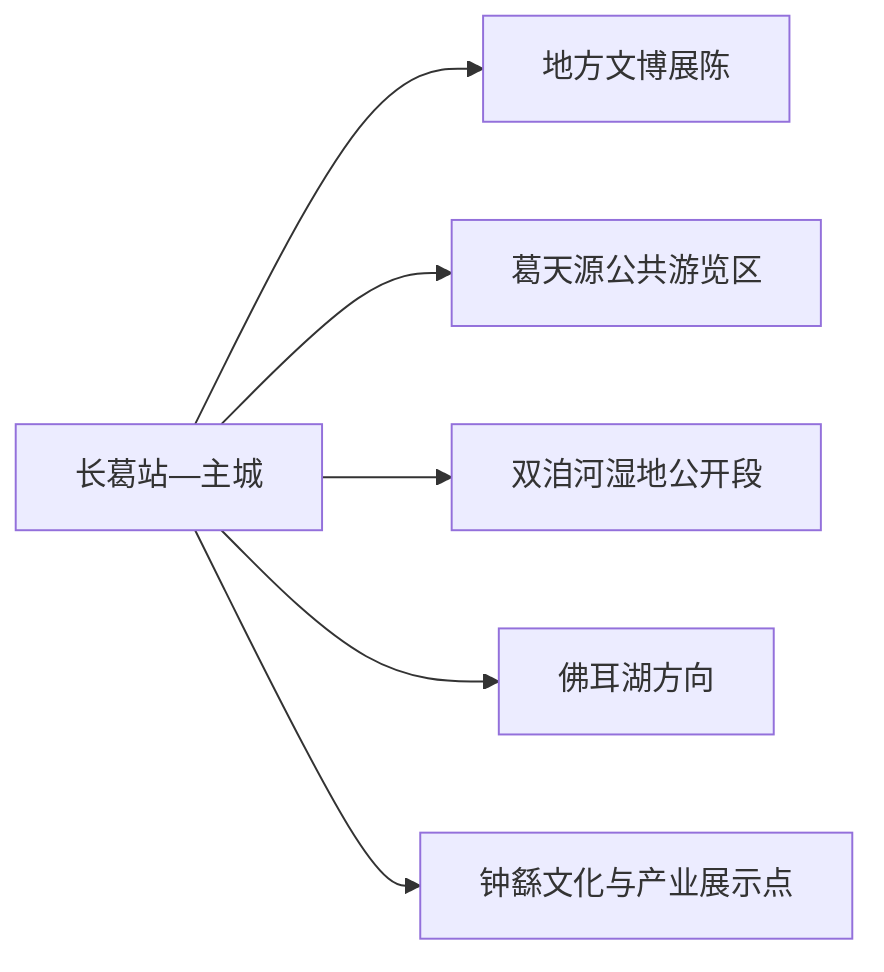
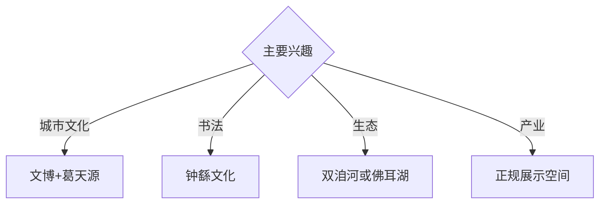

# 长葛旅行指南

长葛位于郑州与许昌之间，葛天氏乐舞文化、钟繇书法、双洎河湿地和佛耳湖构成城市文化与平原生态线，蜂产品、卫浴及再生金属产业则提供当代城市观察。固定快照中的 **Changge / GeoNames 1808310** 对应现行长葛市；主城公共空间、湖湿地方向与产业接待点宜分组安排。

## 城市速览

| 项目 | 信息 |
|---|---|
| 主线 | 长葛文博—葛天源—双洎河—佛耳湖 |
| 停留 | 主城1天；湖区或乡村另加半天至1天 |
| 住宿 | 长葛主城便于铁路、公路与郑许联程 |
| 交通 | 铁路、公路抵达，湖区与乡村宜公交、约车或自驾 |
| 风险 | 湿地与水库管理、农业生产、金属加工和卫浴产业园边界 |

## 城市格局与游览区域

主城承担住宿、地方展陈与葛天氏文化体验；双洎河和佛耳湖是不同的水系方向，按当期开放游线安排。蜂产品、卫浴、机械和再生金属产业参观通过企业明确开放的展厅完成，生产车间、物流和原料区依门禁管理。

## 主要景点

| 景点 | 区域 | 类型 | 核心体验 | 用时 | 环境 | 体力 | 研究价值 | 拥挤 | 优先级 |
|---|---|---|---|---:|---|---|---|---|---|
| 长葛市博物馆或地方展陈 | 主城 | 博物馆 | 葛天氏传说、钟繇书法与城市史 | 2小时 | 室内 | 低 | 高 | 团体时中 | A |
| 葛天源公共游览区 | 新区 | 城市公园与文化 | 乐舞主题、湖景与城市休闲 | 2–3小时 | 室外 | 低 | 高 | 节假日中 | A |
| 双洎河国家湿地公园公开段 | 市域水系 | 湿地 | 河流生态、平原湿地与观鸟 | 半天 | 室外 | 低中 | 高 | 观鸟季中 | A |
| 佛耳湖正式开放区 | 佛耳湖镇方向 | 湖泊与休闲 | 湖景、乡村与管理型水域体验 | 半天 | 室外 | 低 | 中 | 周末中 | B |
| 钟繇书法文化公开空间 | 主城或相关文化点 | 名人与书法 | 楷书传统、碑帖与地方记忆 | 1–2小时 | 混合 | 低 | 很高 | 活动时中 | A |
| 陉山正规游览点 | 南部方向 | 丘陵与历史 | 子产文化、平原边缘地貌与乡野 | 半天 | 室外 | 中 | 中 | 周末低 | B |
| 正规蜂产品或产业展示空间 | 市域产业点 | 产业与科普 | 蜂业、装备制造与县域产业观察 | 2小时 | 室内 | 低 | 中 | 团体时中 | B |

## 美食与餐饮

长葛腐竹、蜂产品、烩面和许昌地区家常菜具有地方辨识度。蜂产品购买关注配料、生产许可与适用人群；湖区和乡村用餐选择证照、价格和接待范围清晰的经营点。

## 经典行程

### 一日城市基础线
**路线**：地方展陈—午餐—钟繇文化空间—葛天源。**逻辑**：从地方史、书法进入现代城市公共空间。**预约锚点**：展馆和文化点开放。**休息**：主城。**删除条件**：高温时缩短葛天源户外段。

### 葛天乐舞线
**路线**：地方展陈—葛天源公共区—主题景观—城市文化活动。**逻辑**：辨认传说、地方文化表达与当代公园设计。**预约锚点**：活动与场地开放。**休息**：新区商业区。**删除条件**：活动暂停时保留文博与公园慢游。

### 钟繇书法线
**路线**：书法文化公开空间—碑帖讲解—午餐—地方展陈。**逻辑**：用人物、作品和城市记忆建立书法主题。**预约锚点**：展陈和讲解。**休息**：主城。**删除条件**：专题空间未开放时改公共文化馆。

### 双洎河湿地线
**路线**：主城—湿地正式入口—公开观景段—返城。**逻辑**：在平缓路线观察河流生态。**预约锚点**：开放、水情和车辆。**休息**：正规服务点。**删除条件**：洪水、大雾、强风或生态管控时取消。

### 佛耳湖乡村线
**路线**：主城—佛耳湖正式开放区—湖景短线—正规乡村午餐—返城。**逻辑**：用半天体验湖区与乡村。**预约锚点**：水域开放、接待和车辆。**休息**：湖区服务点。**删除条件**：水库管理或道路管控时改主城。

### 亲子产业线
**路线**：地方展陈—午休—正规蜂产品科普或产业展厅—葛天源短线。**逻辑**：用城市知识和生产科普组合低体力行程。**预约锚点**：企业接待。**休息**：展厅与公园。**删除条件**：接待暂停时增加公共文化活动。

### 雨天线
**路线**：地方展陈—午餐—书法展陈—正规产业展示空间。**逻辑**：以室内内容保留历史与产业主题。**预约锚点**：馆舍和企业开放。**休息**：主城。**删除条件**：道路积水时就近返宿。

## 住宿区域

长葛站—主城适合铁路、公路抵离和郑州—许昌联程；新区住宿适合葛天源与城市公共空间。乡村住宿按合法经营、消防、夜间道路和天气响应能力选择。

## 市内交通

长葛站、长葛北站服务不同铁路方向，订票后核对到发站。主城用公交、出租车和网约车；双洎河、佛耳湖、陉山与产业点提前确认城乡班次或预约返程。

## 不同旅行者须知

书法兴趣者优先钟繇主题；亲子家庭选择文博、葛天源与预约科普；观鸟者按湿地季节安排；行动不便者确认湖岸路面、展馆无障碍和卫生间。

## 行前核对

- 核对地方展陈、葛天源、书法空间、湿地、佛耳湖与产业接待。
- 核对铁路站点、水情、湿地开放、乡村道路和返程。
- 湿地核心保护区、水库工程区、农田、金属加工与卫浴生产车间、物流仓储区按正式开放和生产边界进入。

## 来源与更新记录

| 来源 | 支持内容 | 核验日期 |
|---|---|---|
| [长葛市政府：长葛年鉴旅游发展](https://changge.gov.cn/uploadfile/27c28fb2-b816-4dde-b047-d47930393e4c/20211022110924603004.pdf) | 葛天源、钟繇文化、佛耳湖与双洎河旅游结构 | 2026-09-01 |
| [长葛市政府：城市概览资料](https://www.changge.gov.cn/BigFileUpLoadStorage/temp/2023-06-15/8cab8d36-6de3-47af-b15f-2ecde0e14bad/%E5%8E%9A%E9%87%8D%E9%95%BF%E8%91%9B%E6%80%BB.pdf) | 佛耳湖、地方文化与城市资源 | 2026-09-01 |
| [GeoNames 1808310](https://www.geonames.org/1808310/) | Changge 固定人口点与位置 | 2026-09-01 |

| 日期 | 更新 |
|---|---|
| 2026-09-01 | 首次完成长葛旅行研究；建立乐舞、书法、湿地与产业路线。 |

