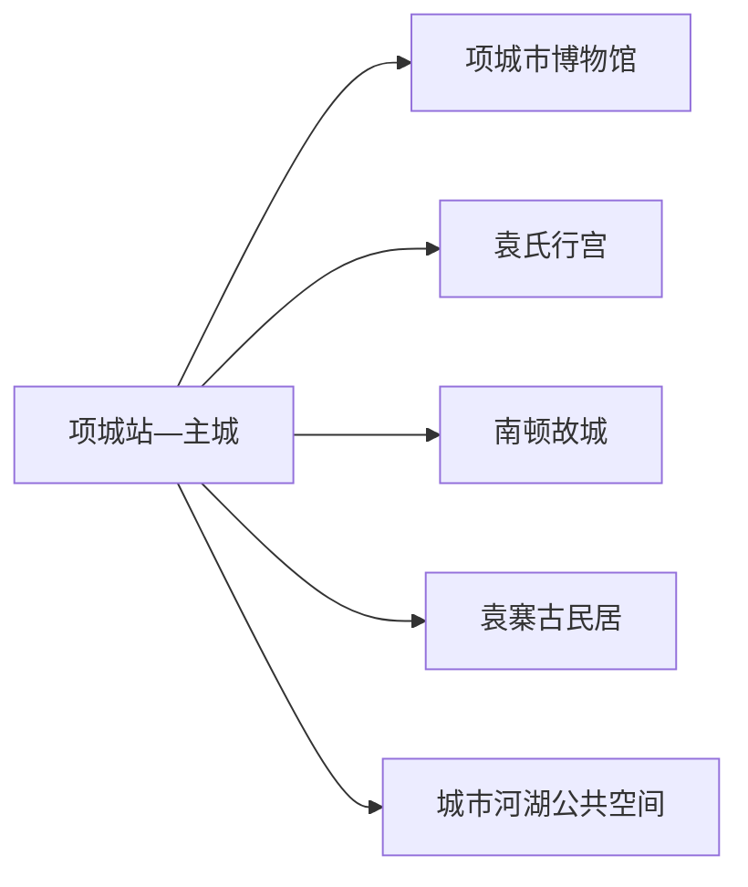
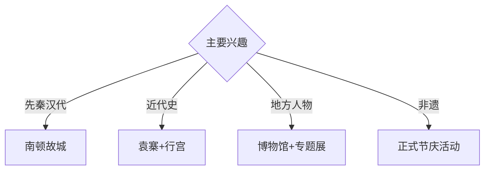

# 项城旅行指南

项城位于豫东南平原，南顿故城的先秦—汉代遗存、袁寨古民居和袁氏近代史、地方非遗与沙颍河支流水系构成历史主线。固定快照中的 **Huayuan / GeoNames 1805083** 对应项城主城花园街一带；主城、南顿和袁寨分属不同方向，适合按主题组织。

## 城市速览

| 项目 | 信息 |
|---|---|
| 主线 | 项城文博—南顿故城—袁寨古民居—袁氏行宫 |
| 停留 | 主城1天；南顿与袁寨组合后建议2天 |
| 住宿 | 项城主城便于铁路、公路和多方向换乘 |
| 交通 | 铁路、公路抵达，远端古迹宜公交、约车或自驾 |
| 风险 | 遗址与古建保护、节庆客流、河道水情、制革与农业生产边界 |

## 城市格局与游览区域

主城集中住宿、地方展陈与袁氏行宫；南顿故城位于光武街道方向，袁寨古民居位于王明口镇，二者车程和内容独立。考古区、古建修缮区、制革加工与仓储区以及农田依正式边界进入。

## 主要景点

| 景点 | 区域 | 类型 | 核心体验 | 用时 | 环境 | 体力 | 研究价值 | 拥挤 | 优先级 |
|---|---|---|---|---:|---|---|---|---|---|
| 南顿故城景区 | 光武街道 | 古城遗址 | 夏商遗存、顿国故城、汉文化与光武庙 | 半天 | 混合 | 低中 | 很高 | 节假日中高 | A |
| 袁寨古民居景区 | 王明口镇 | 近代建筑 | 防御型寨堡、袁氏家族与豫东民居 | 半天 | 混合 | 低中 | 很高 | 节假日中 | A |
| 项城市博物馆 | 主城 | 博物馆 | 地方考古、南顿故城与近代人物 | 2–3小时 | 室内 | 低 | 很高 | 团体时中 | A |
| 袁氏行宫公开区 | 主城 | 近代建筑 | 近代史、四合院空间与城市记忆 | 1–2小时 | 混合 | 低 | 高 | 节假日中 | A |
| 张伯驹等地方人物展陈 | 主城 | 名人文化 | 收藏、艺术与项城近现代人物 | 1–2小时 | 室内 | 低 | 高 | 团体时中 | B |
| 官会响锣或回民秧歌正式活动 | 市域乡镇 | 非遗 | 地方音乐、秧歌与节庆文化 | 2小时 | 混合 | 低 | 高 | 活动时高 | B |
| 城市河湖正式公共段 | 主城 | 城市公园 | 平原水系、慢行与居民生活 | 1–2小时 | 室外 | 低 | 中 | 傍晚中 | B |

## 美食与餐饮

项城小鸡烙馍、胡辣汤、羊肉汤和南顿清真十大碗具有地方辨识度。宴席类菜肴适合多人分享，提前说明人数和忌口；节庆活动期间错峰用餐并选择证照清晰的经营点。

## 经典行程

### 一日城市基础线
**路线**：项城市博物馆—午餐—袁氏行宫—城市河湖短线。**逻辑**：从地方通史进入近代城市记忆。**预约锚点**：博物馆和行宫开放。**休息**：主城。**删除条件**：高温时缩短河湖段。

### 南顿故城线
**路线**：主城—南顿故城入口—遗址与光武庙公开区—返城。**逻辑**：集中理解多时代遗址叠合。**预约锚点**：景区开放、演出和车辆。**休息**：景区服务区。**删除条件**：考古或维护安排时按开放单元缩短。

### 袁寨近代史线
**路线**：主城—袁寨古民居—寨堡与展陈—返城后袁氏行宫。**逻辑**：对照乡村寨堡与城市行宫，阅读近代家族史。**预约锚点**：两处开放和车辆。**休息**：袁寨服务点与主城。**删除条件**：古建维护时保留博物馆相关展陈。

### 地方人物线
**路线**：市博物馆—张伯驹等人物展陈—午餐—公共文化馆。**逻辑**：从考古转向收藏、艺术与近现代文化。**预约锚点**：专题展开放。**休息**：主城。**删除条件**：临展换展时改常设展。

### 非遗节庆线
**路线**：主城—官会响锣或回民秧歌官方活动点—村镇公共空间—返城。**逻辑**：在真实活动场景理解地方表演。**预约锚点**：活动日期、接待和车辆。**休息**：正规服务点。**删除条件**：非活动期改文化馆影像或展陈。

### 亲子低体力线
**路线**：市博物馆—午休—南顿故城近入口线—主城公园。**逻辑**：室内文物配平缓遗址观察。**预约锚点**：亲子讲解。**休息**：馆内和景区。**删除条件**：儿童体力不足时只留主城。

### 雨天线
**路线**：市博物馆—午餐—袁氏行宫室内开放单元—正规文化馆。**逻辑**：减少遗址和乡村道路暴露，保留历史主线。**预约锚点**：馆舍开放。**休息**：主城。**删除条件**：道路积水时就近返宿。

## 住宿区域

项城站—主城适合铁路、公路抵离和多方向换乘；南顿或袁寨附近住宿按正规接待、消防和夜间返程条件选择。两处远线同日安排时更适合约车。

## 市内交通

项城站、项城西站及公路客运服务不同方向，订票后核对到发站。主城用公交、出租车和网约车；南顿故城有城市公交连接，袁寨与非遗乡镇提前确认城乡班次或预约返程。

## 不同旅行者须知

考古兴趣者优先南顿故城；近代史兴趣者组合袁寨与行宫；亲子家庭选择博物馆和遗址短线；行动不便者确认古建门槛、遗址路面和无障碍卫生间。

## 行前核对

- 核对市博物馆、南顿故城、袁寨古民居、袁氏行宫与非遗活动。
- 核对铁路站点、节庆客流、城乡班次、河道水情和返程。
- 考古工作区、古建修缮区、河道工程区、制革加工仓储区和农田按正式开放与生产边界进入。

## 来源与更新记录

| 来源 | 支持内容 | 核验日期 |
|---|---|---|
| [项城市政府：南顿故城景区](https://www.xiangcheng.gov.cn/sitesources/xcs/page_pc/xxgk/fdzdgk/ly/article65ba24608e724fcfb5528bef0a045ba5.html) | 故城遗址构成、位置、交通与游览信息 | 2026-09-01 |
| [项城市政府：袁寨古民居景区](https://www.xiangcheng.gov.cn/sitesources/xcs/page_pc/xxgk/fdzdgk/ly/article49e3090310a6418eaccb311162903d21.html) | 袁寨建筑格局与近代史属性 | 2026-09-01 |
| [GeoNames 1805083](https://www.geonames.org/1805083/) | Huayuan 固定人口点与主城位置 | 2026-09-01 |

| 日期 | 更新 |
|---|---|
| 2026-09-01 | 首次完成项城旅行研究；建立故城、近代史、人物与非遗路线。 |

