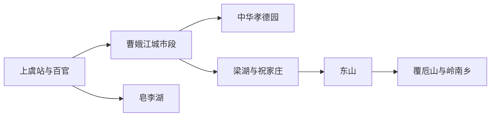
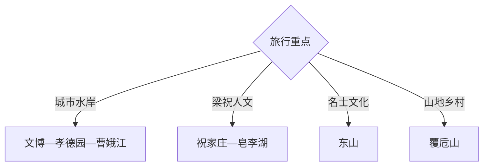

# 上虞旅行指南

上虞以曹娥江串起孝德文化、滨水新城与梁湖—祝家庄方向，东山和覆卮山则分别代表名士人文与四季山地。首访可用两天走曹娥江城市线和祝家庄—东山线，覆卮山适合另留完整一天。

## 城市速览

| 项目 | 信息 |
|---|---|
| 主线 | 百官—曹娥江—中华孝德园—梁湖祝家庄—东山—覆卮山 |
| 停留 | 城市与人文2天；覆卮山另加1天 |
| 住宿 | 百官与曹娥适合铁路和餐饮，岭南乡适合覆卮山早出 |
| 交通 | 铁路到站后以公交、出租车或预约车连接各片区 |
| 风险 | 梅雨台风、曹娥江水情、山地冰雪与乡村夜间返程 |
| 边界 | 考古遗址、宗祠民宅、茶园农田和山林按开放与生产边界进入 |

## 城市格局与游览区域

固定 `Lianghu / GeoNames 1919014` 是上虞区梁湖街道城市点，本页以法定上虞区 `Q1023800` 组织。百官—曹娥是交通与住宿核心，梁湖、东山在曹娥江南侧，覆卮山位于更远的南部山地。

## 主要景点

| 景点 | 区域 | 类型 | 核心体验 | 用时 | 环境 | 体力 | 预约风险 | 天气影响 | 优先级 |
|---|---|---|---|---:|---|---|---|---|---|
| 中华孝德园 | 曹娥江畔 | 文化园区 | 曹娥文化、舜耕传说与滨水景观 | 3–5小时 | 室内外 | 中 | 高 | 高 | A |
| 上虞博物馆或区级文博展陈 | 百官 | 地方文博 | 越地考古、名人文化与城市沿革 | 2–4小时 | 室内 | 低 | 很高 | 低 | A |
| 祝家庄景区公开区 | 梁湖街道 | 文学民俗 | 梁祝传说、村落与乡野水系 | 3–5小时 | 室内外 | 低中 | 高 | 高 | A |
| 东山景区 | 上浦镇方向 | 山地人文 | 谢安文化、曹娥江视野与摩崖古迹 | 半日 | 室外 | 中高 | 高 | 极高 | A |
| 覆卮山景区开放区 | 岭南乡 | 山地乡村 | 石浪、梯田、古村与四季景观 | 1天 | 室外 | 高 | 很高 | 极高 | A |
| 皂李湖公开湖岸 | 梁湖方向 | 湖泊休闲 | 湖岸、村落与低强度慢游 | 2–4小时 | 室外 | 低 | 中 | 高 | B |
| 曹娥江滨水公共空间 | 百官与曹娥 | 城市水岸 | 江河地理、桥梁与城市更新 | 2–4小时 | 室外 | 低 | 低 | 高 | B |
| 凤凰山考古或瓷源文化公开点 | 上浦方向 | 考古与陶瓷 | 早期瓷业、窑址与地方工艺 | 2–4小时 | 室内外 | 中 | 极高 | 高 | B |

## 美食与餐饮

可尝上虞盖北葡萄等季节水果、二都杨梅、梁湖年糕、崧厦霉千张和绍兴风味菜。水果按产季在正规基地购买，采摘先确认价格和可进入区域；黄酒菜与腌制品可主动询问酒精、盐度和过敏原。

## 经典行程

### 一日经典线
**路线**：区级文博—中华孝德园—曹娥江滨水。**逻辑**：先补历史背景，再沿同一城市水系游览。**预约锚点**：文博与孝德园开放。**休息**：百官。**删除条件**：天气不稳时缩短滨水段。

### 两日人文线
**路线**：首日城市水岸；次日祝家庄—皂李湖—梁湖用餐。**逻辑**：城市史与梁祝乡野分日。**预约锚点**：祝家庄展陈与车辆。**休息**：梁湖。**删除条件**：水情异常时取消皂李湖。

### 三日山水线
**路线**：前两日基础线；第三日覆卮山。**逻辑**：山地远线独占一天。**预约锚点**：景区开放、天气与返程。**休息**：岭南乡。**删除条件**：雷雨、冰雪或地质风险时整段删除。

### 雨天文化线
**路线**：区级文博—孝德园室内展陈—城市文化空间。**逻辑**：用室内内容保留上虞历史主线。**预约锚点**：场馆开放。**休息**：百官。**删除条件**：极端天气按预警减少跨江移动。

### 亲子梁祝线
**路线**：祝家庄—皂李湖短段—正规农事体验。**逻辑**：故事、湖岸和季节活动容易理解。**预约锚点**：活动年龄、采摘和供餐。**休息**：梁湖。**删除条件**：活动不匹配时保留祝家庄。

### 东山瓷源线
**路线**：凤凰山瓷源公开点—东山开放游线—上浦返程。**逻辑**：把陶瓷考古与名士山水放在同一南线。**预约锚点**：考古点、山路与讲解。**休息**：上浦镇。**删除条件**：山路湿滑时只留室内展陈。

### 低体力线
**路线**：车辆到区级文博—孝德园平缓段—曹娥江车辆观景。**逻辑**：用场馆和滨水平路替代山地。**预约锚点**：无障碍入口、落客和座椅。**休息**：孝德园。**删除条件**：滨水高温时只留场馆。

## 住宿区域

百官和曹娥适合铁路抵离、餐饮与跨片区换线；梁湖适合祝家庄慢游；岭南乡适合覆卮山早出，但住宿与供餐需提前确认。自驾住郊区时同时核对夜间道路和充电条件。

## 市内交通

上虞站、绍兴东站及不同客运节点对应的接驳方向不同，订票后按实际到站规划。城市段可公交加步行，东山和覆卮山更适合预约车或自驾。山地日预留返程缓冲，梅雨和冬季关注道路状态。

## 不同旅行者须知

人文旅行者优先孝德园、祝家庄与东山；徒步者单独安排覆卮山；亲子家庭选择文博和正规农事体验；低体力旅行者留在曹娥江城市段。山林、考古遗址、茶园果园和居民古村保留明确保护与生产边界。

## 行前核对

- 核对文博、孝德园、祝家庄、东山、覆卮山和瓷源点开放。
- 核对曹娥江水情、梅雨台风、山地冰雪、公交和返程车辆。
- 农事体验按经营者指定范围参与，古村与遗址沿公开游线参观。

## 来源与更新记录

| 来源 | 支持内容 | 核验日期 |
|---|---|---|
| [曹娥江旅游度假区年度计划](https://www.shangyu.gov.cn/art/2024/5/20/art_1629716_59151987.html) | 皂李湖、孝德文化小镇、东山与瓷源小镇 | 2026-09-01 |
| [上虞区政府：文旅工作布局](https://www.shangyu.gov.cn/art/2023/2/9/art_1229346094_1881256.html) | 一江一湖一山三镇与祝家庄等片区 | 2026-09-01 |
| [GeoNames 1919014](https://www.geonames.org/1919014/) | Lianghu 固定城市点 | 2026-09-01 |
| [Wikidata Q1023800](https://www.wikidata.org/wiki/Q1023800) | 上虞区实体与跨库标识 | 2026-09-01 |

| 日期 | 更新 |
|---|---|
| 2026-09-01 | 首次完成上虞旅行研究，按曹娥江、梁祝人文、东山与覆卮山组织。 |
