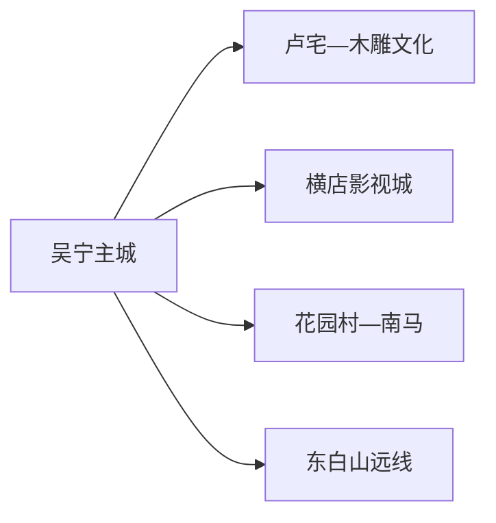
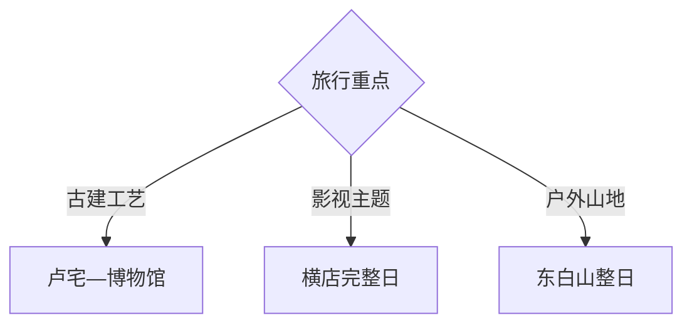

# 东阳旅行指南

东阳是金华代管的县级市，旅行主线由吴宁主城与卢宅、横店影视城、木雕产业和东白山远线组成。最容易执行的选择是把横店单独住一晚，把卢宅与木雕文化留给主城日；东白山、花园村和乡村博物馆按天气与接待条件追加。

> 建议停留：2–4 天；横店至少完整 1 天 
> 旅行关键词：横店影视城、卢宅、东阳木雕、吴宁主城、东白山、花园村、影视文化 
> 主要体力：中等；影视园区和山地远线较高 
> 最近研究：2026-08-13

## 城市速览

| 项目 | 旅行信息 |
|---|---|
| 主要旅行价值 | 在一座县级市里并行理解影视产业、明清宅第、木雕竹编与浙中山地乡村 |
| 建议停留 | 2 天可完成主城—卢宅与横店；3 天把横店展开；4 天再选东白山或花园村 |
| 较舒适季节 | 春秋适合主城与山地；夏季注意高温雷雨，冬季山路和园区夜游注意低温 |
| 预算特点 | 卢宅与城市文化日较易控费；横店套票、演艺、住宿和山地用车是主要变量 |
| 步行强度 | 横店单园区也可能走一整天；卢宅石路与古建门槛、东白山坡道需量力 |
| 主要天气风险 | 梅雨、台风外围影响、短时强降雨、高温与山地低温雾天 |
| 独行旅行 | 吴宁和横店餐饮住宿成熟；远线先确认返程，影视体验核最低参与人数 |
| 亲子旅行 | 横店或木雕科普可各成一日；先按年龄、演出时段、推车和午休择一 |
| 长者与低体力旅行 | 主城一馆一街最稳；横店选单园区并使用正式接驳，山地远线按体力删减 |
| 无障碍信息 | 现代园区可询问接驳与轮椅服务；古宅、片场和山地连续性差异大，设施连续性需向官方确认 |

## 城市格局与游览区域

东阳市法定行政代码 `330783`，由金华市代管。GeoNames `1791056` 是东阳主城点，Wikidata `Q1023774` 对应法定东阳市且 `P1566` 精确指向该记录。本页覆盖 6 个街道、11 个镇和 1 个乡的市域旅行内容，横店镇虽名气最大，仍只是东阳市的一个旅行片区。

| 区域 | 主要内容 | 游览特点 | 与其他区域的关系 |
|---|---|---|---|
| 吴宁主城—卢宅 | 卢宅、博物馆、美术馆、东阳江城市空间 | 历史建筑与城市文化最集中 | 适合作为抵达日和木雕主题基地 |
| 横店镇 | 横店影视城各园区、演艺、住宿 | 大型度假目的地，单园区已可占一天 | 与主城需轨道、公交或车辆衔接，宜住一晚 |
| 木雕小镇与产业展示 | 木雕博物、工艺展示、正规市场 | 适合了解非遗与产业链 | 展馆与生产厂房分开，按开放接待进入 |
| 南马—花园村 | 乡村建设、木雕红木与当期文旅项目 | 适合半日至一日专题 | 与横店方向可组合，但先核接待 |
| 东白山方向 | 山地、茶场与生态景观 | 车程、天气和步行占比高 | 独立整日，雨雾和防火期按公告调整 |

横店影视城内部多个园区按一个完整父级目的地管理，路线根据票种、演出和体力选择，不把每座仿古建筑拆成独立城市景点。木雕产业园、红木工厂、影视拍摄区和通用机场均含生产空间；公众体验以正式展馆、景区和预约活动为准。

## 主要景点

优先级用于分配时间：**A** 首访核心，**B** 兴趣补充，**C** 远线或接待条件变化较大的项目。

### 主城、古建与工艺

| 景点 | 区域 | 类型 | 主要看点 | 建议用时 | 室内外 | 体力 | 预约风险 | 天气影响 | 优先级 |
|---|---|---|---|---:|---|---|---|---|---|
| 卢宅历史文化街区 | 吴宁 | 古建与历史街区 | 明清宅第、木雕装饰、街巷与非遗活动 | 3–5 小时 | 混合 | 中 | 中高 | 中 | A |
| 东阳市博物馆或文化艺术中心当期展馆 | 主城 | 地方博物馆 | 城市历史、考古、木雕竹编与专题展 | 2–3 小时 | 室内 | 低 | 中高 | 低 | A |
| 东阳木雕小镇正式展馆 | 城西方向 | 工艺与产业展示 | 木雕技艺、设计与产业变迁 | 2–4 小时 | 室内为主 | 低至中 | 高 | 低 | B |
| 东阳市美术馆 | 卢宅周边 | 美术馆 | 书画、工艺与专题展览 | 1–2 小时 | 室内 | 低 | 中高 | 低 | B |

### 横店、乡村与山地

| 景点 | 区域 | 类型 | 主要看点 | 建议用时 | 室内外 | 体力 | 预约风险 | 天气影响 | 优先级 |
|---|---|---|---|---:|---|---|---|---|---|
| 横店影视城 | 横店镇 | 影视主题度假区 | 按兴趣选择一至两个园区、演艺与影视体验 | 1–3 天 | 混合 | 高 | 很高 | 中高 | A |
| 花园村当期开放文旅区 | 南马镇 | 乡村与产业体验 | 乡村建设、红木与当期接待项目 | 3–5 小时 | 混合 | 中 | 高 | 中 | B |
| 东白山公开游览区 | 虎鹿镇方向 | 山地与茶文化 | 山脊、茶园和浙中山地景观 | 1 天 | 室外 | 高 | 中高 | 很高 | C |
| 寀卢现代农业科技体验馆 | 乡村远点 | 乡村博物馆 | 农业历史、智慧农业与互动展示 | 2–3 小时另计往返 | 室内为主 | 低 | 高 | 中 | C |

## 美食与餐饮

吴宁主城与横店适合安排稳定正餐；远线把午餐放在镇区或已确认经营的接待点。东阳火腿和香榧更适合作为有标签的地方产品理解，不以“农家自制”替代食品安全信息。

| 菜品或餐饮类型 | 常见区域 | 一个人用餐与常见份量 | 风味、过敏原与饮食限制 | 排队风险与替代方法 |
|---|---|---|---|---|
| 东阳沃面 | 吴宁、横店 | 可按碗点，适合独行 | 面粉、蛋、海鲜干货和汤底按店确认 | 正餐高峰换普通面馆 |
| 东阳土鸡煲与家常煲 | 城区、乡镇 | 多人共享，先问小份 | 骨肉、菌菇、豆制品和较高油盐 | 单人改点小炒或面食 |
| 东阳火腿入菜 | 正规餐馆与特产店 | 适合少量尝试 | 高盐，配料可能含糖、酒或防腐工艺 | 购买看标签、日期和储存条件 |
| 香榧与木雕主题伴手礼 | 城区正规销售点 | 小包装便于携带 | 坚果过敏风险高 | 选清晰标签，不进入生产车间采购 |

## 经典行程

### 一日经典路线

**路线**：卢宅历史文化街区 → 吴宁午餐 → 东阳市博物馆或美术馆 → 东阳江城市空间

- **串联逻辑**：主城内完成古建、工艺和地方历史，不跨去横店。
- **预约锚点**：先确认卢宅收费院落与场馆开放。
- **休息安排**：午餐在吴宁，下午使用场馆休息区。
- **时间不足时**：保留卢宅和一座场馆，删除滨水散步。

### 两日城市路线

**第 1 天**：卢宅 → 主城场馆 → 吴宁住宿 
**第 2 天**：横店所选一个主要园区 → 当期演艺 → 横店住宿或返程

- **串联逻辑**：两天分别承担东阳本地文化与影视主题，减少跨区折返。
- **预约锚点**：横店票种、园区和演出时段。
- **休息安排**：第一天主城午休，第二天使用园区服务区。
- **时间不足时**：横店只选一个园区；一天时只执行第一天或横店整日二选一。

### 三日深度路线

**第 1 天**：吴宁—卢宅 
**第 2 天**：横店完整日 
**第 3 天**：木雕小镇正式展馆 → 花园村当期开放项目

- **串联逻辑**：第三天把木雕非遗与产业展示放在同一主题中，按开放条件连接。
- **预约锚点**：木雕展馆、花园村接待和横店演出。
- **休息安排**：第三天在城区或镇区完成午餐。
- **时间不足时**：删除花园村，保留一座木雕展馆；两天时删第三天。

### 雨天路线

**路线**：东阳市博物馆 → 主城午餐 → 东阳市美术馆或木雕正式展馆

- **适用条件**：普通降雨；台风、山洪预警或大面积积水时减少跨区移动。
- **预约锚点**：两馆开放与临时展览。
- **休息安排**：午餐与休息都放在吴宁主城。
- **时间不足时**：只保留博物馆或木雕展馆一处。

### 亲子或低体力路线

**亲子路线**：横店一个适龄园区完整日，或寀卢体验馆单点半日 
**低体力路线**：卢宅入口核心院落 → 车辆前往主城午餐 → 博物馆

- **减负方式**：亲子按年龄和演出时间选一个主目标；低体力线缩短古宅石路，并用车辆连接场馆。
- **预约锚点**：园区年龄身高规则、乡村馆接待、博物馆服务。
- **休息安排**：使用正式游客中心与主城餐饮区。
- **时间不足时**：两条路线均只留第一处主目标。

### 远郊一日路线

**路线**：吴宁出发 → 东白山正式入口 → 山地短线 → 镇区休息 → 返回

- **适用条件**：天气稳定、道路和返程明确，具备山地步行装备。
- **预约锚点**：入口开放、防火与车辆通行规则。
- **休息安排**：出发前在城区补给，山中只使用正式服务点。
- **时间不足时**：整段取消，改为主城木雕文化日。

## 住宿区域

| 区域 | 优点 | 缺点 | 适合人群 | 交通特点 |
|---|---|---|---|---|
| 吴宁主城 | 餐饮、城市服务与卢宅方便 | 去横店仍需转场 | 首访、古建、木雕、多主题 | 可衔接市域轨道与公路交通 |
| 横店镇 | 园区早进晚出、演艺后返房方便 | 与主城文化点分开 | 影视主题、亲子、连续两日园区 | 核对酒店到具体园区接驳 |
| 金义东市域轨道站点周边 | 跨城和主城—横店移动清楚 | 站点周边未必就是景区入口 | 公共交通、轻装旅行 | 查末班、站名与最后一段交通 |
| 东白山或乡村周边 | 便于清晨户外 | 正规住宿、餐饮和夜间交通较少 | 已确认运营方的专题行程 | 订房前落实资质、道路和退改 |

## 市内交通

| 场景 | 建议与取舍 | 行前需要重查的内容 |
|---|---|---|
| 从高铁门户抵达 | 多数旅客经义乌、金华或市域轨道换乘进入东阳 | 到发站、轨道末班、行李与换乘距离 |
| 吴宁—横店 | 市域轨道、公交或正规车辆均可；住宿跟随主要行程片区 | 末班、活动交通管制、园区最近站点 |
| 横店园区内部 | 按运营方地图和接驳移动 | 园区入口、演出散场、寄存和接驳 |
| 东白山与乡村远线 | 公路车辆更实用，先确定返程 | 山路、天气、防火、停车和通信 |
| 自驾 | 远线灵活，横店旺季停车压力较大 | 预约停车、活动封路、山区道路与充电 |

## 不同旅行者须知

| 旅行维度 | 可行条件 | 主要取舍 | 需额外核对 |
|---|---|---|---|
| 独行旅行 | 主城和横店服务成熟 | 远线先锁返程，套餐餐饮看份量 | 末班、夜间叫车、单人项目资格 |
| 亲子旅行 | 横店或科普场馆可独立成日 | 一天只设一个大园区 | 年龄身高、推车、寄存与午休 |
| 长者或低体力旅行 | 卢宅短线加博物馆较稳 | 古宅门槛和园区长距离步行需减量 | 车辆下客点、电梯、座椅与接驳 |
| 无障碍需求 | 现代场馆可先问服务 | 古宅、片场和山路连续性不同 | 设施连续性需向官方确认 |
| 摄影旅行 | 古建、片场和山地题材丰富 | 剧组作业、文保与商业拍摄有边界 | 三脚架、灯光、无人机、肖像与版权规则 |
| 预算有限 | 主城公共文化日易控费 | 横店票种和住宿是大项 | 套票组成、演艺、接驳、退改 |
| 特殊天气 | 雨天改主城场馆 | 山地与户外演艺更受影响 | 气象预警、景区关闭与道路状态 |

## 行前核对

| 核对事项 | 为什么需要重查 | 建议核对时间 | 官方入口 |
|---|---|---|---|
| 横店园区、演艺和票种 | 园区组合、演出与项目维护变化频繁 | 订票前及当天 | [横店影视城](https://www.hengdianworld.com/) |
| 卢宅、博物馆与美术馆 | 开放院落、闭馆日和展览会调整 | 出发前一周 | [东阳市政府旅游入口](https://www.dongyang.gov.cn/col/col1229161535/index.html) |
| 木雕与乡村体验 | 展馆、市场、工坊和生产区开放属性不同 | 排入路线前 | [东阳市政府](https://www.dongyang.gov.cn/) |
| 市域轨道与铁路 | 班次、末班和换乘会调整 | 订票时及当天 | [中国铁路 12306](https://www.12306.cn/)；[金华轨道交通](https://www.jhmtr.net/) |
| 山地天气与防火 | 东白山路线对雨雾、雷暴和防火敏感 | 出发前三日及当天 | [浙江省气象局](https://zj.cma.gov.cn/) |

## 来源与更新记录

### 主要来源

| 来源 | 类型 | 支持内容 | 核验日期 |
|---|---|---|---|
| [东阳市概况与旅游入口](https://www.dongyang.gov.cn/col/col1229161535/index.html) | 市政府 | 6街道11镇1乡、木雕竹编、影视文化与主要旅游方向 | 2026-08-13 |
| [东阳市文化旅游发展“十四五”规划解读](https://www.dongyang.gov.cn/art/2023/11/10/art_1229545205_59660025.html) | 市政府规划解读 | 横店、木雕、非遗、乡村旅游与全域空间结构 | 2026-08-13 |
| [非遗一台戏与卢宅活动](https://www.dongyang.gov.cn/art/2024/12/6/art_1229325920_59696806.html) | 市文旅部门 | 卢宅非遗街区及节庆活动背景 | 2026-08-13 |
| [横店文旅数字服务](https://ct.zj.gov.cn/art/2025/10/30/art_1229678763_5669521.html) | 浙江省文旅厅 | 横店景区、智慧导览、云排队与文旅服务 | 2026-08-13 |
| [长三角影视主题旅游列车](https://ct.zj.gov.cn/art/2025/7/1/art_1652992_59027066.html) | 浙江省文旅厅 | 横店、卢宅、花园村与四类旅行主题 | 2026-08-13 |
| [寀卢现代农业科技体验馆](https://www.dongyang.gov.cn/art/2025/9/2/art_1229163093_59825128.html) | 市文旅部门 | 乡村博物馆地址、展陈与开放信息入口 | 2026-08-13 |
| [GeoNames 1791056](https://www.geonames.org/1791056/) | 开放地理数据 | 东阳城市点与坐标 | 2026-08-13 |
| [Wikidata Q1023774](https://www.wikidata.org/wiki/Q1023774) | 开放结构化数据 | 东阳市实体与 GeoNames 精确映射 | 2026-08-13 |

### 更新记录

| 日期 | 更新内容 |
|---|---|
| 2026-08-13 | 首次完成东阳市独立旅行研究；拆分吴宁—卢宅、横店、木雕产业、乡村和东白山路线，补充父景区去重、交通、天气与生产空间边界 |
