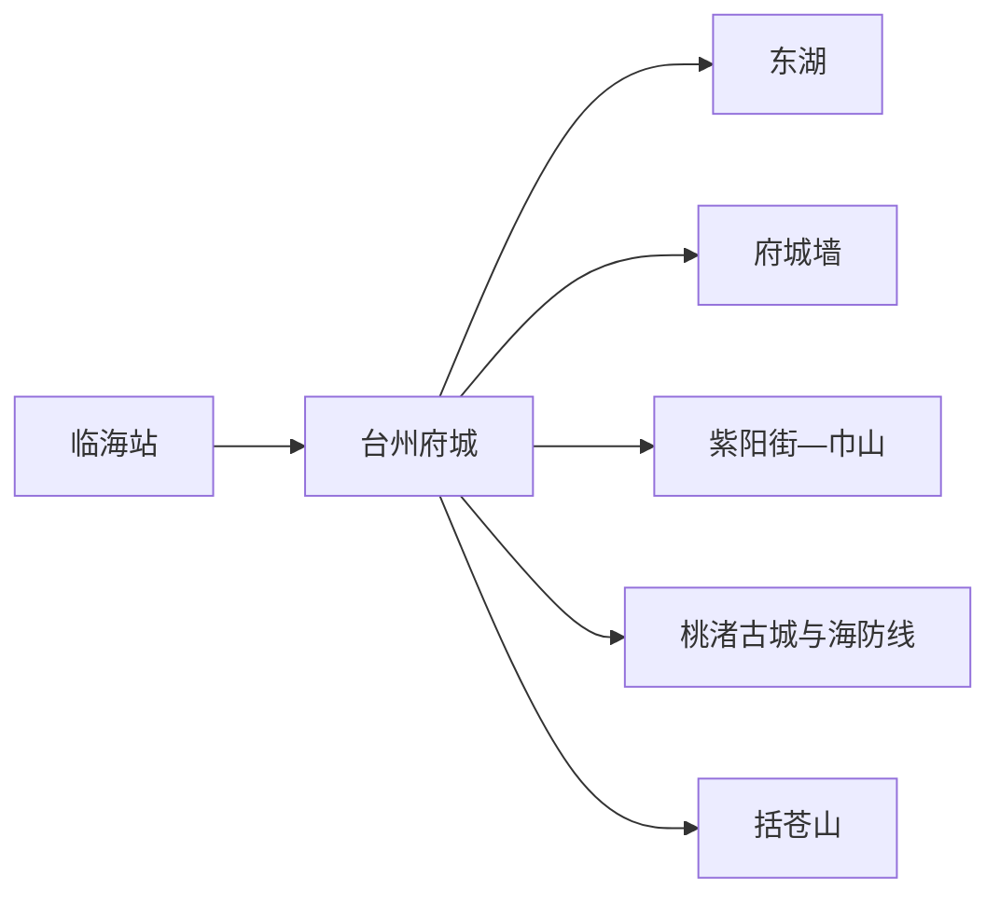
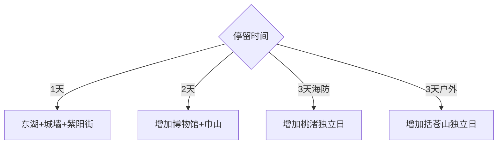

# 临海旅行指南

临海是台州古代州府所在地，首访核心是台州府城墙、紫阳街、东湖与巾山；桃渚海防古城、括苍山和东部海岸属于分散的独立主题。固定 **Linhai / GeoNames 1803422** 对应临海县级市，本页不与地级台州市中心椒江混写。

## 城市速览

| 项目 | 信息 |
|---|---|
| 主线 | 东湖—台州府城墙—紫阳街—巾山 |
| 停留 | 府城1至2天；桃渚或括苍山另加1天 |
| 住宿 | 府城—紫阳街适合历史街区；临海站方向适合早晚车次 |
| 交通 | 临海站接入铁路，府城内步行加短途交通，远郊用公交或预约车辆 |
| 风险 | 城墙台阶、山地雷雨、台风海岸、古城居民边界与节假日拥挤 |

## 城市格局与游览区域

府城核心由东湖、城墙、紫阳街与巾山组成，可用一至两天步行和短接驳完成。桃渚位于东部，以明代海防城和火山地貌为主；括苍山位于西部，以山地和户外路线为主。两条远郊线方向相反，各自预留完整一天。

## 主要景点

| 景点 | 区域 | 类型 | 核心体验 | 用时 | 环境 | 体力 | 研究价值 | 拥挤 | 优先级 |
|---|---|---|---|---:|---|---|---|---|---|
| 台州府城墙 | 府城 | 城墙文物 | 山城防御、瓮城与城市视角 | 3–4小时 | 室外 | 高 | 很高 | 节假日高 | A |
| 紫阳街 | 府城 | 历史街区 | 街巷、传统店铺与地方饮食 | 2–3小时 | 混合 | 中 | 很高 | 节假日很高 | A |
| 东湖 | 府城东侧 | 历史园林 | 湖、亭台与城墙关系 | 1–2小时 | 室外 | 低中 | 高 | 节假日高 | A |
| 巾山与龙兴寺公开区 | 府城 | 山地宗教 | 古塔、寺院与府城制高点 | 2小时 | 混合 | 中高 | 很高 | 节假日中高 | A |
| 临海市博物馆 | 新城 | 博物馆 | 地方史、府城与海防文物 | 2小时 | 室内 | 低 | 很高 | 团体时中 | A |
| 灵湖景区 | 新城 | 城市湖区 | 湖岸慢行与城市休闲 | 1–2小时 | 室外 | 低 | 中 | 周末中 | B |
| 桃渚古城 | 桃渚镇 | 海防古城 | 明代抗倭城防与生活城镇 | 半天 | 混合 | 中 | 很高 | 节假日中高 | A |
| 桃渚火山地貌公开区 | 桃渚方向 | 地质 | 火山遗迹、峰林与海岸地貌 | 2–4小时 | 室外 | 中高 | 高 | 周末中 | B |
| 括苍山开放线路 | 西部山区 | 山地 | 高山视野、风电景观与户外路线 | 1天 | 室外 | 高 | 高 | 节假日高 | B |

## 美食与餐饮

麦虾、蛋清羊尾、海苔饼、姜汁调蛋、糟羹和白水洋豆腐是常见线索。紫阳街适合小份多样，但节假日先看排队与明码标价。鸡蛋、猪油、海产、芝麻、花生和小麦过敏或饮食限制需逐项询问配料及共用锅具。

## 经典行程

### 一日基础线
**路线**：东湖—府城墙选定段—午休—紫阳街—巾山脚。**逻辑**：由水城、城防走入生活街区。**预约锚点**：城墙与景区票务。**休息**：紫阳街正规商业。**删除条件**：体力不足时缩短城墙并删巾山。

### 两日府城线
**路线**：第一天东湖—城墙—紫阳街；第二天博物馆—巾山与开放古塔—灵湖。**逻辑**：把高体力城墙与馆内研究分日。**预约锚点**：博物馆和城墙。**休息**：每天午间回住宿。**删除条件**：雨天把博物馆前移。

### 城墙专题线
**路线**：选定入口—核心城墙段—下城休息—对应城门街区。**逻辑**：只走一段并理解地形。**预约锚点**：入口、出口和封闭段。**休息**：下城后长休。**删除条件**：雷雨、湿滑或高温时改东湖与博物馆。

### 桃渚海防线
**路线**：桃渚古城—镇区午餐—一处正式开放地质点—返城。**逻辑**：海防史与火山地貌分层阅读。**预约锚点**：古城馆舍、地质点和返程。**休息**：桃渚镇区。**删除条件**：台风或接驳不足时只留古城。

### 括苍山户外线
**路线**：主城—官方开放路线—山地观景—按时下山。**逻辑**：完整一天服务山地主题。**预约锚点**：天气、道路与住宿接驳。**休息**：服务点。**删除条件**：雷雨、大风、结冰或地质预警时取消。

### 美食低体力线
**路线**：博物馆—午休—紫阳街短段—东湖近入口。**逻辑**：室内展陈、小吃和低强度步行组合。**预约锚点**：博物馆。**休息**：紫阳街。**删除条件**：拥挤时把餐饮移到外围街区。

### 雨天线
**路线**：博物馆—已确认开放的府城室内馆舍—紫阳街短段。**逻辑**：减少城墙和山地。**预约锚点**：馆舍最晚入场。**休息**：室内商业。**删除条件**：台风响应时按官方要求留在安全地点。

## 住宿区域

紫阳街—府城周边适合早晚街区与城墙，但节假日需关注噪音、停车和步行距离；新城—灵湖方向适合现代住宿与博物馆；临海站方向适合早晚车次；桃渚与括苍山住宿只在对应专题下选择。

## 市内交通

临海站到府城需地面接驳，府城内以步行和短途交通为主。桃渚与括苍山分处东西两端，分别核对班次和返程。古城民宅、城墙维修段、海防设施、风电生产设施和自然保护区域执行明确限制。

## 不同旅行者须知

历史旅行者优先府城两日和桃渚；摄影者选择城墙公开观景点、东湖与规范开放海岸；亲子家庭选择博物馆、东湖和短城墙段；长者与轮椅使用者根据坡度选择东湖、博物馆和紫阳街平缓段。

## 行前核对

- 核对府城墙入口、开放段、博物馆与古塔馆舍开放。
- 核对桃渚和括苍山的天气、道路、接驳与返程。
- 古城居民院落、城防保护区、海岸和风电作业区遵守明确限制。

## 来源与更新记录

| 来源 | 支持内容 | 核验日期 |
|---|---|---|
| [临海市发展规划（浙江政务云）](https://zjjcmspublic.oss-cn-hangzhou-zwynet-d01-a.internet.cloud.zj.gov.cn/jcms_files/jcms1/web2792/site/attach/0/009fba1f7eb24a2fafa93bd8ab47ead5.pdf) | 府城、桃渚、括苍山与全域旅游格局 | 2026-09-01 |
| [临海市文化和旅游发展规划（浙江政务云）](https://zjjcmspublic.oss-cn-hangzhou-zwynet-d01-a.internet.cloud.zj.gov.cn/jcms_files/jcms1/web2792/site/attach/0/31520247ff514566934bb38b9ea5aaa1.pdf) | 府城、东湖、巾山、桃渚与户外主题 | 2026-09-01 |
| [国家发展改革委：临海诗路案例](https://www.ndrc.gov.cn/fggz/zcssfz/dffz/202305/t20230531_1357034.html) | 一体两翼、府城保护与线路组织 | 2026-09-01 |
| [GeoNames 1803422](https://www.geonames.org/1803422/) | Linhai 固定人口点与位置 | 2026-09-01 |

| 日期 | 更新 |
|---|---|
| 2026-09-01 | 首次完成临海旅行研究；区分府城、桃渚海防与括苍山三类路线。 |
