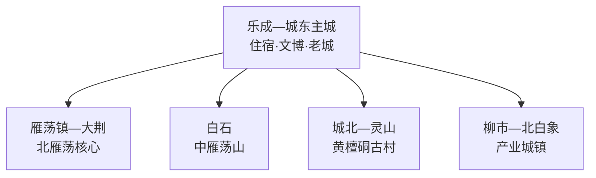
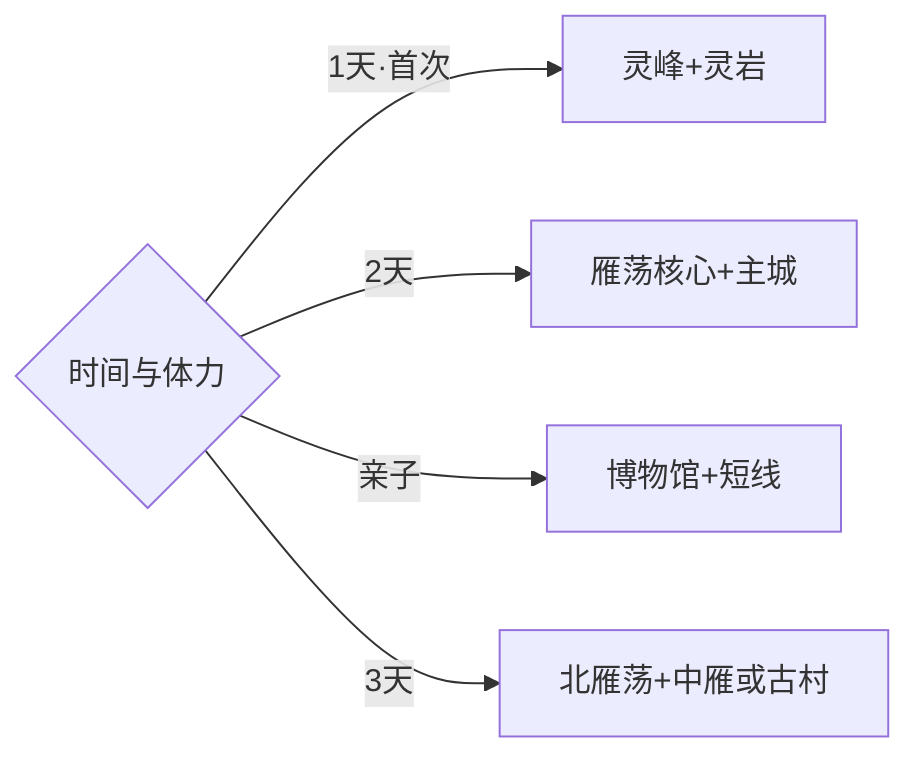

# 乐清旅行指南

乐清沿温州湾北岸展开，旅行上最重要的选择是北雁荡山、中雁荡山和乐成主城三条线。第一次来可把雁荡镇作为山岳基地，用一至两天走灵峰、灵岩与大龙湫；想看古村、非遗和本地生活，再回到乐成—城北或白石方向。固定快照中的 **Liushi / GeoNames 1802929** 对应乐清市柳市镇，坐标、名称与温州市行政层级闭合；温州主城、永嘉和平阳均按跨县级行政区行程处理。

> 建议停留：2–3 天\
> 旅行关键词：雁荡山、火山地貌、中雁荡山、黄檀硐、乐清湾\
> 主要体力：主城低；雁荡核心中等；完整山线较高\
> 最近研究：2026-09-03

## 城市速览

| 项目 | 旅行信息 |
|---|---|
| 主要旅行价值 | 以雁荡山流纹岩地貌为核心，延伸到中雁湖山、灵山古村和沿海饮食 |
| 建议停留 | 2天安排雁荡核心与主城；增加中雁或黄檀硐后用3天 |
| 较舒适季节 | 春秋适合登山；夏季瀑布水量较好但高温雷雨多；冬季关注湿滑与寒潮 |
| 预算特点 | 景区票务、景交和山地住宿是主要变量，主城餐饮选择较多 |
| 步行强度 | 博物馆低，灵峰与灵岩中等，连续登高路线较高 |
| 主要天气风险 | 雷电、短时强降雨、台风、山洪、落石、雾和高温 |
| 独行旅行 | 正式景区线路清晰，偏远古村与晚间返程先落实交通 |
| 亲子旅行 | 雁荡山博物馆和核心短线适合地质研学，按年龄控制台阶量 |
| 长者与低体力旅行 | 选择景交可达点、博物馆和湖边短线，减少连续登高 |
| 无障碍信息 | 新建场馆相对友好，山岳步道与古村石路需逐段确认 |

## 城市格局与游览区域

| 区域 | 主要内容 | 游览特点 | 与其他区域的关系 |
|---|---|---|---|
| 乐成—城东主城 | 市博物馆、东塔、老城街巷与城市服务 | 适合抵达日和雨天 | 可作中雁、灵山方向基地 |
| 雁荡镇—大荆 | 灵峰、灵岩、大龙湫与雁荡山博物馆 | 景区单元分散，依赖景交与步行 | 建议当地住一晚，减少往返 |
| 白石—中雁 | 玉甑、西漈与钟前湖等开放游线 | 湖山与台阶并存 | 与主城可组合为一日 |
| 城北—灵山 | 黄檀硐古村及灵山公开路线 | 古村石路和山路受天气影响 | 适合作为第三日慢游 |
| 柳市—北白象 | 电气产业城镇与生活商业 | 工业主题只选正式展陈 | 主要承担交通、餐饮与产业观察 |

## 主要景点

| 景点 | 区域 | 类型 | 主要看点 | 建议用时 | 室内外 | 体力 | 预约风险 | 天气影响 | 优先级 |
|---|---|---|---|---:|---|---|---|---|---|
| 灵峰景区 | 北雁荡 | 山岳 | 峰洞组合、日景与独立夜景时段 | 3–4小时 | 室外 | 中 | 中 | 高 | A |
| 灵岩景区 | 北雁荡 | 山岳 | 峰壁、寺院环境与峡谷步道 | 3–4小时 | 室外 | 中 | 中 | 高 | A |
| 大龙湫景区 | 北雁荡 | 瀑布与峡谷 | 高落差瀑布和流纹岩地貌 | 2–3小时 | 室外 | 中 | 中 | 很高 | A |
| 雁荡山博物馆 | 雁荡镇 | 地质博物馆 | 火山、流纹岩、地质遗迹与生态 | 1.5–2小时 | 室内 | 低 | 中 | 低 | A |
| 中雁荡山正式开放游线 | 白石 | 湖山 | 玉甑、西漈与钟前湖景观 | 半天–1天 | 室外 | 中高 | 中高 | 很高 | B |
| 黄檀硐古村开放区 | 城北—灵山 | 古村 | 石屋、山村格局与传统聚落 | 2–3小时 | 室外 | 中 | 中 | 高 | B |
| 乐清市博物馆 | 主城 | 博物馆 | 地方历史、非遗与山海城市背景 | 1.5–2小时 | 室内 | 低 | 中 | 低 | B |
| 东塔及老城公共街巷 | 乐成 | 古建与街区 | 城市文脉、塔景与本地生活 | 1–2小时 | 室外 | 低中 | 低 | 中 | C |

## 美食与餐饮

| 菜品或餐饮类型 | 常见区域 | 一个人用餐与常见份量 | 风味、过敏原与饮食限制 | 排队风险与替代方法 |
|---|---|---|---|---|
| 清江三鲜面 | 清江及主城面馆 | 一碗适合独行 | 常含海鲜、蛋与面筋，先确认配料 | 午间高峰可选社区面馆 |
| 鱼丸、鱼饼与海鲜小吃 | 主城、虹桥与沿海城镇 | 小份便于组合 | 鱼类、贝类和淀粉配方需留意 | 选明码标价和冷链规范门店 |
| 灯盏糕与米面小吃 | 老城、市场周边 | 单个或单份友好 | 油炸食品及肉馅按饮食需求选择 | 错峰购买，现做现吃 |
| 雁荡山笋与家常菜 | 雁荡镇正规餐馆 | 两三道小份可分享 | 按季供应，确认辣度与食材来源 | 景区核心拥挤时到镇区用餐 |
| 雁荡毛峰等本地茶饮 | 雁荡山与主城 | 单杯或茶席 | 咖啡因敏感者控制饮用量 | 选择正规茶室并先问价格 |

## 经典行程

### 一日雁荡山经典路线

**路线**：雁荡山博物馆 → 灵岩 → 午餐 → 灵峰日景；体力与开放允许时另购夜景时段

- **串联逻辑**：先看地质背景，再用两座核心景区识别峰壁与洞景。
- **预约锚点**：景区票务、景交、夜景时段与演出公告。
- **休息安排**：博物馆、响岭头及各景区正式服务点。
- **时间不足时**：保留博物馆与灵岩，灵峰夜景按返程决定。

### 两日山城路线

**第 1 天**：灵岩 → 大龙湫 → 雁荡镇住宿。\
**第 2 天**：雁荡山博物馆 → 灵峰 → 乐成主城。

- **串联逻辑**：把峡谷瀑布和峰洞分日，避开一天内反复换乘。
- **预约锚点**：景交、住宿和瀑布水情公告。
- **休息安排**：雁荡镇连住或一晚，午间返回服务区补给。
- **时间不足时**：第二日只保留灵峰后返程。

### 三日深度路线

**第 1 天**：北雁荡灵岩与大龙湫。\
**第 2 天**：灵峰、博物馆与雁荡镇。\
**第 3 天**：中雁荡山或黄檀硐二选一。

- **串联逻辑**：两天完成北雁荡核心，第三天按湖山或古村兴趣选择。
- **预约锚点**：第三日开放入口、车辆和森林防火公告。
- **休息安排**：第二晚可转住主城，第三日带足饮水。
- **时间不足时**：先删第三日，再压缩大龙湫。

### 雨天路线

**路线**：雁荡山博物馆 → 雁荡镇午餐 → 乐清市博物馆 → 主城老街短线

- **适用条件**：普通降雨采用室内线；雷暴、台风或山洪预警时留在城镇安全区域。
- **预约锚点**：场馆开放、跨片区道路与铁路运行。
- **休息安排**：两座博物馆和主城商业区。
- **时间不足时**：就近选择一座博物馆深度参观。

### 亲子或低体力路线

**亲子路线**：雁荡山博物馆 → 灵岩短线 → 地质观察活动。\
**低体力路线**：博物馆 → 景交可达观景点 → 响岭头休息。

- **减负方式**：亲子用地质任务串联；低体力线减少台阶、夜行和连续换乘。
- **预约锚点**：研学年龄、无障碍入口、景交和卫生间。
- **休息安排**：场馆公共区与正式游客中心。
- **时间不足时**：两类路线均保留雁荡山博物馆。

### 中雁荡山路线

**路线**：主城 → 白石景区入口 → 玉甑或西漈二选一 → 钟前湖公开步道 → 返回

- **适用条件**：适合天气稳定、景区游线明确开放的日期。
- **预约锚点**：索道或接驳、步道开放与停车。
- **休息安排**：景区服务点与湖边公共区域。
- **时间不足时**：选择一个核心游线加湖边短走。

### 灵山古村路线

**路线**：乐成主城 → 黄檀硐古村公开区 → 灵山正式步道短段 → 返回

- **串联逻辑**：以传统聚落为主，山地只选开放短线，保持充足返程时间。
- **预约锚点**：古村接待、道路、停车和防火信息。
- **休息安排**：村内正规经营点与主城。
- **时间不足时**：保留古村核心公共街巷，取消登高。

## 住宿区域

| 区域 | 优点 | 缺点 | 适合人群 | 交通特点 |
|---|---|---|---|---|
| 雁荡镇—响岭头 | 靠近北雁荡核心和景交 | 节假日价格与供给波动大 | 首访、登山、摄影旅行者 | 适合连住一至两晚 |
| 乐成—城东主城 | 餐饮、城市服务和跨方向交通集中 | 前往北雁荡耗时较长 | 多主题、商务、独行旅行者 | 适合中雁和灵山方向 |
| 乐清站周边 | 铁路抵离方便 | 夜间体验较少 | 早晚车、短住旅行者 | 核对到景区和主城接驳 |
| 柳市—北白象 | 商务住宿选择多 | 与核心山岳景区距离较远 | 商务、产业访问 | 适合接温州主城方向 |

## 市内交通

| 场景 | 建议与取舍 | 行前需要重查的内容 |
|---|---|---|
| 铁路抵达 | 按目的地选择雁荡山站、乐清站或乐清东站，避免只看“乐清”二字 | 实际车次、站名与接驳 |
| 北雁荡景区内部 | 使用正式景交串联分散入口，为换乘预留时间 | 景交线路、末班与临时封闭 |
| 主城—中雁或黄檀硐 | 一天只选一个方向，公共交通不足时使用正规车辆 | 道路、停车、叫车与返程 |
| 乐清湾与产业城镇 | 选择公共滨水空间和正式产业展陈 | 潮汐、港区、厂区准入与作业公告 |

## 不同旅行者须知

| 旅行维度 | 可行条件 | 主要取舍 | 需额外核对 |
|---|---|---|---|
| 独行旅行 | 北雁荡核心交通较成熟 | 古村和中雁晚间返程选择少 | 景交末班、叫车与通信 |
| 亲子旅行 | 地质博物馆和核心短线易组合 | 连续台阶与夜景时段较累 | 研学预约、护栏和休息点 |
| 长者或低体力旅行 | 博物馆与景交可达点负担较低 | 山岳完整游线体力要求高 | 无障碍入口、索道与座椅 |
| 无障碍需求 | 新建场馆优先 | 山径、古村石路连续性有限 | 坡道、电梯、卫生间与陪同 |
| 摄影旅行 | 峰壁、瀑布、古村与海湾题材丰富 | 雾雨和夜景改变器材需求 | 三脚架、航拍、潮汐与开放时段 |
| 预算有限 | 主城住宿餐饮选择多 | 景区票务与往返交通增加支出 | 联票、景交、退改与淡旺季 |
| 晚出发或紧凑行程 | 主城或单一核心景区可做半日 | 三大核心点不宜强塞同一下午 | 最晚入园和返程 |
| 特殊天气或自然条件 | 普通小雨可转博物馆 | 台风、雷暴、山洪和火险会影响山线 | 气象、景区、铁路与道路公告 |

雁荡山、中雁荡山和灵山按正式入口、开放步道与森林防火要求游览；瀑布潭口、溪谷、临崖地段和封闭地质保护点服从现场管理。乐清湾滩涂、港区、码头、电气工厂、仓储和施工区域按生态与生产边界通行，工业参访只选择明确对公众开放的项目。

## 行前核对

| 核对事项 | 为什么需要重查 | 建议核对时间 | 官方入口 |
|---|---|---|---|
| 北雁荡门票、景交和夜景 | 分景区开放、活动与交通会变化 | 购票前及到访前一日 | [乐清市人民政府](https://www.yueqing.gov.cn/) |
| 中雁与黄檀硐路线 | 维护、防火和道路影响可走范围 | 出发前三日及当天 | [乐清市人民政府](https://www.yueqing.gov.cn/) |
| 博物馆和研学 | 闭馆、团队和活动安排会调整 | 排入行程前 | [温州市科协：雁荡山博物馆](https://wzast.wenzhou.gov.cn/art/2024/7/6/art_1229798665_11375.html) |
| 台风、雷暴与山洪 | 山岳、溪谷、铁路和海湾均受影响 | 出发前三日及当天 | [浙江省气象局](https://zj.cma.gov.cn/) |
| 三座铁路客站接驳 | 车次、到发站和末班会变化 | 购票前及当天 | [中国铁路12306](https://www.12306.cn/) |

## 来源与更新记录

### 主要来源

| 来源 | 类型 | 支持内容 | 核验日期 |
|---|---|---|---|
| [乐清市人民政府：景区（点）选介](https://www.yueqing.gov.cn/art/2019/3/15/art_1631517_31080211.html) | 政府 | 雁荡山、中雁荡山、灵山与黄檀硐的空间关系 | 2026-09-03 |
| [温州市科协：雁荡山博物馆](https://wzast.wenzhou.gov.cn/art/2024/7/6/art_1229798665_11375.html) | 政府 | 博物馆位置、展陈主题与服务入口 | 2026-09-03 |
| [乐清市文化和广电旅游体育局公开答复](https://www.yueqing.gov.cn/module/download/downfile.jsp?classid=0&filename=4c8ab85dda0445d7ae15d4aa1edf0e22.pdf) | 政府 | 中雁、黄檀硐与地方文旅活动线索 | 2026-09-03 |
| [GeoNames 1802929](https://www.geonames.org/1802929/) | 开放数据 | Liushi 固定人口点、坐标与行政代码 | 2026-09-03 |

### 更新记录

| 日期 | 更新内容 |
|---|---|
| 2026-09-03 | 首次完成资料研究、空间拆分、七条路线与县级市映射 |
