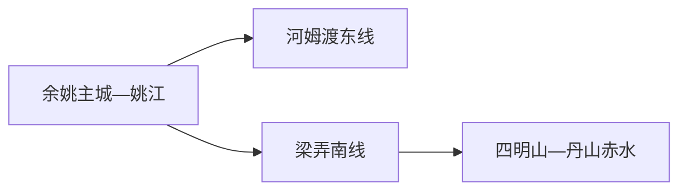
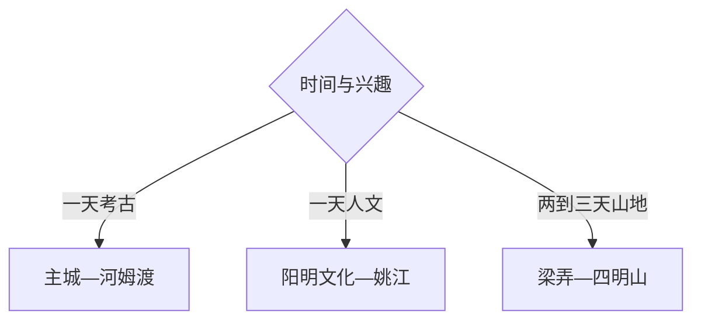

# 余姚旅行指南

余姚可以先在主城认识姚江、阳明文化和浙东城市生活，再把河姆渡、梁弄或四明山分别交给完整半日到一天。首访若只有一天，选择“主城—河姆渡”或“梁弄—四明山”其中一组；两组方向相反，分成两天更从容。

> 建议停留：主城 1 天；河姆渡或四明山方向各另留 1 天 
> 旅行关键词：河姆渡、王阳明、梁弄、四明山、丹山赤水、姚江 
> 主要体力：主城低至中等；山地与古村中至高 
> 最近研究：2026-08-13

## 城市速览

| 项目 | 旅行信息 |
|---|---|
| 主要旅行价值 | 从七千年河姆渡文化、阳明思想和姚江城市，到四明山革命史与山村景观形成多层次体验 |
| 建议停留 | 1 天主城或河姆渡；2 天增加梁弄；3 天再选一条四明山山地线 |
| 较舒适季节 | 春秋适合主城与山地；梅雨、台风和高温期优先场馆并核对山路 |
| 预算特点 | 主城与公共场馆中低；山区车辆、景区交通和住宿增加预算 |
| 步行强度 | 主城和馆区可分段步行，古村石路与四明山坡道增加体力 |
| 主要天气风险 | 梅雨、暴雨山洪、台风、大风、高温、冬季结冰和森林火险 |
| 独行旅行 | 主城和河姆渡较容易；山地优先明确班次、住宿或正规车辆 |
| 亲子旅行 | 河姆渡考古、博物馆与短程古村更合适 |
| 长者与低体力旅行 | 一馆一街或车辆到梁弄镇区，山地只选短线 |
| 无障碍信息 | 现代场馆可先询问，遗址、古村和山地的设施连续性需向官方确认 |

## 城市格局与游览区域

余姚市是宁波市代管的县级市，法定代码 `330281`。GeoNames `1785545` 与 Wikidata `Q1011201` 精确对应余姚市。余姚主城位于姚江沿线，河姆渡在东部，梁弄与四明山在南部山地，三者不构成连续步行区。

| 区域 | 主要内容 | 怎么安排 | 与其他区域的关系 |
|---|---|---|---|
| 余姚主城 | 阳明文化、地方文博、姚江与城市生活 | 半日至一天，适合作为住宿基地 | 到河姆渡和四明山需不同方向交通 |
| 河姆渡 | 遗址博物馆、遗址公园与史前考古 | 完整半日至一天 | 与宁波主城、余姚站均需末端接驳 |
| 梁弄 | 红色旧址、古镇生活与山地门户 | 半日至一天 | 可与一条邻近短线组合 |
| 四明山—丹山赤水 | 山地、森林、古村与季节景观 | 一次只选一个正式景区或游线 | 山路、天气和森林防火决定可行性 |

四明山区域叠加林地、水源、村落、农业和旅游经营空间。用正式景区入口、公共道路和开放步道组织行程；茶园、果园、林业道路、水库工程与居民院落在获得接待同意后再进入。

## 主要景点

### 主城与河姆渡

| 景点 | 区域 | 类型 | 主要看点 | 建议用时 | 室内外 | 体力 | 预约风险 | 天气影响 | 优先级 |
|---|---|---|---|---:|---|---|---|---|---|
| 河姆渡遗址博物馆与遗址区 | 河姆渡 | 考古遗址与博物馆 | 稻作、干栏式建筑与史前生活；馆、遗址和现场展示按一个主题 | 3–5 小时 | 混合 | 中 | 高 | 中 | A |
| 余姚市博物馆 | 主城 | 地方博物馆 | 城市历史、地方文物与区域文化 | 1.5–2.5 小时 | 室内 | 低 | 中 | 低 | A |
| 王阳明故居—阳明古镇公共文化组团 | 主城 | 名人故居与街区 | 阳明思想、生平与姚江城市空间 | 2–4 小时 | 混合 | 中 | 高 | 中 | A |
| 龙泉山—姚江公共空间 | 主城 | 城市山水 | 姚江、城市视野和短程步行 | 1–2 小时 | 室外 | 中 | 低 | 高 | B |

### 梁弄与四明山

| 景点 | 区域 | 类型 | 主要看点 | 建议用时 | 室内外 | 体力 | 预约风险 | 天气影响 | 优先级 |
|---|---|---|---|---:|---|---|---|---|---|
| 梁弄红色旧址群公开场馆 | 梁弄 | 革命史与古镇 | 浙东抗日根据地历史、镇区与公开展馆 | 3–5 小时 | 混合 | 中 | 高 | 中 | A |
| 四明山国家森林公园公开游线 | 四明山 | 森林与山地 | 森林、山脊与季节景观 | 1 天 | 室外 | 高 | 高 | 很高 | A |
| 丹山赤水景区 | 大岚方向 | 古村与山水 | 柿林村、峡谷与丹霞色彩山体 | 1 天 | 室外为主 | 高 | 高 | 很高 | B |
| 四明湖正式开放岸段 | 梁弄周边 | 湖泊与水利景观 | 湖面、山地倒影与公共观景 | 1–2 小时 | 室外 | 低至中 | 中 | 很高 | B |

河姆渡考古系统内部的展馆、遗址公园和复原展示无需拆成多个必到景点。梁弄各革命旧址也按公开场馆和步行关系组合；正在修缮、办公或居民使用的建筑按现场边界参观。

## 美食与餐饮

余姚主城适合尝试年糕、汤圆、面食、河鲜和宁波菜；梁弄与四明山方向可用茶点、糕点和乡村家常菜补给。生腌水产、整鱼和大份合菜按人数与饮食限制取舍。

| 类型 | 常见区域 | 一人份量 | 饮食提示 | 选择方法 |
|---|---|---|---|---|
| 年糕、汤团与面食 | 主城 | 一人一份 | 糯米、小麦、猪油、芝麻或花生常见 | 先问馅料和小份 |
| 宁波菜与河鲜 | 主城、姚江沿线 | 多人菜较多 | 鱼虾贝、酱油、酒料与交叉接触 | 一人选择蒸鱼小份、羹汤或套餐 |
| 梁弄大糕及糕点 | 梁弄 | 小份或礼盒 | 米粉、糖、芝麻和坚果 | 选标识与日期清楚的包装 |
| 山区家常菜 | 梁弄、四明山接待点 | 常按合菜 | 笋、腌菜、肉类与较高盐分 | 订餐时说明人数、素食和过敏原 |

## 经典行程

### 一日经典路线

**路线**：余姚主城出发 → 河姆渡遗址博物馆与遗址区 → 城区晚餐

- **串联逻辑**：用一个完整考古系统构成核心日，避免与南部山地跨向赶场。
- **预约锚点**：场馆开放、遗址区入口、讲解和末端交通。
- **休息安排**：馆内坐席和午餐各一次。
- **时间不足时**：保留博物馆与核心遗址展示。

### 两日城市路线

**第 1 天**：余姚市博物馆 → 阳明故居与古镇 → 姚江短段 
**第 2 天**：河姆渡完整日

- **串联逻辑**：城市思想史与史前考古各用一天，住宿留在主城。
- **预约锚点**：阳明文化场馆和河姆渡开放。
- **休息安排**：两天午间均在城区或游客服务区坐休。
- **时间不足时**：第一天删姚江延伸，第二天不追加乡村点。

### 三日深度路线

**第 1 天**：主城 
**第 2 天**：梁弄红色旧址群 → 四明湖公开岸段 
**第 3 天**：四明山森林公园或丹山赤水二选一

- **串联逻辑**：先在梁弄建立南部山地背景，再选择一个完整自然景区。
- **预约锚点**：旧址开放、住宿、车辆、景区入口与天气。
- **休息安排**：梁弄镇区和景区游客中心。
- **时间不足时**：删除第三天山地，保留梁弄。

### 雨天路线

**路线**：余姚市博物馆 → 坐席午餐 → 阳明文化室内场馆

- **适用条件**：城区交通正常的普通降雨。
- **预约锚点**：场馆开放、临展与入馆。
- **休息安排**：以室内场馆和餐厅为主。
- **时间不足时**：只保留一座馆；暴雨、台风时暂停山地与遗址室外段。

### 亲子与低体力路线

**亲子路线**：河姆渡博物馆 → 午休 → 遗址区短段 
**低体力路线**：车辆到余姚市博物馆 → 午餐 → 姚江平缓短段

- **减负方式**：亲子控制户外时长；低体力路线保留车辆和随时折返。
- **预约锚点**：儿童活动、推车、轮椅、卫生间和下客点。
- **休息安排**：馆内与餐厅两次坐休。
- **时间不足时**：两条路线均只保留博物馆。

### 山地一日路线

**路线**：梁弄或山区住宿点 → 四明山森林公园或丹山赤水二选一 → 原路返回

- **适用条件**：无暴雨、雷电、台风或森林防火封控，车辆和返程明确。
- **预约锚点**：正式入口、停车、景交和末班。
- **休息安排**：游客中心与镇区补给。
- **时间不足时**：缩短为梁弄镇区与四明湖公开短段。

## 住宿区域

| 区域 | 优点 | 取舍 | 适合人群 | 交通特点 |
|---|---|---|---|---|
| 余姚主城 | 铁路、餐饮和公共服务集中 | 到四明山车程长 | 首访与城市、河姆渡组合 | 默认基地 |
| 梁弄镇区 | 便于红色旧址与南部山地 | 夜间服务少于主城 | 连续两天南线 | 锁定次日景区车辆 |
| 四明山正规住宿 | 便于清晨与山地慢游 | 医疗、网络、餐饮和退改差异大 | 山地摄影与多日游 | 先确认道路和防火状态 |

## 市内交通

| 场景 | 建议与取舍 | 行前核对 |
|---|---|---|
| 铁路抵达 | 余姚站或余姚北站按票面分流 | 车次、站口、公交和行李 |
| 主城内部 | 公交、步行和短程出租组合 | 末班、施工、停车和共享单车范围 |
| 河姆渡 | 公交、出租或合规车辆到官方入口 | 末端班次、闭馆和返程 |
| 梁弄与四明山 | 公路为主，一次只走一个山区方向 | 山路、景交、天气、充电和救援 |

## 不同旅行者须知

| 旅行者 | 怎么选 | 主要取舍 | 额外核对 |
|---|---|---|---|
| 独行 | 主城—河姆渡或主城—梁弄单线 | 山区晚返和弱叫车覆盖 | 末班、住宿、车辆和通信 |
| 亲子 | 河姆渡与阳明文化场馆 | 古村石路和山地时长按年龄减少 | 儿童预约、推车、寄存与卫生间 |
| 长者或低体力 | 一馆一街、车辆点到点 | 山地坡道和古建门槛 | 坡道、电梯、轮椅和座椅 |
| 摄影 | 姚江、古村、湖泊和山地 | 农事、居民和保护地边界 | 日出车辆、三脚架、无人机与商业拍摄 |
| 预算有限 | 主城公共文化与单一远线 | 山区车辆和住宿保留必要预算 | 联票、公交、停车与退改 |

## 行前核对

| 事项 | 何时核对 | 官方入口 | 怎么处理 |
|---|---|---|---|
| 文博场馆 | 排路线前及前一日 | [余姚市文博单位名录](https://www.yy.gov.cn/art/2024/9/25/art_1229710017_59089281.html) | 按开放馆区安排 |
| 梁弄与红色旧址 | 出发前一周及当天 | [余姚红色旅游入口](https://www.yy.gov.cn/col/col1229133314/) | 以当期开放场馆组合 |
| 四明山与森林防火 | 出发前三日及当天 | [余姚市人民政府](https://www.yy.gov.cn/) | 预警或封控时改主城线 |
| 铁路 | 购票时及当天 | [中国铁路 12306](https://www.12306.cn/) | 核对余姚站与余姚北站 |

## 来源与更新记录

### 主要来源

| 来源 | 类型 | 支持内容 | 核验日期 |
|---|---|---|---|
| [余姚市文博单位名录](https://www.yy.gov.cn/art/2024/9/25/art_1229710017_59089281.html) | 市政府与文旅部门 | 河姆渡、余姚博物馆和公共文化机构 | 2026-08-13 |
| [余姚红色旅游资料](https://www.yy.gov.cn/col/col1229133314/) | 市政府 | 梁弄与浙东抗日根据地主题 | 2026-08-13 |
| [四明山国家森林公园](https://www.yy.gov.cn/art/2020/4/1/art_1229131397_59078869.html) | 市政府 | 森林公园属地和山地背景 | 2026-08-13 |
| [余姚市城市概况](https://www.yy.gov.cn/col/col1229133666/) | 市政府 | 城市历史、主城与市域背景 | 2026-08-13 |
| [GeoNames 1785545](https://www.geonames.org/1785545/) | 开放地理数据 | 固定城市点 | 2026-08-13 |
| [Wikidata Q1011201](https://www.wikidata.org/wiki/Q1011201) | 开放结构化数据 | 法定余姚市与 GeoNames 精确映射 | 2026-08-13 |

### 更新记录

| 日期 | 更新内容 |
|---|---|
| 2026-08-13 | 首次完成余姚独立旅行研究，拆分主城、河姆渡、梁弄与四明山路线，并补充山区、生产空间、天气与无障碍核对 |
