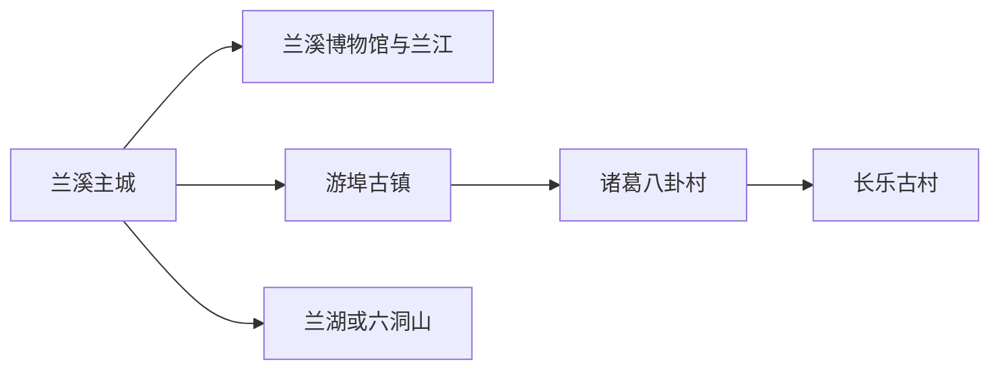
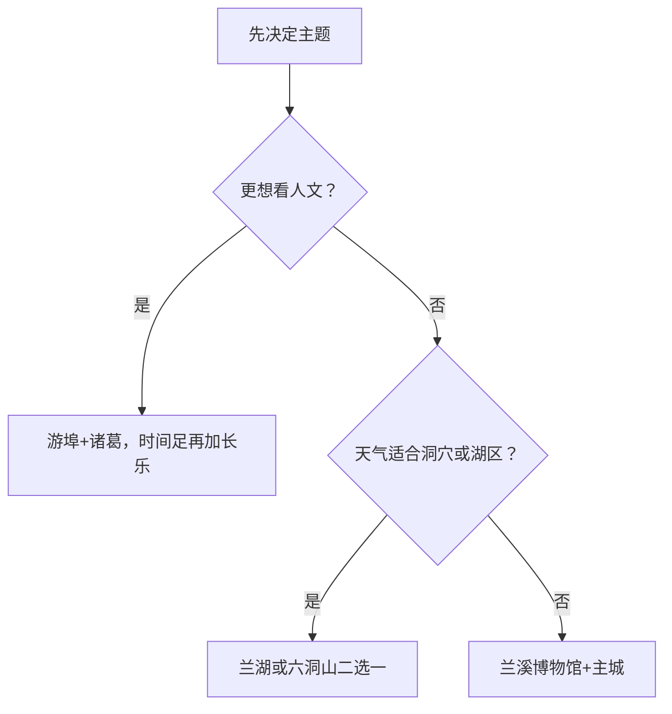

# 兰溪旅行指南

兰溪位于金华西部，兰江、衢江与金华江塑造了城市格局。旅行可分为主城、游埠早茶古镇、诸葛—长乐古村群和兰湖—六洞山自然方向。古村、古镇仍有居民与经营活动，适合跟随公共街巷、景区入口和公开展陈慢游。

## 城市速览

| 项目 | 信息 |
|---|---|
| 旅行主线 | 兰江主城、游埠早茶、诸葛八卦村、长乐古村、兰湖与地下长河 |
| 建议停留 | 1 天主城或游埠—诸葛；2–3 天再加自然或古村方向 |
| 住宿基地 | 兰溪主城；早茶主题可在游埠周边选正规住宿 |
| 步行强度 | 主城低，古镇古村中等，洞穴与山地中至高 |
| 主要天气 | 梅雨、台风外围降雨、高温、山洪、江河涨水与冬季湿冷 |
| 预约核心 | 古村景区、六洞山、讲解和交通 |
| 亲子 | 博物馆、游埠短线和兰湖正式活动较合适 |
| 低体力 | 主城场馆、游埠早茶街短段和车辆串联古村入口 |
| 社区边界 | 古镇古村以公共街巷和开放院落为主，尊重居民生活 |
| 无障碍 | 设施连续性需向官方确认，重点核对石板路、洞穴、码头与卫生间 |

## 城市格局与游览区域

兰溪市是金华市代管县级市，代码 `330781`。GeoNames `1804442` 为兰溪主城点，Wikidata `Q1023793` 代表法定兰溪市，`P1566` 同时列出 `1804442` 与较广记录 `1804437`。本页用法定代码界定市域，点记录用于主城定位。

| 区域 | 旅行价值 | 怎么安排 |
|---|---|---|
| 兰溪主城 | 住宿、文博、兰江与城市生活 | 抵达日或半日 |
| 游埠镇 | 早茶、古镇街巷、摄影与商贸记忆 | 清晨出发，半日至一日 |
| 诸葛—长乐 | 古村格局、宗族与传统建筑 | 两村相邻但分别游览，留足步行时间 |
| 芝堰等古村 | 古驿道与传统村落 | 有明确开放和车辆时作为第三日 |
| 兰湖—六洞山 | 湖区休闲、洞穴与山地 | 按天气与项目开放二选一 |

## 主要景点

### 主城与古镇

| 景点 | 所在区域 | 类型 | 核心看点 | 建议用时 | 室内/室外 | 体力 | 预约难度 | 天气敏感度 | 适合旅程 |
|---|---|---|---|---|---|---|---|---|---|
| 兰溪市博物馆 | 主城 | 地方史与文物 | 兰江流域、城市历史与地方文化 | 1.5–2.5 小时 | 室内 | 低 | 中 | 低 | A |
| 兰江主城公共滨水段 | 主城 | 江河与城市空间 | 三江汇流背景、老城与公共生活 | 1–2 小时 | 室外 | 低 | 低 | 很高 | B |
| 游埠古镇 | 游埠镇 | 古镇、早茶与摄影文化 | 早茶街、商贸街巷、郎静山文化与公开院落 | 3–5 小时 | 混合 | 中 | 中 | 高 | A |

### 古村与自然

| 景点 | 所在区域 | 类型 | 核心看点 | 建议用时 | 室内/室外 | 体力 | 预约难度 | 天气敏感度 | 适合旅程 |
|---|---|---|---|---|---|---|---|---|---|
| 诸葛八卦村 | 诸葛镇 | 古村与传统建筑 | 村落格局、宗祠、民居与中医药文化 | 3–5 小时 | 混合 | 中 | 中 | 高 | A |
| 长乐古村 | 诸葛镇 | 古村与国保建筑群 | 传统民居、村落街巷与活态社区 | 2–3 小时 | 室外为主 | 中 | 中 | 高 | B |
| 芝堰古村公开区 | 黄店方向 | 古村与古驿道 | 古建筑、驿道与乡村环境 | 3–4 小时 | 室外为主 | 中 | 高 | 高 | C |
| 兰湖旅游度假区正式开放项目 | 兰湖方向 | 湖区与休闲 | 湖岸、生态景观与当期运营项目 | 3–5 小时 | 室外为主 | 中 | 高 | 很高 | B |
| 六洞山地下长河景区 | 六洞山方向 | 洞穴与山水 | 喀斯特洞穴、地下河与景区交通 | 4–6 小时 | 混合 | 中至高 | 高 | 高 | B |

诸葛村与长乐村是两个相邻的传统村落；可在同日串联，但分别计算入口、开放院落和休息。民居、祠堂和作坊依旧服务社区，参观以公共街巷和公开空间为主。

## 美食与餐饮

| 类型 | 适合场景 | 份量 | 过敏与饮食提示 | 选择方法 |
|---|---|---|---|---|
| 游埠早茶小吃 | 清晨早餐 | 适合少量多选 | 小麦、糯米、猪肉、蛋、芝麻与花生常见 | 先看价目和出品，少量尝试 |
| 兰溪鸡子馃 | 早餐、加餐 | 一只或一份 | 小麦、蛋、猪肉、葱和油 | 现做时询问馅料与熟度 |
| 牛肉面与汤面 | 简餐 | 一人份 | 小麦、牛肉汤、大豆与辣椒 | 先问汤底和辣度 |
| 江鲜与地方家常菜 | 正餐 | 适合分享 | 鱼刺、河鲜过敏、共锅 | 看禁渔规定与正规来源，问时价 |

## 经典行程

### 一日经典路线

**路线**：游埠古镇早茶 → 古镇公共街巷 → 诸葛八卦村 → 返回兰溪主城

- **串联逻辑**：从商贸早茶文化转入宗族古村，公路方向顺接。
- **预约锚点**：两处景区开放、停车与讲解。
- **休息安排**：游埠早餐后短休，诸葛村入口附近午餐长休。
- **时间不足时**：保留游埠早茶与诸葛村核心区，删除沿途延伸。

### 两日城市路线

**第 1 天**：兰溪博物馆 → 兰江主城短线 
**第 2 天**：游埠古镇 → 诸葛八卦村 → 长乐古村

- **串联逻辑**：主城历史与古镇古村分日，第二天沿西部古村线路推进。
- **预约锚点**：博物馆、诸葛与长乐开放。
- **休息安排**：第二天在诸葛镇区长休，再去长乐。
- **时间不足时**：第二天在诸葛和长乐中保留诸葛，长乐移到第三日。

### 三日深度路线

**路线**：主城 → 游埠—诸葛—长乐 → 兰湖或六洞山二选一

- **串联逻辑**：城市、古村与自然主题各用一天。
- **预约锚点**：第三天景区票务、洞穴游线或湖区运营。
- **休息安排**：六洞山按游客服务点休息，兰湖避开正午暴晒。
- **时间不足时**：删除第三天，不压缩古村线。

### 雨天路线

**路线**：兰溪市博物馆 → 室内午餐 → 游埠古镇近入口有顶棚街巷或公共文化活动

- **适用条件**：普通降雨且江河、道路和古镇开放正常。
- **串联逻辑**：室内为主，古镇只保留可随时退出的短线。
- **预约锚点**：洪水预警、场馆闭馆与古村保护性关闭。
- **休息安排**：午餐与博物馆座椅。
- **时间不足时**：只留博物馆。

### 亲子与低体力路线

**亲子路线**：兰溪博物馆 → 午餐 → 游埠早茶文化或兰湖适龄项目 
**低体力路线**：车辆到达博物馆 → 长休 → 兰江近入口公共段

- **适用条件**：亲子按年龄选择湖区项目，低体力路线保持平地。
- **串联逻辑**：用文博与短时户外组合，降低古村石路和洞穴负担。
- **预约锚点**：婴儿车、轮椅、卫生间、座椅和落客。
- **休息安排**：每个项目之间安排室内长休。
- **时间不足时**：只留博物馆。

### 古村或自然主题路线

**古村线**：诸葛八卦村 → 午餐 → 长乐古村 
**自然线**：兰溪主城 → 兰湖或六洞山二选一 → 返回

- **适用条件**：按天气、体力和开放状态二选一。
- **串联逻辑**：古村线集中相邻村落，自然线集中一个景区。
- **预约锚点**：讲解、院落、洞穴、湖区项目与返程。
- **休息安排**：古村在镇区休息，自然线用游客中心。
- **时间不足时**：古村只留诸葛，自然线缩成入口附近短线。

## 住宿区域

| 区域 | 优点 | 取舍 | 适合人群 | 核对项 |
|---|---|---|---|---|
| 兰溪主城 | 餐饮、叫车和多方向出发方便 | 清晨到游埠需早起 | 首访、无车、多日 | 站点、停车、早餐、夜间入住 |
| 游埠周边正规住宿 | 方便体验早茶 | 晚间选择较少 | 摄影、早茶主题 | 证照、隔音、停车、返程 |
| 诸葛镇正规住宿 | 便于古村慢游 | 距主城和其他方向较远 | 古建爱好者 | 实际入口、消防、夜间服务 |

## 市内交通

兰溪站与公路客运承担主要到发，主城可用公交、出租车或网约车。游埠、诸葛、长乐、兰湖和六洞山分属不同方向，适合公交结合叫车、自驾或合规包车。

| 场景 | 怎么做 | 核对项 |
|---|---|---|
| 铁路到达 | 按车票确认兰溪站 | 车次、站口、夜间交通 |
| 金华联程 | 按跨城交通安排 | 铁路、公交、末班、住宿切换 |
| 游埠—诸葛 | 早出并落实两段交通 | 班次、停车、返程 |
| 兰湖或六洞山 | 先确认景区入口再导航 | 开放、景区交通、天气 |

## 不同旅行者须知

| 旅行者 | 推荐做法 | 重点核对 |
|---|---|---|
| 独行 | 住主城，古村日提前锁返程 | 末班、夜间叫车、通信 |
| 亲子 | 博物馆加一处适龄短线 | 水边、洞穴、食品与卫生间 |
| 长者与低体力 | 主城和游埠短段，车辆连接古村入口 | 石板、坡道、座椅、轮椅 |
| 摄影 | 游埠清晨、古村错峰 | 居民肖像、三脚架、无人机 |
| 古建爱好者 | 诸葛与长乐分别留时间 | 开放院落、讲解、文保修缮 |

## 行前核对

- 兰溪市政府和文旅部门：场馆、古镇古村、活动与交通。
- 游埠、诸葛、长乐、兰湖、六洞山：门票、开放、讲解、停车和返程。
- 浙江气象和水利：梅雨、台风、强对流、江河水位与地质灾害。
- 12306与公交运营：兰溪站、金华联程和县域班次。

## 来源与更新记录

| 来源 | 支持内容 | 核验日期 |
|---|---|---|
| [兰溪市人民政府](https://www.lanxi.gov.cn/) | 市情、文旅、交通和动态入口 | 2026-08-13 |
| [文化和旅游部：兰溪日子线路](https://zhuanti.mct.gov.cn/xcss2024_nlhwzzxc/zhejiang/detail/8150.html) | 游埠、诸葛、长乐与李渔文化路线 | 2026-08-13 |
| [Wikidata Q1023793](https://www.wikidata.org/wiki/Q1023793) | 法定兰溪市、代码与两条 `P1566` | 2026-08-13 |
| [GeoNames 1804442](https://www.geonames.org/1804442/) | 固定主城点与坐标 | 2026-08-13 |
| [浙江省气象局](http://zj.cma.gov.cn/) | 天气与预警入口 | 2026-08-13 |
| [中国铁路12306](https://www.12306.cn/) | 铁路车次动态入口 | 2026-08-13 |

| 日期 | 更新 |
|---|---|
| 2026-08-13 | 首次完成兰溪主城、游埠、诸葛—长乐、湖区与洞穴旅行研究。 |
