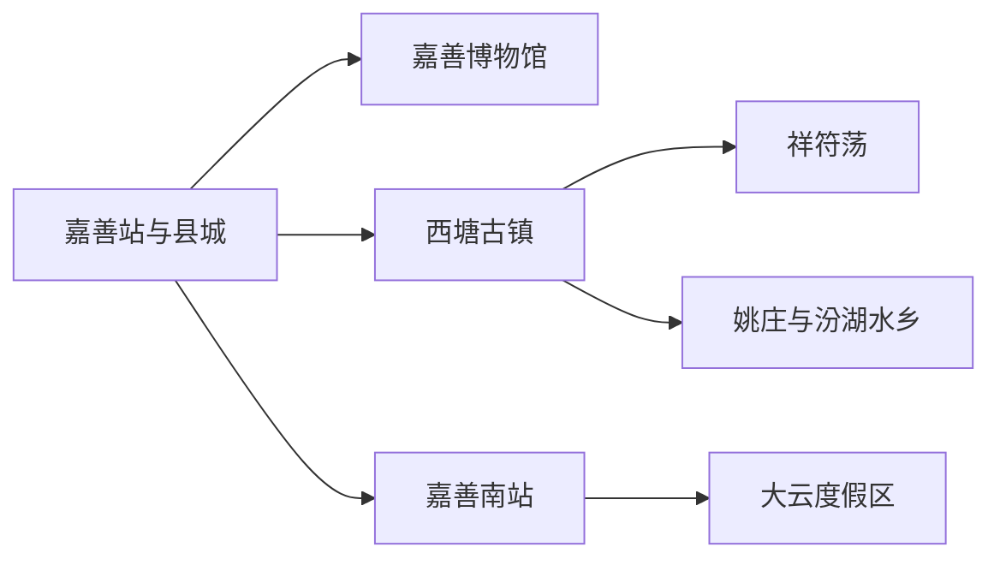
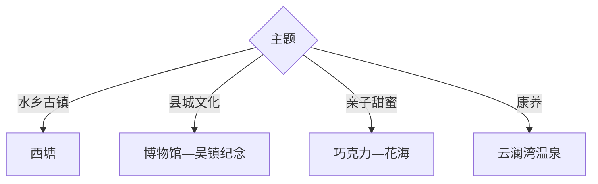

# 嘉善旅行指南

嘉善位于江浙沪交界，西塘古镇是人文核心，大云度假区提供温泉、巧克力与亲子体验，县城则以博物馆、吴镇纪念和田歌文化补足地方背景。两天可完成县城—西塘与大云两个方向。

## 城市速览

| 项目 | 信息 |
|---|---|
| 主线 | 嘉善县城—西塘古镇—大云度假区—祥符荡—姚庄水乡 |
| 停留 | 西塘1天；县城与大云再加1天 |
| 住宿 | 西塘适合早晚水乡，县城适合铁路与换线，大云适合度假 |
| 交通 | 嘉善站、嘉善南站接入，县内用公交、出租车或预约车 |
| 风险 | 梅雨台风、古镇拥挤、河网水情、温泉健康条件与亲子项目规则 |
| 边界 | 古镇民宅、湿地水域、食品生产线、乡村农田和创新园区按开放范围进入 |

## 城市格局与游览区域

固定 `Jiashan / GeoNames 7303248` 对应嘉善城市点，本页以法定嘉善县 `Q1361347` 组织。嘉善站靠近老城，嘉善南站更接近大云；西塘位于北部，三者适合按住宿和铁路到站分线。

## 主要景点

| 景点 | 区域 | 类型 | 核心体验 | 用时 | 环境 | 体力 | 预约风险 | 天气影响 | 优先级 |
|---|---|---|---|---:|---|---|---|---|---|
| 西塘古镇景区 | 西塘镇 | 水乡古镇 | 廊棚、河街、桥巷与生活社区 | 1天 | 室内外 | 中高 | 极高 | 高 | A |
| 嘉善博物馆 | 县城 | 地方文博 | 吴根越角、田歌、窑火与县史 | 2–4小时 | 室内 | 低 | 很高 | 低 | A |
| 吴镇纪念馆 | 县城 | 名人艺术 | 元代绘画、诗书与梅花园林 | 1.5–3小时 | 室内外 | 低 | 高 | 中 | A |
| 歌斐颂巧克力小镇当期开放区 | 大云镇 | 工业与亲子 | 巧克力知识、制造展示与家庭活动 | 3–6小时 | 室内外 | 低中 | 极高 | 中 | B |
| 云澜湾温泉度假区 | 大云镇 | 温泉度假 | 温泉、住宿与康养休闲 | 半日至1天 | 室内外 | 低 | 极高 | 中 | B |
| 碧云花海·十里水乡正规景区 | 大云镇 | 花田水乡 | 季节花景、乡村水网与亲子活动 | 半日 | 室外 | 低中 | 很高 | 很高 | B |
| 祥符荡公开滨水空间 | 西塘北部 | 湖荡生态 | 江南湖荡、创新社区与慢行 | 2–4小时 | 室外 | 低中 | 中 | 高 | B |
| 姚庄或天凝正规乡村旅游点 | 东北部 | 乡村非遗 | 桃花、窑乡、田歌与水乡村落 | 半日 | 室外 | 低中 | 极高 | 很高 | C |

## 美食与餐饮

可尝嘉善黄酒、八珍糕、麻饼、袜底酥、陆氏馄饨和水乡家常菜。西塘小吃适合少量分次，黄酒先确认酒精度；巧克力体验关注乳制品、坚果和可可过敏原，温泉前后避免大量饮酒。

## 经典行程

### 一日经典线
**路线**：嘉善博物馆—吴镇纪念馆—县城水系。**逻辑**：用文博建立嘉善地方背景。**预约锚点**：两馆开放。**休息**：县城。**删除条件**：时间不足时只留博物馆。

### 两日西塘大云线
**路线**：首日西塘；次日巧克力小镇—云澜湾或花海二选一。**逻辑**：古镇与度假亲子分日。**预约锚点**：西塘场馆、巧克力项目与温泉。**休息**：西塘或大云。**删除条件**：次日只保留一个运营项目。

### 三日水乡线
**路线**：前两日基础线；第三日祥符荡—姚庄或天凝正规乡村点。**逻辑**：北部湖荡与乡村慢行独立安排。**预约锚点**：活动、接待和车辆。**休息**：乡村接待点。**删除条件**：梅雨积水时整段删除。

### 雨天文博线
**路线**：嘉善博物馆—吴镇纪念馆—巧克力室内体验。**逻辑**：场馆与产业展示为主。**预约锚点**：三个时段。**休息**：县城。**删除条件**：台风预警时减少跨镇移动。

### 亲子甜蜜线
**路线**：巧克力小镇—午休—碧云花海当季开放项目。**逻辑**：食品科普与户外活动组合。**预约锚点**：年龄、课程、过敏原和花期。**休息**：大云。**删除条件**：花期不匹配时只留巧克力项目。

### 西塘慢游线
**路线**：古镇主要河街—午休—支巷与夜景。**逻辑**：在住客与日游客交替时段观察水乡。**预约锚点**：住宿、场馆和游船。**休息**：古镇正规茶馆。**删除条件**：水情停船时保留陆上街巷。

### 低体力线
**路线**：车辆到嘉善博物馆—午休—西塘近入口平缓段。**逻辑**：场馆与古镇短线控制步数。**预约锚点**：落客、座椅和无障碍。**休息**：县城。**删除条件**：古桥台阶负担大时只留博物馆。

## 住宿区域

嘉善县城适合嘉善站、博物馆和实用餐饮；嘉善南站周边适合高铁与大云；西塘适合早晚古镇；大云适合温泉度假。节假日核对古镇噪声、停车、接驳和退改。

## 市内交通

嘉善站与嘉善南站服务不同片区，订票后按住宿选择接驳。西塘、大云、县城之间以公交和公路为主；计划中的轨道项目以实际开通公告为准。河网地区在台风、暴雨和积水时调整线路。

## 不同旅行者须知

水乡旅行者给西塘完整一天；艺术爱好者优先吴镇纪念馆；亲子家庭选巧克力与花海；康养旅行者核对温泉禁忌。古镇民宅、食品生产线、乡村农田、湿地水域和创新园区办公区保留明确限制。

## 行前核对

- 核对西塘、嘉善博物馆、吴镇纪念馆、巧克力小镇、云澜湾与花海开放。
- 核对梅雨台风、河网水情、古镇游船、铁路到站与跨镇公交。
- 工业体验只进入正式展厅与参观线，温泉按健康提示选择项目。

## 来源与更新记录

| 来源 | 支持内容 | 核验日期 |
|---|---|---|
| [嘉善县政府：走进嘉善](https://www.jiashan.gov.cn/col/col1229250517/) | 西塘、博物馆、吴镇纪念、巧克力与云澜湾 | 2026-09-01 |
| [嘉善县政府：全域旅游](https://www.jiashan.gov.cn/art/2017/12/29/art_1229268809_57269150.html) | 大云、花海、工业与乡村旅游格局 | 2026-09-01 |
| [GeoNames 7303248](https://www.geonames.org/7303248/) | Jiashan 固定城市点 | 2026-09-01 |
| [Wikidata Q1361347](https://www.wikidata.org/wiki/Q1361347) | 嘉善县实体与跨库标识 | 2026-09-01 |

| 日期 | 更新 |
|---|---|
| 2026-09-01 | 首次完成嘉善旅行研究，按县城文博、西塘与大云度假组织。 |
