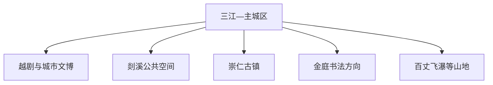
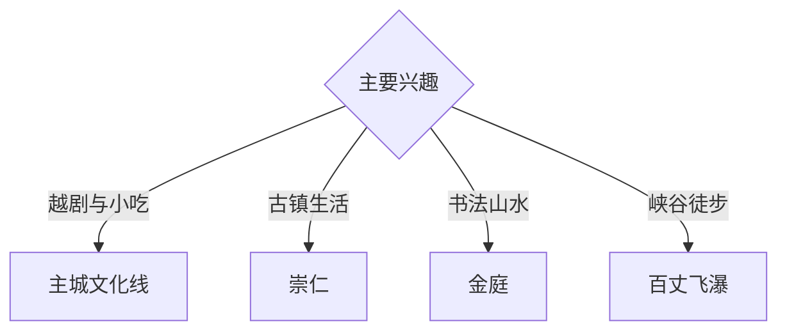

# 嵊州旅行指南

嵊州位于曹娥江上游的剡溪流域，以越剧、书法、古镇、山水和小吃形成独立旅行体验。固定快照中的 **Shanhu / GeoNames 1795647** 对应三江—市区一带；主城适合文博与饮食，越剧小镇、崇仁、金庭和百丈飞瀑分属不同方向。

## 城市速览

| 项目 | 信息 |
|---|---|
| 主线 | 越剧文化—剡溪主城—崇仁古镇—金庭书法—山水远郊 |
| 停留 | 主城 1 天；古镇、书法或山水方向各另留半日至1天 |
| 住宿 | 主城交通餐饮最便利；乡村住宿适合山水慢游 |
| 交通 | 高铁与公路抵达，远郊宜公交、约车或自驾 |
| 季节 | 春秋适合古镇与山水；梅雨和台风期关注溪流水位 |
| 预算 | 小吃与住宿选择多，远郊车辆和演出是主要增量成本 |

## 城市格局与游览区域

主城区承担高铁接驳、住宿和餐饮；崇仁偏古镇，金庭偏书法文化，百丈飞瀑与西白山等山地需要独立车程。河道行洪区、山地地质风险区、古建保护范围和乡村生产空间按公告与现场边界进入。

## 主要景点

| 景点 | 区域 | 类型 | 核心体验 | 用时 | 环境 | 体力 | 研究价值 | 拥挤 | 优先级 |
|---|---|---|---|---:|---|---|---|---|---|
| 越剧小镇或越剧公共展演 | 甘霖方向 | 戏曲与文化体验 | 越剧起源、表演、唱腔与当代传承 | 半天 | 混合 | 低 | 很高 | 演出时中高 | A |
| 嵊州地方博物馆或越剧展陈 | 主城区 | 博物馆 | 剡溪历史、越剧与地方社会 | 2–3小时 | 室内 | 低 | 很高 | 低 | A |
| 崇仁古镇依法开放区 | 崇仁镇 | 古镇与古建 | 宗族聚落、台门、街巷与乡土生活 | 半天 | 室外 | 低中 | 高 | 节假日中 | A |
| 金庭王羲之文化公开区 | 金庭镇 | 书法与纪念地 | 王羲之、书法传统与浙东山水 | 半天 | 混合 | 中 | 很高 | 节假日中 | A |
| 剡溪与艇湖公共空间 | 主城 | 河流与公园 | 山水城市、慢行与居民生活 | 2小时 | 室外 | 低 | 中 | 傍晚中 | B |
| 百丈飞瀑依法开放区 | 王院方向 | 峡谷与瀑布 | 山谷水系、瀑布与季节植被 | 1天 | 室外 | 中高 | 高 | 丰水期中 | B |
| 西白山或贵门公开山地线 | 市域山地 | 山地与乡村 | 浙东丘陵、古道与村落 | 1天 | 室外 | 高 | 中 | 季节性 | C |

## 美食与餐饮

嵊州小笼包、榨面、豆腐包、糟货和年糕适合用多顿小吃串联。主城老街与生活商业区选择密集；一人用餐可点小份，猪肉、虾皮、麸质和糟制酒香等成分按饮食需求确认。

## 经典行程

### 主城一日线
**路线**：地方展陈—小吃午餐—剡溪公共空间—越剧演出或体验。**逻辑**：从城市史进入活态戏曲。**预约锚点**：演出和场馆。**休息**：主城。**删除条件**：无演出时增加小吃与滨水段。

### 越剧专题线
**路线**：越剧展陈—越剧小镇公开区—正式演出。**逻辑**：按起源、空间和舞台理解剧种。**预约锚点**：演出与体验名额。**休息**：甘霖或主城。**删除条件**：演出取消时保留展陈。

### 崇仁古镇线
**路线**：主城—崇仁古镇—台门与街巷—返程。**逻辑**：给传统聚落半天以上。**预约锚点**：重点古建开放。**休息**：镇区。**删除条件**：暴雨时改室内文博。

### 金庭书法线
**路线**：主城—金庭公开纪念设施—乡村山水—返程。**逻辑**：把书法人物与地域环境结合。**预约锚点**：场馆和车辆。**休息**：镇区。**删除条件**：山路受天气影响时改主城。

### 百丈飞瀑山水线
**路线**：主城—景区入口—依法开放步道—返程。**逻辑**：独立一天承接峡谷尺度。**预约锚点**：景区与道路。**休息**：游客中心。**删除条件**：强降雨、山洪或地质预警时整段顺延。

### 亲子低体力线
**路线**：越剧展陈—小吃—短段剡溪公园。**逻辑**：室内外切换、步行可控。**预约锚点**：儿童演出规则。**休息**：主城。**删除条件**：疲劳时保留展陈和小吃。

### 两日组合线
**路线**：首日主城与越剧；次日崇仁、金庭或百丈飞瀑三选一。**逻辑**：不同远郊方向分日。**预约锚点**：第二日交通。**休息**：连续住主城。**删除条件**：一天时保留主城线。

## 住宿区域

主城区适合高铁、餐饮和多方向出发；甘霖便于越剧主题；崇仁或山地正规民宿适合慢游。订房核对夜间接驳、消防、停车、早餐和强降雨退改。

## 市内交通

嵊州新昌站服务两地，订票后确认到站与城区接驳。主城用公交、出租车和步行；崇仁、金庭与山地提前确认城乡班次及返程。自驾在古镇窄路和山路按停车与临时交通组织行驶。

## 不同旅行者须知

戏曲旅行者先锁定演出；书法兴趣者给金庭半天；亲子和长者以主城、古镇低坡段为主；徒步者关注补水与返程。古建内部、文物保护区、河道行洪区、未开放古道和林地防火封控区保留明确限制。

## 行前核对

- 核对越剧演出、地方场馆、崇仁与金庭开放。
- 核对百丈飞瀑及山地道路、汛情、台风和地质灾害预警。
- 核对嵊州新昌站接驳、城乡班次与返程。
- 核对古镇活动、民宿和餐饮营业日期。

## 来源与更新记录

| 来源 | 支持内容 | 核验日期 |
|---|---|---|
| [嵊州市政府：文广旅游工作总结](https://www.szzj.gov.cn/art/2020/5/13/art_1229761690_4093726.html) | 越剧、崇仁、百丈飞瀑、金庭与乡村旅游结构 | 2026-09-03 |
| [嵊州市政府：嵊州市越剧博物馆](https://www.szzj.gov.cn/art/2025/3/31/art_1229858566_59099489.html) | 越剧博物馆定位、收藏研究与公众教育功能 | 2026-09-03 |
| [GeoNames 1795647](https://www.geonames.org/1795647/) | Shanhu 固定人口点与嵊州主城位置 | 2026-09-03 |
