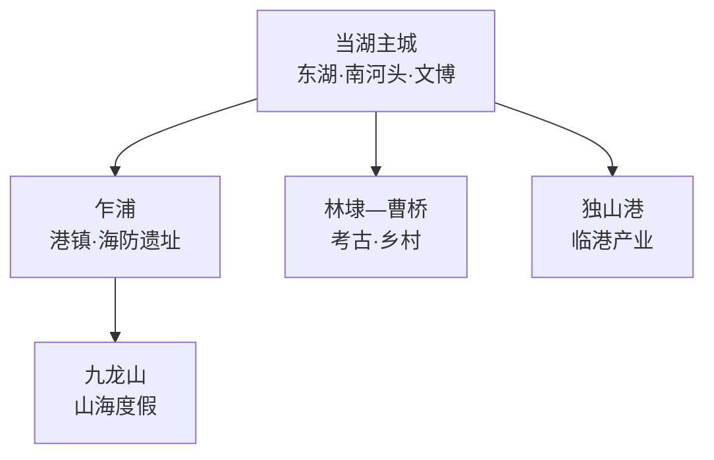
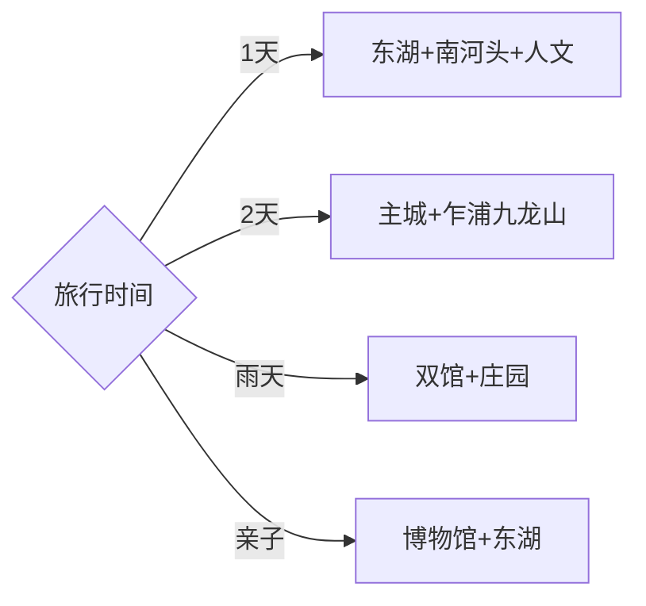

# 平湖旅行指南

平湖位于浙沪交界，主城水乡、乍浦海防与九龙山海岸构成三条最清楚的旅行线。第一次来可住当湖，用一天串联东湖、南河头、莫氏庄园和李叔同纪念馆；第二天前往乍浦，在正式开放点认识海塘、炮台和港镇。固定快照中的 **Zhapu / GeoNames 1784800** 对应平湖市乍浦镇，坐标、名称与嘉兴市行政层级闭合；嘉兴主城、海盐以及上海金山均按跨县级行政区行程处理。

> 建议停留：1–2 天\
> 旅行关键词：东湖、南河头、莫氏庄园、李叔同、乍浦海防\
> 主要体力：主城低；九龙山与炮台线中等\
> 最近研究：2026-09-03

## 城市速览

| 项目 | 旅行信息 |
|---|---|
| 主要旅行价值 | 在紧凑主城看江南水乡、近代人文和庄园建筑，再到乍浦理解海防与港镇 |
| 建议停留 | 1天覆盖主城；增加乍浦—九龙山后安排2天 |
| 较舒适季节 | 春秋适合步行；初夏关注梅雨；盛夏防高温与台风；冬季海边风冷 |
| 预算特点 | 主城步行成本低，沿海接驳、景区项目和度假住宿是主要变量 |
| 步行强度 | 东湖与街区低，古建台阶少量，沿海山地中等 |
| 主要天气风险 | 台风、暴雨、雷电、高温、海边强风、潮位与内涝 |
| 独行旅行 | 主城友好，乍浦与九龙山返程先确认 |
| 亲子旅行 | 博物馆、东湖和非遗活动容易组合，海岸线按天气选点 |
| 长者与低体力旅行 | 主城水乡线较轻松，沿海选择车辆可达的正式观景点 |
| 无障碍信息 | 新建公共空间相对友好，历史建筑门槛和海岸步道需逐点确认 |

## 城市格局与游览区域

| 区域 | 主要内容 | 游览特点 | 与其他区域的关系 |
|---|---|---|---|
| 当湖主城 | 东湖、南河头、莫氏庄园、李叔同纪念馆 | 点位紧凑，适合步行和骑行 | 一日游核心与住宿基地 |
| 乍浦 | 乍浦炮台、港镇街巷与海塘线索 | 文保、海防和港区边界并存 | 可与九龙山组合一天 |
| 九龙山 | 正式开放的山海步道与度假项目 | 受天气、潮位和项目运营影响 | 从乍浦进入较顺 |
| 林埭—曹桥 | 庄桥坟遗址线索与乡村空间 | 以公开展陈和正规农旅点为主 | 适合第三日或自驾补充 |
| 独山港 | 临港工业与海河联运 | 生产空间为主 | 只在公共道路和正式展示点观察 |

## 主要景点

| 景点 | 区域 | 类型 | 主要看点 | 建议用时 | 室内外 | 体力 | 预约风险 | 天气影响 | 优先级 |
|---|---|---|---|---:|---|---|---|---|---|
| 东湖景区公共游线 | 当湖 | 湖景与城市公园 | 湖岸、桥景与城市日常 | 2–3小时 | 室外 | 低 | 低 | 高 | A |
| 南河头历史文化街区 | 当湖 | 水乡街区 | 河埠、街巷、修缮建筑与夜间活动 | 2–3小时 | 混合 | 低 | 中 | 中 | A |
| 莫氏庄园 | 当湖 | 清代建筑 | 江南宅园格局与地方家族生活 | 1–1.5小时 | 混合 | 低 | 中 | 低 | A |
| 李叔同纪念馆 | 当湖 | 人物纪念馆 | 李叔同生平、艺术与近代文化 | 1–1.5小时 | 室内 | 低 | 中 | 低 | A |
| 平湖市博物馆 | 当湖 | 博物馆 | 地方历史、良渚文化线索与民俗 | 1.5–2小时 | 室内 | 低 | 中 | 低 | B |
| 乍浦炮台批准开放点 | 乍浦 | 海防遗址 | 清代海防、海塘与港口地理 | 1.5–2小时 | 室外 | 中 | 高 | 很高 | B |
| 九龙山正式开放游线 | 乍浦 | 海岸与山地 | 山海景观、森林步道与度假空间 | 半天 | 室外 | 中 | 中高 | 很高 | B |
| 报本塔外围与叔同公园 | 主城 | 古塔与公园 | 城市文化景观和休闲步行 | 1–2小时 | 室外 | 低 | 低 | 中 | C |

## 美食与餐饮

| 菜品或餐饮类型 | 常见区域 | 一个人用餐与常见份量 | 风味、过敏原与饮食限制 | 排队风险与替代方法 |
|---|---|---|---|---|
| 糟蛋等地方传统食品 | 主城正规门店 | 小份适合品尝或伴手礼 | 含蛋、酒糟和较高盐分 | 看包装、保质期与配料表 |
| 河鲜与家常鱼 | 当湖正规餐馆 | 多人分享更合适，独行可问小份 | 注意鱼刺、酒糟调味和水产来源 | 选择明码标价店铺 |
| 乍浦海鲜 | 乍浦正规餐馆 | 按人数点菜，先问时价 | 贝类过敏、禁渔期与来源需留意 | 确认重量、做法和总价 |
| 粽子、糕团与江南点心 | 主城街区 | 单个或小份友好 | 糯米不易消化，馅料可能含坚果 | 少量组合，错峰购买 |
| 平湖西瓜及季节果蔬 | 正规市场与农旅点 | 按小份或整果选择 | 供应随季节变化 | 选择可追溯摊点，不进入生产田块采摘 |

## 经典行程

### 一日城市经典路线

**路线**：李叔同纪念馆 → 东湖 → 午餐 → 莫氏庄园 → 南河头历史文化街区

- **串联逻辑**：沿主城水系串起人物、湖景、宅园和街区，减少换乘。
- **预约锚点**：两座室内场馆的开放和南河头活动。
- **休息安排**：东湖公共空间与南河头正规餐饮。
- **时间不足时**：保留东湖、莫氏庄园和南河头。

### 两日水乡与海岸路线

**第 1 天**：主城东湖—人文—南河头。\
**第 2 天**：乍浦炮台公开点 → 港镇午餐 → 九龙山正式开放游线。

- **串联逻辑**：主城水乡和海防海岸分日，第二天集中在东南方向。
- **预约锚点**：炮台开放、九龙山项目与交通。
- **休息安排**：主城连住或第二晚按返程安排；乍浦镇区午休。
- **时间不足时**：第二日保留炮台展陈与一处海岸观景点。

### 三日慢游路线

**第 1 天**：东湖、莫氏庄园与南河头。\
**第 2 天**：乍浦与九龙山。\
**第 3 天**：平湖市博物馆 → 林埭或曹桥正规乡村项目。

- **串联逻辑**：水乡、海岸和乡村分别安排，第三日按活动和季节调整。
- **预约锚点**：乡村接待、农事活动与博物馆开放。
- **休息安排**：以主城为基地，远线日预留返程缓冲。
- **时间不足时**：先删第三日，再把九龙山缩为半天。

### 雨天路线

**路线**：平湖市博物馆 → 午餐 → 李叔同纪念馆 → 莫氏庄园室内开放区

- **适用条件**：普通降雨采用室内线；台风、暴雨或内涝响应时留在安全室内。
- **预约锚点**：闭馆、展陈维护与道路交通。
- **休息安排**：场馆公共区和主城商业区。
- **时间不足时**：保留市博物馆与李叔同纪念馆。

### 亲子或低体力路线

**亲子路线**：平湖市博物馆 → 东湖观察 → 南河头非遗活动。\
**低体力路线**：李叔同纪念馆 → 车辆接驳莫氏庄园 → 东湖短走。

- **减负方式**：亲子用展陈和观察任务串联；低体力线缩短湖岸距离并减少古建门槛往返。
- **预约锚点**：活动年龄、无障碍入口、停车和座椅。
- **休息安排**：场馆、东湖驿站与街区餐饮。
- **时间不足时**：两类路线均保留一馆加东湖短线。

### 乍浦海防路线

**路线**：主城 → 乍浦镇 → 炮台批准开放点 → 海塘公共观景段 → 港镇午餐 → 返回

- **适用条件**：适合文保点明确开放、海边天气稳定的日期。
- **预约锚点**：炮台接待、潮位、道路和返程车辆。
- **休息安排**：乍浦镇正规餐饮与正式服务点。
- **时间不足时**：保留有讲解的海防展陈，海塘只作短停。

### 九龙山山海路线

**路线**：乍浦 → 九龙山游客服务点 → 正式森林或海岸步道 → 公开观景点 → 返回

- **串联逻辑**：全程围绕同一运营区，按体力选择山线或海线。
- **预约锚点**：开放项目、票务、停车和海边警戒。
- **休息安排**：正式游客中心和批准休息区。
- **时间不足时**：选择一条短步道与一处公共观景点。

## 住宿区域

| 区域 | 优点 | 缺点 | 适合人群 | 交通特点 |
|---|---|---|---|---|
| 当湖主城 | 餐饮、东湖、南河头与文博集中 | 前往海岸需接驳 | 初访、独行、公共交通旅行者 | 适合步行加短途车辆 |
| 平湖站方向 | 城际铁路抵离方便 | 与主城核心仍需接驳 | 上海、嘉兴方向短住 | 核对开通线路与末班 |
| 乍浦镇 | 靠近海防和九龙山 | 节假日及天气影响较大 | 海岸、摄影、自驾旅行者 | 适合第二天早出发 |
| 九龙山正规度假住宿 | 山海环境完整 | 价格、项目和餐饮选择波动 | 度假与家庭旅行 | 订房时确认运营范围和接驳 |

## 市内交通

| 场景 | 建议与取舍 | 行前需要重查的内容 |
|---|---|---|
| 从上海、嘉兴或杭州抵达 | 按铁路或公路实际班次选择，不用直线距离估算时间 | 到发站、换乘、末班与施工 |
| 主城内部 | 东湖、南河头和人文场馆可步行加短途公交 | 场馆入口、骑行范围与夜间交通 |
| 主城—乍浦—九龙山 | 留完整半天至一天，按正式入口顺序游览 | 公交、叫车、停车与返程 |
| 独山港方向 | 生产区与公共生活区分开，只安排有明确接待的点 | 港区管制、危化品运输与道路公告 |

## 不同旅行者须知

| 旅行维度 | 可行条件 | 主要取舍 | 需额外核对 |
|---|---|---|---|
| 独行旅行 | 主城步行与餐饮方便 | 海岸晚间返程选择较少 | 末班、叫车覆盖与住宿位置 |
| 亲子旅行 | 博物馆、东湖和非遗活动易组合 | 海边风浪与步道受天气影响 | 活动年龄、护栏和休息点 |
| 长者或低体力旅行 | 主城水乡线负担较低 | 炮台和九龙山有坡路 | 无障碍入口、车辆和座椅 |
| 无障碍需求 | 新建公共空间优先 | 古建门槛与海岸步道连续性有限 | 坡道、卫生间与陪同 |
| 摄影旅行 | 湖景、水乡、海防和海岸题材集中 | 海雾、潮位与港区规则影响取景 | 日出日落、航拍与警戒线 |
| 预算有限 | 主城一日可步行为主 | 海岸车辆和度假项目增加支出 | 公交、门票、停车与退改 |
| 晚出发或紧凑行程 | 主城核心可做半日 | 乍浦与九龙山适合完整时段 | 最晚入馆与返程 |
| 特殊天气或自然条件 | 小雨可转室内场馆 | 台风、暴雨、强风和高潮位影响海岸 | 气象、海塘、景区与道路公告 |

莫氏庄园、乍浦炮台、庄桥坟等文物点按批准开放范围参观；修缮区和考古工作区服从现场管理。海塘、滩涂、码头、独山港、危化品仓储与临港工厂按防潮、生态和生产安全边界通行。农旅体验使用正规接待项目，进入田块或采摘前取得经营方安排。

## 行前核对

| 核对事项 | 为什么需要重查 | 建议核对时间 | 官方入口 |
|---|---|---|---|
| 主城场馆与南河头活动 | 闭馆、展陈和街区活动会调整 | 排入行程前及到访前一日 | [平湖市人民政府](https://www.pinghu.gov.cn/) |
| 乍浦炮台与九龙山 | 文保、运营、维护和天气影响开放 | 订车前及到访当天 | [平湖市人民政府](https://www.pinghu.gov.cn/) |
| 台风、暴雨、强风与潮位 | 海岸、海塘和道路受影响 | 出发前三日及当天 | [浙江省气象局](https://zj.cma.gov.cn/) |
| 铁路与跨市接驳 | 线路、到发站和末班会变化 | 购票前及当天 | [中国铁路12306](https://www.12306.cn/) |

## 来源与更新记录

### 主要来源

| 来源 | 类型 | 支持内容 | 核验日期 |
|---|---|---|---|
| [平湖市人民政府：2024年重点工作完成情况](https://www.pinghu.gov.cn/art/2024/7/1/art_1229591437_5324895.html) | 政府 | 东湖、南河头、九龙山、文博场馆与城市旅游建设 | 2026-09-03 |
| [平湖市人民政府：当湖文旅消费场景](https://www.pinghu.gov.cn/art/2025/6/16/art_1229395937_59865872.html) | 政府 | 南河头、东湖、博物馆与非遗活动线索 | 2026-09-03 |
| [嘉兴市自然资源和规划局相关规划附件](https://zrzyhghj.jiaxing.gov.cn/module/download/downfile.jsp?classid=0&filename=8747feae470d4fcc9df1b37d00bb9695.pdf) | 政府 | 莫氏庄园、乍浦炮台与文物保护身份 | 2026-09-03 |
| [GeoNames 1784800](https://www.geonames.org/1784800/) | 开放数据 | Zhapu 固定人口点、坐标与行政代码 | 2026-09-03 |

### 更新记录

| 日期 | 更新内容 |
|---|---|
| 2026-09-03 | 首次完成资料研究、空间拆分、七条路线与县级市映射 |
