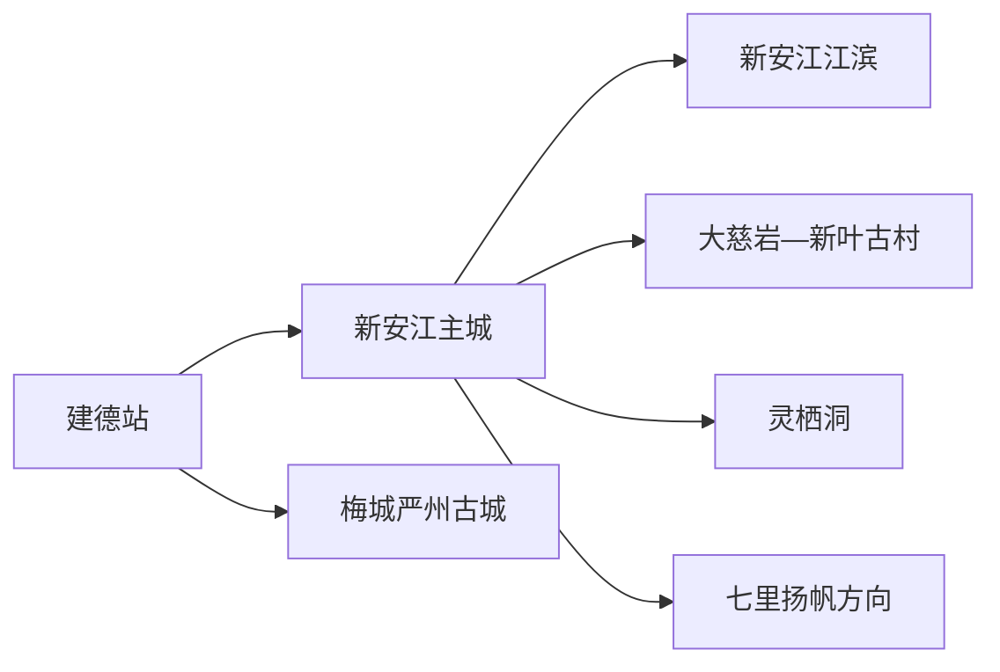
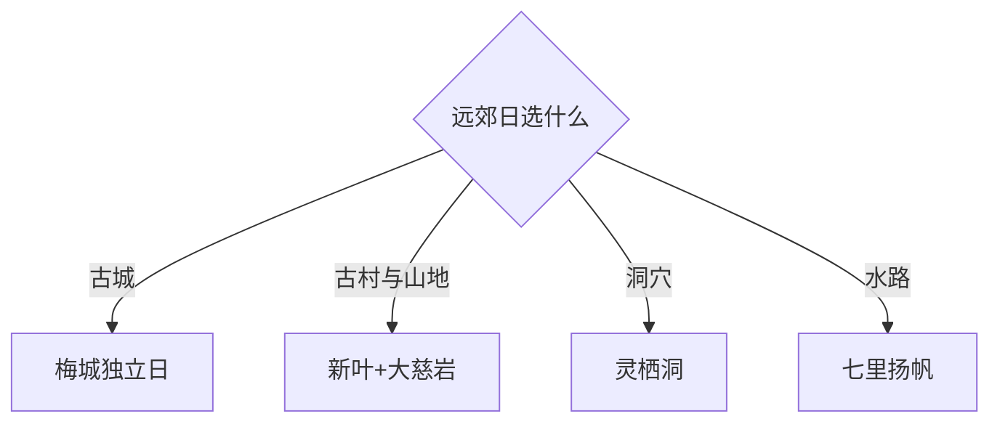

# 建德旅行指南

建德位于杭州西部的新安江、富春江与兰江水系，主线是新安江主城的冷水雾景、梅城严州古城，以及大慈岩、新叶古村、灵栖洞等分散景区。固定 **Xin’anjiang / GeoNames 1789243** 是建德市政府驻地新安江街道的城镇点，本页承接整个县级市的旅行结构。

## 城市速览

| 项目 | 信息 |
|---|---|
| 主线 | 新安江主城—江滨步道—梅城古镇—大慈岩或灵栖洞 |
| 停留 | 主城与梅城2天；山地洞穴或古村再加1天 |
| 住宿 | 新安江主城综合便利；梅城适合古城夜游；建德站附近适合早晚车次 |
| 交通 | 建德站接入高铁，市域景区跨度大，使用公交、景区接驳或预约车辆 |
| 风险 | 汛期水位、山地雷雨、洞穴湿滑、漂流运营和水电设施边界 |

## 城市格局与游览区域

新安江主城适合食宿、江滨和城市服务；梅城位于三江口，以严州古城和历史街区为主；大慈岩—新叶古村、灵栖洞、七里扬帆分属不同方向。每天选择一个远郊主题，能给接驳、天气和景区游览留出余量。

## 主要景点

| 景点 | 区域 | 类型 | 核心体验 | 用时 | 环境 | 体力 | 研究价值 | 拥挤 | 优先级 |
|---|---|---|---|---:|---|---|---|---|---|
| 新安江江滨公开段 | 新安江主城 | 滨水城市 | 冷水效应、雾景与城市慢行 | 2–3小时 | 室外 | 低中 | 高 | 夏季高 | A |
| 新安江水电站公开参观区 | 新安江 | 工业遗产 | 水电建设史与工程展陈 | 2小时 | 混合 | 低中 | 很高 | 团体时高 | A |
| 梅城严州古城 | 梅城镇 | 历史城镇 | 州府格局、城门、街巷与三江口 | 半天至1天 | 混合 | 中 | 很高 | 节假日高 | A |
| 大慈岩 | 大慈岩镇 | 山岳宗教 | 山体栈道、寺观与地貌 | 半天 | 室外 | 高 | 高 | 节假日高 | A |
| 新叶古村 | 大慈岩镇 | 古村 | 宗族聚落、明清建筑与生活村落 | 2–3小时 | 混合 | 中 | 很高 | 节假日中高 | A |
| 灵栖洞 | 航头方向 | 洞穴 | 喀斯特洞穴与地下景观 | 2–3小时 | 室内湿滑 | 中 | 高 | 暑期高 | B |
| 七里扬帆 | 富春江方向 | 江峡游览 | 富春江水路与两岸山景 | 半天 | 混合 | 低中 | 高 | 节假日高 | B |
| 建德市博物馆 | 新安江主城 | 博物馆 | 建德地方史与文物 | 1–2小时 | 室内 | 低 | 高 | 团体时中 | B |
| 寿昌古镇公开街区 | 寿昌镇 | 历史街镇 | 集镇街巷与地方饮食 | 2–3小时 | 混合 | 低中 | 中 | 节庆时高 | B |

## 美食与餐饮

建德豆腐包、严州干菜鸭、江鲜、寿昌小吃和草莓等农产品适合按片区选择。江鲜遵循禁捕与正规供应链，点单时确认来源、时价和做法；草莓采摘按园方开放区域和称重规则进行。山地出发前准备饮水与简餐，过敏者询问豆制品、笋干、花生及共用油锅。

## 经典行程

### 一日基础线
**路线**：建德市博物馆—主城午餐—新安江江滨—夜间公开段。**逻辑**：先读城市，再理解水电塑造的冷水河城。**预约锚点**：博物馆与水电主题参观。**休息**：主城商业。**删除条件**：汛情或雷雨时删滨水段。

### 梅城一日线
**路线**：梅城游客区—古城公开街巷—午休—三江口公开滨水段。**逻辑**：围绕严州府城空间慢行。**预约锚点**：馆舍与演出。**休息**：古城正规商业。**删除条件**：高水位时取消滨水段。

### 大慈岩新叶线
**路线**：大慈岩—午休—新叶古村。**逻辑**：山岳与生活古村分开阅读。**预约锚点**：景区交通与古村开放。**休息**：景区服务区。**删除条件**：雷雨或体力不足时在两者中选一处。

### 灵栖洞线
**路线**：主城—灵栖洞—镇区午餐—返城。**逻辑**：用半日至一天完成洞穴主题。**预约锚点**：开放洞段与接驳。**休息**：游客中心。**删除条件**：暴雨、检修或地质风险时取消。

### 七里扬帆线
**路线**：指定码头—核定航线—返主城。**逻辑**：以当日船班组织水路体验。**预约锚点**：航班、码头和天气。**休息**：码头服务区。**删除条件**：停航时改梅城或博物馆。

### 亲子低体力线
**路线**：博物馆—午休—新安江江滨平缓短段。**逻辑**：室内展陈配低强度水岸。**预约锚点**：馆内活动。**休息**：主城。**删除条件**：高温时保留室内。

### 雨天线
**路线**：博物馆—正规商业空间—已确认开放的室内展陈。**逻辑**：降低山地、洞穴和江岸风险。**预约锚点**：馆舍开放。**休息**：室内。**删除条件**：强降雨与地质预警时提前返宿。

## 住宿区域

新安江主城适合首次到访、江滨和跨方向换乘；梅城适合严州古城早晚漫步；建德站—高铁新区适合早晚车次；大慈岩、新叶周边住宿适合次日早入景区。选择住宿时比较接驳、夜间餐饮和次日首站。

## 市内交通

建德站与新安江主城之间需公路接驳，梅城、灵栖洞、大慈岩、新叶和七里扬帆分散。先核对公交、景区专线和末班；水电站坝体、发电设施、航道、码头作业区和泄洪警戒区执行明确安全限制。

## 不同旅行者须知

历史旅行者优先梅城和博物馆；工业遗产兴趣者核对水电站公开参观；亲子家庭选择江滨、博物馆或单一洞穴景区；高龄和低体力旅行者在大慈岩、新叶、灵栖洞中择一，并提前确认缆车、台阶和卫生间。

## 行前核对

- 核对水电站、博物馆、古城馆舍、洞穴和水上项目的预约与开放。
- 核对新安江水位、泄洪、雷雨、地质灾害与景区接驳末班。
- 坝体生产设施、航道作业区、农田果园和古村民宅按许可范围进入。

## 来源与更新记录

| 来源 | 支持内容 | 核验日期 |
|---|---|---|
| [建德市政府：梅城文旅与古城更新](https://www.jiande.gov.cn/art/2025/1/26/art_1229535708_4329850.html) | 严州古城、三江口、文旅路线与汛期边界 | 2026-09-01 |
| [建德市政府：六大景区信息](https://www.jiande.gov.cn/art/2025/5/21/art_1229542569_59131908.html) | 灵栖洞、七里扬帆、新叶、大慈岩等景区身份 | 2026-09-01 |
| [GeoNames 1789243](https://www.geonames.org/1789243/) | Xin’anjiang 固定人口点与位置 | 2026-09-01 |

| 日期 | 更新 |
|---|---|
| 2026-09-01 | 首次完成建德旅行研究；明确新安江驻地记录与建德县级市页面关系。 |
