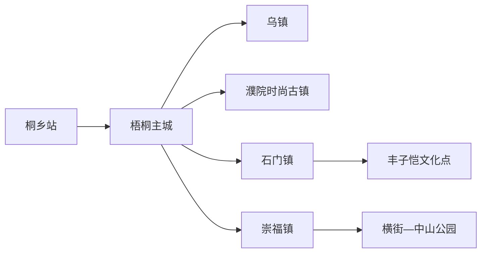
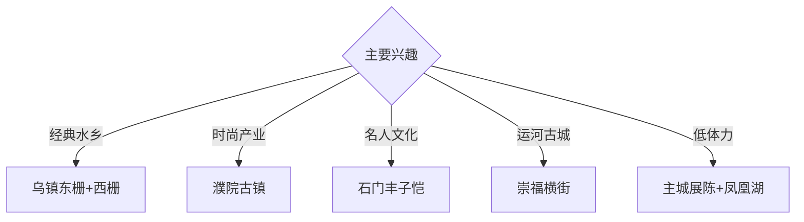

# 桐乡旅行指南

桐乡位于嘉兴西部，乌镇、濮院、梧桐主城、石门和崇福分别代表水乡、时尚产业、现代城市、名人文化与运河古城。固定快照中的 **Tongxiang / GeoNames 1790942** 对应现行桐乡市；乌镇、濮院和崇福各有独立游览范围，适合按兴趣分日安排。固定清单中的 **Chóngfú / GeoNames 1814928** 对应崇福镇，作为桐乡市域内部历史城镇并入本页。

## 城市速览

| 项目 | 信息 |
|---|---|
| 主线 | 乌镇—濮院—梧桐主城—石门丰子恺文化—崇福运河古城 |
| 停留 | 乌镇1–2天；濮院1天；主城、石门或崇福各加半天至1天 |
| 住宿 | 乌镇适合夜游；濮院适合时尚古镇；桐乡站—主城便于换乘；崇福适合古城慢游 |
| 交通 | 高铁抵达桐乡站，公交、景区专线、出租车连接各镇 |
| 风险 | 水岸台阶、节庆客流、夜间返程、商业展演与产业园开放边界 |

## 城市格局与游览区域

乌镇位于北部，东栅、西栅和当期开放的文化场馆按独立票务组合；濮院位于东部，以时尚古镇和毛衫产业为主。梧桐主城承担高铁接驳与公共文化，石门镇连接丰子恺和蚕桑文化。崇福位于市域西南部，可沿横街、中山公园、徐自华纪念馆及当期开放的孔庙大成殿理解运河古城格局；五个片区之间使用公交或车辆转换。

## 主要景点

| 景点 | 区域 | 类型 | 核心体验 | 用时 | 环境 | 体力 | 研究价值 | 拥挤 | 优先级 |
|---|---|---|---|---:|---|---|---|---|---|
| 乌镇西栅景区 | 乌镇 | 水乡古镇 | 河道、桥梁、夜景与文化演艺 | 半天至1天 | 混合 | 中 | 很高 | 节假日高 | A |
| 乌镇东栅景区 | 乌镇 | 水乡古镇 | 茅盾文化、传统街巷与生活空间 | 半天 | 混合 | 中 | 很高 | 节假日高 | A |
| 木心美术馆或乌镇当期开放艺术场馆 | 乌镇 | 艺术馆 | 文学艺术、建筑与当代展览 | 2–3小时 | 室内 | 低 | 高 | 周末中高 | A |
| 濮院时尚古镇 | 濮院镇 | 古镇与时尚 | 水乡空间、针织产业与节庆活动 | 1天 | 混合 | 中 | 很高 | 节假日高 | A |
| 桐乡市博物馆或公共文化展陈 | 梧桐主城 | 博物馆 | 地方史、蚕桑、名人和城市发展 | 2小时 | 室内 | 低 | 高 | 团体时中 | B |
| 丰子恺故居及石门漫画文化街区 | 石门镇 | 名人文化 | 漫画、文学、故居与镇区历史 | 半天 | 混合 | 低中 | 高 | 周末中 | A |
| 崇福横街—中山公园—徐自华纪念馆 | 崇福镇 | 历史城镇 | 运河古城、老街、城墙遗址线索与近代人物文化 | 半天至1天 | 混合 | 低中 | 高 | 周末中 | A |
| 凤凰湖公共开放区 | 梧桐主城 | 城市公园 | 现代城市、湖岸慢行与夜景 | 1–2小时 | 室外 | 低 | 中 | 傍晚中 | B |

## 美食与餐饮

桐乡羊肉面、姑嫂饼、乌镇酱鸭、定胜糕、野火饭和杭白菊具有地方辨识度。节庆和古镇餐饮提前核对排队与营业时间；羊肉、甜点和酒酿按个人饮食习惯选择，伴手礼关注生产日期和储存条件。

## 经典行程

### 一日乌镇基础线
**路线**：东栅—午餐—艺术场馆—西栅—夜景。**逻辑**：从传统街巷过渡到当代文化和夜游。**预约锚点**：联票、场馆与演出。**休息**：西栅游客服务区。**删除条件**：只留半天时选择一个栅区。

### 乌镇文学艺术线
**路线**：茅盾相关展陈—木心美术馆或当期艺术馆—午餐—西栅文化空间。**逻辑**：以文学和艺术理解古镇更新。**预约锚点**：场馆开放和展览票。**休息**：乌镇镇区。**删除条件**：艺术馆闭馆时增加东栅街巷。

### 濮院时尚线
**路线**：濮院时尚古镇—针织文化公开展陈—午餐—夜间活动。**逻辑**：连接传统水乡、毛衫产业与时尚事件。**预约锚点**：景区门票、展演和返程。**休息**：古镇服务区。**删除条件**：大型活动管控时缩短夜游。

### 石门名人线
**路线**：桐乡主城—石门镇—丰子恺故居—漫画文化街区—返城。**逻辑**：用故居与镇区空间理解名人文化。**预约锚点**：故居和展馆开放。**休息**：石门镇公共服务区。**删除条件**：故居闭馆时改主城博物馆。

### 崇福运河古城线
**路线**：主城—崇福横街—徐自华纪念馆—中山公园—孔庙大成殿当期开放区—返城。**逻辑**：用横街、城墙遗址线索和公共文化点串起千年古城。**预约锚点**：纪念馆、历史建筑和公共展陈开放。**休息**：中山公园及镇区正规餐饮。**删除条件**：场馆集中闭馆时保留横街与公园公开段。

### 亲子低体力线
**路线**：桐乡市博物馆—午休—凤凰湖近入口段—主城用餐。**逻辑**：室内地方史配平缓湖岸。**预约锚点**：亲子活动和馆舍开放。**休息**：馆内与湖区座椅。**删除条件**：高温或强对流时只留室内。

### 雨天线
**路线**：主城公共文化展陈—午餐—乌镇艺术场馆—有廊道的开放街区。**逻辑**：以室内展览为主，保留少量古镇空间。**预约锚点**：馆舍和景区交通。**休息**：乌镇游客中心。**删除条件**：暴雨积水时留在主城。

## 住宿区域

乌镇西栅内外适合夜游与清晨；濮院适合时尚古镇和节庆；桐乡站—梧桐主城适合高铁抵离和多方向换乘。崇福镇适合横街与古城公共空间的早晚慢游，住宿选择和夜间服务以具体门店为准。订房时核对实际行政地址、景区内外、停车、行李接驳和夜间返程。

## 市内交通

桐乡站是主要高铁入口，公交、景区专线、出租车和网约车连接梧桐、乌镇、濮院、石门与崇福。前往崇福先核对目的地是横街、中山公园还是具体纪念馆，再按主城或桐乡站出发选择当期公交与预约车辆。节庆期间预留排队和道路管控时间；自驾按各景区外围停车场换乘，古镇内部以步行或官方交通为主。

## 不同旅行者须知

古建与水乡兴趣者给乌镇完整一天；时尚与产业兴趣者优先濮院；亲子家庭选择博物馆、艺术馆和短距离古镇段；行动不便者确认石桥台阶、石板路、游船上下客、无障碍接驳与卫生间。

## 行前核对

- 核对乌镇东栅、西栅、艺术馆、濮院、丰子恺故居的票务与开放。
- 核对戏剧节、时装周等活动日期、客流、交通、住宿和夜间返程。
- 河道岸线、历史建筑维护区、毛衫生产车间、蚕桑农田和村庄生产空间按经营方正式游线进入。

## 来源与更新记录

| 来源 | 支持内容 | 核验日期 |
|---|---|---|
| [浙江省文旅厅：桐乡文旅消费品牌](https://ct.zj.gov.cn/art/2025/10/29/art_1229678763_5669044.html) | 乌镇、濮院、节庆、美食与文旅格局 | 2026-09-01 |
| [浙江省文旅厅：桐乡入境旅游试点](https://ct.zj.gov.cn/art/2025/4/28/art_1652992_59026410.html) | 双子星、名人文化、交通与服务 | 2026-09-01 |
| [桐乡市政府：崇福镇政府工作报告](https://www.tx.gov.cn/art/2023/1/29/art_1229402547_59119115.html) | 崇福运河古城、横街、徐自华纪念馆、中山公园与城镇定位 | 2026-09-04 |
| [GeoNames 1790942](https://www.geonames.org/1790942/) | Tongxiang 固定人口点与位置 | 2026-09-01 |
| [GeoNames 1814928](https://www.geonames.org/1814928/) | Chóngfú 固定人口点及其桐乡市域内部合并关系 | 2026-09-04 |

| 日期 | 更新 |
|---|---|
| 2026-09-01 | 首次完成桐乡旅行研究；建立乌镇、濮院、石门与主城路线。 |
| 2026-09-04 | 固定 Chóngfú 人口点并入桐乡页，补充崇福运河古城路线、住宿和交通承接。 |
