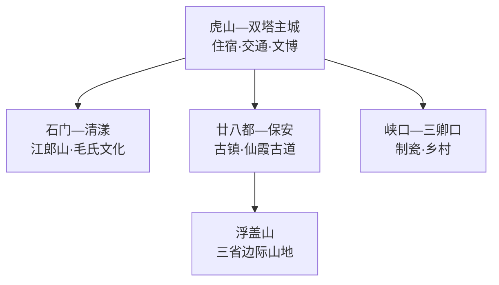
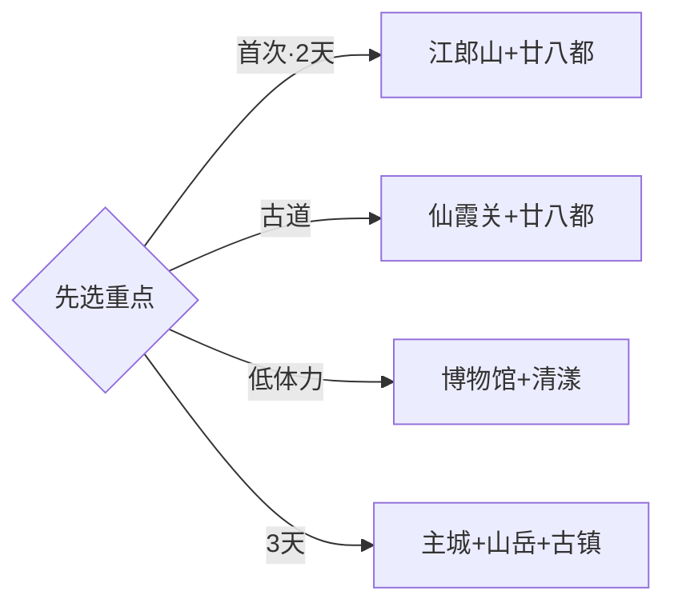

# 江山旅行指南

江山位于浙闽赣三省交界，旅行重点沿江山港和仙霞岭南北展开。首次到访可在虎山—双塔主城落脚，把江郎山与清漾安排为一天；廿八都、仙霞关和浮盖山位于更南侧，适合单独一天。固定快照中的 **Hecun / GeoNames 1808750** 对应江山市贺村镇，坐标、名称与衢州市行政层级闭合；衢州主城、常山以及福建浦城均按跨县级行政区行程处理。

> 建议停留：2–3 天\
> 旅行关键词：江郎山、廿八都、仙霞古道、清漾、三省边际\
> 主要体力：主城低；古镇中等；江郎山与古道较高\
> 最近研究：2026-09-03

## 城市速览

| 项目 | 旅行信息 |
|---|---|
| 主要旅行价值 | 从江郎山丹霞世界遗产走到仙霞古道与廿八都商埠，再看古村和制瓷传统 |
| 建议停留 | 2天覆盖江郎山与廿八都；增加主城、清漾或三卿口后用3天 |
| 较舒适季节 | 春秋适合登山与古道；夏季关注高温雷雨；冬季山路湿冷 |
| 预算特点 | 主城消费温和，南部远线车辆、门票和换宿是主要变量 |
| 步行强度 | 主城低，古镇石路中等，江郎山与仙霞古道有连续坡阶 |
| 主要天气风险 | 雷电、短时强降雨、山洪、落石、雾、高温与森林火险 |
| 独行旅行 | 核心景区可安排，南部乡镇返程和通信需提前落实 |
| 亲子旅行 | 古镇、非遗与地质观察可组合，登山段按年龄缩短 |
| 长者与低体力旅行 | 选择古镇主街、清漾和江郎山交通可达点，减少长台阶 |
| 无障碍信息 | 新建游客中心相对友好，古村石路、古道和山岳连续性需逐点确认 |

## 城市格局与游览区域

| 区域 | 主要内容 | 游览特点 | 与其他区域的关系 |
|---|---|---|---|
| 虎山—双塔主城 | 市博物馆、江山港与城市服务 | 适合抵达日和雨天 | 各方向共同住宿基地 |
| 石门—清漾 | 江郎山、清漾毛氏文化村 | 丹霞登山与古村人文互补 | 可组合为完整一天 |
| 廿八都—保安 | 廿八都古镇、仙霞关与古道 | 距主城较远，古道受天气影响 | 宜单独一天或当地住宿 |
| 浮盖山 | 花岗岩山地与省界景观 | 体力和天气门槛较高 | 与廿八都同向但通常二选一 |
| 峡口—三卿口 | 传统制瓷、乡村与古道支线 | 以正式展陈和接待点为主 | 适合第三日专题线 |

## 主要景点

| 景点 | 区域 | 类型 | 主要看点 | 建议用时 | 室内外 | 体力 | 预约风险 | 天气影响 | 优先级 |
|---|---|---|---|---:|---|---|---|---|---|
| 江郎山景区 | 石门 | 世界自然遗产与丹霞 | 三爿石、赤壁峰柱与丹霞地貌 | 半天–1天 | 室外 | 高 | 中高 | 很高 | A |
| 廿八都古镇 | 廿八都 | 历史街区 | 三省商埠、方言姓氏与传统建筑 | 3–4小时 | 混合 | 中 | 中 | 高 | A |
| 仙霞关与古道批准开放段 | 保安 | 古关与古道 | 关隘、驿路与浙闽交通史 | 3–4小时 | 室外 | 中高 | 中高 | 很高 | A |
| 清漾毛氏文化村 | 石门 | 古村与族群文化 | 村落格局、谱牒与地方人文 | 1.5–2小时 | 混合 | 低中 | 中 | 中 | B |
| 江山市博物馆 | 主城 | 博物馆 | 地方历史、丹霞、古道与非遗线索 | 1.5–2小时 | 室内 | 低 | 中 | 低 | B |
| 浮盖山正式开放游线 | 廿八都方向 | 山地 | 巨石地貌、山林与三省边际视野 | 半天–1天 | 室外 | 高 | 中高 | 很高 | B |
| 三卿口传统制瓷公开展陈 | 峡口方向 | 工艺与工业遗产 | 传统窑作、制瓷流程与村落生产史 | 1.5–2小时 | 混合 | 低中 | 高 | 中 | B |
| 大陈古村或清湖古镇公共街巷 | 中北部 | 古村与古镇 | 乡土建筑、村歌或水陆商贸线索 | 2–3小时 | 室外 | 低中 | 中 | 高 | C |

## 美食与餐饮

| 菜品或餐饮类型 | 常见区域 | 一个人用餐与常见份量 | 风味、过敏原与饮食限制 | 排队风险与替代方法 |
|---|---|---|---|---|
| 铜锣糕、米糕 | 主城与廿八都 | 单块或小份适合尝味 | 糯米制品不易消化，馅料可能含芝麻花生 | 上午选择较多，少量组合 |
| 江山炒粉干 | 主城与乡镇 | 一盘适合独行 | 常含蛋、肉和酱油，可先说明配料 | 用餐高峰可换社区小店 |
| 山区笋、菌菇与家常菜 | 江郎山、廿八都正规餐馆 | 两三道小份适合分享 | 按季供应，确认食材来源 | 选择正规餐饮，不采食野生菌 |
| 溪鱼与江山港水系家常鱼 | 主城正规餐馆 | 多人分享更合适 | 注意鱼刺、辣度与合法来源 | 先问重量、做法和总价 |
| 猕猴桃及季节果蔬 | 正规市场与农旅点 | 小份或按盒购买 | 成熟度与保存期影响携带 | 选择可追溯摊点，采摘按经营方安排 |

## 经典行程

### 一日江郎山经典路线

**路线**：主城出发 → 江郎山正式入口 → 核心开放游线 → 山脚午餐 → 清漾毛氏文化村 → 返回

- **串联逻辑**：江郎山和清漾位于同一南向片区，自然与人文互补。
- **预约锚点**：景区票务、交通接驳和清漾开放。
- **休息安排**：山脚游客中心、正规餐饮和古村公共区。
- **时间不足时**：保留江郎山交通可达核心，清漾改为短停。

### 两日山水古镇路线

**第 1 天**：江郎山 → 清漾 → 主城住宿。\
**第 2 天**：廿八都古镇 → 仙霞关或古道短段。

- **串联逻辑**：丹霞和古镇分日，第二天沿同一南部交通轴移动。
- **预约锚点**：廿八都活动、仙霞关开放和返程车辆。
- **休息安排**：主城连住；第二日在古镇内午休。
- **时间不足时**：第二天保留廿八都，古道按天气删减。

### 三日深度路线

**第 1 天**：主城博物馆、江山港与清湖。\
**第 2 天**：江郎山与清漾。\
**第 3 天**：廿八都与仙霞关。

- **串联逻辑**：先建立地方背景，再分别完成丹霞与三省古道主题。
- **预约锚点**：博物馆、两大景区票务与南部交通。
- **休息安排**：主城连住，或第三天前一晚转住廿八都正规住宿。
- **时间不足时**：先删第一天外围点，保留博物馆半日。

### 雨天路线

**路线**：江山市博物馆 → 主城午餐 → 三卿口制瓷公开展陈或廿八都室内开放建筑

- **适用条件**：普通降雨采用室内线；暴雨、雷电或山洪预警时留在主城。
- **预约锚点**：场馆和工艺接待点开放、道路交通。
- **休息安排**：博物馆与主城商业区。
- **时间不足时**：保留市博物馆和一处主城文化空间。

### 亲子或低体力路线

**亲子路线**：市博物馆 → 清漾村落观察 → 江郎山脚地质观察。\
**低体力路线**：市博物馆 → 车辆接驳清漾 → 廿八都主街短线。

- **减负方式**：亲子以地质和村落任务串联；低体力线选择平缓开放段并增加车辆连接。
- **预约锚点**：研学、无障碍入口、停车和座椅。
- **休息安排**：场馆、游客中心与古镇正规餐饮。
- **时间不足时**：两类路线均保留博物馆加一个近距离点位。

### 廿八都与仙霞古道路线

**路线**：主城或廿八都住宿地 → 廿八都古镇 → 午餐 → 仙霞关 → 批准开放古道段 → 返回

- **适用条件**：适合道路正常、古道开放且天气稳定的日期。
- **预约锚点**：景区入口、接驳、古道开放和返程。
- **休息安排**：廿八都游客中心与正规餐饮点。
- **时间不足时**：保留古镇和仙霞关，长距离古道整段删除。

### 制瓷与古村路线

**路线**：主城 → 三卿口制瓷公开点 → 峡口午餐 → 大陈古村或清湖古镇二选一 → 返回

- **串联逻辑**：以工艺和乡土建筑为主，选择一个古村减少跨向移动。
- **预约锚点**：制瓷讲解、古村活动和乡镇交通。
- **休息安排**：峡口或主城正规餐饮。
- **时间不足时**：保留有讲解的制瓷展陈，古村改为主城江岸短线。

## 住宿区域

| 区域 | 优点 | 缺点 | 适合人群 | 交通特点 |
|---|---|---|---|---|
| 虎山—双塔主城 | 餐饮、交通和城市服务集中 | 前往廿八都距离较长 | 初访、独行、多主题旅行者 | 适合各方向共同基地 |
| 江山站周边 | 铁路抵离方便 | 夜间体验少于核心城区 | 早晚车、短住旅行者 | 核对进城和景区接驳 |
| 江郎山—清漾正规住宿 | 靠近丹霞和古村 | 餐饮与夜间交通选择较少 | 登山、摄影、慢游 | 适合早入景区 |
| 廿八都正规住宿 | 古镇早晚氛围完整 | 返回主城班次较少 | 古镇、古道、摄影旅行者 | 适合第二天接仙霞关 |

## 市内交通

| 场景 | 建议与取舍 | 行前需要重查的内容 |
|---|---|---|
| 从衢州或外省抵达 | 铁路到江山站后再按南北方向接驳 | 车次、景区直通车和末班 |
| 主城—江郎山 | 留半天以上，按正式入口和景交游览 | 盘山道路、票务、停车与返程 |
| 主城—廿八都—仙霞关 | 作为完整一日，公共交通不足时选择正规车辆 | 班次、道路、古道开放和通信 |
| 浮盖山及省界方向 | 独立安排，按浙江侧正式入口和开放线行走 | 入口归属、防火、天气与返程 |

## 不同旅行者须知

| 旅行维度 | 可行条件 | 主要取舍 | 需额外核对 |
|---|---|---|---|
| 独行旅行 | 主城和核心景区服务较完整 | 南部乡镇晚间返程较少 | 末班、叫车与通信 |
| 亲子旅行 | 博物馆、古镇和地质观察易组合 | 登山与古道连续坡阶较多 | 年龄、研学和休息点 |
| 长者或低体力旅行 | 清漾、古镇主街和山脚线可减量 | 江郎山登高与古道较费力 | 景交、无障碍入口与座椅 |
| 无障碍需求 | 新建场馆和游客中心优先 | 古镇石路与山径连续性有限 | 坡道、卫生间和陪同 |
| 摄影旅行 | 丹霞、古镇、古道和古村题材丰富 | 云雾和日照改变路线节奏 | 三脚架、航拍、日出时段与开放 |
| 预算有限 | 主城住宿与公共空间成本较稳 | 南部车辆与换宿增加支出 | 公交、联票、退改和拼车 |
| 晚出发或紧凑行程 | 主城或清漾可做半日 | 江郎山和廿八都各需完整时段 | 最晚入园与返程 |
| 特殊天气或自然条件 | 小雨可转博物馆与工艺线 | 暴雨、雷电、山洪和火险影响山线 | 气象、景区、道路和防火公告 |

江郎山世界遗产地、仙霞古道、浮盖山与森林区域沿正式开放游线通行；地质保护点、临崖区、封闭山道和省界林区服从现场管理。三卿口窑作、木门制造、化工仓储及贺村工业空间按生产安全边界进入，工艺参访选择明确对公众开放的项目。

## 行前核对

| 核对事项 | 为什么需要重查 | 建议核对时间 | 官方入口 |
|---|---|---|---|
| 江郎山票务、景交与步道 | 维护、天气和客流会改变开放范围 | 购票前及到访当天 | [江山市人民政府](https://www.jiangshan.gov.cn/) |
| 廿八都、仙霞关与浮盖山 | 活动、古道维护和防火影响行程 | 出发前三日及当天 | [江山市人民政府](https://www.jiangshan.gov.cn/) |
| 市博物馆与制瓷体验 | 闭馆、展陈和团队接待会调整 | 排入行程前 | [江山市人民政府](https://www.jiangshan.gov.cn/) |
| 雷暴、山洪与森林火险 | 丹霞、古道和山区道路受影响 | 出发前三日及当天 | [浙江省气象局](https://zj.cma.gov.cn/) |
| 铁路与景区接驳 | 车次、直通车和末班会变化 | 购票前及当天 | [中国铁路12306](https://www.12306.cn/) |

## 来源与更新记录

### 主要来源

| 来源 | 类型 | 支持内容 | 核验日期 |
|---|---|---|---|
| [江山市人民政府：2024年政府工作报告](https://www.jiangshan.gov.cn/art/2024/2/5/art_1206574_59167635.html) | 政府 | 江郎山、廿八都、浮盖山、清湖和三卿口等文旅布局 | 2026-09-03 |
| [江山市人民政府：诗意江山](https://www.jiangshan.gov.cn/art/2025/1/6/art_1206571_59176111.html) | 政府 | 仙霞古道、江郎山、古村与三省边际文化线索 | 2026-09-03 |
| [UNESCO：China Danxia](https://whc.unesco.org/en/list/1335/) | 国际组织 | 江郎山作为中国丹霞系列遗产组成部分 | 2026-09-03 |
| [江山市人民政府：贺村镇](https://www.jiangshan.gov.cn/col/col1229081201/index.html) | 政府 | 贺村镇现行属地与政务入口 | 2026-09-03 |
| [GeoNames 1808750](https://www.geonames.org/1808750/) | 开放数据 | Hecun 固定人口点、坐标与行政代码 | 2026-09-03 |

### 更新记录

| 日期 | 更新内容 |
|---|---|
| 2026-09-03 | 首次完成资料研究、空间拆分、七条路线与县级市映射 |
