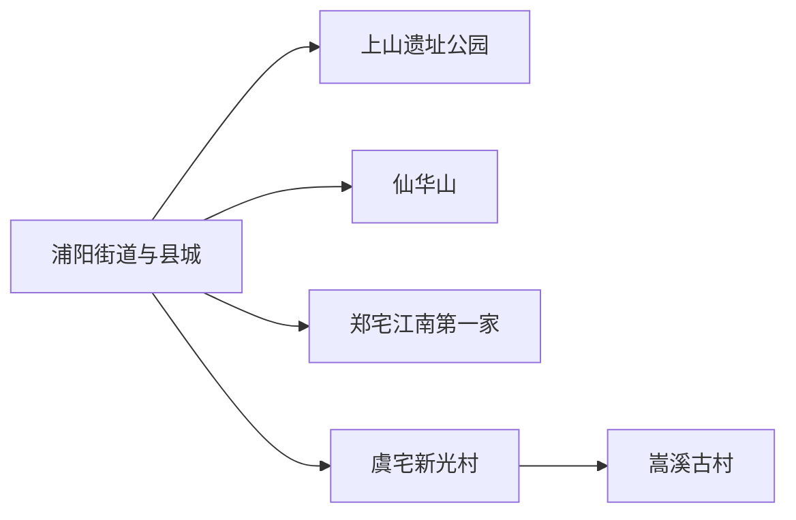
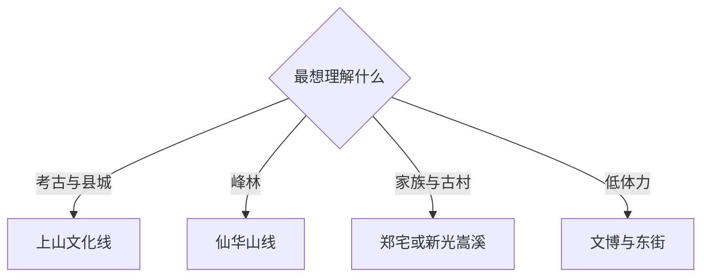

# 浦江旅行指南

浦江适合从县城的上山文化、书画与水晶线索起步，再按兴趣选择仙华山、郑宅“江南第一家”或新光、嵩溪古村。县域景点分处不同乡镇，一天集中一个方向，能把考古、山水和村落生活看得更完整。

## 城市速览

| 项目 | 信息 |
|---|---|
| 主线 | 县城—上山遗址—仙华山—郑宅—新光与嵩溪古村 |
| 停留 | 县城1天；每条山地或古村方向另留半日至1天 |
| 住宿 | 浦阳街道便于餐饮与接驳；仙华山周边适合早登；乡村民宿适合单方向慢游 |
| 交通 | 义乌站、义乌机场或金华方向接驳至浦江，县内远点以公交、出租车或包车连接 |
| 风险 | 盛夏高温、梅雨台风、山路湿滑、雷雨与森林火险 |
| 边界 | 遗址保护区、山林封闭段、水库管理区、水晶生产车间和居民院落按正式开放范围进入 |

## 城市格局与游览区域

固定记录 **Puyang / GeoNames 1798425** 位于浦江县城浦阳街道，本页以它定位抵达核心，并用现行浦江县行政实体 `Q1335006` 与代码 `330726` 确定县域范围。县城适合文博、东街和餐饮；仙华山位于北向山地；江南第一家在郑宅；上山遗址、新光村和嵩溪古村各有独立入口与保护边界。义乌和金华是主要外部交通门户，其城市景点另行计算。

## 主要景点

| 景点 | 区域 | 类型 | 核心体验 | 用时 | 环境 | 体力 | 研究价值 | 拥挤 | 优先级 |
|---|---|---|---|---:|---|---|---|---|---|
| 上山遗址公园与展示空间 | 黄宅方向 | 考古遗址 | 认识上山文化、早期稻作与遗址保护 | 2–3小时 | 混合 | 低至中 | 很高 | 中 | A |
| 仙华山正式游线 | 县城北部 | 峰林山地 | 丹霞峰林、登高视野与山地植被 | 半日至1天 | 室外 | 高 | 高 | 节假日高 | A |
| 江南第一家 | 郑宅镇 | 历史聚落 | 郑氏宗祠、家族治理与古镇空间 | 2–4小时 | 混合 | 中 | 很高 | 中高 | A |
| 浦江县博物馆或当期县级展览 | 县城 | 地方文博 | 串联考古、书画、民俗与县域历史 | 1.5–2.5小时 | 室内 | 低 | 高 | 低 | B |
| 浦江东街与县城生活区 | 浦阳街道 | 历史街区 | 老城尺度、非遗活动与日常餐饮 | 2–3小时 | 混合 | 低至中 | 中 | 活动时高 | B |
| 新光村 | 虞宅乡 | 传统村落 | 书画市集、乡村更新与公共文化空间 | 2–4小时 | 混合 | 中 | 高 | 活动时高 | B |
| 嵩溪古村 | 白马镇 | 传统村落 | 古建筑、巷道水系与居民村落 | 2–4小时 | 室外为主 | 中 | 高 | 中 | B |
| 神丽峡正式景区 | 浦江山地 | 峡谷山水 | 溪谷、森林与季节水景 | 半日至1天 | 室外 | 高 | 中 | 中 | C |

## 美食与餐饮

县城餐饮便于寻找麦饼、米筛爬、豆腐皮、索粉和时令农家菜；郑宅、虞宅或白马方向适合在正式接待点用餐。点餐时说明辣度、猪油、花生芝麻和大豆过敏；山区行程携带饮水与易保存补给，返城后再安排完整正餐更稳妥。

## 经典行程

### 两日基础线
**路线**：县城文博—东街—上山遗址—仙华山或江南第一家。**逻辑**：先建立时间线，再用一条远线深入。**预约锚点**：遗址、山岳景区和场馆。**休息**：县城午休。**删除条件**：天气不稳时保留考古与县城。

### 上山文化线
**路线**：县城展览—上山遗址公园—黄宅公开服务点。**逻辑**：从展陈进入考古现场。**预约锚点**：展厅开放与团队接待。**休息**：遗址服务区。**删除条件**：遗址临时保护时只看正式展览。

### 仙华山登高线
**路线**：正式入口—开放峰林游线—原路或公告出口返程。**逻辑**：把体力集中给一座山。**预约锚点**：门票、交通和防火公告。**休息**：入口与平台。**删除条件**：雷雨、大风、冰雪或火险时取消。

### 郑宅人文线
**路线**：江南第一家完整景区—郑宅公共街巷—返县城。**逻辑**：用半日理解宗族建筑与聚落。**预约锚点**：展馆、讲解和活动。**休息**：镇区餐饮。**删除条件**：修缮封闭时保留公开街区。

### 古村慢游线
**路线**：新光村—乡村午餐—嵩溪古村。**逻辑**：对照活化村落与传统格局。**预约锚点**：民宿、活动和返程车辆。**休息**：正式接待点。**删除条件**：雨天或返程不足时二选一。

### 亲子非遗线
**路线**：上山展示—县城书画或非遗活动—东街。**逻辑**：用短段体验替代连续登山。**预约锚点**：研学与活动年龄。**休息**：县城商业区。**删除条件**：活动停办时保留文博。

### 低体力线
**路线**：车辆到县级场馆—东街短段—江南第一家平缓开放区。**逻辑**：以室内和车辆连接控制步行。**预约锚点**：无障碍入口与车辆落客点。**休息**：每站室内座席。**删除条件**：古村铺装湿滑时留在县城。

## 住宿区域

浦阳街道适合首访、公共交通和晚间餐饮；仙华山周边适合清晨进山；郑宅、新光或嵩溪的正规民宿适合单方向慢游。订房时核对实际村镇、夜间接驳、停车、消防与餐饮时段，避免只凭“浦江景区附近”的模糊标注选择。

## 市内交通

浦江站承担铁路抵离，但站区与县城、各景区仍需接驳；从义乌站、义乌机场或金华进入时按全程道路时间选车。县内远线公交频率有限，仙华山、郑宅和古村方向宜逐段确认末班，包车则明确合法运营、等候、返程与山路费用。

## 不同旅行者须知

考古兴趣者优先上山遗址；登山者把仙华山单独成日；建筑与民俗兴趣者选择郑宅、新光和嵩溪；亲子家庭以展馆和预约研学为主；长者采用县城住宿、车辆接驳和单村慢游。遗址采样区、未开放山脊、林业作业区、水库设施、水晶工厂与私人院落保持明确边界。

## 行前核对

- 核对上山遗址、仙华山、江南第一家、县级场馆和乡村活动的开放、预约与停车。
- 核对铁路接驳、县内末班、梅雨台风、雷雨、地质灾害与森林火险。
- 进入古村和工坊时选择公共街巷、正式展陈与明确接待空间。

## 来源与更新记录

| 来源 | 支持内容 | 核验日期 |
|---|---|---|
| [浙江省文旅厅：浦江非遗与核心景区](https://ct.zj.gov.cn/art/2026/2/25/art_1652992_59029654.html) | 板凳龙、上山文化、新光村、仙华山和江南第一家 | 2026-09-01 |
| [浙江省科协：上山遗址考古](https://www.zast.org.cn/art/2023/9/14/art_1229642499_58968992.html) | 上山遗址、早期稻作与考古研究 | 2026-09-01 |
| [浦江县文旅部门预算](https://www.pj.gov.cn/art/2020/5/26/art_1229198590_1529307.html) | 县域景区、上山研学与旅游发展范围 | 2026-09-01 |
| [GeoNames 1798425](https://www.geonames.org/1798425/) | Puyang 固定人口点 | 2026-09-01 |
| [Wikidata Q1335006](https://www.wikidata.org/wiki/Q1335006) | 浦江县实体与跨库标识 | 2026-09-01 |

| 日期 | 更新 |
|---|---|
| 2026-09-01 | 首次完成浦江旅行研究；以浦阳县城承接固定 Puyang 记录，并按考古、峰林、郑宅和古村组织路线。 |
