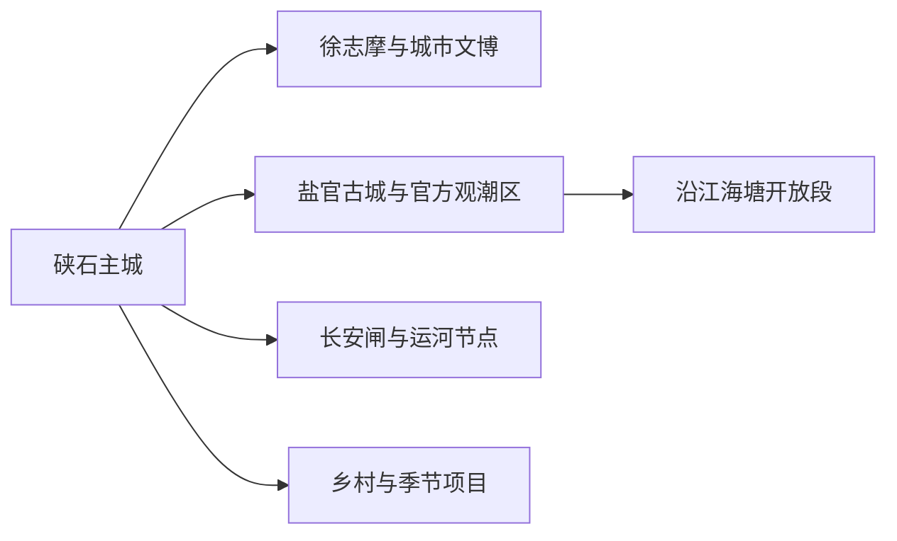
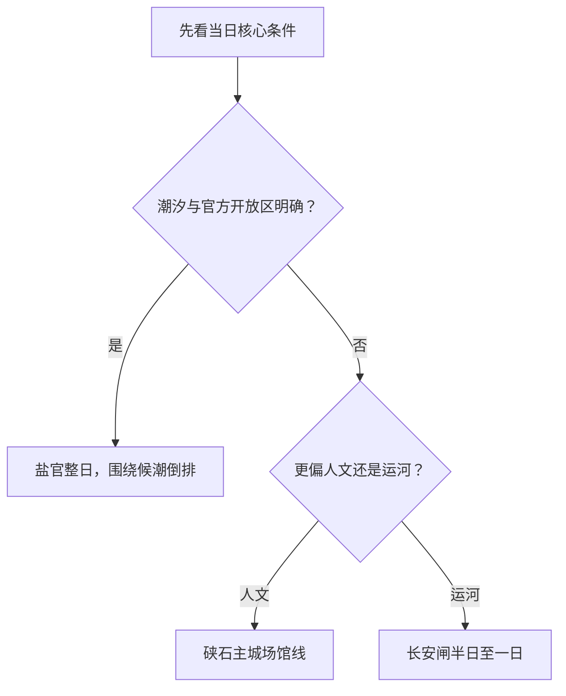

# 海宁旅行指南

海宁位于钱塘江北岸，旅行体验由硖石主城的人文场馆、盐官的潮文化与古城、长安的大运河遗产，以及沿江海塘和乡村季节项目组成。第一次到访可先按“城市人文”或“盐官观潮”选择主线；观潮日则把潮汐、交通和疏散当作整天的时间锚点。

## 城市速览

| 项目 | 信息 |
|---|---|
| 旅行主线 | 硖石主城、徐志摩文化、盐官潮文化、长安闸与大运河 |
| 建议停留 | 1 天选择主城或盐官；2 天组合两者；3 天再加长安或正式开放的乡村项目 |
| 住宿基地 | 硖石主城交通与餐饮更集中；盐官适合把候潮和古城慢游放在同一片区 |
| 步行强度 | 主城低至中等；盐官候潮中等且可能久站；古城、海塘与运河节点按入口分段 |
| 主要天气 | 梅雨、高温、台风外围影响、强对流、钱塘江潮汐与风暴潮 |
| 预约核心 | 盐官景区、潮汐与开放区、文博场馆、节庆交通和讲解 |
| 亲子 | 博物馆、城市展陈、盐官潮文化展陈和有年龄说明的正式活动 |
| 低体力 | 主城场馆加车辆串联；盐官选择靠近正式服务设施的短线候潮方案 |
| 边界重点 | 海塘工程、滩涂、施工岸段和生产空间按现场开放范围进入 |
| 无障碍 | 设施连续性需向官方确认，重点核对古城石路、观潮区座席、坡道、卫生间和接驳 |

## 城市格局与游览区域

海宁市是嘉兴市代管的县级市，法定代码 `330481`。GeoNames `1789799` 是海宁城市点，Wikidata `Q286266` 代表法定海宁市，`P1566` 与该固定点一致。居民点坐标帮助定位主城，市域边界和行政关系以法定代码与政府资料为准。

| 区域 | 旅行价值 | 怎么安排 |
|---|---|---|
| 硖石主城 | 到达、住宿、文博、名人文化与城市生活 | 抵达日或完整半日 |
| 盐官 | 古城、潮文化、海塘工程与官方观潮 | 按潮汐倒排行程，通常留完整一天 |
| 长安 | 大运河、长安闸及城镇历史 | 适合独立半日至一日，也可与主城组合 |
| 丁桥—沿江方向 | 正式开放的海塘、生态与乡村项目 | 先确认入口、活动和返程，再作为季节支线 |

盐官的古城游览与观潮共享同一旅行基地，但体验节奏不同：古城适合按场馆和街区开放顺序慢游，观潮则围绕每日潮汐预报、警戒线与现场疏散安排。长安闸是运河遗产节点，与盐官观潮分属不同方向，适合分开安排。

## 主要景点

### 硖石主城与人文

| 景点 | 所在区域 | 类型 | 核心看点 | 建议用时 | 室内/室外 | 体力 | 预约难度 | 天气敏感度 | 适合旅程 |
|---|---|---|---|---|---|---|---|---|---|
| 海宁市博物馆 | 硖石主城 | 地方史与文物 | 海宁历史、钱塘江文明与地方文物 | 1.5–2.5 小时 | 室内 | 低 | 中 | 低 | A |
| 徐志摩旧居公开展陈 | 硖石主城 | 名人故居与文学 | 徐志摩生平、作品与近代城市文化 | 1–2 小时 | 室内为主 | 低 | 中 | 低 | A |
| 硖石灯彩相关公共展陈 | 硖石主城 | 非遗与工艺 | 灯彩技艺、地方节俗与当期展览 | 1–2 小时 | 室内 | 低 | 中 | 低 | B |
| 东山—西山城市公共空间 | 硖石主城 | 城市山体与休闲 | 主城格局、公共步道与城市视野 | 1.5–3 小时 | 室外 | 中 | 低 | 高 | B |

### 盐官、运河与远点

| 景点 | 所在区域 | 类型 | 核心看点 | 建议用时 | 室内/室外 | 体力 | 预约难度 | 天气敏感度 | 适合旅程 |
|---|---|---|---|---|---|---|---|---|---|
| 盐官潮乐之城与古城公开区 | 盐官镇 | 古城与综合文旅区 | 潮文化、古城街区、当期展陈与演出 | 4–8 小时 | 混合 | 中 | 高 | 高 | A |
| 盐官官方观潮区 | 盐官镇 | 自然现象与海塘 | 钱塘江涌潮、候潮秩序与海塘工程 | 2–5 小时 | 室外 | 中 | 极高 | 极高 | A |
| 海神庙公开游览区 | 盐官镇 | 历史建筑与海塘文化 | 海塘信俗、建筑与治水历史 | 1–2 小时 | 混合 | 中 | 中 | 高 | B |
| 长安闸与大运河公开节点 | 长安镇 | 运河遗产 | 闸坝、水运与城镇发展 | 2–4 小时 | 室外为主 | 中 | 中 | 高 | B |
| 丁桥梁家墩等正式接待乡村项目 | 丁桥方向 | 乡村与季节活动 | 江南村落、公共空间与当期文旅活动 | 2–4 小时 | 室外为主 | 中 | 高 | 高 | C |

盐官景区内部的古城、演艺、展陈与观潮服务按实际票务和运营边界理解，不把同一综合项目拆成多个“必去景点”。潮汐是自然现象，看到何种潮形取决于当日水文、气象和河床条件；路线以官方开放区和现场指引为准。

## 美食与餐饮

| 类型 | 适合场景 | 份量 | 过敏与饮食提示 | 怎么选 |
|---|---|---|---|---|
| 海宁宴球 | 正餐或多人分享 | 常为共享菜 | 猪肉、蛋、淀粉、高汤与豆制品可能同时出现 | 先问份量、馅料和汤底，独行选小份 |
| 缸肉与地方家常菜 | 正餐 | 适合分享 | 猪肉、酱油、糖与油脂较多 | 配蔬菜和主食，先问肥瘦与口味 |
| 钱塘江流域水产 | 正餐 | 多按份或时价 | 鱼刺、甲壳类、河鲜过敏与共锅 | 选正规来源并确认时价、做法与禁渔期供应 |
| 小笼、烧卖与面食 | 早餐或简餐 | 一人份较容易 | 小麦、猪肉、虾、蛋、芝麻与花生 | 看现行价目，过敏者逐项问馅料 |

观潮日适合把正餐放在到达后、候潮前的固定时段，并预留安检和步行时间；潮后集中离场时，用已确认营业的简餐作为备选会更稳妥。

## 经典行程

### 一日经典路线

**路线**：海宁市博物馆 → 主城午餐 → 徐志摩旧居公开展陈 → 东山或西山短线

- **串联逻辑**：把地方史、文学和城市空间放在主城内，换乘少且节奏稳定。
- **预约锚点**：博物馆和旧居的开放、闭馆日与入场规则。
- **休息安排**：主城午餐长休，山体只走靠近入口的公共段。
- **时间不足时**：保留博物馆和徐志摩旧居，删除山体短线。

### 两日城市路线

**第 1 天**：硖石主城人文线 
**第 2 天**：盐官古城公开区 → 正式服务区休息 → 官方观潮区

- **串联逻辑**：城市人文与潮文化分日，第二天完全按潮汐时间倒排。
- **预约锚点**：盐官票务、演出、观潮开放区、潮汐预报和交通管制。
- **休息安排**：候潮前在景区正式服务区长休，潮后按疏散方向离开。
- **时间不足时**：第二天只保留古城或观潮一个核心，不在潮前跨片区加点。

### 三日深度路线

**第 1 天**：硖石主城 
**第 2 天**：盐官古城与观潮 
**第 3 天**：长安闸与运河节点，或正式开放的乡村季节项目

- **串联逻辑**：主城、钱塘江和大运河分别成日，减少东西向反复移动。
- **预约锚点**：第三日开放节点、讲解、活动和返程交通。
- **休息安排**：长安镇区或乡村游客服务点安排午休。
- **时间不足时**：删除第三日，完整保留前两日。

### 雨天路线

**路线**：海宁市博物馆 → 室内午餐 → 徐志摩旧居或当期公共文化展览

- **适用条件**：普通降雨且场馆和城区交通正常；强对流、台风或积水预警时按官方提示调整。
- **串联逻辑**：以主城室内场馆为主，片区间短距离乘车。
- **预约锚点**：闭馆、临时活动、道路积水和公共交通公告。
- **休息安排**：午餐和场馆座椅作为固定休息点。
- **时间不足时**：只留海宁市博物馆。

### 亲子路线

**路线**：海宁市博物馆 → 午餐 → 硖石灯彩相关展陈或盐官潮文化室内项目

- **适用条件**：按儿童年龄、展陈开放和潮区现场管理选择一处下午项目。
- **串联逻辑**：先用文博建立城市背景，再选互动性较强的工艺或潮文化内容。
- **预约锚点**：亲子活动年龄、场次、入场与观潮区儿童照看规则。
- **休息安排**：午餐长休，下午项目控制在半日内。
- **时间不足时**：保留博物馆，下午项目改为主城短线。

### 低体力路线

**路线**：车辆到达海宁市博物馆 → 午餐长休 → 徐志摩旧居近入口短线

- **适用条件**：以平地、室内和短距离落客为主，观潮另按座席与接驳条件决定。
- **串联逻辑**：两处主城人文场馆用车辆连接，减少古城石路和候潮久站。
- **预约锚点**：无障碍入口、轮椅、卫生间、座椅和落客点。
- **休息安排**：每处只选核心展陈，中间安排完整午休。
- **时间不足时**：只留一处场馆。

### 盐官观潮主题路线

**路线**：提前到盐官 → 古城或潮文化展陈 → 正式服务区休息 → 官方观潮区候潮 → 按现场疏散离开

- **适用条件**：潮汐预报、观潮区开放和往返交通均已确认。
- **串联逻辑**：所有安排围绕一个官方观潮区展开，避免潮前跨镇移动。
- **预约锚点**：潮到时间、开放区、警戒线、票务、交通管制和潮后疏散。
- **休息安排**：候潮前在正式服务区补水、用餐和如厕。
- **时间不足时**：保留潮文化展陈或观潮其中一项；天气不合适时改为主城室内线。

## 住宿区域

| 区域 | 优点 | 取舍 | 适合人群 | 核对项 |
|---|---|---|---|---|
| 硖石主城 | 铁路、餐饮、叫车和多方向出发方便 | 观潮日仍需预留到盐官的接驳 | 首访、无车、多日旅行 | 实际车站、夜间入住、停车、早餐 |
| 盐官正规住宿 | 便于提前候潮和古城慢游 | 活动日价格、噪声和交通管制影响较大 | 观潮、摄影、古城主题 | 证照、景区边界、接驳、退改、潮后出行 |
| 长安镇区正规住宿 | 方便运河与杭州方向衔接 | 与盐官、硖石仍需跨片区移动 | 运河主题、杭州联程 | 铁路或城际站点、末班、落客 |

住宿平台写“海宁”只表示市域范围，订房时要同时核对到盐官、硖石主城或长安的实际距离。观潮活动日期变动较大，退改条件与到店路线应在付款前确认。

## 市内交通

海宁站、海宁西站和杭海城际沿线服务不同片区。硖石主城适合作为公共交通基地；盐官、长安和沿江乡村方向需按实际入口继续接驳。路线规划先确定“去哪个入口”，再选择铁路、城际、公交、出租车或自驾组合。

| 场景 | 怎么做 | 行前核对 |
|---|---|---|
| 铁路到达主城 | 按车票选择海宁站或海宁西站，再转市内交通 | 完整站名、车次、夜间接驳 |
| 杭州联程 | 杭海城际适合沿线片区，其他方向再换公交或车辆 | 运营时刻、换乘站、末班 |
| 前往盐官 | 从最合适的铁路或城际节点接驳，观潮日优先采用官方交通方案 | 临时公交、远端停车、封路、散场 |
| 前往长安 | 先确认长安闸或运河节点的实际入口 | 开放、步行距离、返程 |
| 自驾观潮 | 使用官方公布停车区与接驳 | 预约、管制、放行与疲劳驾驶 |

观潮活动期的实际用时常由安检、候潮和疏散决定，返程车票与下一段行程宜留出弹性。海塘工程便道、生产码头和无明确开放信息的岸段用于管理或作业，不作为旅行停车与观潮入口。

## 不同旅行者须知

| 旅行者 | 推荐做法 | 重点核对 |
|---|---|---|
| 独行 | 住主城，观潮日采用官方接驳与开放区 | 末班、夜间照明、疏散和通信 |
| 亲子 | 文博加一项潮文化展陈，观潮时选有正式服务设施的区域 | 护栏、儿童照看、卫生间、活动年龄 |
| 长者与低体力 | 主城室内场馆为主，盐官按座席和落客条件单独决定 | 久站、台阶、轮椅、接驳与休息点 |
| 摄影 | 用官方潮汐信息选时段，提前找公共拍摄位置 | 三脚架、无人机、肖像、警戒线 |
| 运河与建筑爱好者 | 长安与盐官分日，分别预约讲解 | 文保开放、修缮、公共街巷和返程 |

潮水、海塘和滩涂涉及公共安全与水利管理。现场警戒线、广播和临时关闭优先于既定行程；观潮只使用官方开放区。村庄、作坊、农田和工厂以公开接待空间为旅行入口，其他区域维持正常生活与生产秩序。

## 行前核对

- 海宁市政府与文旅部门：盐官、场馆、节庆、活动和交通管制。
- 浙江省水利厅：每日潮汐预报、潮到时间、涌高与观赏等级。
- 浙江气象：台风、强对流、大风、高温和暴雨预警。
- 盐官景区：开放区、票务、演出、观潮规则、停车接驳和退改。
- 中国铁路 12306、杭海城际和属地公交：站名、班次、末班与临时调整。

## 来源与更新记录

| 来源 | 支持内容 | 核验日期 |
|---|---|---|
| [海宁市人民政府](https://www.haining.gov.cn/) | 市情、文旅、交通与动态入口 | 2026-08-13 |
| [海宁市政府：盐官入选浙江省入境旅游创新发展先行城镇](https://www.haining.gov.cn/art/2025/5/12/art_1688514_179049.html) | 盐官镇属地、古城复兴与文旅定位 | 2026-08-13 |
| [海宁市政府：文旅活动与场景资料](https://www.haining.gov.cn/art/2025/5/3/art_1229519873_59052898.html) | 城市文旅活动、盐官与乡村项目动态 | 2026-08-13 |
| [海宁市政府：文旅项目与公共服务资料](https://www.haining.gov.cn/art/2025/6/11/art_1229519873_59053642.html) | 市域文旅项目、公共文化与旅行线索 | 2026-08-13 |
| [浙江省水利厅](https://slt.zj.gov.cn/) | 检索到访日潮汐预报、潮高、观赏等级与动态水文信息 | 2026-08-13 |
| [Wikidata Q286266](https://www.wikidata.org/wiki/Q286266) | 法定海宁市与 `P1566=1789799` | 2026-08-13 |
| [GeoNames 1789799](https://www.geonames.org/1789799/) | 固定海宁城市点与坐标 | 2026-08-13 |
| [中国铁路 12306](https://www.12306.cn/) | 海宁各铁路站车次与购票动态 | 2026-08-13 |

| 日期 | 更新 |
|---|---|
| 2026-08-13 | 首次完成硖石主城、盐官潮文化、长安运河与沿江旅行研究。 |
