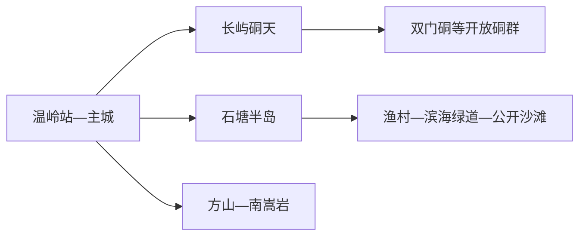
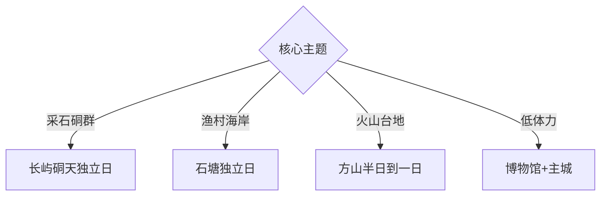

# 温岭旅行指南

温岭位于浙江东南沿海，旅行核心是长屿硐天的采石硐群、石塘半岛的渔村海岸，以及方山火山台地。固定 **Wenling / GeoNames 1791464** 对应温岭县级市，主城承担铁路接驳和综合住宿，三类核心景观分属不同方向。

## 城市速览

| 项目 | 信息 |
|---|---|
| 主线 | 温岭主城—长屿硐天—石塘半岛或方山二选一 |
| 停留 | 主城加一处核心景区2天；三主题完整体验3天 |
| 住宿 | 主城适合铁路和跨方向换乘；石塘适合日出、海岸与渔村 |
| 交通 | 温岭站接入铁路，长屿、石塘、方山分别使用公交、接驳或预约车辆 |
| 风险 | 台风、海浪、潮汐、硐穴湿滑、山地雷雨与渔港生产边界 |

## 城市格局与游览区域

主城和温岭站负责抵离、餐饮与跨方向换乘。长屿硐天位于新河方向，石塘位于东南海岸，方山位于西部大溪方向；三个主题都足以占据半日至一天。海边日出、硐穴夜游和景区演出均以当日天气和运营公告为准。

## 主要景点

| 景点 | 区域 | 类型 | 核心体验 | 用时 | 环境 | 体力 | 研究价值 | 拥挤 | 优先级 |
|---|---|---|---|---:|---|---|---|---|---|
| 长屿硐天 | 新河镇 | 采石遗产 | 人工硐群、石文化与岩硐空间 | 半天至1天 | 洞穴混合 | 中 | 很高 | 节假日高 | A |
| 双门硐等开放硐群 | 长屿 | 地质工业 | 石板开采遗迹、硐套硐与岩壁 | 2–3小时 | 洞穴 | 中 | 很高 | 高 | A |
| 石塘滨海绿道公开段 | 石塘镇 | 海岸 | 山海步道、渔村与海湾视野 | 2–4小时 | 室外 | 中 | 高 | 节假日高 | A |
| 千年曙光园 | 石塘镇 | 海岸观景 | 日出地标与半岛海景 | 1–2小时 | 室外 | 中 | 中高 | 日出时高 | A |
| 箬山渔村公开街巷 | 石塘镇 | 渔村 | 石屋、街巷与渔业社区 | 2小时 | 室外 | 中 | 很高 | 节假日高 | A |
| 洞下沙滩等开放浴场 | 石塘半岛 | 沙滩 | 海滩休闲与潮间带观察 | 2–3小时 | 室外 | 中 | 中 | 夏季高 | B |
| 方山景区 | 大溪镇 | 火山地貌 | 台地、崖壁与火山地质 | 半天 | 室外 | 中高 | 很高 | 节假日高 | A |
| 温岭市博物馆 | 主城 | 博物馆 | 地方史、石文化与海洋文化 | 1–2小时 | 室内 | 低 | 高 | 团体时中 | B |
| 东辉公园 | 主城 | 城市公园 | 山城视角与抵离日散步 | 1–2小时 | 室外 | 中 | 中 | 周末中 | C |

## 美食与餐饮

石塘海鲜、嵌糕、食饼筒、麦饼和姜汤面适合按主城与海岸分开选择。海鲜点单先确认品种、重量、时价、加工费与做法；台风和休渔期按正规供应调整期待。甲壳类、贝类、鱼类、花生和小麦过敏者说明共用油锅与案板风险。

## 经典行程

### 一日基础线
**路线**：温岭市博物馆—主城午餐—长屿硐天核心开放区—返城。**逻辑**：先在馆内建立地方框架，再进入采石硐群。**预约锚点**：景区开放硐段。**休息**：游客中心。**删除条件**：闭硐或台风响应时保留主城。

### 长屿硐天线
**路线**：游客中心—双门硐等开放硐群—午休—当期开放展演。**逻辑**：围绕石文化完成一日。**预约锚点**：分区门票、检修与演出。**休息**：景区服务区。**删除条件**：积水、检修或应急闭园时取消。

### 石塘海岸线
**路线**：箬山公开街巷—午休—滨海绿道短段—日落观景。**逻辑**：从生活渔村走向公共海岸。**预约锚点**：天气、交通与返程。**休息**：石塘镇区。**删除条件**：台风、大浪或高温时缩短岸线。

### 日出线
**路线**：合规住宿—千年曙光园公开区—早餐—白天渔村短线。**逻辑**：把日出与正常休息结合。**预约锚点**：能见度、开放时间与清晨交通。**休息**：早餐后回住宿。**删除条件**：低能见度或强风时改白天海岸。

### 方山地质线
**路线**：方山游客区—台地步道—观景点—返主城。**逻辑**：集中观察火山地貌。**预约锚点**：景区交通和步道开放。**休息**：山门服务区。**删除条件**：雷雨、结冰或体力不足时走短线。

### 亲子低体力线
**路线**：博物馆—午休—长屿硐天短线或主城公园。**逻辑**：在一个受管理景区内控制步行。**预约锚点**：无障碍入口和开放硐段。**休息**：游客中心。**删除条件**：硐内湿滑时改博物馆。

### 雨天线
**路线**：博物馆—主城餐饮—当日确认安全开放的室内场馆。**逻辑**：减少海岸和山地暴露。**预约锚点**：场馆与防台通知。**休息**：主城。**删除条件**：台风响应时按官方要求留在安全地点。

## 住宿区域

温岭站—主城适合铁路抵离、博物馆和三方向换乘；石塘适合日出、渔村和海岸慢游；长屿周边适合早入硐群；方山通常可从主城或大溪方向当天往返。海景住宿优先核对真实视野、停车、隔音和台风退改。

## 市内交通

温岭站到主城和各景区仍需地面接驳，长屿、石塘、方山之间不宜同日硬拼。海岸交通在节假日和台风期间可能调整。渔港码头、养殖区、采石生产区、未开放硐穴和地质保护区执行明确限制。

## 不同旅行者须知

工业与地质旅行者优先长屿硐天和方山；摄影者选择石塘公开观景点并服从海岸管理；亲子家庭选择博物馆和受管理景区短线；长者根据台阶、硐穴地面和接驳条件在三类主题中择一。

## 行前核对

- 核对长屿硐天各硐、夜游、方山步道和石塘浴场开放。
- 核对台风、潮汐、海浪、能见度与景区返程交通。
- 渔港、养殖塘、未开放硐穴和采石作业区遵守明确限制。

## 来源与更新记录

| 来源 | 支持内容 | 核验日期 |
|---|---|---|
| [温岭市政府：服务业与旅游格局](https://www.wl.gov.cn/art/2021/11/30/art_1229599812_3757966.html) | 城市、海滨、硐天与山岳四类旅游空间 | 2026-09-01 |
| [台州史志：温岭景区](https://tzsz.zjtz.gov.cn/art/2018/12/13/art_1229209654_54440083.html) | 长屿硐天、方山与温岭景区身份 | 2026-09-01 |
| [GeoNames 1791464](https://www.geonames.org/1791464/) | Wenling 固定人口点与位置 | 2026-09-01 |

| 日期 | 更新 |
|---|---|
| 2026-09-01 | 首次完成温岭旅行研究；将硐群、海岸和方山拆为可选择的独立主题。 |
