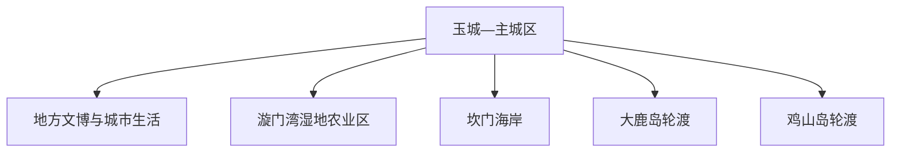
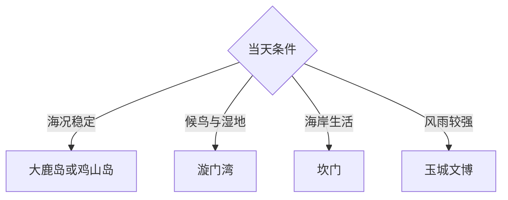

# 玉环旅行指南

玉环位于浙江东南海岸，以海岛渔村、漩门湾湿地与农业、海防记忆、滨海工业和文旦形成旅行主线。固定快照中的 **Zhugang / GeoNames 8401397** 对应玉城—主城一带；大鹿岛、鸡山岛、漩门湾和坎门分属不同方向，海岛按船期独立成日。

## 城市速览

| 项目 | 信息 |
|---|---|
| 主线 | 玉城主城—漩门湾—坎门海岸—大鹿岛或鸡山岛 |
| 停留 | 陆地 1–2 天；每个海岛另留 1 天并预留天气机动 |
| 住宿 | 玉城综合便利；坎门适合海岸；码头附近便于早船 |
| 交通 | 公路、公交、约车与轮渡组合，海况决定海岛节奏 |
| 季节 | 春秋适合海岸，夏季海岛需关注台风，冬季关注大风 |
| 预算 | 轮渡、海岛住宿和海鲜是主要弹性支出 |

## 城市格局与游览区域

主城区承担住宿和交通；漩门湾侧重湿地、围垦史与农业，坎门侧重渔港和海岸，大鹿岛与鸡山岛依各自码头和船期组织。湿地核心区、海洋保护区、养殖区、港口作业区、军事设施与非开放岛礁执行明确限制。

## 主要景点

| 景点 | 区域 | 类型 | 核心体验 | 用时 | 环境 | 体力 | 研究价值 | 拥挤 | 优先级 |
|---|---|---|---|---:|---|---|---|---|---|
| 漩门湾国家湿地公园公开区 | 北部 | 湿地与生态 | 湿地修复、候鸟、围垦水系与农业 | 半天 | 室外 | 低中 | 很高 | 周末中 | A |
| 大鹿岛景区 | 东部外海 | 海岛与森林 | 海岛森林、海岸岩礁与艺术景观 | 1天 | 室外 | 中 | 高 | 夏季高 | A |
| 鸡山岛依法开放区 | 东部外海 | 海岛与渔村 | 渔村生活、海岛聚落与海鲜 | 1天 | 室外 | 中 | 高 | 节假日中高 | A |
| 坎门渔港公共区域 | 坎门 | 渔港与城市街区 | 海洋渔业、港镇生活与海防记忆 | 半天 | 室外 | 低中 | 高 | 作业时中 | B |
| 玉环地方文博 | 玉城 | 博物馆 | 海岛县历史、围垦、渔业与工业 | 2–3小时 | 室内 | 低 | 很高 | 低 | A |
| 漩门湾观光农业正规体验区 | 清港方向 | 农业与乡村 | 文旦、季节作物与滨海农业 | 2–3小时 | 混合 | 低 | 中 | 采摘季中 | B |
| 东沙渔村等依法开放海岸村落 | 坎门方向 | 渔村与海岸 | 石屋、港湾与社区生活 | 2–3小时 | 室外 | 中 | 中 | 节假日中 | B |

## 美食与餐饮

玉环适合吃海鲜、鱼面、敲鱼、海鲜羹与季节文旦。玉城便于比价和寻找替代餐，坎门与海岛偏渔鲜；点餐时确认时价、重量、加工方式和份量。海鲜过敏者明确接触风险，饮酒后安排公共交通。

## 经典行程

### 玉城漩门湾线
**路线**：地方文博—午餐—漩门湾公开区—农业体验。**逻辑**：从围垦史进入湿地和农业。**预约锚点**：湿地与采摘。**休息**：玉城。**删除条件**：大风或保护调整时保留文博。

### 坎门海岸线
**路线**：玉城—坎门公共渔港—依法开放渔村—返程。**逻辑**：连续观察港镇生产与社区。**预约锚点**：村落接待。**休息**：坎门镇区。**删除条件**：台风、风暴潮或港区管制时改玉城。

### 大鹿岛一日线
**路线**：对应码头—轮渡—大鹿岛公开景区—返程。**逻辑**：以船期为时间骨架。**预约锚点**：往返船票和天气。**休息**：岛上服务区。**删除条件**：停航时改漩门湾陆地线。

### 鸡山岛一日线
**路线**：对应码头—轮渡—鸡山渔村公开区—返程。**逻辑**：单岛慢游降低赶船风险。**预约锚点**：船期、餐食和住宿。**休息**：岛上正规经营区。**删除条件**：停航时改坎门线。

### 文旦农业线
**路线**：主城展陈—正规果园—农产品体验—返程。**逻辑**：按季节理解地方农业。**预约锚点**：采摘期和经营主体。**休息**：清港或玉城。**删除条件**：非果期改湿地生态线。

### 亲子低体力线
**路线**：地方文博—漩门湾短段步道—正规农业体验。**逻辑**：步行可控且内容多样。**预约锚点**：儿童和推车条件。**休息**：游客中心。**删除条件**：天气差时只保留文博。

### 三日海陆组合线
**路线**：首日玉城与漩门湾；次日坎门；第三日大鹿岛或鸡山岛二选一。**逻辑**：陆地与单岛分日。**预约锚点**：第三日船期。**休息**：玉城或码头附近。**删除条件**：海况变化时取消海岛并保留陆地机动日。

## 住宿区域

玉城适合公共交通、餐饮和多方向出发；坎门适合渔港海岸；码头及海岛正规住宿适合早船和日落。海岛订房核对接船、消防、热水、通讯、停航退改和行李条件。

## 市内交通

玉环以公路客运为主，可经周边铁路站换乘；订票时核对具体站点和接驳。陆地用公交、出租车、网约车或自驾；海岛以码头公告为准。沿海自驾关注停车、潮水、施工与渔业车辆。

## 不同旅行者须知

海岛旅行者给返程留机动；观鸟者保持距离并使用公开观察点；亲子家庭以湿地、文博和单个海岛为主；长者优先玉城与低坡路线。湿地核心区、封滩区、养殖设施、港池航道、军事区域与非开放岛礁保留明确限制。

## 行前核对

- 核对大鹿岛、鸡山岛船期、实名购票、行李与停航退改。
- 核对湿地、果园、地方场馆和坎门公共区域开放。
- 核对台风、大风、风暴潮、雷雨、浓雾和海浪预警。
- 核对码头接驳、末班公交、停车与住宿接船。

## 来源与更新记录

| 来源 | 支持内容 | 核验日期 |
|---|---|---|
| [玉环市人民政府](https://www.yuhuan.gov.cn/) | 景区、海岛、港航与公共服务信息核对入口 | 2026-09-03 |
| [玉环市政府：海洋经济发展规划](https://www.yuhuan.gov.cn/art/2016/12/2/art_1229300146_3157268.html) | 漩门湾湿地、海岛生态与农业渔业背景 | 2026-09-03 |
| [GeoNames 8401397](https://www.geonames.org/8401397/) | Zhugang 固定人口点与玉环主城位置 | 2026-09-03 |
