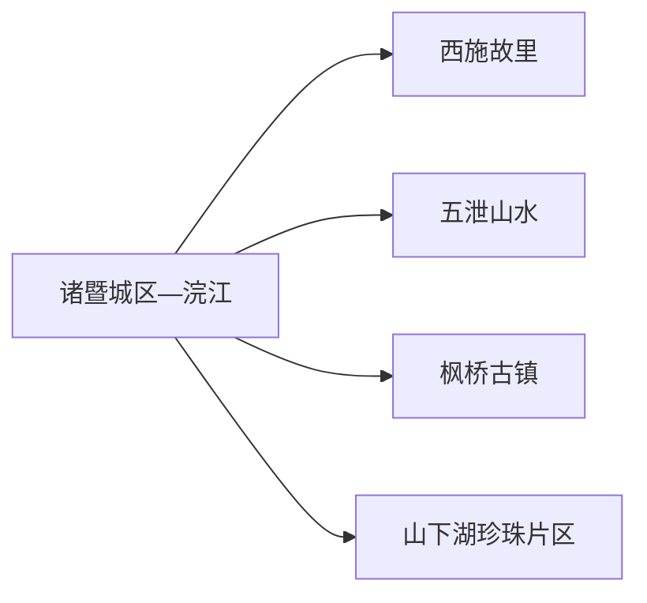
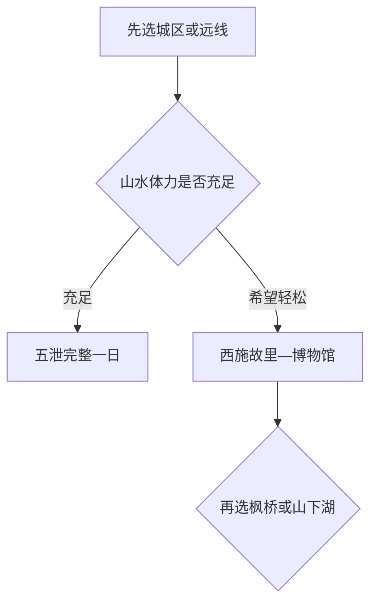

# 诸暨旅行指南

诸暨的选择很清楚：第一次来先看西施故里与浣江，一天山水则去五泄；对运河古镇、珍珠产业或“枫桥经验”感兴趣，再分别给枫桥、山下湖留半日至一天。城区与五泄、枫桥、山下湖并非连续景区，用铁路站附近住宿作基地最灵活。

> 建议停留：2–3 天 
> 旅行关键词：西施故里、浣江、五泄、枫桥、珍珠、次坞打面 
> 主要体力：城区低至中等；五泄较高 
> 最近研究：2026-08-13

## 城市速览

| 项目 | 旅行信息 |
|---|---|
| 主要旅行价值 | 在西施故里理解古越文化与浣江城市空间，再以五泄山水、枫桥古镇或山下湖珍珠产业扩展 |
| 建议停留 | 1 天城区；2 天加入五泄；3 天再选枫桥或山下湖 |
| 较舒适季节 | 春秋适合城区和山地；梅雨期瀑布丰沛但山洪与湿滑风险上升 |
| 预算特点 | 城区中等；五泄门票接驳和远线车辆增加成本 |
| 步行强度 | 浣江沿线可分段；五泄有长步道、台阶和可能的景区交通 |
| 主要天气风险 | 梅雨、台风、暴雨、山洪、雷电、高温和冬季结冰 |
| 独行旅行 | 城区与铁路方便；远线先确认末班和返程 |
| 亲子旅行 | 西施故里、博物馆和珍珠文化正式体验较适合 |
| 长者与低体力旅行 | 城区短线与车辆接驳更轻松，五泄选择游客中心附近开放段 |
| 无障碍信息 | 现代场馆可咨询，古建街巷和山地设施连续性需向官方确认 |

## 城市格局与游览区域

诸暨市是绍兴市代管的县级市，法定代码 `330681`；GeoNames `1783940` 与 Wikidata `Q198222` 精确对应。市域可按浣江城区、五泄西部山水、枫桥东北历史片区和山下湖珍珠产业片区来理解。

| 区域 | 主要内容 | 怎么安排 | 与其他区域的关系 |
|---|---|---|---|
| 浣江城区 | 西施故里、博物馆、滨水生活 | 一日核心 | 住宿和交通基地 |
| 五泄方向 | 瀑布、峡谷、森林和水库景观 | 完整一日 | 天气与景区交通决定节奏 |
| 枫桥方向 | 古镇、文保与基层治理展示 | 半日至一日 | 与五泄分日更稳妥 |
| 山下湖方向 | 珍珠产业、市场与正式体验 | 半日至一日 | 生产场所和游客设施边界清楚后进入 |
| 同山、赵家等乡镇 | 酒业、香榧和乡村活动 | 按节庆与正式接待选择 | 山林、果园和工厂首先是生产空间 |

## 主要景点

### 城区与历史文化

| 景点 | 区域 | 类型 | 主要看点 | 建议用时 | 室内外 | 体力 | 预约风险 | 天气影响 | 优先级 |
|---|---|---|---|---:|---|---|---|---|---|
| 西施故里旅游区 | 浣江城区 | 历史文化景区 | 西施文化、古越主题、浣江景观和当期展演 | 3–5 小时 | 混合 | 中 | 高 | 中 | A |
| 诸暨市博物馆及公共文化场馆 | 城区 | 博物馆 | 地方历史、考古与非遗展览 | 1–2 小时 | 室内 | 低 | 高 | 低 | A |
| 浣江城市滨水段 | 城区 | 滨水公共空间 | 城市生活、桥梁和夜间散步 | 1–2 小时 | 室外 | 低 | 低 | 高 | B |
| 枫桥古镇与“枫桥经验”展示片区 | 枫桥镇 | 古镇与公共文化 | 古镇街巷、地方历史和治理主题展陈 | 3–5 小时 | 混合 | 中 | 高 | 中 | B |

### 山水与产业文化

| 景点 | 区域 | 类型 | 主要看点 | 建议用时 | 室内外 | 体力 | 预约风险 | 天气影响 | 优先级 |
|---|---|---|---|---:|---|---|---|---|---|
| 五泄旅游区 | 五泄镇 | 瀑布峡谷与森林 | 五级瀑布、山谷水体、森林游线和正式景区交通 | 5–7 小时 | 室外 | 高 | 很高 | 很高 | A |
| 山下湖珍珠文化正式游览点 | 山下湖镇 | 产业文化 | 珍珠养殖、加工、交易和文化展示 | 3–5 小时 | 混合 | 中 | 很高 | 中 | B |
| 斯氏古民居建筑群 | 东白湖方向 | 古建筑 | 江南宗族建筑与村落格局 | 2–3 小时 | 混合 | 中 | 高 | 中 | B |
| 同山或赵家正式乡村体验 | 乡镇 | 农业与非遗 | 高粱酒、香榧或季节乡村活动 | 半日 | 混合 | 中 | 很高 | 高 | C |

西施故里内部殿馆、演出和浣江节点统一安排；五泄的瀑布、禅寺、游船或接驳也是同一景区游线。珍珠养殖池、加工车间、仓储和交易作业区只在运营方明确接待范围内参观。

## 美食与餐饮

诸暨适合用次坞打面、麻糍、年糕、香榧和江南家常菜建立味觉线索。城区最方便独行；远郊景区和乡镇用餐先确认营业与返程。

| 菜品或餐饮类型 | 常见区域 | 一个人用餐与常见份量 | 风味、过敏原与饮食限制 | 排队风险与替代方法 |
|---|---|---|---|---|
| 次坞打面 | 城区、次坞及面馆 | 一碗适合一人 | 含小麦，浇头可能含猪肉、蛋、虾和大豆 | 在生活街区选同类面馆 |
| 诸暨麻糍 | 市区、节庆与糕点店 | 小份适合分享 | 糯米制品可能含芝麻、花生和糖 | 选择配料清楚的小份产品 |
| 年糕与汤面 | 城区家常餐馆 | 一份可作主食 | 酱油含大豆和小麦，汤底可能含肉 | 紧凑行程改选清汤面或米饭套餐 |
| 香榧 | 赵家等产区与正规商店 | 坚果小份 | 坚果过敏者避开，也注意共线加工 | 购买带产地和包装标识产品 |
| 江鲜与家常菜 | 浣江沿线和城区 | 多为合菜 | 鱼刺、贝类、酒和酱油常见 | 独行点小份鱼或时蔬 |

## 经典行程

### 一日经典路线

**路线**：诸暨站或城区 → 西施故里旅游区 → 浣江午餐与休息 → 诸暨市博物馆 → 河岸短段

- **串联逻辑**：核心人文和公共文化集中在城区，步行与短接驳即可完成。
- **预约锚点**：西施故里展演和博物馆开放。
- **休息安排**：浣江沿线与城区商业区。
- **时间不足时**：保留西施故里，博物馆按开放时间二选一。

### 两日城市路线

**第 1 天**：西施故里—浣江—博物馆。  
**第 2 天**：城区 → 五泄游客中心 → 正式山水游线 → 返回。

- **串联逻辑**：城区文化和山地山水各占一天，第二天给接驳与天气留足余量。
- **预约锚点**：五泄门票、景区交通和清场时间。
- **休息安排**：第一天城区；第二天游客中心和正式服务点。
- **时间不足时**：整段删除五泄，改做枫桥半日。

### 三日深度路线

**第 1 天**：城区核心。  
**第 2 天**：五泄完整一日。  
**第 3 天**：枫桥古镇或山下湖珍珠文化二选一。

- **串联逻辑**：第三天按历史与产业兴趣选择，不跨两个远线。
- **预约锚点**：枫桥场馆或珍珠文化接待。
- **休息安排**：连续住城区最便于铁路返程。
- **时间不足时**：先删第三天。

### 雨天路线

**路线**：诸暨市博物馆 → 城区午餐 → 西施故里室内展陈与短廊道

- **适用条件**：普通降雨且城区道路正常；暴雨时避开河岸和山地。
- **预约锚点**：场馆与景区临时关闭。
- **休息安排**：城区商业区和室内场馆。
- **时间不足时**：只保留博物馆或西施故里一项。

### 亲子与低体力路线

**亲子路线**：博物馆 → 西施故里适龄展陈 → 浣江短段。  
**低体力路线**：车辆到西施故里主入口 → 平缓游线 → 城区午休 → 博物馆。

- **减负方式**：亲子路线减少长演出；低体力路线取消五泄与古村台阶。
- **预约锚点**：儿童活动、景区车辆和电梯。
- **休息安排**：西施故里服务区和城区餐饮。
- **时间不足时**：两类路线都先删河岸附加段。

### 远郊一日路线

**路线**：诸暨城区 → 五泄游客中心 → 正式瀑布森林游线 → 原路返回

- **适用条件**：天气稳定、游线开放且体力适合长步道。
- **预约锚点**：票务、船行/接驳和返程。
- **休息安排**：游客中心及景区正式服务点。
- **时间不足时**：改为枫桥半日，五泄留到能保留完整安全余量的一天。

## 住宿区域

| 区域 | 优点 | 缺点 | 适合人群 | 交通特点 |
|---|---|---|---|---|
| 诸暨站—城区 | 铁路、餐饮和多方向出发方便 | 到五泄仍需较长接驳 | 首访、独行和多日旅行者 | 最适合作为基地 |
| 西施故里—浣江 | 晚间散步与人文核心方便 | 旺季和演出日更拥挤 | 城区深度游者 | 以步行和短接驳为主 |
| 五泄或乡镇住宿 | 便于早入山地或乡村慢游 | 餐饮、返程和接待稳定性需核对 | 自驾、摄影和远线主题者 | 先确认次日车辆 |

## 市内交通

| 场景 | 建议与取舍 | 行前需要重查的内容 |
|---|---|---|
| 铁路抵达 | 诸暨站服务主城，抵达后再按片区换乘 | 12306 车次、公交和上客点 |
| 城区游览 | 步行配合公交/出租连接西施故里、博物馆和河岸 | 活动管制、停车和演出散场 |
| 前往五泄 | 公交、自驾或正规包车；给景区交通和返程留时间 | 班次、入口、船行、接驳与末班 |
| 枫桥/山下湖 | 每天只选一个远线锚点 | 场馆开放、生产接待和返程 |

## 不同旅行者须知

| 旅行维度 | 可行条件 | 主要取舍 | 需额外核对 |
|---|---|---|---|
| 独行旅行 | 城区与铁路方便 | 远线先锁定返程 | 末班、夜间上客点 |
| 亲子旅行 | 博物馆、西施故里和正规产业体验 | 山地按年龄缩短 | 儿童票、推车和卫生间 |
| 长者或低体力旅行 | 城区平缓线和车辆接驳 | 五泄只选低强度开放段 | 景区车辆、电梯和座椅 |
| 无障碍需求 | 现代场馆可咨询 | 古建、古村和山地连续通行资料有限 | 设施连续性需向官方确认 |
| 产业旅行 | 正式展示区能看到珍珠或酒业文化 | 生产池、车间和仓库按作业要求活动 | 参观许可、卫生和拍摄 |
| 梅雨台风 | 城区室内可替换 | 五泄、河岸和古村整体顺延 | 预警、山洪和退改 |

## 行前核对

| 核对事项 | 为什么需要重查 | 建议核对时间 | 官方入口 |
|---|---|---|---|
| 西施故里和五泄 | 演出、夜游、船行和接驳可能调整 | 订票前及当天 | [诸暨市人民政府](https://www.zhuji.gov.cn/) |
| 远线产业与乡村项目 | 接待范围和活动日期变化快 | 排入路线前 | [诸暨市全域旅游规划公开页](https://www.zhuji.gov.cn/art/2021/9/13/art_1229074729_3886256.html)及属地运营方公告 |
| 铁路 | 车次和停站按日期调整 | 出发前一周及当天 | [中国铁路 12306](https://www.12306.cn/) |
| 山区天气 | 梅雨、台风和山洪影响五泄 | 出发前三日及当天 | [浙江省气象局](https://zj.cma.gov.cn/) |

## 来源与更新记录

### 主要来源

| 来源 | 类型 | 支持内容 | 核验日期 |
|---|---|---|---|
| [民政部行政区划代码服务](https://dmfw.mca.gov.cn/xzqh/getList?code=330000&trimCode=false&maxLevel=3) | 政府开放接口 | 诸暨代码 `330681` 与绍兴代管关系 | 2026-08-13 |
| [诸暨市全域旅游总体规划公开页](https://www.zhuji.gov.cn/art/2021/9/13/art_1229074729_3886256.html) | 属地政府规划 | 规划名称、公开机关及配套附件入口 | 2026-08-13 |
| [浙江省文旅厅：诸暨核心景区与风物](https://ct.zj.gov.cn/art/2024/5/23/art_1652992_59022744.html) | 省级文旅主管部门 | 西施故里、五泄和地方饮食线索 | 2026-08-13 |
| [GeoNames 1783940](https://www.geonames.org/1783940/) | 开放地名库 | 城市记录与坐标 | 2026-08-13 |
| [Wikidata Q198222](https://www.wikidata.org/wiki/Q198222) | 开放知识库 | 法定城市实体与 GeoNames 精确映射 | 2026-08-13 |

### 更新记录

| 日期 | 更新内容 |
|---|---|
| 2026-08-13 | 首次建立诸暨独立指南；将西施故里、五泄、枫桥和山下湖分配到不同旅行日，并明确山水、珍珠、酒业、果园和文保空间的开放与生产边界。 |
