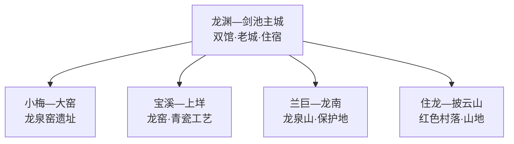
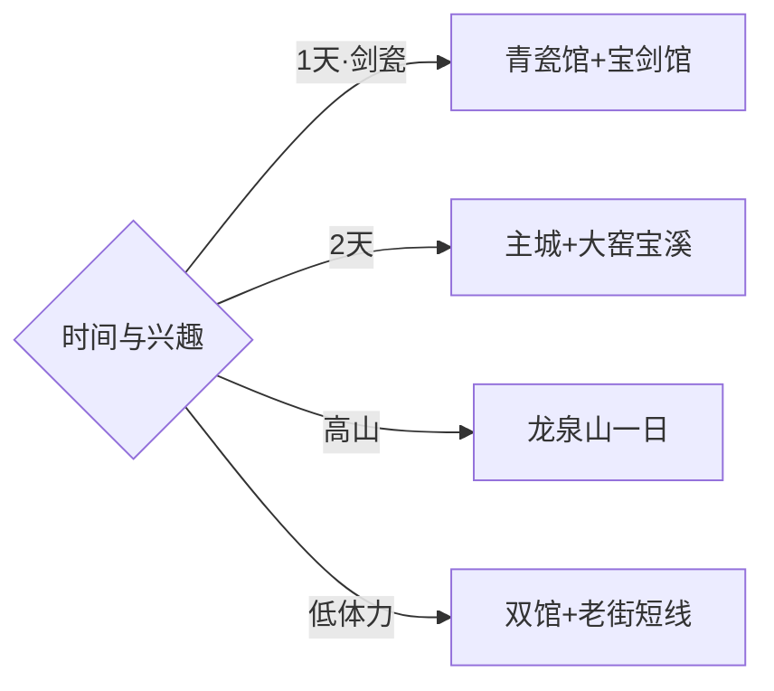

# 龙泉旅行指南

龙泉位于瓯江源头山区，最适合按“青瓷—宝剑—高山森林”来选。龙渊、剑池和西街一带集中了博物馆、老城与住宿；大窑—宝溪适合看窑址和龙窑文化，龙泉山则需要完整一天和山地天气窗口。固定快照中的 **Badu / GeoNames 1817827** 对应龙泉市八都镇，坐标、名称与丽水市行政层级闭合；丽水主城、云和、景宁和福建浦城均按跨县级行政区行程处理。

> 建议停留：2–3 天\
> 旅行关键词：龙泉青瓷、龙泉宝剑、大窑龙泉窑、龙泉山、瓯江源\
> 主要体力：主城低；窑址中等；高山路线较高\
> 最近研究：2026-09-03

## 城市速览

| 项目 | 旅行信息 |
|---|---|
| 主要旅行价值 | 用两座专业博物馆理解剑瓷传统，再到窑址、龙窑和高山森林看产地环境 |
| 建议停留 | 2天安排主城剑瓷与大窑—宝溪；增加龙泉山后用3天 |
| 较舒适季节 | 春秋适合山地和村落；夏季关注雷雨；冬季高海拔道路受低温影响 |
| 预算特点 | 主城成本温和，高山车辆、门票、住宿与工艺体验是主要变量 |
| 步行强度 | 博物馆低，窑址和古村中等，高山步道较高 |
| 主要天气风险 | 暴雨、雷电、山洪、落石、雾、低温结冰和森林火险 |
| 独行旅行 | 主城容易安排，乡村和高山返程先落实 |
| 亲子旅行 | 青瓷、宝剑展陈和正规手作适合研学，炉窑与锐器展示需成人看护 |
| 长者与低体力旅行 | 以主城双馆和车辆可达工艺点为主，减少窑址坡路与高山线 |
| 无障碍信息 | 新馆相对友好，老街、窑址、古村和山地连续性需逐点确认 |

## 城市格局与游览区域

| 区域 | 主要内容 | 游览特点 | 与其他区域的关系 |
|---|---|---|---|
| 龙渊—剑池主城 | 青瓷博物馆、宝剑博物馆、西街与剑池遗址公园 | 室内点集中，适合抵达日 | 各远线共同住宿基地 |
| 小梅—大窑 | 大窑龙泉窑遗址与相关展陈 | 文保和考古属性突出 | 宜留半天以上，可接宝溪 |
| 宝溪—上垟 | 龙窑、工艺村与青瓷体验 | 生产与展示空间需区分 | 与大窑同方向组织较顺 |
| 兰巨—龙南 | 龙泉山、凤阳山—百山祖保护区相关公开游线 | 海拔高、天气变化快 | 单独一天并优先官方入口 |
| 住龙—披云山 | 红色村落、山地与乡村工艺 | 道路和接待条件影响较大 | 适合作为第三日替代线 |

## 主要景点

| 景点 | 区域 | 类型 | 主要看点 | 建议用时 | 室内外 | 体力 | 预约风险 | 天气影响 | 优先级 |
|---|---|---|---|---:|---|---|---|---|---|
| 龙泉青瓷博物馆 | 主城 | 专题博物馆 | 青瓷历史、器形、釉色与烧造技术 | 2–3小时 | 室内 | 低 | 中 | 低 | A |
| 龙泉宝剑博物馆 | 主城 | 专题博物馆 | 铁剑发展、铸剑工艺与当代传承 | 1.5–2小时 | 室内 | 低 | 中 | 低 | A |
| 大窑龙泉窑遗址批准开放区 | 小梅 | 考古遗址 | 窑址、作坊与青瓷产地环境 | 2–3小时 | 混合 | 中 | 高 | 高 | A |
| 宝溪溪头村公开龙窑与工艺点 | 宝溪 | 工艺村 | 龙窑、当代青瓷与村落生产空间 | 2–3小时 | 混合 | 低中 | 高 | 中 | B |
| 西街历史街区与龙泉溪公共空间 | 主城 | 老街与滨水 | 山城街巷、瓯江上游水系与城市生活 | 2–3小时 | 室外 | 低中 | 低 | 中 | B |
| 龙泉山正式开放游线 | 南部山地 | 高山与森林 | 高海拔山地、森林生态与江浙高峰景观 | 1天 | 室外 | 高 | 高 | 很高 | A |
| 白云岩正式开放游线 | 主城近郊 | 山地 | 溪谷、山林与近郊步道 | 3–4小时 | 室外 | 中 | 中 | 很高 | B |
| 住龙红色小镇或披云山公开点 | 西部与南部 | 红色文化与山地 | 革命旧址、村落和森林景观 | 半天–1天 | 混合 | 中 | 高 | 高 | C |

## 美食与餐饮

| 菜品或餐饮类型 | 常见区域 | 一个人用餐与常见份量 | 风味、过敏原与饮食限制 | 排队风险与替代方法 |
|---|---|---|---|---|
| 安仁鱼头及溪鱼菜 | 主城与安仁正规餐馆 | 多人分享更合适，独行可问小份 | 注意鱼刺、辣度和合法来源 | 先问重量、做法和总价 |
| 香菇、笋与山地时蔬 | 主城和乡镇 | 小炒或汤菜适合组合 | 按季供应，菌菇来源需可靠 | 选择正规餐饮，不采食野生菌 |
| 黄粿、粉皮等米制小吃 | 主城与市场周边 | 单份友好 | 糯米或米浆制品按消化情况选择 | 上午和饭点选择较多 |
| 茶丰泥鳅火锅等乡镇风味 | 查田及主城餐馆 | 通常适合分享 | 泥鳅细骨、辣椒和汤底配料需确认 | 选菜单清晰的正规店铺 |
| 灵芝主题食品或茶饮 | 正规门店与展销点 | 小份体验 | 将其作为食品选择；正在用药或有基础病时咨询专业人士 | 看配料、资质与产品类别 |

## 经典行程

### 一日剑瓷经典路线

**路线**：龙泉青瓷博物馆 → 午餐 → 龙泉宝剑博物馆 → 西街历史街区 → 龙泉溪公共空间

- **串联逻辑**：两座专业馆建立剑瓷背景，再用老街和河谷理解山城环境。
- **预约锚点**：双馆开放、讲解与工艺活动。
- **休息安排**：博物馆公共区和主城餐饮区。
- **时间不足时**：保留青瓷馆和宝剑馆，老街改为短走。

### 两日剑瓷产地路线

**第 1 天**：主城双馆 → 西街。\
**第 2 天**：大窑龙泉窑遗址 → 宝溪公开龙窑或工艺点。

- **串联逻辑**：先看馆藏与技术，再到窑址和村落理解烧造环境。
- **预约锚点**：遗址开放、工艺讲解、体验和往返车辆。
- **休息安排**：主城连住；第二日在正式接待点休息。
- **时间不足时**：第二日保留大窑遗址，宝溪按预约删减。

### 三日深度路线

**第 1 天**：青瓷馆、宝剑馆与主城。\
**第 2 天**：大窑—宝溪工艺线。\
**第 3 天**：龙泉山正式开放游线。

- **串联逻辑**：城市展陈、产地工艺和高山生态各占一天。
- **预约锚点**：第三日景区入口、车辆、住宿和天气窗口。
- **休息安排**：前两晚住主城，高山日带足饮水和保暖层。
- **时间不足时**：先删第三日，再缩短宝溪体验。

### 雨天路线

**路线**：龙泉青瓷博物馆 → 主城午餐 → 龙泉宝剑博物馆 → 正规青瓷工作室公开展陈

- **适用条件**：普通降雨采用室内线；暴雨、山洪或道路预警时留在主城。
- **预约锚点**：双馆和工艺点接待。
- **休息安排**：场馆公共区与主城商业区。
- **时间不足时**：保留两座博物馆。

### 亲子或低体力路线

**亲子路线**：青瓷博物馆 → 正规手作体验 → 宝剑博物馆。\
**低体力路线**：青瓷博物馆 → 车辆接驳宝剑博物馆 → 龙泉溪短走。

- **减负方式**：亲子以材料和工艺任务串联；低体力线减少老街石路和远线坡路。
- **预约锚点**：体验年龄、锐器展示安全、无障碍入口与停车。
- **休息安排**：双馆公共区与主城。
- **时间不足时**：两类路线均保留青瓷博物馆。

### 大窑与宝溪路线

**路线**：主城 → 大窑遗址批准开放区 → 小梅或宝溪午餐 → 宝溪公开龙窑与工艺点 → 返回

- **适用条件**：适合遗址和工艺点均确认开放、道路正常的日期。
- **预约锚点**：遗址讲解、龙窑活动、工艺体验和车辆。
- **休息安排**：正式游客服务点与乡镇正规餐饮。
- **时间不足时**：保留大窑遗址与一处公开展陈。

### 龙泉山高山路线

**路线**：主城早出发 → 官方游客入口 → 景交或批准步道 → 核心观景点 → 原路返回

- **适用条件**：适合天气稳定、道路与景区明确开放的完整一天。
- **预约锚点**：票务、景交、山顶气象、道路和返程。
- **休息安排**：正式服务区，携带保暖层、饮水与应急食品。
- **时间不足时**：高山线整段改期，换成白云岩或主城双馆。

## 住宿区域

| 区域 | 优点 | 缺点 | 适合人群 | 交通特点 |
|---|---|---|---|---|
| 龙渊—剑池主城 | 双馆、餐饮和交通集中 | 前往大窑与高山仍需接驳 | 初访、独行、多主题旅行者 | 适合各方向共同基地 |
| 龙泉市站周边 | 铁路抵离方便 | 与老城和场馆有距离 | 早晚车、短住旅行者 | 预留进城接驳时间 |
| 宝溪或上垟正规民宿 | 靠近青瓷工艺村 | 餐饮和晚间交通较少 | 工艺、摄影、慢游 | 按预约工作室选择位置 |
| 龙泉山正式住宿点 | 靠近高山入口 | 天气、道路和供给波动大 | 登山、避暑、自驾 | 订房时确认景区准入与交通 |

## 市内交通

| 场景 | 建议与取舍 | 行前需要重查的内容 |
|---|---|---|
| 从丽水或衢宁铁路抵达 | 到龙泉市站后再进入主城或换远线车辆 | 车次、进城接驳和末班 |
| 主城—大窑—宝溪 | 留完整半天至一天，按预约顺序组织 | 遗址开放、乡镇公交与返程 |
| 主城—龙泉山 | 作为独立一日，高海拔天气决定是否出发 | 景区交通、山路、低温和防火 |
| 主城—住龙或披云山 | 一天只选一个方向，使用正规车辆 | 道路、接待、通信与补给 |

## 不同旅行者须知

| 旅行维度 | 可行条件 | 主要取舍 | 需额外核对 |
|---|---|---|---|
| 独行旅行 | 主城双馆和餐饮易安排 | 乡镇与高山返程选择少 | 末班、叫车覆盖与通信 |
| 亲子旅行 | 剑瓷展陈和手作体验适合研学 | 炉窑、工具与锐器展项需要看护 | 年龄、体验流程和安全规则 |
| 长者或低体力旅行 | 双馆与车辆可达点负担较低 | 窑址坡路和高山步道较重 | 无障碍入口、景交与座椅 |
| 无障碍需求 | 新建博物馆优先 | 老街、窑址与山地连续性有限 | 电梯、坡道、卫生间与陪同 |
| 摄影旅行 | 青瓷、龙窑、老街和山地题材丰富 | 作坊与文物拍摄规则各异 | 三脚架、闪光灯、航拍与肖像授权 |
| 预算有限 | 主城场馆与住宿选择较稳 | 远线车辆和体验增加支出 | 公交、门票、材料费与退改 |
| 晚出发或紧凑行程 | 双馆可安排半日 | 大窑和高山需要完整时段 | 最晚入馆与返程 |
| 特殊天气或自然条件 | 小雨可转剑瓷室内线 | 暴雨、雾、结冰、山洪和火险影响远线 | 气象、景区、道路和防火公告 |

大窑龙泉窑遗址及相关考古点按文物保护和批准展示范围参观；龙窑、工作室、制剑作坊和工厂按生产安全与接待边界进入，宝剑体验遵循锐器管理和现场指导。龙泉山与凤阳山—百山祖保护区域使用官方入口和开放游线，核心区、封闭林道及科研监测区域按保护规定管理。

## 行前核对

| 核对事项 | 为什么需要重查 | 建议核对时间 | 官方入口 |
|---|---|---|---|
| 青瓷与宝剑博物馆 | 闭馆、临展和讲解会变化 | 排入行程前及到访前一日 | [龙泉市人民政府](https://www.longquan.gov.cn/) |
| 大窑遗址与宝溪工艺体验 | 考古、窑火活动和团队接待会调整 | 订车前及到访前一日 | [龙泉市人民政府](https://www.longquan.gov.cn/) |
| 龙泉山开放与景交 | 高山天气、道路和防火决定可走范围 | 出发前三日及当天 | [龙泉市人民政府](https://www.longquan.gov.cn/) |
| 暴雨、低温与森林火险 | 山地、古村和公路受影响 | 出发前三日及当天 | [浙江省气象局](https://zj.cma.gov.cn/) |
| 铁路与乡镇接驳 | 车次、站点和末班会变化 | 购票前及当天 | [中国铁路12306](https://www.12306.cn/) |

## 来源与更新记录

### 主要来源

| 来源 | 类型 | 支持内容 | 核验日期 |
|---|---|---|---|
| [龙泉市人民政府：2024年政府工作报告解读](https://www.longquan.gov.cn/art/2024/3/20/art_1229382455_5279166.html) | 政府 | 青瓷、宝剑、龙泉山、披云山及特色乡镇文旅布局 | 2026-09-03 |
| [龙泉市人民政府：龙泉宝剑博物馆新馆开馆](https://www.longquan.gov.cn/art/2024/12/17/art_1229355680_59158271.html) | 政府 | 宝剑历史、展陈与新馆定位 | 2026-09-03 |
| [丽水市人民政府：龙泉青瓷发布活动](https://www.lishui.gov.cn/art/2023/5/17/art_1229268114_57346454.html) | 政府 | 青瓷博物馆、工艺体验与产业文化 | 2026-09-03 |
| [龙泉市农村水电绿色发展规划](https://www.longquan.gov.cn/module/download/downfile.jsp?classid=0&filename=1fabff3b48ca4ae980107e04816ee4b4.pdf) | 政府规划 | 凤阳山—百山祖保护区范围与保护对象 | 2026-09-03 |
| [GeoNames 1817827](https://www.geonames.org/1817827/) | 开放数据 | Badu 固定人口点、坐标与行政代码 | 2026-09-03 |

### 更新记录

| 日期 | 更新内容 |
|---|---|
| 2026-09-03 | 首次完成资料研究、空间拆分、七条路线与县级市映射 |
