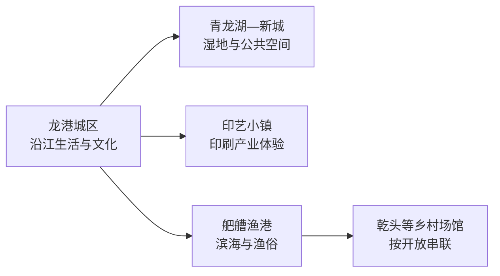
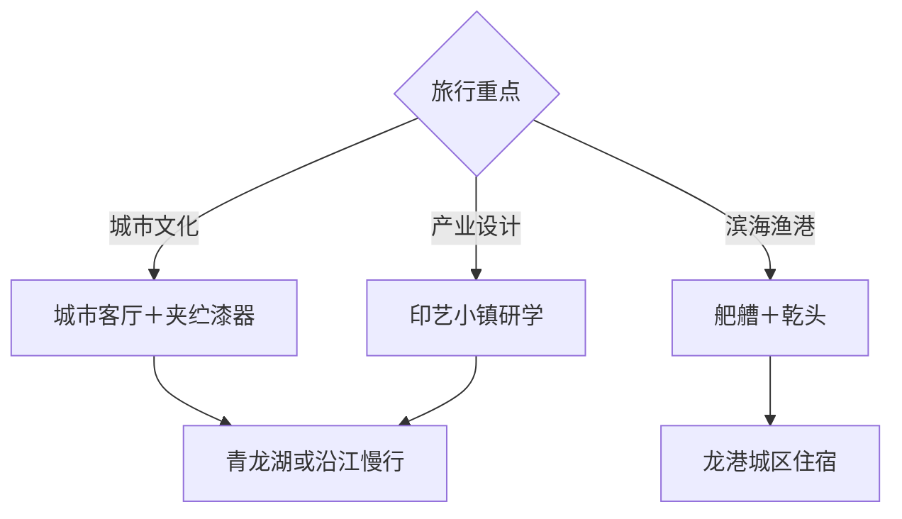

# 龙港旅行指南

龙港位于鳌江南岸和浙江东南海岸，是一座由印刷产业、撤镇设市改革、新城湿地与舥艚渔港共同塑造的年轻城市。城区文化场馆和沿江生活适合半日至一天，青龙湖—新城、舥艚渔港与乡村博物馆分属不同方向；2 天可看清“江口城市＋滨海渔港”两种尺度。

本页绑定龙港同名聚居点 **GeoNames 1893461**。该点建立时仍处于原苍南县行政链下，但坐标对应现龙港城市核心；其人口字段未进入项目固定 `cities500` 快照，因此页面只计入法定县级市覆盖，不改变固定 GeoNames 进度。

## 城市速览

| 项目 | 信息 |
|---|---|
| 主线 | 撤镇设市—印刷产业—夹纻漆器—青龙湖湿地—舥艚渔港 |
| 停留 | 1 天看城区文化和新城；2 天加入舥艚及乡村场馆 |
| 住宿 | 龙港城区适合餐饮、公交和鳌江跨江联程；新城住宿看重滨海活动 |
| 交通 | 铁路通常从鳌江站等周边门户接驳，市内以公交、出租和自驾串联 |
| 季节 | 春秋适合江岸与滨海；夏秋核对台风、暴雨和潮汐；冬季海风增强体感寒冷 |
| 预算 | 公共文化与公园成本较低，渔港用车、体验活动和跨江交通形成增量 |

## 城市格局与游览区域

老城区靠近鳌江，文化场馆、商业和跨江生活联系紧密；青龙湖与翠湖位于新城公共空间；舥艚渔港更靠近海岸，需要单独接驳。对岸鳌江镇属于平阳县，跨江用餐或乘车是一段跨县移动；苍南炎亭、渔寮等滨海景点属于苍南县，联程保持行政归属清晰。

## 主要景点

| 景点 | 区域 | 类型 | 核心体验 | 用时 | 环境 | 体力 | 预约风险 | 天气影响 | 优先级 |
|---|---|---|---|---:|---|---|---|---|---|
| 龙港城市客厅或政务客厅展陈 | 主城区 | 城市展陈 | 撤镇设市、基层治理改革与城市发展 | 1–2小时 | 室内 | 低 | 高 | 低 | A |
| 夹纻漆器博物馆 | 湿地公园二期 | 非遗博物馆 | 夹纻漆器历史、工艺和当代作品 | 1.5–2小时 | 室内 | 低 | 高 | 低 | A |
| 青龙湖公园 | 龙港新城 | 滨海湿地公园 | 城市湿地、公共空间和新城建设 | 2–3小时 | 室外 | 低 | 低 | 很高 | A |
| 翠湖公园与城市书房 | 龙港新城 | 公园与阅读空间 | 儿童友好公共空间、阅读和休息 | 1.5–2小时 | 混合 | 低 | 中 | 中 | B |
| 印艺小镇客厅及开放研学 | 印刷产业片区 | 产业与设计 | 活字、数字印刷、包装设计与城市产业 | 2–3小时 | 室内为主 | 低 | 很高 | 低 | A |
| 舥艚渔港公开游览区 | 舥艚片区 | 渔港与滨海 | 渔港生产、海塘景观与渔区生活 | 2–4小时 | 室外为主 | 低中 | 高 | 很高 | A |
| 乾头乡村博物馆 | 三园社区 | 乡村博物馆 | 舥艚渔村历史、渔民生活与民俗物件 | 1–1.5小时 | 室内 | 低 | 高 | 低 | B |
| 龙港沿江公共空间 | 鳌江南岸 | 江岸与城市 | 江口城市生活、桥梁和滨水慢行 | 1.5–2小时 | 室外 | 低 | 低 | 高 | B |
| 九龙河艺术小村当期开放区 | 乡村片区 | 艺术与乡村 | 青年文创、工作室和乡村公共空间 | 2小时 | 混合 | 低 | 很高 | 中 | C |
| 青龙湖婚俗博物馆等新城场馆 | 青龙湖片区 | 专题场馆 | 婚俗、城市文化和当期公共展览 | 1–2小时 | 室内 | 低 | 很高 | 低 | C |

## 美食与餐饮

龙港饮食兼具温州风味和渔港特色，可寻找糯米饭、鱼丸、敲鱼、海鲜面、灯盏糕和江蟹生等地方菜。城区适合一人小吃，舥艚海鲜更适合多人并先问时价、份量和做法。生食水产存在食品安全风险，孕期、儿童、长者和免疫力较弱者选择充分加热的替代菜。

## 经典行程

### 城市文化一日线
**路线**：城市客厅—午餐—夹纻漆器博物馆—青龙湖公园。**逻辑**：从城市制度与历史进入非遗和新城空间。**预约锚点**：两处场馆开放。**休息**：翠湖城市书房。**删除条件**：天气欠佳时缩短公园段。

### 印刷产业线
**路线**：印艺小镇客厅—正式研学基地—文创展示。**逻辑**：理解龙港产业如何转向设计和文旅。**预约锚点**：企业或基地接待。**休息**：小镇公共区。**删除条件**：没有预约时只保留公共展陈。

### 舥艚渔港一日线
**路线**：城区—舥艚渔港公开区—海鲜午餐—乾头乡村博物馆—返城。**逻辑**：生产性渔港与渔村文化在同一方向。**预约锚点**：博物馆与渔港开放。**休息**：渔港正式商业区。**删除条件**：台风、大风或生产管制时改城区线。

### 沿江新城慢游线
**路线**：鳌江南岸公共空间—午餐—翠湖—青龙湖。**逻辑**：比较老城江岸与新城湿地。**预约锚点**：无。**休息**：城市书房。**删除条件**：暴晒或强风时保留一处公园。

### 雨天场馆线
**路线**：城市客厅—夹纻漆器博物馆—城市书房。**逻辑**：用室内空间完成城市和工艺主线。**预约锚点**：场馆开放。**休息**：馆区。**删除条件**：台风红色预警时按属地安排暂停出行。

### 亲子低体力线
**路线**：夹纻漆器博物馆—午餐—翠湖城市书房—青龙湖短段。**逻辑**：互动、阅读和公园相间。**预约锚点**：儿童活动。**休息**：书房。**删除条件**：疲劳或高温时只保留室内场馆。

### 两日完整线
**路线**：首日城市客厅—印艺—青龙湖，次日舥艚—乾头。**逻辑**：江口产业城市与滨海渔港分日。**预约锚点**：印艺研学、乡村博物馆和第二日车辆。**休息**：连续住城区。**删除条件**：只有一天时按兴趣保留首日或渔港线。

## 住宿区域

龙港老城区适合首次到访，餐饮、沿江生活和跨江接驳更方便。新城住宿适合青龙湖、翠湖和滨海活动，选择时核对夜间餐饮与交通；舥艚周边住宿适合渔港晨昏，并需确认台风季退改和实际营业。

## 市内交通

鳌江站等铁路门户位于周边行政区，订票后核对跨江接驳和总耗时。城区、新城、印艺片区和舥艚之间以公交、出租或自驾连接。渔港码头、装卸区、船舶作业区、海塘施工区和潮间带执行明确生产与安全边界；滨海活动按潮汐和预警调整。

## 不同旅行者须知

工艺与设计旅行者优先夹纻漆器和印艺研学；亲子家庭选择博物馆、书房和公园；低体力旅行者将舥艚改为城区场馆；摄影旅行者在公开江岸、湿地和渔港观景区取景。企业车间、渔港生产区、无人机、潮间带和海塘施工规则按运营与管理方执行。

## 行前核对

- 通过龙港市政府核对城市客厅、夹纻漆器博物馆、乡村博物馆和印艺研学开放。
- 通过 12306 核对鳌江等实际铁路门户，并安排跨江接驳。
- 舥艚和滨海线路核对台风、雷雨、潮汐、大风、渔港生产和海塘施工。
- 青龙湖、九龙河及新场馆处于持续建设运营中，按当期已开放范围安排行程。

## 来源与更新记录

| 来源 | 支持内容 | 核验日期 |
|---|---|---|
| [龙港市政府：公共文化场馆](https://zjlg.gov.cn/art/2022/12/7/art_1229604626_58957430.html) | 夹纻漆器博物馆、乾头乡村博物馆、翠湖书房与场馆位置 | 2026-09-04 |
| [龙港市政府：青龙湖旅游开发答复](https://zjlg.gov.cn/art/2025/8/1/art_1229551166_4332048.html) | 青龙湖、印艺小镇与新城文旅布局 | 2026-09-04 |
| [龙港市政府：乡村旅游答复](https://zjlg.gov.cn/art/2025/8/5/art_1229551166_4369630.html) | 舥艚渔港、九龙河艺术小村与乡村文旅方向 | 2026-09-04 |
| [GeoNames 1893461](https://www.geonames.org/1893461/) | 龙港同名城市点与坐标 | 2026-09-04 |

