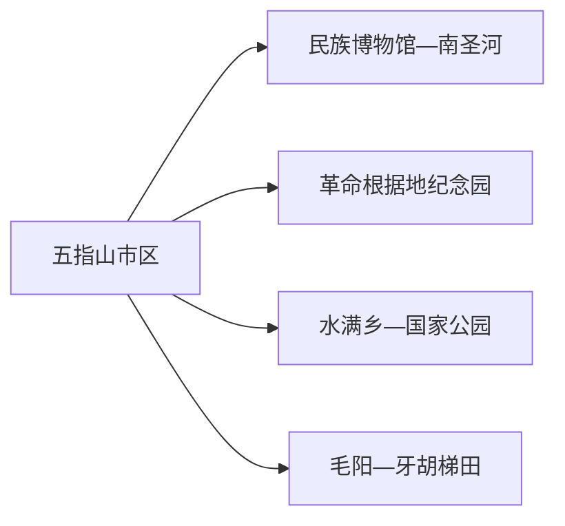
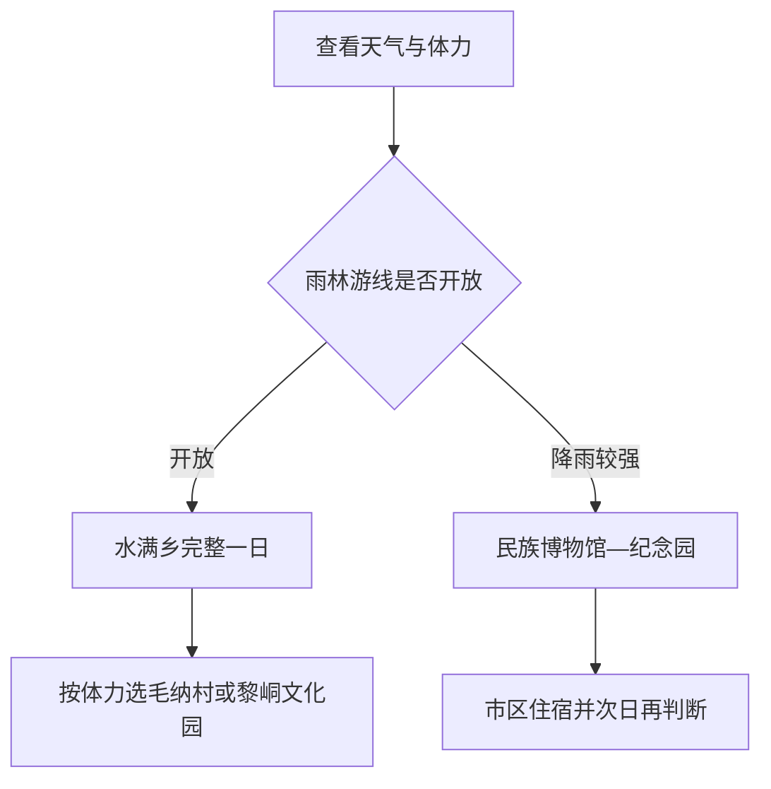

# 五指山旅行指南

五指山市的核心选择是“市区文化”与“水满雨林”分日安排：市区适合看海南省民族博物馆、革命根据地纪念园和南圣河生活空间；水满乡则承接国家公园雨林、黎族文化和山地项目。两片区相距较远，住两晚能给雨林天气和山路留出调整余量。

> 建议停留：2–3 天 
> 旅行关键词：热带雨林、黎族文化、海南省民族博物馆、水满乡、革命史、山地茶园 
> 主要体力：市区低至中等；雨林和漂流较高 
> 最近研究：2026-08-13

## 城市速览

| 项目 | 旅行信息 |
|---|---|
| 主要旅行价值 | 在海南中部山地同时理解热带雨林、黎苗文化、革命史和茶旅农业 |
| 建议停留 | 1 天市区文化；1 天水满乡雨林；第三天按天气选择梯田、茶园或漂流 |
| 较舒适季节 | 旱季山路更稳定；雨季雨林更丰沛但强降雨、山洪和落石风险上升 |
| 预算特点 | 市区中低；水满乡车辆、景区、漂流和换宿增加预算 |
| 步行强度 | 市区低至中等；国家公园和山地景区有湿滑坡道与台阶 |
| 主要天气风险 | 高温高湿、短时强降雨、雷电、山洪、落石、台风外围影响和能见度变化 |
| 独行旅行 | 市区容易；雨林日优先使用正式景区接驳或正规包车 |
| 亲子旅行 | 民族博物馆、毛纳村和短雨林步道较适合；漂流按年龄与运营规则选择 |
| 长者与低体力旅行 | 以博物馆、纪念园低强度段和水满乡车辆观景为主 |
| 无障碍信息 | 现代场馆可提前咨询，雨林、黎峒文化园台阶和村寨设施连续性需向官方确认 |

## 城市格局与游览区域

五指山市是海南省直辖县级市，法定代码 `469001`。GeoNames `1916012` 与 Wikidata `Q1001424` 精确对应城市实体；旅行时仍要区分市区、水满乡、毛阳—牙胡和国家公园保护空间。

| 区域 | 主要内容 | 怎么安排 | 与其他区域的关系 |
|---|---|---|---|
| 市区 | 省民族博物馆、城市公共文化、南圣河 | 半日至一日 | 住宿和交通基地 |
| 番阳—毛阳方向 | 革命根据地纪念园、牙胡梯田和乡村 | 半日至一日 | 点位分散，按一个主锚点规划 |
| 水满乡 | 国家公园五指山片区、毛纳村、黎峒文化和茶园 | 完整一日或换宿 | 山路、天气和开放入口决定节奏 |
| 漂流与峡谷项目 | 正式运营河段和游客服务区 | 单独半日至一日 | 与登山同日时体力和天气负担高 |
| 国家公园核心保护空间 | 热带雨林生态系统与科研管护区 | 只沿正式开放游线活动 | 保护区、管护道和非开放登山线保留生态功能 |

## 主要景点

### 市区与文化

| 景点 | 区域 | 类型 | 主要看点 | 建议用时 | 室内外 | 体力 | 预约风险 | 天气影响 | 优先级 |
|---|---|---|---|---:|---|---|---|---|---|
| 海南省民族博物馆 | 市区 | 博物馆 | 海南少数民族历史、服饰、生产生活与非遗 | 2–3 小时 | 室内 | 低 | 高 | 低 | A |
| 五指山革命根据地纪念园 | 毛阳方向 | 红色文化 | 海南革命斗争史与纪念空间 | 2–3 小时 | 混合 | 中 | 中 | 中 | A |
| 南圣河城市步道 | 市区 | 滨水公共空间 | 山城日常、河岸与夜间散步 | 1–2 小时 | 室外 | 低 | 低 | 高 | B |
| 市区公共文化场馆 | 市区 | 文化馆与图书馆 | 当期展览、非遗活动与避雨休息 | 1–2 小时 | 室内 | 低 | 高 | 低 | B |

### 雨林与黎族文化

| 景点 | 区域 | 类型 | 主要看点 | 建议用时 | 室内外 | 体力 | 预约风险 | 天气影响 | 优先级 |
|---|---|---|---|---:|---|---|---|---|---|
| 海南热带雨林国家公园五指山片区正式游线 | 水满乡 | 国家公园与雨林 | 热带雨林、山地水系和正式观景步道 | 4–6 小时 | 室外 | 高 | 很高 | 很高 | A |
| 黎峒文化园 | 水满乡 | 黎族文化 | 黎祖文化、祭祀空间和黎族文化展示 | 2–4 小时 | 混合 | 高 | 很高 | 高 | A |
| 毛纳村 | 水满乡 | 黎族村寨与乡村 | 村寨公共空间、黎锦等文化展示和乡村生活 | 2–3 小时 | 混合 | 中 | 中 | 高 | B |
| 牙胡梯田 | 毛阳镇 | 农业景观 | 山地稻作、梯田季相与村落景观 | 2–3 小时 | 室外 | 中 | 中 | 很高 | B |
| 五指山大峡谷漂流 | 水满乡方向 | 户外运动 | 正式河段漂流与峡谷地貌 | 半日至一日 | 室外 | 高 | 很高 | 很高 | C |
| 正式茶园体验 | 水满乡 | 农业与茶文化 | 茶园景观、采制体验和山地农业 | 半日 | 混合 | 中 | 很高 | 高 | C |

国家公园游线、黎峒文化园和毛纳村是不同运营或管理单元；登山、漂流和茶园体验也分别核对。雨林之外的林道、河谷、取水设施和生产茶园按保护与生产边界活动。

## 美食与餐饮

五指山饮食可围绕五脚猪、小黄牛、山兰米、树仔菜和水满茶选择。市区更适合稳定用餐，水满乡的餐饮与民宿常随客流和季节变化。

| 菜品或餐饮类型 | 常见区域 | 一个人用餐与常见份量 | 风味、过敏原与饮食限制 | 排队风险与替代方法 |
|---|---|---|---|---|
| 山兰米饭与竹筒饭 | 市区、黎族村寨正式餐饮 | 小份主食适合一人 | 竹筒饭可能加入肉、椰浆或花生；逐项问配料 | 改选普通米饭配地方菜 |
| 五脚猪 | 市区与水满乡餐馆 | 多为合菜，适合分享 | 含猪肉，烧烤或蘸料可能含大豆、花生 | 独行点小炒或汤粉中的小份肉 |
| 小黄牛与水满鸭 | 水满乡和市区地方菜馆 | 通常一盘以上 | 牛肉、鸭肉和辣椒风味明显；汤底可能含酒 | 先问份量，选择清炒蔬菜搭配 |
| 树仔菜等山野蔬菜 | 市区、乡镇餐馆 | 一盘可分享 | 只食用正规餐饮采购食材，不自行采摘 | 非产季选择常规叶菜 |
| 五指山红茶 | 水满乡茶园和市区茶店 | 品饮可小份 | 含咖啡因；体验内容与购买价格分开确认 | 选择标识完整产品，不以进园推销代替体验 |

## 经典行程

### 一日经典路线

**路线**：海南省民族博物馆 → 市区午餐 → 五指山革命根据地纪念园 → 南圣河短段

- **串联逻辑**：用市区和毛阳方向的文化线建立背景，适合抵达日或雨林天气不稳时。
- **预约锚点**：博物馆和纪念园开放公告。
- **休息安排**：午餐与下午休息放在市区。
- **时间不足时**：保留民族博物馆和南圣河短段。

### 两日城市路线

**第 1 天**：民族博物馆 → 革命根据地纪念园 → 市区住宿。  
**第 2 天**：市区或水满乡住宿地 → 国家公园正式游线 → 毛纳村或黎峒文化园 → 返回。

- **串联逻辑**：文化日与雨林日分开，第二天按体力在毛纳村和黎峒文化园中选择重点。
- **预约锚点**：国家公园入口、黎峒文化园和往返车辆。
- **休息安排**：水满乡游客服务点和正式餐饮。
- **时间不足时**：第二天只保留国家公园正式短线和一个文化点。

### 三日深度路线

**第 1 天**：市区文化线。  
**第 2 天**：水满乡雨林—黎族文化线。  
**第 3 天**：牙胡梯田或正式茶园体验；漂流作为另一套整日选择。

- **串联逻辑**：第三天按季节在农业景观、茶旅和漂流中三选一。
- **预约锚点**：茶园接待、漂流年龄健康规则和梯田道路。
- **休息安排**：连续住市区可减少换宿；雨林早入者可在水满乡住一晚。
- **时间不足时**：保留前两天，漂流改到下一次独立安排。

### 雨天路线

**路线**：海南省民族博物馆 → 市区午餐 → 公共文化场馆 → 住宿附近用餐

- **适用条件**：普通降雨且城区道路正常；暴雨、山洪或台风影响时以室内和住宿为主。
- **预约锚点**：场馆临时闭馆和道路预警。
- **休息安排**：全程在市区短距离移动。
- **时间不足时**：只保留民族博物馆。

### 亲子与低体力路线

**亲子路线**：民族博物馆 → 毛纳村正式公共区域 → 适龄非遗体验。  
**低体力路线**：民族博物馆 → 车辆到水满乡观景点 → 正式服务区休息 → 返回。

- **减负方式**：亲子路线避开漂流和长登山；低体力路线以车辆观景和短步道为主。
- **预约锚点**：儿童活动、景区车辆和无障碍设施。
- **休息安排**：博物馆、市区餐厅和水满乡游客服务点。
- **时间不足时**：两条路线都保留民族博物馆，删远端附加点。

### 远郊一日路线

**路线**：市区 → 水满乡 → 国家公园正式游线 → 黎峒文化园或毛纳村 → 返回/水满乡住宿

- **适用条件**：山路与游线开放、往返车辆已确认，体力适合湿热山地环境。
- **预约锚点**：国家公园入口、文化园票务和住宿。
- **休息安排**：水满乡正式服务点，午后留防雨缓冲。
- **时间不足时**：保留国家公园短线，文化园与村寨二选一。

## 住宿区域

| 区域 | 优点 | 缺点 | 适合人群 | 交通特点 |
|---|---|---|---|---|
| 五指山市区 | 餐饮、补给和场馆集中 | 去水满乡需较长山路接驳 | 首访、公共交通和文化线旅行者 | 适合作为多日基地 |
| 水满乡 | 靠近国家公园、文化园和村寨 | 夜间餐饮与车辆选择较少 | 雨林早入、摄影和慢游者 | 提前锁定往返与次日车辆 |
| 毛阳方向 | 靠近纪念园和牙胡梯田 | 住宿成熟度需逐点核对 | 乡村与革命史主题者 | 更适合自驾或正规包车 |

## 市内交通

| 场景 | 建议与取舍 | 行前需要重查的内容 |
|---|---|---|
| 从海口或三亚抵达 | 以公路客运、正规包车或自驾为主，先到市区再分日 | 班次、到站、山路天气和夜间抵达 |
| 市区—水满乡 | 预留完整往返时间，优先正式旅游车辆或正规包车 | 发车点、返程、车辆资质和临时管制 |
| 市区—毛阳/牙胡 | 按单个远点安排，不连续叠加多个村寨 | 乡道状况、停车和接待状态 |
| 国家公园内 | 使用正式入口、步道和景区交通 | 开放游线、清场时间、火险与强降雨 |

## 不同旅行者须知

| 旅行维度 | 可行条件 | 主要取舍 | 需额外核对 |
|---|---|---|---|
| 独行旅行 | 市区场馆容易；雨林日有正规车辆 | 每天选择一个已确认接待的村寨或雨林入口 | 返程、通信和上客点 |
| 亲子旅行 | 博物馆、村寨公共区和短步道 | 漂流与长登山按年龄取舍 | 身高年龄、救生装备和卫生间 |
| 长者或低体力旅行 | 车辆观景和文化场馆 | 黎峒台阶与雨林湿滑段缩短 | 接驳、电梯、座椅和医疗距离 |
| 无障碍需求 | 市区现代场馆可先咨询 | 雨林和村寨连续通行证据有限 | 设施连续性需向官方确认 |
| 户外旅行 | 正式步道与漂流运营项目 | 保护区核心区、河道和非开放林道保留生态功能 | 预警、保险、装备和闭园 |
| 高温高湿 | 早出发、补水和分段休息 | 减少午后长坡和连续户外活动 | 雷电、热指数和中暑信号 |

## 行前核对

| 核对事项 | 为什么需要重查 | 建议核对时间 | 官方入口 |
|---|---|---|---|
| 国家公园入口与游线 | 保护、天气和维护会改变开放范围 | 出发前三日及当天 | [海南热带雨林国家公园](https://www.hntrnp.com/) |
| 市内文旅活动 | 三月三、非遗和乡村活动按日期运行 | 确定日期后 | [五指山市人民政府](https://wzs.hainan.gov.cn/) |
| 道路与天气 | 山区强降雨、台风和落石影响接驳 | 出发前三日及当天 | [海南省气象局](https://hi.cma.gov.cn/) |
| 博物馆与纪念园 | 闭馆日、团队活动和展陈维护会调整 | 到访前一日 | [海南省旅游和文化广电体育厅](https://lwt.hainan.gov.cn/) |

## 来源与更新记录

### 主要来源

| 来源 | 类型 | 支持内容 | 核验日期 |
|---|---|---|---|
| [民政部行政区划代码服务](https://dmfw.mca.gov.cn/xzqh/getList?code=460000&trimCode=false&maxLevel=3) | 政府开放接口 | 五指山市代码 `469001` 与省直辖县级市层级 | 2026-08-13 |
| [文化和旅游部：五指山下看非遗线路](https://zhuanti.mct.gov.cn/xcszbwg2022/hainan/detail/1955.html) | 国家文旅主管部门 | 国家公园、黎峒文化园、漂流、民族博物馆、纪念园和牙胡梯田组合关系 | 2026-08-13 |
| [农业农村部：五指山茶旅线路](https://gjcr.moa.gov.cn/cty/202005/t20200519_6344538.htm) | 国家农业主管部门 | 水满乡、雨林、茶园、黎族饮食与市区关系 | 2026-08-13 |
| [五指山市人民政府](https://wzs.hainan.gov.cn/) | 属地政府 | 城市公告、道路和文旅活动核对入口 | 2026-08-13 |
| [海南热带雨林国家公园](https://www.hntrnp.com/) | 国家公园管理入口 | 保护地与开放信息 | 2026-08-13 |
| [GeoNames 1916012](https://www.geonames.org/1916012/) | 开放地名库 | 城市记录与坐标 | 2026-08-13 |
| [Wikidata Q1001424](https://www.wikidata.org/wiki/Q1001424) | 开放知识库 | 法定城市实体与 GeoNames 精确映射 | 2026-08-13 |

### 更新记录

| 日期 | 更新内容 |
|---|---|
| 2026-08-13 | 首次建立五指山独立指南；按市区文化、水满雨林和毛阳乡村分日，明确国家公园、河道、茶园和村寨的开放与生产保护边界。 |
