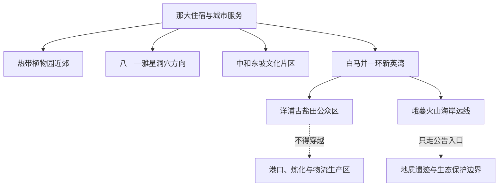
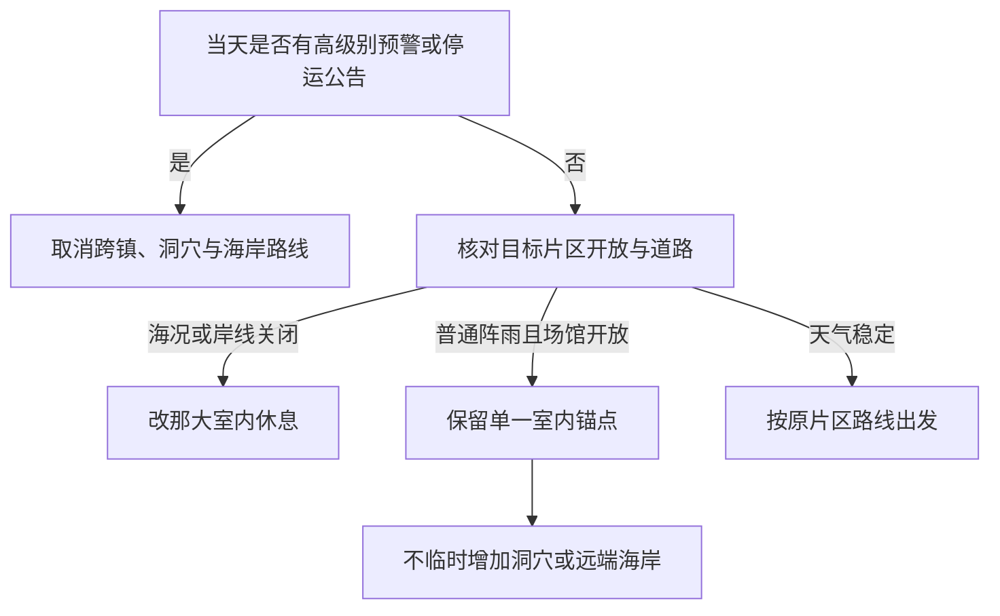

# 儋州旅行指南

儋州位于海南岛西北部，旅行结构不像一座紧凑的滨海城市：那大是住宿、餐饮和日常服务中心，中和镇集中东坡文化遗存，八一—雅星方向是热带植物与火山溶洞，白马井—排浦面向海花岛与新英湾，洋浦和峨蔓则把古盐田、火山海岸、深水港与工业生产空间并置。各片区相距较远，铁路站、景区入口和海岸之间仍有“最后一段”；把它们压成连续城区，会低估交通、高温、台风和返程成本。

> 建议停留：3–5 天；2 天可选那大近郊与东坡文化，增加环新英湾或地质远线宜再留 1–3 天\
> 旅行关键词：东坡文化、热带农业、火山海岸、古盐田、环新英湾\
> 主要体力：中等；洞穴、园区和火山海岸会增加湿滑、台阶与日晒负担\
> 最近研究：2026-08-12

## 城市速览

| 项目 | 旅行信息 |
|---|---|
| 主要旅行价值 | 东坡书院与中和古镇的人文线、海南热带植物园与石花水洞的自然科普、洋浦古盐田与峨蔓火山海岸的地质和生产文化、环新英湾的滨海度假 |
| 建议停留 | 3–5 天；那大近郊 1 天、中和东坡文化 1 天，环新英湾、石花水洞或峨蔓海岸各需独立半天至一日 |
| 较舒适季节 | 相对少雨且不处于强台风影响时更容易组织远线；全年都需防晒补水，冬季海风和冷空气也会降低海上项目舒适度 |
| 预算特点 | 中等；市区餐饮选择较多，远线车辆、滨海住宿和度假项目通常是主要支出 |
| 步行强度 | 中等；书院与园区可控制步行，洞穴、火山岩岸线和大尺度度假区对鞋底防滑与体力要求更高 |
| 主要天气风险 | 高温、雷电、短时强降雨、台风、海浪、山洪与湿滑；同一天内陆和海岸条件可能不同 |
| 独行旅行 | 那大与单一片区较好安排；跨镇包车和海岸晚间返程成本较高，不把陌生渔船或生产车辆当接驳 |
| 亲子旅行 | 植物、洞穴和东坡文化可形成清晰主题；洞穴台阶、临水岸线、园区接驳和正午高温需逐项核对 |
| 长者与低体力旅行 | 可住那大或白马井，以车辆点对点和每日一个片区减负；火山岩、洞穴和大园区仍难完全避开不平路面 |
| 无障碍信息 | 公开资料能证明儋州正在建设和检查无障碍设施，但不能证明车站、道路、景区和住宿之间连续通行，须逐点向运营方确认 |

## 城市格局与游览区域

儋州行政市域覆盖海南岛西北部广阔范围。那大不临海，却承担主要城市服务；白马井站靠近新英湾和海花岛方向，并不等于抵达那大；洋浦港区与临港工业片区首先是生产空间；中和、峨蔓、雅星等镇各有自己的道路与返程条件。实时 GeoNames 已将固定记录 `1800234` 的主名更新为 Danzhou，固定快照仍保留 Nada；两者是同一 GeoNames 标识。法定城市实体使用 Wikidata `Q1015132` 和行政代码 `460400`，页面按儋州市域组织，而不是只写那大镇。

| 区域 | 主要内容 | 游览特点 | 与其他区域的关系 |
|---|---|---|---|
| 那大主城 | 城市住宿、餐饮、采购、公共文化和换乘 | 最适合作基地；公共空间可短步行，去所有远线仍需车辆 | 靠近海南热带植物园方向；到白马井、洋浦、中和和峨蔓均不能按城区通勤估算 |
| 宝岛新村—热作科研片区 | 海南热带植物园、热带农业科研与校园生产空间 | 植物科普为主；科研、教学和生产区域不因园区相邻而开放 | 可与那大同日；不要再叠加洋浦或峨蔓远线 |
| 八一—雅星方向 | 石花水洞等喀斯特与热带农业景观 | 洞穴湿滑、台阶和接驳是核心限制 | 适合独立半日或一日；松涛水库等水利空间不作为随意延伸点 |
| 中和东坡文化片区 | 东坡书院、儋州故城、桄榔庵遗址及中和镇公共街区 | 文保点、居民街巷与新建展示设施并存，开放范围需分别确认 | 适合从那大往返；不要把所有东坡遗迹拆成多个“已完成景点” |
| 白马井—排浦—海花岛 | 白马井站、环新英湾滨海住宿、海花岛当期开放项目 | 度假项目尺度大，经营、票务和接驳变化较快 | 可住一晚减少返程；与洋浦古盐田相邻但不等于可穿越港区或工地 |
| 洋浦—三都 | 洋浦古盐田、工业遗产、港产城空间 | 古盐田与盐业生活可游，港口、炼化、仓储、码头和专用铁路受控 | 与白马井可组合；生产区不能作为观景捷径或随意航拍地点 |
| 峨蔓火山海岸 | 龙门激浪等火山海岸地貌、盐田与村落海岸 | 远、晒、风浪大，火山岩湿滑且公共入口可能调整 | 单独一日；不与石花水洞、东坡书院硬拼 |

东坡文化、古盐田和火山海岸既是旅行资源，也是文物、社区生产与生态保护空间。只进入有明确公众入口的道路、场馆和运营区域；规划项目、在建展示工程、盐田生产面和地图上的沿海小路，都不能自动视为已开放景点。

## 主要景点

优先级用于安排时间：**A** 为首访核心，**B** 为按兴趣补充，**C** 为远郊、季节性或运营变化较大的目的地。东坡书院、中和古镇与相关遗址按一条东坡文化片区安排；峨蔓火山海岸内的龙门激浪等地貌点按同一地质海岸单元安排，不重复拆站。

### 那大近郊与内陆科普

| 景点 | 区域 | 类型 | 主要看点 | 建议用时 | 室内外 | 体力 | 预约风险 | 天气影响 | 优先级 |
|---|---|---|---|---:|---|---|---|---|---|
| 海南热带植物园 | 宝岛新村—热作科研片区 | 植物园／农业科普 | 热带经济作物、植物分类与热作科研背景；只走当期公众园区 | 2–4 小时 | 室外为主 | 中 | 中 | 高 | A |
| 海南石花水洞地质公园 | 八一—雅星方向 | 洞穴／地质公园 | 石灰岩溶洞、地下景观与地质科普；洞内项目和地面园区分别核对 | 3–5 小时 | 混合 | 中至高 | 中 | 中至高 | A |

### 东坡文化与历史

| 景点 | 区域 | 类型 | 主要看点 | 建议用时 | 室内外 | 体力 | 预约风险 | 天气影响 | 优先级 |
|---|---|---|---|---:|---|---|---|---|---|
| 中和东坡文化片区（东坡书院为核心） | 中和镇 | 书院／古镇／文物 | 东坡书院、儋州故城与依法开放的相关遗址；理解苏轼居儋与地方文脉 | 4–6 小时 | 混合 | 中 | 中 | 中 | A |

### 环新英湾与西部海岸

| 景点 | 区域 | 类型 | 主要看点 | 建议用时 | 室内外 | 体力 | 预约风险 | 天气影响 | 优先级 |
|---|---|---|---|---:|---|---|---|---|---|
| 洋浦千年古盐田 | 洋浦—三都 | 工业遗产／传统生产景观 | 火山岩盐槽、海盐晒制传统与社区生产；不踏入正在作业的盐池 | 1.5–3 小时 | 室外 | 中 | 低至中 | 高 | A |
| 海花岛旅游度假区当期开放项目 | 白马井—排浦 | 综合度假区 | 人工岛空间、文化娱乐和滨海休闲；各场馆、水上项目和演出独立运营 | 半日至一日 | 混合 | 中 | 高 | 高 | B |
| 峨蔓火山海岸省级地质公园公众开放段 | 峨蔓镇 | 火山海岸／地质遗迹 | 海蚀崖、海蚀拱桥、海蚀平台与玄武岩岸线；龙门激浪等仅作内部地貌节点 | 4–7 小时 | 室外 | 高 | 中至高 | 很高 | B |
| 光村银滩及北部公共海岸当期开放段 | 光村镇方向 | 海岸／季节性休闲 | 北部湾海岸、浅滩与落日；只使用主管部门或运营方确认的公共入口 | 2–4 小时 | 室外 | 中 | 中 | 很高 | C |

松涛水库首先是重要水利设施，洋浦港首先是深水港与临港产业空间，峨蔓盐田和古盐田也可能持续生产。没有明确公众游线时，它们只作为边界和区域背景；不要进入坝体、闸室、输水渠、码头、罐区、炼化厂、仓储区、专用铁路、施工便道或无人值守岸线。

## 美食与餐饮

儋州饮食兼有那大日常早餐、东坡文化菜、滨海海产和节庆粽食。以菜品与区域选择为主，不把单家店写成唯一答案；海鲜、粽子和米烂常见多种配料，点单前应主动询问甲壳类、鱼干、花生、猪肉、蛋奶和麸质。

| 菜品或餐饮类型 | 常见区域 | 一个人用餐与常见份量 | 风味、过敏原与饮食限制 | 排队风险与替代方法 |
|---|---|---|---|---|
| 儋州米烂 | 那大及市域早餐店 | 通常可按碗点，适合独食；可要求少配料 | 米制主食常配猪肉丝、花生、鱿鱼干、虾米、豆角、酸菜和蒜油；涉及花生、海鲜与肉类 | 早市时段更集中；不必追单店，在居民区找当日营业的同类早餐店 |
| 儋州粽子 | 那大、白马井及节庆市集 | 个头和馅料差异大，一人可先买一个分食或留作下一餐 | 糯米饱腹，可能含猪肉、咸蛋黄、虾米、红鱼、鱿鱼或干贝；海鲜、蛋类和高盐需注意 | 端午前后热门品牌排队；优先选标签、生产日期和储存条件清楚的正规产品 |
| 东坡文化菜 | 那大、中和及主题餐饮 | 肉菜多适合共享，一人先询问小份或套餐 | 东坡肉、玉糁羹等做法并不完全统一；肉类、油脂、糖、酒和芡汁需按当日配方确认 | 活动期间主题宴席紧张；日常餐馆可选同类家常菜，不以“古法”宣传替代食品安全判断 |
| 海鲜与盐焗类 | 白马井、排浦、洋浦生活区 | 海鲜通常按重量或份点，一人先确认总价和加工费 | 甲壳类、贝类、鱼类过敏风险高；盐焗蛋和盐焗海产钠含量较高 | 节假日和休渔期供应变化；点单前确认活鲜重量、计价单位、加工方式和菜单明码标价 |
| 海南粉面、老爸茶与日常小吃 | 那大和镇区生活街区 | 一人点餐方便，可用粉面、茶点组合控制份量 | 可能含花生、芝麻、虾米、猪油、炼乳或含麸质点心 | 早餐和下午茶高峰可能满座；附近居民街区同类型店通常可替代 |
| 热带水果与农产品 | 那大市场、正规果园或销售点 | 先少量购买，远线不宜携带过多易坏水果 | 乳胶相关过敏、血糖管理和果园用药需考虑；不采摘未获许可的作物 | 季节和品种波动大；以明码标价、可追溯产品替代路边不明来源采摘 |

在盐田、果园、胶园、科研基地和渔港附近用餐时，不因“体验”宣传进入生产面。海鲜后厨、冷链、码头卸货、盐池和农业设施都有卫生与作业边界；亲子活动尤其不要触摸机械、药剂、盐卤或未经处理的海产。

## 经典行程

### 一日经典路线

**路线**：那大早餐 → 海南热带植物园 → 那大午餐与长休 → 当期开放的城市公共文化空间或短段街区散步

- **串联逻辑**：全日围绕那大及近郊组织，植物园是唯一大尺度户外项目，午后回主城休息，避免在最热时段再跨到海岸。
- **预约锚点**：海南热带植物园开放时间、公众入口、讲解和园内交通；如安排公共文化场馆，再单独确认闭馆日。
- **休息安排**：正午返回那大有空调的餐饮和住宿区域，补水后再决定是否增加短段散步。
- **时间不足时**：删除下午公共空间，只保留植物园；若植物园关闭，整日改为那大用餐与休息，不临时闯入科研、教学或生产园区。

### 两日城市路线

**第 1 天**：海南热带植物园 → 那大午餐与休息 → 那大生活街区短线
**第 2 天**：那大出发 → 中和东坡文化片区 → 中和午餐与休息 → 原路返回

- **串联逻辑**：第一天处理主城基地和热带农业，第二天只走中和人文线；两个主题分日，可把高温和跨镇交通负担控制在可恢复范围。
- **预约锚点**：先确认东坡书院及相关遗址的当期开放、讲解和修缮范围，再确认植物园。
- **休息安排**：第一天回那大午休；第二天在中和有固定建筑和卫生间的餐饮或服务点休息，不在文物院落占用通道。
- **时间不足时**：第一天删城市短线；第二天只保留东坡书院和一段公共街区，不追逐分散且未确认开放的遗址。

### 三日深度路线

**第 1 天**：海南热带植物园 → 那大
**第 2 天**：中和东坡文化片区 → 那大或中和住宿
**第 3 天**：白马井—海花岛当期开放项目 → 洋浦千年古盐田 → 白马井或洋浦生活区住宿

- **串联逻辑**：前两天分别处理内陆农业和历史，第三天才转入环新英湾；海花岛与古盐田位于同一西部方向，但各自有独立入口，不能穿越港区或施工道路抄近路。
- **预约锚点**：第三天的海花岛场馆、演出或水上项目是首要锚点；古盐田只核对公共入口和生产安排，不预约未经许可的“下盐池体验”。
- **休息安排**：第三天把正午留在白马井或洋浦生活区室内用餐，海岸活动放在海况和气温更合适的时段。
- **时间不足时**：第三天先删海花岛内的次要付费项目，再在海花岛与古盐田中二选一；不得压缩成“路过港区看一眼”。

### 雨天路线

**路线**：那大早餐 → 已确认开放的公共文化空间 → 室内午餐与长休 → 雨势减弱后短段城市散步

- **适用条件**：只适用于普通阵雨且道路、场馆正常开放；暴雨、雷电、台风、内涝、地质或海浪预警出现时，取消洞穴、植物园、海岸和跨镇观光。
- **预约锚点**：出门前向具体场馆确认开放和室内展陈范围；没有可靠室内锚点时不为凑路线远行。
- **休息安排**：以那大住宿、商场、餐厅等固定建筑为主；不在大树、海边亭棚、洞口、桥下、坝体或工业设施附近避雨。
- **时间不足时**：删除雨后散步；交通受影响时留在住宿地处理退改和下一程。

### 亲子或低体力路线

**亲子路线**：海南热带植物园较短公众游线 → 那大午餐与午休 → 当日仍有余力时增加短段公共空间
**低体力路线**：车辆到中和东坡文化片区确认入口 → 东坡书院短线 → 室内午餐与休息 → 原路返回

- **减负方式**：亲子路线只保留一个自然科普主题，提前确认推车、卫生间、遮阴和儿童看护；低体力路线用车辆点对点，只走已确认有落客点、坡道和座椅的入口，不安排洞穴与火山岩岸线。
- **预约锚点**：亲子先核园内交通和儿童规则；低体力先核东坡书院无障碍停车位、轮椅坡道、卫生间及其当前可用性。
- **休息安排**：两条路线均把正午留给有空调和座位的固定建筑，每连续活动 60–90 分钟即安排补水和坐休。
- **时间不足时**：亲子删下午延伸，低体力删书院之外的古镇步行；不减少午休来换第二个片区。

### 石花水洞地质一日路线

**路线**：那大出发 → 海南石花水洞地质公园 → 景区或镇区午餐与休息 → 仅在确认开放时完成较短地面游线 → 天黑前返回

- **适用条件**：适合能承受洞穴湿滑、台阶和往返车程的旅行者；雷电、强降雨、积水、设备维护或地质安全提示下整段改期。
- **预约锚点**：洞内开放范围、船段或其他项目、年龄和健康限制、鞋服要求、接驳与最晚入园共同构成锚点。
- **休息安排**：在有固定座椅、卫生间和餐饮的游客服务区休息，不在洞口、陡坡或无护栏水边久留。
- **时间不足时**：只保留运营方建议的主游线，删除地面延伸；不把松涛水库坝区或农业生产道路作为临时加点。

### 中和东坡文化一日路线

**路线**：那大出发 → 东坡书院 → 中和镇午餐与休息 → 依法开放的儋州故城或桄榔庵相关展示点二选一 → 返回

- **串联逻辑**：东坡书院是文化锚点，其他遗址只在同一中和片区内择一，既理解历史脉络，也不给分散文保点和居民街巷造成赶场压力。
- **预约锚点**：先确认东坡书院开放，再确认第二处是否已依法开放、是否施工和是否需要预约；宣传中的建设项目不算开放承诺。
- **休息安排**：中午在镇区固定餐饮休息，避免最热时段连续走石板路和院落；尊重居民门前、学校与宗教空间。
- **时间不足时**：删除第二处遗址，只保留东坡书院和一段公共街区；不以快速拍照替代讲解和文物保护要求。

### 环新英湾与古盐田一日路线

**路线**：白马井或洋浦生活区出发 → 海花岛当期开放项目或公共滨海空间 → 室内午餐与休息 → 洋浦千年古盐田公众区 → 原住宿地

- **串联逻辑**：全日在新英湾两侧活动，先选一个现代滨海项目，再转向传统盐业；两处之间按公开道路接驳，不穿过港区、炼化厂、码头或施工区域。
- **预约锚点**：海花岛具体场馆与活动、古盐田入口、道路和日落前返程；任何海上项目另核运营资质、救生与取消标准。
- **休息安排**：正午在白马井或洋浦生活区室内长休，古盐田选择气温较低且不妨碍生产的时段。
- **时间不足时**：海花岛与古盐田二选一；若天气或经营状态不确定，优先保留生活区休息而不是临时转入生产岸线。

### 峨蔓火山海岸一日路线

**路线**：那大或白马井出发 → 峨蔓镇确认服务点 → 地质公园当期公众开放岸段 → 镇区午餐与休息 → 天黑前原路返回

- **适用条件**：只适合海况、道路和岸线公告稳定且有可靠车辆的日期；火山岩湿滑、无连续遮阴和通信薄弱使其不适合临时加点。
- **预约锚点**：公众入口、停车、开放岸段、潮汐海浪、道路、移动通信和返程车辆必须同时确认。
- **休息安排**：在镇区或正式驿站补水、用餐和如厕，不在海蚀崖下、浪打平台、盐田生产面或无护栏礁石上休息。
- **时间不足时**：缩短为一个正式入口的安全观景段；出现大浪、雷电、台风、道路积水或关闭公告时整段取消。

## 住宿区域

| 区域 | 优点 | 缺点 | 适合人群 | 交通特点 |
|---|---|---|---|---|
| 那大主城 | 餐饮、采购、医疗和城市服务集中，便于向多个方向出发 | 不临海，离白马井站、洋浦和峨蔓较远 | 首访、公共交通抵达、以东坡与内陆科普为主、预算有限 | 需先解决从高铁站到那大的接驳；远线多依赖公交、出租或预约车辆 |
| 白马井—海花岛方向 | 接近白马井站、新英湾和滨海度假项目 | 经营、活动和夜间噪声差异大；去那大和东部内陆仍远 | 滨海度假、亲子、从铁路抵达后少换乘 | 高铁站近不等于步行可达住宿；接送、岛内交通和末班需逐项确认 |
| 洋浦生活区 | 便于古盐田、环新英湾与商务活动 | 临港工业和生产交通明显，休闲环境与道路封闭需接受 | 工业遗产兴趣、商务、计划古盐田短线 | 只使用城市公共道路；港区专用道路和码头不承担观光接驳 |
| 中和镇 | 便于早到东坡书院和慢看古镇 | 住宿、夜间餐饮和返程选择少于那大 | 东坡文化深度行程、已确认民宿接待 | 预订前确认准确地址、晚餐、停车、夜间值守和次日车辆 |
| 八一—雅星方向 | 可减少石花水洞当天往返 | 合格住宿、餐饮、医疗和夜间交通资料差异大 | 洞穴或农业主题、已有车辆安排 | 先核到景区入口的真实距离，不把农场、矿区或内部道路当公共通道 |

滨海住宿要问清台风退改、停水停电备援、海滩是否为公开合法入口；乡镇住宿要问清消防、热水、空调、晚餐、网络、停车和夜间联络。房名中的“海景”“温泉”“盐田边”“景区内”不代表住客可以进入海域、水源地、生产区或保护地。

## 市内交通

### 抵达与铁路站

- **铁路**：环岛铁路服务白马井站、银滩站等儋州方向站点。白马井站更接近环新英湾和海花岛，银滩站服务北部方向；那大主城没有以同名高铁站直接承接所有列车。具体停站、车次、票价和无障碍服务以中国铁路 12306 为准。
- **航空**：截至本次核验，儋州没有供普通旅客购票使用的定期商业客运机场；规划或在建机场不能写成已运营入口。通常需从海口美兰或三亚凤凰机场衔接铁路、公路，具体组合按航班和末班交通重查。
- **公路**：高速、国省道和海南环岛旅游公路连接那大、白马井、洋浦和各镇。地图上显示道路不代表景区入口有公交、可随意停车或雨后安全。

### 市域跨片区

儋州更适合“先选片区，再解决往返”，而不是依靠一张城区公交图串完。那大到中和、雅星、白马井、洋浦和峨蔓的车辆、班次、上车点和末班具有时效性；远线应同时保存返程车辆、司机或运营方联络，并给道路受阻留下整段取消空间。

自驾能降低换乘次数，但要面对高温疲劳、乡镇道路、农用车辆、雨后积水、夜间照明和海岸盐雾。不要在桥面、隧道口、专用铁路、港区道路、坝区、盐田作业面或地质遗迹旁随意停车。

### 港口、海岸与水上活动

洋浦港、码头、锚地、炼化装置、仓储、物流园和工作船都属于生产及安保空间，不是城市观景台。参加海上项目必须核对经营主体、船艇和船员资质、许可水域、救生设备、保险、乘员名单、天气取消标准与返航安排；普通渔船、货船和工作船不能替代合规旅游船艇。

海岸步行只走明确开放、地面稳定且不妨碍盐业和渔业生产的区域。潮汐、涌浪、离岸流、雷暴和台风可让平时可见的礁石或沙洲迅速失去安全条件。

## 不同旅行者须知

| 旅行维度 | 可行条件 | 主要取舍 | 需额外核对 |
|---|---|---|---|
| 独行旅行 | 住那大或白马井、每天只选一个片区，粉面和日常餐饮容易独食 | 远线车辆成本高，夜间和偏远海岸返程选择少 | 车辆订单、住宿值守、手机信号、末班铁路和紧急联络 |
| 亲子旅行 | 植物园、东坡文化和较短洞穴游线主题清楚 | 高温、洞穴台阶、临水、园区尺度和长途乘车消耗体力 | 儿童年龄／身高、推车、卫生间、护栏、午休、救生和看护规则 |
| 长者或低体力旅行 | 车辆点对点、每天一个入口、正午长休可显著减负 | 火山岩、洞穴、古镇石板和大型度假区难完全避开不平路面 | 落客点、坡道、座椅、电梯、轮椅、陪同和附近医疗 |
| 无障碍需求 | 东坡书院等点位曾接受无障碍设施实地调研，可作为询问起点 | 一处有设施不代表跨景点、车站和住宿连续无障碍 | 逐点确认无障碍停车位、盲道、坡道、卫生间、低位服务、轮椅和接驳 |
| 摄影旅行 | 植物、书院、盐田和火山海岸题材差异大 | 强光、盐雾、风浪、居民隐私和器材长途携带增加负担 | 三脚架、闪光灯、文物、无人机、商业拍摄、港区和保护地规则 |
| 预算有限 | 住那大，以植物园、东坡文化和日常饮食为核心 | 远线交通常比门票更贵，滨海度假项目叠加快 | 公交末班、拼车经营资质、景区套票、住宿退改和总交通成本 |
| 晚出发或紧凑行程 | 下午抵达只安排住宿周边用餐与休息 | 不应临时加入中和、石花水洞、洋浦或峨蔓 | 最晚入场、末班交通、日落和夜间道路 |
| 高温、雨季与台风期 | 那大固定建筑和已确认开放的场馆可作普通阵雨备用 | 极端天气下海岸、洞穴、园区和跨镇移动均可能不成立 | 气象预警、海浪、地质风险、景区关闭、道路、铁路与航班 |

参加节庆、调声或社区文化活动时，以当年主办方公布的场地、时间和观众规则为准。节庆不等于任何村落、祠堂、后台或居民院落开放；拍摄人物应先征得同意，宗教、祭祀和文物空间遵守现场礼仪。

## 行前核对

| 核对事项 | 为什么需要重查 | 建议核对时间 | 官方入口 |
|---|---|---|---|
| 东坡书院及中和相关遗址的开放、修缮与讲解 | 文保点和建设项目各自管理，只有符合开放条件的遗址才向公众开放 | 排入路线前一周及到访前一日 | [儋州市人民政府](https://www.danzhou.gov.cn/)；[儋州市东坡文化资源保护利用规定](https://rd.danzhou.gov.cn/h-nd-2838.html) |
| 海南热带植物园开放、公众入口、讲解与园内交通 | 科研、教学、生产和公众园区边界可能调整 | 预约前及当天 | [儋州市人民政府](https://www.danzhou.gov.cn/)；[海南省旅游和文化广电体育厅](https://lwt.hainan.gov.cn/) |
| 石花水洞洞内项目、设备、健康限制和地面游线 | 洞穴积水、维护、天气、年龄和体力条件会改变可走范围 | 付款前、到访前一日及当天 | [儋州市人民政府](https://www.danzhou.gov.cn/)；[海南省旅游和文化广电体育厅](https://lwt.hainan.gov.cn/) |
| 海花岛各场馆、演出、水上项目和岛内交通 | 综合度假项目可能分开经营，旧套票和开放时间不能固化 | 订房或付款前、到访前一日 | [海南省人民政府海花岛资料](https://en.hainan.gov.cn/englishsite/mr8/202507/89fc942a6d71435ca2f17fcc6c94f256.shtml?ddtab=true)；具体运营方当日公告 |
| 洋浦古盐田入口、生产安排与文物保护 | 盐田仍有生产和社区生活，潮汐及维护影响参观边界 | 出发前一周及当天 | [儋州市人民政府](https://www.danzhou.gov.cn/)；[海南省人民政府古盐田资料](https://en.hainan.gov.cn/englishsite/Heritage/202412/5fd2dfda5f634f1d9cddef54cc46be33.shtml?ddtab=true) |
| 峨蔓火山海岸和光村海岸的公共入口、道路与地质安全 | 地质遗迹、生态红线、盐田、风浪和道路施工可限制进入 | 形成计划前、出发前一日及当天 | [儋州市人民政府](https://www.danzhou.gov.cn/)；[海南省自然资源和规划厅](https://lr.hainan.gov.cn/) |
| 白马井站、银滩站列车和跨镇交通 | 停站、班次、接驳、票价和末班会变化 | 购票前、出发前一周及当天 | [中国铁路 12306](https://www.12306.cn/)；[海南省交通运输厅](https://jt.hainan.gov.cn/) |
| 洋浦港、海上项目、航行警告和休渔 | 港区生产、海事管制、船艇资质、休渔和海况优先于商业预订 | 付款前、出海前一日及当天 | [海南海事局](https://www.hn.msa.gov.cn/)；[海南省农业农村厅](https://agri.hainan.gov.cn/) |
| 台风、暴雨、雷电、高温、海浪与地质风险 | 同一场天气可联动影响海岸、洞穴、铁路、公路、港口和住宿 | 出发前三日、前一日及当天 | [海南省气象局](https://hi.cma.gov.cn/)；[海南天气网海洋天气](https://hainan.weather.com.cn/hytq/index.shtml)；[海南省应急管理厅](https://yjglt.hainan.gov.cn/) |
| 无障碍设施连续性 | 实地调研涉及多个点位，但设施维护和跨点衔接仍需逐处确认 | 订票与订房前 | [儋州无障碍环境建设调研](https://rd.danzhou.gov.cn/h-nd-2910.html)；车站、住宿和景区客服 |
| 节庆、东坡文化活动、调声演出和交通管制 | 主会场、演出、公交专线和道路管制按年度发布 | 活动前一月及出发前一周 | [儋州市人民政府](https://www.danzhou.gov.cn/)；[海南省旅游和文化广电体育厅](https://lwt.hainan.gov.cn/) |
| 餐厅、海鲜市场和乡镇餐饮营业 | 店铺更替、休渔、节庆、团队接待和食材供应会改变营业 | 排入路线前及当天 | [海南省市场监督管理局](https://amr.hainan.gov.cn/)；经营场所当日公示 |

出现高级别预警、港口或水库警戒、海岸和洞穴关闭、山洪地质风险、官方转移安排时，先处理住宿、交通和退改。已经购买门票或包车，不构成继续进入风险区域的理由。

## 来源与更新记录

### 主要来源

| 来源 | 类型 | 支持内容 | 核验日期 |
|---|---|---|---|
| [海南省人民政府：Danzhou 城市概况](https://en.hainan.gov.cn/englishsite/Cities/202506/de532a966cc64872988509f1d6cf8be5.shtml?ddtab=true) | 省政府 | 儋州在海南西部的城市角色、铁路公路、气候、森林资源及东坡书院、石花水洞、热带植物园、松涛水库、古盐田等资源概况；概况列名不等于当前开放承诺 | 2026-08-12 |
| [儋州市人民政府](https://www.danzhou.gov.cn/) | 市政府 | 属地文旅、交通、气象灾害、道路、活动和临时公告总入口 | 2026-08-12 |
| [GeoNames：1800234](https://www.geonames.org/1800234/nada.html)；[Wikidata：Q1015132](https://www.wikidata.org/wiki/Q1015132) | 开放数据 | 固定 GeoNames 标识、实时名称 Nada／Danzhou 变化及法定城市实体对应；人口字段不替代官方人口 | 2026-08-12 |
| [民政部全国行政区划信息查询平台](https://xzqh.mca.gov.cn/map) | 国家部门 | 儋州市现行法定地级市身份与行政代码 `460400` 的核对入口 | 2026-08-12 |
| [儋州市东坡文化资源保护利用规定](https://rd.danzhou.gov.cn/h-nd-2838.html) | 地方立法 | 东坡书院、儋州故城、桄榔庵遗址、东坡井及相关非遗属于东坡文化资源；文保范围分层管理，符合条件者依法开放 | 2026-08-12 |
| [省人大调研东坡文化与文物保护](https://rd.danzhou.gov.cn/h-nd-1080.html)；[海南省文物＋旅游行动方案](https://en.hainan.gov.cn/hainan/szfbgtwj/201711/d51db282e9f34950a4f360be54e2fcba.shtml?ddtab=true) | 人大／省政府 | 中和镇东坡书院、儋州故城、桄榔庵遗址、东坡井等空间关系及文物整体保护方向；保护展示项目不外推为全部已开放 | 2026-08-12 |
| [海南省人民政府：环雨林公路民俗文化线路](https://en.hainan.gov.cn/englishsite/Routes/202507/b4aa8fa3d01340a783dd46e9ad09b825.shtml) | 省政府文旅 | 海南热带植物园、松涛水库和石花水洞在儋州内陆路线中的区域组合；水库仍按水利边界处理 | 2026-08-12 |
| [海南省人民政府：洋浦古盐田入选国家工业遗产](https://en.hainan.gov.cn/englishsite/Heritage/202412/5fd2dfda5f634f1d9cddef54cc46be33.shtml?ddtab=true) | 省政府文旅 | 古盐田位于儋州洋浦、火山石盐槽与延续中的晒盐传统，支持工业遗产和生产空间并置说明 | 2026-08-12 |
| [海南省人民政府：海花岛旅游度假资料](https://en.hainan.gov.cn/englishsite/mr8/202507/89fc942a6d71435ca2f17fcc6c94f256.shtml?ddtab=true) | 省政府文旅 | 海花岛人工岛、不同娱乐与场馆类型、滨海度假属性；具体营业、演出、票务和项目另行动态核对 | 2026-08-12 |
| [儋州市政协：峨蔓火山海岸生态保护调研](https://zx.danzhou.gov.cn/h-nd-1220.html) | 地方机构 | 峨蔓火山海岸省级地质公园、龙门激浪一带海蚀拱桥／崖／平台等地貌及生态红线、修复和适度利用边界 | 2026-08-12 |
| [儋州洋浦一体化交通体系调研](https://rd.danzhou.gov.cn/h-nd-451.html) | 地方机构 | 那大、洋浦、白马井之间并非连续城区，国省道和交通项目服务不同片区；规划项目不当作已运营设施 | 2026-08-12 |
| [海南省政府：琼味烟火与儋州米烂](https://www.hainan.gov.cn/hainan/mstc/202004/fec1d72e38334cb0bb680622c9d5470e.shtml?ddtab=true)；[儋州粽子地方标准资料](https://amr.hainan.gov.cn/hd/zjdc/202211/t20221118_3311294.html) | 省政府／市场监管 | 米烂的常见配料与那大早餐语境；儋州粽子地理标志、常见海产和肉类馅料，支持过敏原与份量提醒 | 2026-08-12 |
| [儋州市无障碍环境建设调研](https://rd.danzhou.gov.cn/h-nd-2910.html) | 地方机构 | 东坡书院等点位接受无障碍停车、盲道、坡道、卫生间、低位服务等检查；不外推全市连续无障碍 | 2026-08-12 |
| [海南省气象局](https://hi.cma.gov.cn/)；[海南省交通运输厅](https://jt.hainan.gov.cn/)；[海南海事局](https://www.hn.msa.gov.cn/) | 省级主管部门 | 台风、暴雨、高温、道路、铁路衔接、港口航行和海上安全的动态核对入口 | 2026-08-12 |

### 更新记录

| 日期 | 更新内容 |
|---|---|
| 2026-08-12 | 首次整理儋州旅行资料；按那大、东坡文化、内陆地质、环新英湾与峨蔓海岸拆分空间，并明确港口、工业、水利、盐田和生态保护边界 |
