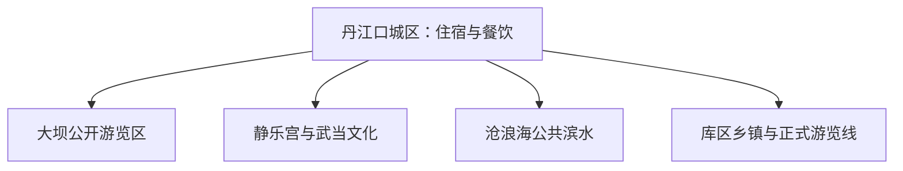

# 丹江口旅行指南

丹江口以汉江水库城市、水利工程展示和武当文化遗存为主线。城区适合看大坝公开游览区、沧浪海公共滨水和静乐宫；库区、乡镇与山地更适合按正式景区、客运和水源保护规则另排完整一天。

> 建议停留：2 天；加入库区或乡镇远线为 3 天<br>
> 旅行关键词：丹江口大坝、南水北调、静乐宫、沧浪海、汉江、库区生态<br>
> 主要体力：城区低至中等；工程展区台阶、码头和远线为中等<br>
> 最近研究：2026-08-13

## 城市速览

| 项目 | 旅行信息 |
|---|---|
| 主要旅行价值 | 用一座水库城市理解丹江口水利枢纽、移民史、武当文化与汉江生态 |
| 建议停留 | 1 天看城区核心；2 天增加静乐宫与滨水；3 天选择一条正式库区远线 |
| 较舒适季节 | 春秋更适合滨水和工程区步行；夏季高温强对流，冬季临水风寒明显 |
| 预算特点 | 城区为中等预算，景区接驳、库区游船或远线车辆增加支出 |
| 步行强度 | 城区可分段安排，大坝展区、古建和码头可能有台阶 |
| 主要天气风险 | 暴雨、汉江水位变化、泄洪调度、高温、冬季雾和临水结冰 |
| 独行旅行 | 城区容易形成闭环；库区项目选有明确运营方与返程的产品 |
| 亲子旅行 | 水利科普适合亲子，临水和船舶活动需全程遵守护栏、救生和年龄规则 |
| 长者与低体力旅行 | 大坝、静乐宫与滨水分时安排，减少同日多次上下车和台阶 |
| 无障碍信息 | 城区新建公共空间较易调整；古建、工程展区和码头资料有限，设施连续性需向官方确认 |

## 城市格局与游览区域

丹江口市是十堰市代管的县级市，法定代码 **420381**。固定 GeoNames `1813828` 是丹江口主城居民点，薄实体 `Q28799760` 与该点相连；法定市域实体 `Q1164197` 的 P1566 指向行政记录 `1813827`。本页以固定城市点作为队列键，以法定实体和代码确定市域边界。



| 区域 | 主要内容 | 游览特点 | 与其他区域的关系 |
|---|---|---|---|
| 城区—大坝片区 | 水利枢纽公开游览、城市生活 | 工程科普优先，入口和安检动态核对 | 与生产管理区边界清晰 |
| 静乐宫片区 | 武当道教建筑、移建文物与园林 | 古建步行，适合半日 | 可与城区同日组合 |
| 沧浪海与汉江公共滨水 | 城市滨水、正式码头和休闲空间 | 适合傍晚，受水位与运营影响 | 与取水口、航道和非开放岸线分开 |
| 库区乡镇方向 | 规范景区、乡村与经批准的水上项目 | 往返时间长，适合完整日 | 先定入口与返程，再选择住宿 |

## 主要景点

### 城区、水利与武当文化

| 景点 | 区域 | 类型 | 主要看点 | 建议用时 | 室内外 | 体力 | 预约风险 | 天气影响 | 优先级 |
|---|---|---|---|---:|---|---|---|---|---|
| 丹江口大坝及公开游览区 | 城区北部 | 水利工程、科普 | 枢纽工程、坝体公开视角与南水北调背景 | 3–5 小时 | 混合 | 中 | 高 | 高 | A |
| 静乐宫 | 城区 | 古建、武当文化 | 移建后的宫观建筑、石牌坊与当期展陈 | 2–3 小时 | 混合 | 低至中 | 中 | 中 | A |
| 沧浪海旅游港及公共滨水 | 城区汉江岸 | 滨水、码头 | 经允许的亲水空间、城市水景和正式运营船线 | 2–4 小时 | 室外 | 低至中 | 高 | 高 | B |
| 丹江口市博物馆或当期公共展馆 | 城区 | 博物馆 | 地方史、移民与工程文化展陈 | 1.5–3 小时 | 室内 | 低 | 中 | 低 | B |

### 库区与乡镇方向

| 景点 | 区域 | 类型 | 主要看点 | 建议用时 | 室内外 | 体力 | 预约风险 | 天气影响 | 优先级 |
|---|---|---|---|---:|---|---|---|---|---|
| 太极峡等正式山水景区 | 市域乡镇 | 山水、峡谷 | 运营范围内的峡谷步道与山水景观 | 1 天 | 室外 | 中至高 | 高 | 极高 | C |
| 官山等武当文化乡村接待点 | 南部乡镇 | 古村、山地文化 | 有明确接待与道路条件的村落和文化节点 | 1 天 | 室外为主 | 中 | 高 | 高 | C |
| 库区正式游船或观景项目 | 丹江口水库 | 水上游览 | 持证航线、码头与当日允许的观景水域 | 半天至 1 天 | 室外 | 中 | 高 | 极高 | C |

大坝旅游区只使用游客入口和公开展区；枢纽控制区、闸室、泄洪设施、取水设施、航道和生产码头按工程与水源管理规定执行。水库岸线以正式码头、公共滨水和标明开放的景区为选择范围。

## 美食与餐饮

| 菜品或餐饮类型 | 常见区域 | 一个人用餐与常见份量 | 风味、过敏原与饮食限制 | 排队风险与替代方法 |
|---|---|---|---|---|
| 丹江口鱼菜 | 城区正规餐馆 | 整鱼多适合分享，一人可问鱼块或小份 | 有鱼刺和水产过敏风险，酱汁可能含大豆、小麦 | 选择明码标价、来源可说明的养殖鱼 |
| 汉江家常菜 | 城区 | 小炒与主食可单点 | 腌制、辣味和动物油使用因店而异 | 热门临水店满位时回城区普通餐馆 |
| 武当山珍与菌菇类菜肴 | 城区和正规餐馆 | 多人拼盘较常见 | 野生菌辨识和加工风险高，优先正规供应链与彻底加热 | 改点常见人工栽培菌菇 |
| 米面早餐 | 城区生活街区 | 一碗适合独食 | 汤底、花生、大豆和辣椒需逐项询问 | 早高峰可换同类早餐店 |

## 经典行程

```mermaid
flowchart TD
    S["先看水位与开放公告"] --> A{ "大坝公开区开放" }
    A -->|是| D["大坝科普为当日主项目"]
    A -->|调整| C["静乐宫与城区展馆"]
    D --> E["傍晚沧浪海短段"]
    C --> E
    E --> F{ "是否再有一天" }
    F -->|是| R["选择一条正式库区远线"]
    F -->|否| X["城区返程"]
```

### 一日经典路线

**路线**：城区 → 丹江口大坝公开游览区 → 城区午餐 → 静乐宫或沧浪海公共滨水

- **串联逻辑**：先锁定最受开放条件影响的大坝，再以城区项目收尾。
- **预约锚点**：大坝入口、安检、静乐宫开放、滨水或船线运营。
- **休息安排**：午间回城区坐席用餐，傍晚只安排低强度短段。
- **时间不足时**：保留大坝和一顿城区正餐，取消第二个景点。

### 两日城市路线

**第 1 天**：大坝公开游览区 → 城区住宿；**第 2 天**：静乐宫 → 城区展馆 → 沧浪海短段。

- **串联逻辑**：水利工程和武当文化分日，第二天保持可调节的城区节奏。
- **预约锚点**：大坝、静乐宫、展馆闭馆日和住宿。
- **休息安排**：两天都在城区安排午休，减少临水持续暴晒。
- **时间不足时**：第二天只留静乐宫。

### 三日深度路线

**第 1 天**：大坝；**第 2 天**：静乐宫与城区；**第 3 天**：一条已确认开放的库区或乡镇远线。

- **串联逻辑**：前两天完成城市核心，最后一天根据天气与道路选择山水或水上项目。
- **预约锚点**：远线运营方、码头、车辆、气象和水位公告。
- **休息安排**：远线中午在正式服务点停留，日落前返回城区。
- **时间不足时**：整段删去第 3 天，不压缩成赶路半日。

### 雨天路线

**路线**：城区博物馆或文化馆 → 午餐 → 静乐宫在确认开放且雨势温和时短游

- **适用条件**：普通降雨可用；暴雨、泄洪或地灾预警时留在安全城区空间。
- **预约锚点**：场馆公告、道路积水、汉江水情和公交运行。
- **休息安排**：每 60–90 分钟坐下休息，住宿与场馆之间用车辆短接。
- **时间不足时**：只留一处室内场馆。

### 亲子或低体力路线

**亲子路线**：大坝科普公开区 → 城区午餐 → 博物馆<br>
**低体力路线**：静乐宫可达部分 → 城区午休 → 沧浪海平缓公共短段

- **减负方式**：亲子线以科普和室内展陈为主；低体力线控制台阶、上下船和长距离岸线。
- **预约锚点**：儿童安检与讲解、场馆电梯、静乐宫入口和滨水上下客点。
- **休息安排**：午间回住宿区，傍晚项目可随时结束。
- **时间不足时**：两条路线均保留首个核心项目。

### 远郊一日路线

**路线**：城区 → 一处正式山水景区或持证库区游览项目 → 城区

- **适用条件**：道路、码头、天气、水位和运营信息形成闭环；山地与水上二选一。
- **预约锚点**：运营方、车辆资质、船舶航线、森林防火和返程。
- **休息安排**：使用正式游客中心和固定卫生间，预留返城缓冲。
- **时间不足时**：整段改为城区展馆与滨水短段。

## 住宿区域

| 区域 | 优点 | 缺点 | 适合人群 | 交通特点 |
|---|---|---|---|---|
| 丹江口城区 | 餐饮、公交和多方向接驳最稳定 | 到远郊景区仍需较长车辆段 | 首访、无车、亲子与低体力旅行者 | 适合连续两晚 |
| 大坝或沧浪海附近城区住宿 | 靠近核心景观和滨水 | 节假日价格与噪声波动较大 | 水利主题、短住者 | 核清具体入口与步行距离 |
| 正式库区度假住宿 | 减少远线当天往返 | 餐饮、医疗和退改条件依运营方 | 自驾、休闲度假者 | 先确认道路、停车与夜间前台 |

## 市内交通

| 场景 | 建议与取舍 | 行前需要重查的内容 |
|---|---|---|
| 铁路抵达 | 丹江口站、丹江口南站等名称和停站需按实际车票核对，抵达后仍需地面接驳 | 12306 站名、停站、公交与夜间到达 |
| 城区到大坝和静乐宫 | 公交、出租或网约车可组合，景区上下客点以公告为准 | 施工、安检、公交改线与停车 |
| 库区与乡镇 | 选择县域客运、景区接驳或正规预约车辆 | 班次、返程、司机资质、山路与水位 |
| 水上交通 | 只使用持证运营、当日允许载客的码头与船舶 | 航线、救生衣、儿童和行动障碍规则 |

## 不同旅行者须知

| 旅行维度 | 可行条件 | 主要取舍 | 需额外核对 |
|---|---|---|---|
| 独行旅行 | 城区住宿和公共交通易组合 | 远线要提前锁定返程 | 末班与运营方联系方式 |
| 亲子旅行 | 水利科普和博物馆可形成主题日 | 临水、安检和船舶增加照看要求 | 年龄、救生衣、推车与卫生间 |
| 长者或低体力旅行 | 每天一个主项目并回城区午休 | 大坝、古建和码头仍可能有台阶 | 电梯、接驳与入口位置 |
| 无障碍需求 | 优先城区新建公共空间 | 工程区、古建和船舶连续动线资料不足 | 设施连续性需向官方确认 |
| 摄影旅行 | 大坝公开视角和城市滨水适合定点拍摄 | 无人机、三脚架和工程设施拍摄规则严格 | 现场标识和管理方许可 |
| 特殊天气 | 城区室内项目可替代 | 泄洪、暴雨和水位变化直接影响临水路线 | 水利、气象与景区公告 |

## 行前核对

| 核对事项 | 为什么需要重查 | 建议核对时间 | 官方入口 |
|---|---|---|---|
| 大坝公开游览 | 工程调度、安检与维修会改变游客范围 | 购票前和到访前一日 | [丹江口市人民政府](https://www.djk.gov.cn/) |
| 库区水位与船线 | 水位、风浪与调度影响码头和航线 | 出发前三日及当天 | [长江水利委员会](https://www.cjw.gov.cn/) |
| 铁路与县域交通 | 站名、停站和末班会变化 | 出发前一周及当天 | [中国铁路 12306](https://www.12306.cn/) |
| 天气与地灾 | 暴雨和雾影响山路、临水与船舶 | 出发前三日及当天 | [湖北省气象局](http://hb.cma.gov.cn/) |

## 来源与更新记录

### 主要来源

| 来源 | 类型 | 支持内容 | 核验日期 |
|---|---|---|---|
| [丹江口市人民政府](https://www.djk.gov.cn/) | 市政府 | 城市公告、工程旅游、交通与属地动态入口 | 2026-08-13 |
| [十堰市人民政府](https://www.shiyan.gov.cn/) | 地级市政府 | 丹江口市与十堰市域关系、区域交通和文旅入口 | 2026-08-13 |
| [长江水利委员会](https://www.cjw.gov.cn/) | 流域管理机构 | 丹江口水利枢纽、水情和工程管理背景 | 2026-08-13 |
| [湖北省南水北调工程管理局](https://nsbd.hubei.gov.cn/) | 省级工程机构 | 南水北调中线水源与保护管理背景 | 2026-08-13 |
| [民政部行政区划查询](https://dmfw.mca.gov.cn/xzqh/getList?code=42&trimCode=true&maxLevel=3) | 政府开放接口 | 丹江口市代码 `420381` 与十堰代管关系 | 2026-08-13 |
| [GeoNames 1813828](https://www.geonames.org/1813828/danjiangkou.html) | 开放地理数据 | 固定主城居民点坐标与 PPL 分类 | 2026-08-13 |
| [Wikidata Q1164197](https://www.wikidata.org/wiki/Q1164197) | 开放知识图谱 | 法定丹江口市实体、代码和行政 GeoNames 记录 | 2026-08-13 |
| [中国铁路 12306](https://www.12306.cn/) | 铁路运营方 | 当前车站、列车与售票核对入口 | 2026-08-13 |

### 更新记录

| 日期 | 更新内容 |
|---|---|
| 2026-08-13 | 首次完成丹江口独立旅行研究；从十堰父页迁入水利工程、住宿、交通和完整路线所有权。 |
