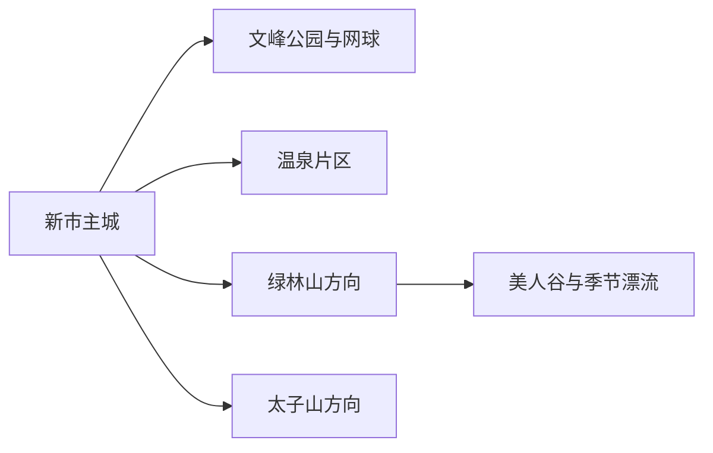
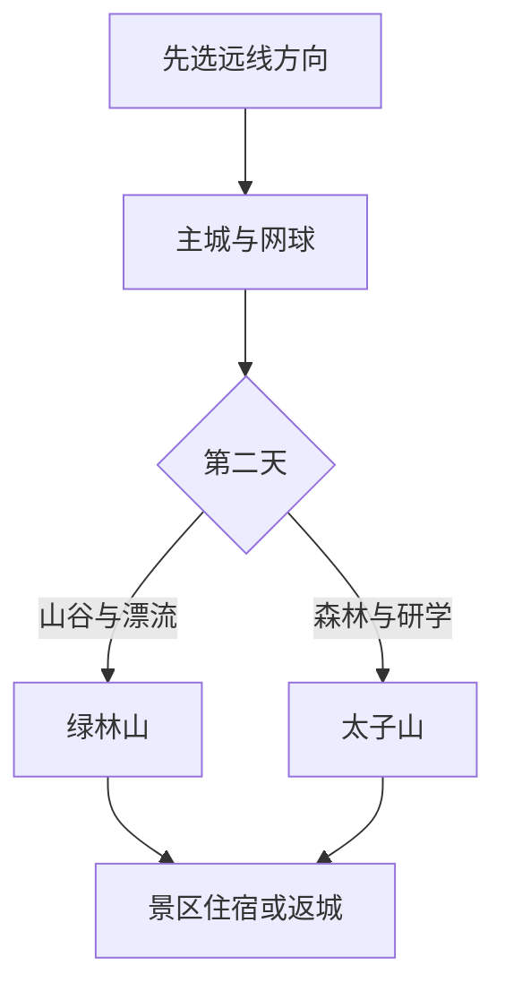

# 京山旅行指南

京山适合把一座“网球城市”和两条山林远线分开体验：主城用文峰公园、公共文化与温泉恢复体力，北部绿林山看山谷、洞穴与季节漂流，西南太子山看森林和研学项目。景区之间距离不短，先选一个远线方向，再决定住主城还是景区附近，行程会更从容。

> 建议停留：2–3 天 
> 旅行关键词：网球、绿林山、美人谷、太子山、温泉、山林 
> 主要体力：主城低至中等；山地与漂流中至较高 
> 最近研究：2026-08-13

## 城市速览

| 项目 | 旅行信息 |
|---|---|
| 主要旅行价值 | 在主城体验网球与温泉，再在绿林山、太子山两个方向中选择山林活动 |
| 建议停留 | 2 天覆盖主城和一条远线；3 天可分别安排绿林山与太子山 |
| 较舒适季节 | 春秋适合山林与步行；夏季漂流和避暑受水情、雷雨影响；冬季以温泉和室内活动为主 |
| 预算特点 | 主城中等；景区门票、漂流、温泉、车辆与景区住宿增加预算 |
| 步行强度 | 主城低；峡谷、洞穴和森林步道中至高 |
| 主要天气风险 | 暴雨、山洪、雷电、高温、道路落石、森林火险与冬季湿滑 |
| 独行旅行 | 主城方便；远线优先景区直通、正规包车或住景区 |
| 亲子旅行 | 网球体验、太子山研学和京山农场较合适，漂流按年龄身高选择 |
| 长者与低体力旅行 | 主城公园、温泉和车辆可达的森林短段更轻松 |
| 无障碍信息 | 主城现代设施可咨询；山谷、洞穴和森林设施连续性需向官方确认 |

## 城市格局与游览区域

京山市是荆门市代管的县级市，法定代码 `420882`。固定 GeoNames `1788638` 是旧名 `Xinshi` 的主城居民点，连接薄地点实体 `Q28795489`；法定京山市采用 Wikidata `Q1199327`，其 `P1566=1805591` 指向另一行政记录。页面以固定点承接人口窗口，以法定代码确定市域边界。

| 区域 | 主要内容 | 怎么安排 | 与其他区域的关系 |
|---|---|---|---|
| 新市主城 | 文峰公园、网球、公共文化与餐饮住宿 | 抵达日或一日 | 多日旅行基地 |
| 温泉片区 | 正式温泉度假与休息 | 半日至一晚 | 可接主城，不与两条山线赶场 |
| 绿林山方向 | 绿林寨、美人谷、空山洞、鸳鸯溪等景区模块 | 一日至两日 | 项目分散，按套票与开放组合 |
| 太子山方向 | 森林、石仓雨林、科普研学 | 一日 | 与主城公路往返，适合亲子与森林主题 |
| 京山农场及乡村方向 | 农文旅、马术或季节活动 | 半日至一日 | 只选已公布接待项目 |

## 主要景点

### 主城、网球与温泉

| 景点 | 区域 | 类型 | 主要看点 | 建议用时 | 室内外 | 体力 | 预约风险 | 天气影响 | 优先级 |
|---|---|---|---|---:|---|---|---|---|---|
| 文峰公园与网球场地 | 主城 | 城市公园与运动 | 网球城市氛围、公共绿地与日常生活 | 1–3 小时 | 室外为主 | 低至中 | 高 | 高 | A |
| 京山市公共文化场馆 | 主城 | 文博与文化 | 地方历史、非遗与当期展览 | 1–2 小时 | 室内 | 低 | 中 | 低 | B |
| 天沐温泉等正式温泉项目 | 温泉片区 | 温泉度假 | 泡池、休息与山地行程后的恢复 | 半日 | 混合 | 低 | 高 | 低 | B |
| 京山农场正式接待项目 | 杨集方向 | 农文旅 | 农业、马术、酒窖或季节活动 | 半日至一日 | 混合 | 中 | 很高 | 高 | B |

### 绿林山与太子山

| 景点 | 区域 | 类型 | 主要看点 | 建议用时 | 室内外 | 体力 | 预约风险 | 天气影响 | 优先级 |
|---|---|---|---|---:|---|---|---|---|---|
| 绿林山风景区完整父景区 | 绿林镇 | 山林综合景区 | 绿林寨、美人谷、洞穴与山水项目按开放选择 | 1–2 天 | 室外为主 | 中至高 | 高 | 很高 | A |
| 美人谷开放游线 | 绿林山内 | 峡谷 | 瀑布、溪谷和山林步道，作为父景区子线路 | 3–5 小时 | 室外 | 高 | 高 | 很高 | 路线节点 |
| 空山洞开放游线 | 绿林山方向 | 洞穴地质 | 溶洞景观与地下步道，作为父景区子线路 | 2–3 小时 | 混合 | 中 | 高 | 中 | 路线节点 |
| 鸳鸯溪漂流 | 绿林山方向 | 季节水上项目 | 正式漂流河段与山谷水景 | 半日 | 室外 | 中至高 | 很高 | 很高 | B |
| 太子山生态旅游区 | 石龙镇方向 | 森林与研学 | 森林、石仓雨林、洞穴和科普项目 | 半日至一日 | 室外为主 | 中 | 高 | 高 | A |
| 京山网球训练基地当期活动 | 主城 | 体育体验 | 预约打球、赛事观赛与城市体育文化 | 1–3 小时 | 混合 | 中 | 很高 | 中 | B |

绿林山按一个完整父景区记录，美人谷、空山洞和漂流用于解释内部取舍，不重复计算成多个独立景区。漂流和洞穴先核年龄、身高、救生、降雨与临时停运；森林区域沿开放步道活动，防火或强对流预警时改走主城线。

## 美食与餐饮

京山饮食兼有湖北家常、米食和山林乡镇风味。主城更适合稳定用餐，景区附近则先确认营业、份量和返程。

| 菜品或餐饮类型 | 常见区域 | 一个人用餐与常见份量 | 风味、过敏原与饮食限制 | 排队风险与替代方法 |
|---|---|---|---|---|
| 京山桥米与米饭菜 | 主城、乡镇 | 单份主食适合一人 | 配菜可能含猪肉、大豆酱油和辣椒 | 购买看产地、等级与包装标识 |
| 财鱼、鱼糕等鱼菜 | 主城与景区餐饮 | 整鱼适合多人，鱼糕可小份 | 含鱼、蛋、淀粉，注意鱼刺 | 一人选鱼糕或小份鱼片 |
| 湖北蒸菜 | 主城家常菜馆 | 可按小份组合 | 可能含猪肉、米粉、豆豉与辣椒 | 避开宴席高峰，选普通蒸菜馆 |
| 山野菜与乡镇农家菜 | 绿林、太子山正式接待点 | 多为合餐 | 菌菇和野菜来源、熟度需确认 | 只在正规餐饮点用餐 |
| 米酒、葛粉等地方食品 | 主城正规商店 | 适合小包装 | 米酒含酒精，葛粉制品可能加糖 | 看配料、生产者和保质期 |

## 经典行程

### 一日经典路线

**路线**：主城公共文化场馆 → 午餐 → 文峰公园 → 预约网球体验或温泉

- **串联逻辑**：先用主城活动认识京山，再用运动或温泉完成轻松半日。
- **预约锚点**：网球场、温泉或场馆。
- **休息安排**：主城午餐，下午在公园或温泉休息。
- **时间不足时**：保留文峰公园和一项预约活动。

### 两日城市路线

**第 1 天**：主城—网球—温泉。 
**第 2 天**：绿林山或太子山整日。

- **串联逻辑**：第一天低强度，第二天只走一条山林方向。
- **预约锚点**：第二天景区、车辆及具体项目。
- **休息安排**：住主城或第二天目标景区附近。
- **时间不足时**：删去温泉或取消第二天远线。

### 三日深度路线

**第 1 天**：主城与网球。 
**第 2 天**：绿林山完整一日。 
**第 3 天**：太子山或京山农场。

- **串联逻辑**：把两个远线分日，第三天按亲子、体力和天气选择。
- **预约锚点**：绿林山内部项目、太子山/农场接待和车辆。
- **休息安排**：山线中午使用游客中心或正式餐饮点。
- **时间不足时**：先删第三天。

### 雨天路线

**路线**：公共文化场馆 → 主城午餐 → 正式温泉项目

- **适用条件**：普通降雨且市区道路正常；暴雨、山洪或雷电预警时留在主城。
- **预约锚点**：场馆和温泉营业。
- **休息安排**：室内场馆与温泉休息区。
- **时间不足时**：只保留场馆或温泉一项。

### 亲子或低体力路线

**亲子路线**：太子山正式研学项目 → 午餐 → 主城公园或网球体验。 
**低体力路线**：车辆到公共文化场馆 → 午休 → 文峰公园平缓短段 → 温泉。

- **减负方式**：亲子线用研学替代漂流和长峡谷；低体力线用车辆、平缓短段与温泉减少台阶。
- **预约锚点**：研学年龄、网球场、温泉和无障碍入口。
- **休息安排**：太子山游客服务点或主城餐饮区。
- **时间不足时**：两类路线都保留一项室内活动和午餐。

### 远郊一日路线

**路线**：主城 → 绿林山或太子山二选一 → 正式服务点午餐 → 返回

- **适用条件**：天气、开放项目、车辆和返程均确认。
- **预约锚点**：景区票务、漂流/洞穴/研学项目。
- **休息安排**：游客中心、景区餐饮或已预约住宿。
- **时间不足时**：远线整段改为主城—温泉线。

## 住宿区域

| 区域 | 优点 | 缺点 | 适合人群 | 交通特点 |
|---|---|---|---|---|
| 京山主城 | 餐饮、车站、网球和温泉选择集中 | 到绿林山、太子山仍需较长公路移动 | 首访、公共交通和多日旅行 | 适合作为两条远线共同基地 |
| 绿林山景区周边 | 便于安排完整父景区和早晚活动 | 运营季、餐饮和返程依赖景区 | 峡谷、洞穴、漂流主题旅行 | 先核景区内部交通 |
| 太子山或农场正式住宿 | 靠近森林、研学或农文旅项目 | 替代活动和夜间服务较少 | 亲子、团队、已预约活动者 | 自驾或正规车辆更合适 |

## 市内交通

| 场景 | 建议与取舍 | 行前需要重查的内容 |
|---|---|---|
| 铁路抵达 | 京山南站等铁路门户与主城、景区仍需接驳 | 车次、站前大巴、上客点和末班 |
| 主城移动 | 公交、出租和网约车连接车站、文峰公园与温泉 | 线路、运营时段与赛事交通 |
| 绿林山、太子山 | 自驾、景区直通或正规包车更适合整日行程 | 山路、接驳、停车与返程 |
| 漂流与洞穴 | 按具体景区入口抵达，不用泛称“绿林山”替代入口 | 项目集合点、装备、寄存和停运 |

## 不同旅行者须知

| 旅行维度 | 可行条件 | 主要取舍 | 需额外核对 |
|---|---|---|---|
| 独行旅行 | 主城便利 | 山线车辆和住宿成本较高 | 景区直通、返程和夜间接驳 |
| 亲子旅行 | 网球、太子山研学、农场项目 | 漂流、洞穴按年龄与体力选择 | 年龄、身高、救生和卫生间 |
| 长者或低体力旅行 | 主城公园、温泉、车辆短线 | 峡谷、洞穴台阶较多 | 落客点、电梯、座椅与泡池规则 |
| 无障碍需求 | 现代场馆与度假设施可咨询 | 山林连续通行资料有限 | 设施连续性需向官方确认 |
| 山水活动 | 正式开放、天气稳定 | 雷雨和涨水会改变线路 | 水情、山洪、火险和保险 |
| 摄影旅行 | 公园、森林开放点与赛事公共区 | 无人机和赛事摄影受管理 | 飞行、器材和商业拍摄规则 |

## 行前核对

| 核对事项 | 为什么需要重查 | 建议核对时间 | 官方入口 |
|---|---|---|---|
| 绿林山内部项目 | 漂流、洞穴和步道按季节开放 | 订房前及到访前一日 | [湖北省文化和旅游厅](https://wlt.hubei.gov.cn/) |
| 太子山与农场 | 研学、活动和接待日期变化 | 排入路线前 | [京山市人民政府](http://www.jingshan.gov.cn/) |
| 铁路与接驳 | 新站接驳和车次会调整 | 出发前一周及当天 | [中国铁路 12306](https://www.12306.cn/) |
| 山洪与天气 | 强降雨影响峡谷、漂流和山路 | 出发前三日及当天 | [湖北省气象局](http://hb.cma.gov.cn/) |
| 森林火险 | 防火期可能调整户外项目 | 秋冬春季出发前 | [湖北省林业局](https://lyj.hubei.gov.cn/) |

## 来源与更新记录

### 主要来源

| 来源 | 类型 | 支持内容 | 核验日期 |
|---|---|---|---|
| [湖北文旅：京山高铁文旅推介](https://wlt.hubei.gov.cn/bmdt/mtjj/202512/t20251226_5842536.shtml) | 省级文旅部门 | 京山南站接驳、网球、温泉、绿林山、太子山与农场 | 2026-08-13 |
| [湖北文旅：太子山生态旅游区](https://wlt.hubei.gov.cn/bmdt/ztzl/mzyj/202308/t20230823_4808730.shtml) | 省级文旅部门 | 太子山位置、森林与开放项目 | 2026-08-13 |
| [湖北文旅：京山文旅与文物保护调研](https://wlt.hubei.gov.cn/bmdt/dtyw/202308/t20230811_4793095.shtml) | 省级文旅部门 | 绿林山、京山农场与安全管理 | 2026-08-13 |
| [湖北文旅：京山漂流资料](https://wlt.hubei.gov.cn/bmdt/mtjj/202208/t20220810_4256164.shtml) | 省级文旅部门 | 鸳鸯溪漂流与季节水上项目 | 2026-08-13 |
| [GeoNames 1788638](https://www.geonames.org/1788638/) | 开放地名库 | 固定新市居民点记录 | 2026-08-13 |
| [Wikidata Q1199327](https://www.wikidata.org/wiki/Q1199327) | 开放知识库 | 法定京山市实体与行政记录粒度 | 2026-08-13 |

### 更新记录

| 日期 | 更新内容 |
|---|---|
| 2026-08-13 | 首次建立京山独立指南；把主城网球与温泉、绿林山、太子山分为三类选择，并明确峡谷漂流、森林防火和固定居民点与法定市域的粒度差异。 |
