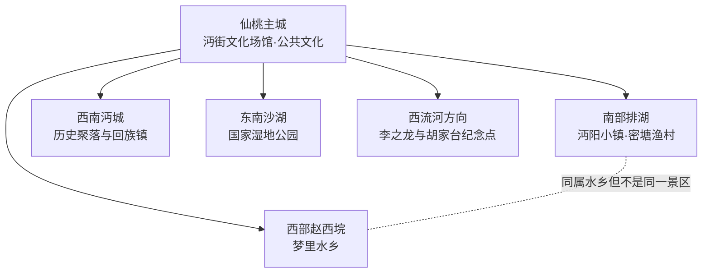
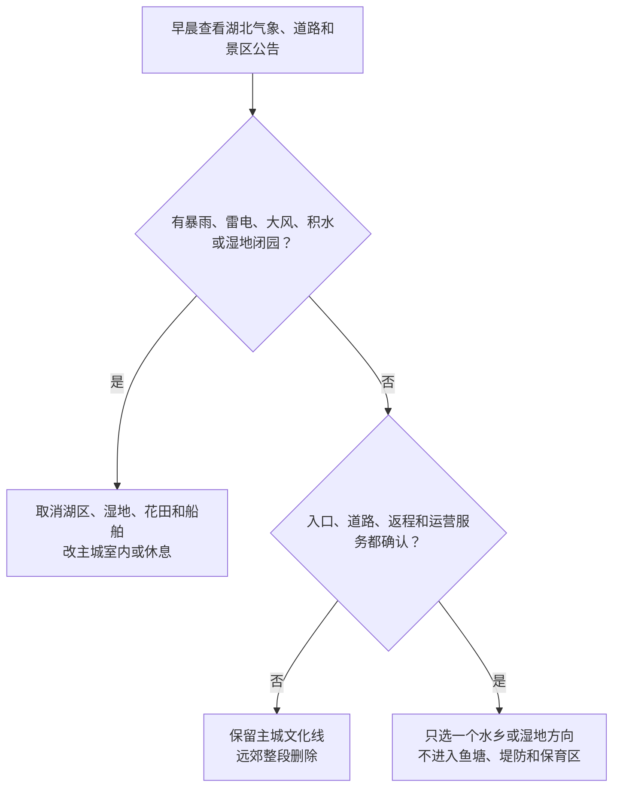

# 仙桃旅行指南

仙桃古称沔阳，是湖北省直辖的县级市，不属于武汉或荆州。旅行空间以干河—龙华山—沙嘴—杜湖主城为服务基点，向南进入排湖的沔阳小镇与密塘渔村，向西到梦里水乡，向西南到沔城，向东南到沙湖国家湿地公园。江汉平原道路看似平直，但湖区、湿地、养殖区和分散乡镇之间并非连续步行空间；首次到访宜用一日看主城文化，再为一个水乡或湿地方向单独留日。

> 建议停留：2–4 天；主城 1 天，每个湖区、湿地或远郊方向另留完整 1 天 
> 旅行关键词：沔阳文脉、江汉水乡、排湖、湿地、黄鳝、沔阳三蒸 
> 主要体力：低至中等；地形较平，但园区尺度、日晒、桥面和水上活动会增加负担 
> 最近研究：2026-08-12

## 城市速览

| 项目 | 旅行信息 |
|---|---|
| 主要旅行价值 | 在主城文化场馆认识沔阳历史与地方人物，在排湖、梦里水乡、沔城和沙湖分别体验不同的水乡、民俗、森林湿地与历史聚落，再以沔阳三蒸、黄鳝和江汉平原物产连接日常饮食 |
| 建议停留 | 1 天完成主城文化与一段城市公共空间；2 天增加排湖或梦里水乡；3–4 天再选沔城、沙湖湿地或西流河纪念方向 |
| 较舒适季节 | 春秋通常更适合长距离户外；夏季炎热潮湿、雷暴和强降雨多，冬季可能出现湿冷、雨雪和道路结冰 |
| 预算特点 | 整体低至中等；主城公共文化成本较低，主要变量是远郊车辆、经营景区票务、船舶和季节活动 |
| 步行强度 | 主城和湿地地形多平缓，但景区面积大、遮阴不连续；老建筑、桥梁、堤路和上下船仍可能有台阶 |
| 主要天气风险 | 高温高湿、雷电、短时强降雨、城市积水、湖区大风与低能见度；冬季湿冷、雨雪和桥面结冰 |
| 独行旅行 | 主城一人餐和叫车较方便；远郊必须先锁定入口、返程和运营车辆，不依赖临时揽客船或陌生拼车 |
| 亲子旅行 | 城市文化场馆和有完整服务的水乡景区可按年龄选择；临水、桥面、游船、鱼塘和湿地需持续看护 |
| 长者与低体力旅行 | 主城公共文化和排湖正式服务区的短线较适合；每半天一个核心，以车辆跨片区，不把大型园区当作轻松散步 |
| 无障碍信息 | 官方公开资料不足以证明各景区从停车、入口到卫生间、桥面、旧建筑和船舶连续无障碍；必须逐点询问运营方 |

## 城市格局与游览区域

仙桃法定行政代码为 `429004`，现有 4 个街道、15 个镇、2 个原种场和 1 个省级旅游度假区。1986 年撤县设市，1994 年实行省直管；“武汉都市圈”或铁路通达是区域联系，不改变仙桃独立的法定城市、住宿和旅行边界。

| 区域 | 主要内容 | 游览特点 | 与其他区域的关系 |
|---|---|---|---|
| 干河—龙华山—沙嘴—杜湖主城 | 沔街文化场馆、群众艺术馆、城市餐饮与住宿 | 是铁路抵离、住宿和天气备选基点，片区间仍需公交或叫车 | 不把仙桃站、仙桃西站与各远郊入口按连续步行理解 |
| 排湖省级旅游度假区 | 沔阳小镇、密塘渔村及正式开放的湖区公共空间 | 南部完整一日；沔阳小镇内部街区、湖面和演艺按一个项目 | 与生产鱼塘、堤防、水利设施和非运营水域严格分开 |
| 赵西垸—梦里水乡方向 | 梦里水乡文化旅游区 | 西向森林、湿地和农旅综合景区，面积较大 | 与排湖不是同一园区；同日往返会压缩游览和返程 |
| 沔城方向 | 沔城风景名胜区、历史与宗教文化空间 | 西南乡镇日，旧迹开放、礼仪、餐饮与接驳逐点核对 | 沔城是回族镇，但不能推定全镇所有餐饮都经清真认证 |
| 沙湖方向 | 沙湖国家湿地公园及当日开放科普游线 | 东南湿地日，受鸟类保护、天气、水位和道路影响 | 湿地保护范围不等于全域游客公园，只进入正式开放区 |
| 西流河方向 | 李之龙纪念馆、胡家台抗战遗址等纪念点 | 乡村纪念主题，点位分散、接待和开放波动大 | 单独安排车辆与返程，不与梦里水乡按“都在远郊”硬拼 |

仙桃湖泊、湿地、鱼塘和堤网兼有生态保护、防洪与水产生产功能。景区、村庄公共空间、养殖基地和水利设施必须分开：只能进入正式游客中心、开放步道、运营街区和持证船舶，不跨鱼塘、堤防、闸站、泵站、行洪区或保护区寻找近路。

## 主要景点

优先级用于安排时间：**A** 为首访核心，**B** 为按兴趣补充，**C** 为远郊、季节性或通常需要独立半天以上的目的地。同一景区或度假区内部街区、花田、演艺、码头和小景只计一个项目；季节花期和临时活动不能替代稳定开放核对。

### 主城与排湖

| 景点 | 区域 | 类型 | 主要看点 | 建议用时 | 室内外 | 体力 | 预约风险 | 天气影响 | 优先级 |
|---|---|---|---|---:|---|---|---|---|---|
| 沔阳小镇 | 排湖度假区 | 水乡文化旅游区 | 排湖水乡空间、沔阳文化街区和当日开放演艺；内部湖面、街区和项目按一个整体 | 5–7 小时，另计往返 | 室内外混合 | 中 | 高 | 高 | A |
| 排湖密塘渔村 | 排湖方向 | 湖区村落、渔业文化 | 正式旅游村范围内的水乡景观与渔业生活展示；不进入生产鱼塘和非运营水域 | 3–5 小时，另计往返 | 室外为主 | 中 | 高 | 高 | B |
| 陈友谅纪念馆与沔阳名人馆文化组团 | 沔街方向 | 纪念馆、地方人物展陈 | 两座独立场馆集中于同一城市文化片区，可按开放情况组合但不混作同馆 | 2–4 小时 | 室内 | 低 | 中至高 | 低 | B |
| 仙桃市群众艺术馆 | 主城 | 公共文化场馆 | 地方群众文化、非遗或当期公益活动；具体展览和参与规则动态核对 | 1.5–3 小时 | 室内 | 低 | 中 | 低 | B |

### 水乡、湿地与远郊

| 景点 | 区域 | 类型 | 主要看点 | 建议用时 | 室内外 | 体力 | 预约风险 | 天气影响 | 优先级 |
|---|---|---|---|---:|---|---|---|---|---|
| 梦里水乡文化旅游区 | 赵西垸方向 | 森林湿地、农旅景区 | 森林、湿地、水乡和农耕主题的完整景区；内部节点统一游览 | 6–8 小时，另计往返 | 室外为主 | 中 | 高 | 高 | A |
| 沔城风景名胜区当日开放单元 | 沔城回族镇 | 历史聚落、宗教与水乡文化 | 沔阳历史、古迹和多元社区文化；只进入明确开放且符合礼仪要求的空间 | 4–6 小时，另计往返 | 室内外混合 | 中 | 高 | 高 | B |
| 沙湖国家湿地公园正式开放区 | 沙湖方向 | 国家湿地公园、生态科普 | 江汉平原复合湿地与鸟类栖息地；不进入保育区，不采集、投喂或干扰动物 | 5–7 小时，另计往返 | 室外 | 中 | 高 | 高 | B |
| 沔州百万花海当期开放区 | 乡村方向 | 季节花卉、农旅景区 | 当季花田和农业景观；花期、运营和开放面积变化快，生产田与游客区分开 | 3–5 小时，另计往返 | 室外 | 中 | 高 | 高 | C |
| 李之龙纪念馆（故居） | 西流河镇杜窑村 | 纪念馆、故居 | 李之龙生平与地方革命史；远郊小型场馆的开门、讲解和团体接待须确认 | 2–3 小时，另计往返 | 室内外混合 | 低至中 | 高 | 中 | C |
| 胡家台抗战遗址当期开放范围 | 西流河镇方向 | 抗战遗址、纪念空间 | 地方抗战史与遗址群；只进入公布开放、无施工或保护围挡的区域 | 2–3 小时，另计往返 | 室外为主 | 中 | 高 | 高 | C |

## 美食与餐饮

仙桃饮食以沔阳三蒸、黄鳝、水产、米食和卤味较有辨识度。主城成熟生活区最适合一人份与菜单清楚的正餐；排湖、沔城、沙湖等远郊的餐饮营业和食材供应具有季节性，不能把活动报道中的宴席或单家名店当作日常保证。

| 菜品或餐饮类型 | 常见区域 | 一个人用餐与常见份量 | 风味、过敏原与饮食限制 | 排队风险与替代方法 |
|---|---|---|---|---|
| 沔阳三蒸 | 主城地方菜馆、正式宴席餐饮 | 通常适合多人共享；独行先问小份或单品蒸菜 | 米粉、猪肉、鱼、蔬菜、大豆和复合调味常见；具体“三蒸”组合并不固定 | 正餐高峰可能等位；选能说明份量与原料的普通地方菜馆 |
| 黄鳝菜与仙鳝狮子头 | 主城正规餐馆 | 黄鳝菜多为共享份，先问净肉、骨刺和小例 | 水产、猪肉、蛋、淀粉、大豆、芝麻和共用油锅可能存在 | 黄鳝节庆和品牌活动不代表常年供应；换当日食材与价格明示者 |
| 毛嘴卤鸡 | 主城熟食店、毛嘴方向正规餐饮 | 半份或斩件适合一至两人，外带需注意保存 | 鸡肉、酱油、糖、香辛料和可能的酒料；共用砧板需确认 | 热门时段售完；选择标签、储存条件和生产信息清楚的正规产品 |
| 沙湖盐蛋 | 正规餐馆、特产店 | 一枚适合佐餐，注意盐分，不作为完整一餐 | 蛋类和高盐；严重蛋过敏者避免，真空产品看标签与保质期 | 不追逐路边无标签产品，改买生产信息完整的包装食品 |
| 珍珠圆子 | 城区正餐馆 | 多为共享份，可询问小份 | 糯米、猪肉、蛋、大豆等常见；糯食和高脂对部分人不友好 | 宴席菜不一定随时供应；换同类蒸菜并确认现做时间 |

沔城为回族镇，应尊重宗教场所与社区生活；需要清真饮食时仍应查看具体餐厅标识、资质与操作条件，不能由地名推定。严重过敏、严格素食、无麸质或不食酒料者，应书面说明原料与交叉接触要求。

## 经典行程

### 一日经典路线

**路线**：沔街文化组团 → 主城午餐与坐休 → 仙桃市群众艺术馆或一处确认开放的公共文化场馆 → 城市公共空间短停

- **适用条件**：适合到达日、普通天气或不希望跑远郊的人，且所选场馆开放。
- **串联逻辑**：全天留在主城，以地方人物、沔阳文化与群众文化构成低换乘认识线。
- **预约锚点**：先确认陈友谅纪念馆、沔阳名人馆和群众艺术馆的开放日、入口与最晚入场。
- **休息安排**：午餐放在成熟生活区，两个馆之间至少完整坐休一次。
- **时间不足时**：只保留开放条件最明确的一处场馆，删除城市公共空间短停。

### 两日城市路线

**第 1 天**：主城文化组团与地方饮食 
**第 2 天**：仙桃城区 → 沔阳小镇 → 排湖正式服务区休息 → 仙桃城区

- **适用条件**：第二天景区、道路和返程交通均确认；强降雨、雷电或湖区大风时取消。
- **串联逻辑**：第一天建立沔阳历史线，第二天整段交给排湖水乡，不把另一座大型景区插入。
- **预约锚点**：第一天锁定场馆，第二天锁定沔阳小镇票务、演艺、停车或接驳与返程。
- **休息安排**：第二天午间使用正式游客服务区，不在鱼塘、堤防或非运营岸边野餐。
- **时间不足时**：第二天删除演艺或外围短段，但保留返程余量；若入口不明则整段取消。

### 三日深度路线

**第 1 天**：主城文化与餐饮 
**第 2 天**：排湖的沔阳小镇或密塘渔村二选一完整日 
**第 3 天**：梦里水乡、沔城或沙湖湿地三选一完整日

- **适用条件**：两个远郊日都有明确开放、正规交通和天气条件，且不连续安排超长户外。
- **串联逻辑**：主城、排湖、另一水乡或湿地方向分日处理；相似主题不代表景区互为内部节点。
- **预约锚点**：每天只锁定一个完整景区；沙湖还须确认湿地开放边界，沔城须确认具体古迹。
- **休息安排**：远郊日在游客中心或成熟乡镇餐饮完整坐休，随身补水但不进入生产区休息。
- **时间不足时**：删掉第三天或整个较远方向，不用跨鱼塘、堤路或夜间赶车换取“多看一个点”。

### 雨天路线

**路线**：主城一处确认开放的纪念馆 → 室内午餐与长休息 → 群众艺术馆或返回住宿地二选一

- **适用条件**：只适用于普通降雨且城市道路正常；暴雨、雷电、积水、湖区大风或道路结冰时缩成住宿地附近活动。
- **串联逻辑**：用主城室内场馆替代湿地、花田、游船、乡村道路和大尺度园区。
- **预约锚点**：先确认一个主馆；第二馆不作为必须完成项。
- **休息安排**：使用正规室内餐饮和馆内座椅，每次移动前重查预警与积水。
- **时间不足时**：删除第二馆；官方预警或闭园时不以车辆底盘高、雨量暂小作为继续远郊的依据。

### 亲子或低体力路线

**亲子路线**：沔街文化组团精选一馆 → 室内午餐与午休 → 沔阳小镇正式开放短线 
**低体力路线**：车辆直达一处主城公共文化场馆 → 核心展厅 → 长时间坐休 → 城市成熟餐饮区

- **适用条件**：亲子路线须确认沔阳小镇天气和儿童项目；低体力路线须逐点确认无台阶入口、卫生间和车辆落客。
- **串联逻辑**：亲子只加一个有完整服务的近郊景区；低体力路线不安排大型水乡、湿地、桥面或船舶。
- **预约锚点**：确认儿童证件、推车、寄存、活动年龄，以及无障碍停车、入口和卫生间。
- **休息安排**：午间完整休息；亲子下午只走可随时退出的短线。
- **时间不足时**：亲子删除近郊，只留主城；低体力路线只保留一个场馆。

### 远郊一日路线

**路线**：仙桃城区 → 梦里水乡正式入口 → 当日开放的森林湿地游线 → 仙桃城区

- **适用条件**：适合已确认票务、正规车辆和返程，并能承受长时间户外的人；强降雨、雷电或大风时不成行。
- **串联逻辑**：梦里水乡位于独立西向，园区和往返共同占用一日，不再加入排湖、沔城或沙湖。
- **预约锚点**：开放入口、票务、停车或接驳、返程、餐饮和天气同时确认。
- **休息安排**：只在正式服务设施休息，不进入林业、农业或湿地保育空间寻找近路。
- **时间不足时**：整段删除，改为主城文化线；不临时转去另一个未核实远郊点。

## 住宿区域

| 区域 | 优点 | 缺点 | 适合人群 | 交通特点 |
|---|---|---|---|---|
| 干河—龙华山成熟城区 | 餐饮、商店和日常交通集中，适合作为多方向基点 | 到仙桃站、仙桃西站和远郊都需另算车辆 | 首访、独行、预算优先或只住一处的人 | 订房时核对到具体车站和上客点，不按“市中心”标签估算 |
| 沙嘴—杜湖新区 | 城市公共服务和较新住宿选择相对集中 | 道路尺度大，部分文化点仍需叫车 | 亲子、低体力、偏好较新设施的人 | 适合连接仙桃站，去排湖和主城老片区仍需车辆 |
| 仙桃站周边 | 减少武仙城际早晚到发压力 | 站前不等于主要景点或成熟夜生活区 | 晚到、早班、短停或携带大件行李的人 | 先确认酒店接送、夜间餐饮和站前合规上客点 |
| 排湖或远郊正规住宿 | 可减少大型景区清晨往返，适合慢游 | 服务、餐饮、夜间交通和极端天气保障差异大 | 已锁定单一景区、自驾或合规包车者 | 必须按具体景区与入口订房，确认资质、消防和退改 |

需要无障碍客房、电梯、儿童床、安静房或深夜入住时，应直接向住宿方确认从道路落客点到客房的连续路线。远郊民宿和度假住宿还要核对合法经营、夜间道路、供餐、医疗距离与恶劣天气退改。

## 市内交通

仙桃有两个容易混淆的铁路门户：仙桃站服务武仙城际，较适合作为主城到发锚点；仙桃西站位于更西侧的汉宜铁路走廊，对部分西部方向可能更近，但不是“仙桃站”的西站房。购票和接驳必须按票面站名分别规划。仙桃未列入中国民用航空局当前运输机场名录，因此本页不把本地机场作为定期民航客运门户；定期客运变化以民航主管部门和航空公司公告为准，现阶段航空联程通常经武汉天河机场再转铁路或公路。

| 场景或枢纽 | 建议与取舍 | 行前需要重查的内容 |
|---|---|---|
| 仙桃站到达 | 适合主城和武仙城际到发，使用公交、出租或网约进入住宿区 | 票面站名、运行图、出站口、站前上客点、公交首末班 |
| 仙桃西站到达 | 适合汉宜铁路走廊和部分西部行程，仍需核算到主城与景区的地面时间 | 车次、站前接驳、夜间运力、到主城或梦里水乡的实际道路 |
| 武汉联程 | 铁路通常比临时公路拼车更可控，但不能把历史“约多少分钟”写成永久时刻 | 12306 当日车次、换乘站、退改、末班和武汉端接驳 |
| 主城跨片区 | 公交适合预算优先，合规叫车适合赶预约或携带行李 | 线路、站位、施工绕行、支付方式、恶劣天气运力 |
| 排湖、梦里水乡、沔城与沙湖 | 使用正规城乡客运、合规包车或自驾；每个方向单独核对返程 | 是否运营、发车点、末班、景区入口、停车、道路和船班 |
| 航空中转 | 仙桃未列入当前运输机场名录，本页不按本地定期客运规划；通常经武汉天河机场转铁路或公路 | 民航主管部门与航司公告、航班、机场地面交通、跨城衔接、行李与夜间退改 |
| 自驾 | 对分散湖区更灵活，但堤路、积水、雾和活动管制会抵消便利 | 道路施工、积水、桥面结冰、停车、充电、景区预约和防汛管制 |

## 不同旅行者须知

| 旅行维度 | 可行条件 | 主要取舍 | 需额外核对 |
|---|---|---|---|
| 独行旅行 | 主城小吃、单馆和叫车容易组合 | 远郊末班、低密度道路和夜间返程不确定 | 开放、末班、合规车辆、住宿前台与紧急联络 |
| 亲子旅行 | 公共文化和服务完整的水乡景区可按年龄选短线 | 临水、鱼塘、桥面、游船和大型园区需持续看护 | 儿童票、推车、母婴室、救生衣、身高年龄和退改 |
| 长者或低体力旅行 | 平原地形与车辆跨片区有利于减负 | 长距离暴晒、老建筑门槛、桥面和上下船仍增加负担 | 最近落客点、座椅、坡道、无障碍卫生间和陪同政策 |
| 无障碍需求 | 优先主城较新的公共文化场馆并提前联系 | 公开资料不足以证明景区、湿地、船舶和乡村道路连续可达 | 停车至入口、电梯、卫生间、轮椅、船舶登乘与疏散 |
| 摄影旅行 | 正式街区、公共空间和开放湿地观景点题材多 | 鸟类、宗教场所、纪念馆、无人机和商业拍摄限制不同 | 禁拍、三脚架、无人机空域、鸟类干扰和肖像同意 |
| 预算有限 | 主城公共文化、普通餐饮和公共交通可控 | 多个远郊的车辆成本高于门票，不能靠压缩返程省钱 | 免费预约、公交班次、优惠资格与内部交通 |
| 晚出发或紧凑行程 | 只保留主城一馆或一段成熟街区 | 不应傍晚才进入湿地、排湖或乡村纪念点 | 最晚入场、末班、夜间叫车和入住时间 |
| 特殊天气 | 普通雨天改主城室内，高温避开正午户外 | 暴雨、雷电、大风、积水和结冰可关闭湖区与道路 | 湖北气象、应急、交通、景区与防汛公告 |
| 湿地与生产边界 | 只进正式景区、步道、游客村和持证船舶 | 保育区、鱼塘、堤防、闸泵站、生产基地和农田不开放 | 湿地管理、现场围栏、禁渔禁钓和水利要求 |
| 严格饮食限制 | 选择原料和资质说明清楚的正规餐馆 | 水产、猪肉、蛋、米粉、酱油、芝麻花生和共用油锅常见 | 清真认证、过敏原、酒料、骨刺、交叉接触与食品标签 |

## 行前核对

| 核对事项 | 为什么需要重查 | 建议核对时间 | 官方入口 |
|---|---|---|---|
| 景区目录、票务与开放 | 节庆、演艺、花期、检修和天气会改变营业与开放单元 | 排路线前、前一日及当天 | [仙桃市景区景点目录](https://www.xiantao.gov.cn/zjxt/jqjd/)及各运营方官方渠道 |
| 沔阳小镇与排湖 | 演出、船舶、停车、入口、水位和度假区活动变化快 | 购票前、前一日及当天 | [仙桃市政府：沔阳小镇](https://www.xiantao.gov.cn/zjxt/jqjd/201912/t20191218_1885749.shtml)及运营方官方渠道 |
| 梦里水乡 | 大型户外园区的票务、交通、活动与天气退改具有时效性 | 订车前、前一日及当天 | [仙桃市政府：梦里水乡](https://www.xiantao.gov.cn/zjxt/jqjd/201912/t20191218_1885745.shtml)及运营方渠道 |
| 沔城与乡村纪念点 | 古迹、宗教空间、小型展馆和团体接待不保证每天开放 | 排路线前、前一日及出发当天 | [仙桃市文化场馆目录](https://www.xiantao.gov.cn/zjxt/whcg/)及属地官方渠道 |
| 沙湖国家湿地公园 | 湿地保育、鸟类活动、天气、水位和道路会缩小游客范围 | 出发前三日、前一日及当天 | [国家林草局湿地公园资料](https://www.forestry.gov.cn/c/www/sdzg/60227.jhtml)及仙桃属地公告 |
| 仙桃站、仙桃西站与铁路 | 两站不能互换，运行图、检票和站前接驳会调整 | 购票时、前一日及当天 | [中国铁路 12306](https://www.12306.cn/) |
| 运输机场与航空联程 | 仙桃未列入当前运输机场名录；定期客运机场、航线和跨城接驳均可能变化 | 订机票前、前一日及当天 | [中国民用航空局运输机场名录](https://www.caac.gov.cn/GYMH/MHGK/MYJC/)及航空公司官方渠道 |
| 城区公交与城乡客运 | 线路、发车点、首末班、停靠和节假日组织变化快 | 出发前一周、前一日及乘车前 | [仙桃市交通运输局](https://www.xiantao.gov.cn/bmxxgk/sjtj/) |
| 天气、积水与防汛 | 江汉平原强降雨会影响城区排水、湖区道路、桥面和湿地开放 | 出发前三日及每日早晨 | [湖北省气象局](http://hb.cma.gov.cn/)与[中国气象局全国预警](https://weather.cma.cn/web/alarm/map.html) |
| 无障碍连续路线 | 单点平坦不等于停车、入口、桥面、旧建筑、卫生间和船舶全程可达 | 预约、订房和订交通前 | 各场馆、景区、车站、住宿与船舶运营方官方客服 |
| 餐饮、黄鳝与节庆 | 食材、价格、配方、认证、活动和营业状态变化频繁 | 排入路线前及当天 | [仙桃特色美食目录](https://www.xiantao.gov.cn/zjxt/tsms/)及商家、主办方官方渠道 |

## 来源与更新记录

### 主要来源

| 来源 | 类型 | 支持内容 | 核验日期 |
|---|---|---|---|
| [民政部湖北省行政区划接口](https://dmfw.mca.gov.cn/xzqh/getList?code=42&trimCode=true&maxLevel=3) | 国家政府数据 | 仙桃市法定代码 `429004` 与县级市层级 | 2026-08-12 |
| [仙桃市人民政府：仙桃概况](https://www.xiantao.gov.cn/zjxt/202109/t20210901_3732096.shtml) | 县级市政府 | 沔阳旧称、撤县设市、省直管、市域尺度、镇街和交通旅游框架 | 2026-08-12 |
| [仙桃市人民政府：行政区划](https://www.xiantao.gov.cn/zjxt/csgk/xzqh/) | 县级市政府 | 4 街道、15 镇、2 原种场和 1 省级旅游度假区 | 2026-08-12 |
| [仙桃市人民政府：历史沿革](https://www.xiantao.gov.cn/zjxt/csgk/lsyg/) | 县级市政府 | 1986 年撤县设市、1994 年省直管等行政沿革 | 2026-08-12 |
| [仙桃市政府：沔阳小镇](https://www.xiantao.gov.cn/zjxt/jqjd/201912/t20191218_1885749.shtml) | 县级市政府 | 排湖方位、项目整体与水乡文化主题 | 2026-08-12 |
| [仙桃市政府：梦里水乡](https://www.xiantao.gov.cn/zjxt/jqjd/201912/t20191218_1885745.shtml) | 县级市政府 | 赵西垸方位、景区规模与森林湿地农旅主题 | 2026-08-12 |
| [仙桃市政府：排湖密塘渔村](https://www.xiantao.gov.cn/zjxt/jqjd/202104/t20210413_3466170.shtml) | 县级市政府 | 湖区旅游村与渔业文化；游客空间和生产鱼塘分开 | 2026-08-12 |
| [仙桃市政府：沔城风景名胜区](https://www.xiantao.gov.cn/zjxt/jqjd/202104/t20210413_3466146.shtml) | 县级市政府 | 沔城历史、文化资源与乡镇方位 | 2026-08-12 |
| [仙桃市政府：沙湖国家湿地公园](https://www.xiantao.gov.cn/zjxt/jqjd/201912/t20191218_1885746.shtml) | 县级市政府 | 沙湖方位、湿地与水乡资源 | 2026-08-12 |
| [国家林草局：湖北仙桃沙湖国家湿地公园](https://www.forestry.gov.cn/c/www/sdzg/60227.jhtml) | 国家生态主管部门 | 湿地公园面积、湿地比例、生态类型与保护管理属性 | 2026-08-12 |
| [仙桃市政府：文化场馆目录](https://www.xiantao.gov.cn/zjxt/whcg/) | 县级市政府 | 陈友谅纪念馆、沔阳名人馆、群众艺术馆及远郊纪念点 | 2026-08-12 |
| [仙桃市政府：特色美食目录](https://www.xiantao.gov.cn/zjxt/tsms/) | 县级市政府 | 沔阳三蒸、毛嘴卤鸡、沙湖盐蛋、珍珠圆子与黄鳝菜 | 2026-08-12 |
| [湖北省经济和信息化厅：武仙城际建成通车](https://jxt.hubei.gov.cn/bmdt/cyfz/202209/t20220901_4288581.shtml) | 省级政府部门 | 武仙城际于 2020 年建成通车；现行车次与到发时间仍以 12306 为准 | 2026-08-12 |
| [仙桃市交通运输局](https://www.xiantao.gov.cn/bmxxgk/sjtj/) | 交通主管部门 | 城区、城乡道路客运和动态公告核对入口 | 2026-08-12 |
| [中国民用航空局：运输机场名录](https://www.caac.gov.cn/GYMH/MHGK/MYJC/) | 国家民航主管部门 | 当前运输机场名单中未列仙桃；定期客运变化仍以主管部门和航司公告为准 | 2026-08-12 |
| [湖北省气象局](http://hb.cma.gov.cn/) | 气象主管部门 | 高温、强降雨、雷电、雨雪与预警入口 | 2026-08-12 |
| [中国铁路 12306](https://www.12306.cn/) | 铁路运营服务 | 仙桃站、仙桃西站、车次、检票与退改动态核对 | 2026-08-12 |
| [GeoNames：Xiantao 城市点 1790371](https://sws.geonames.org/1790371/about.rdf) | 开放地名结构化数据 | 项目固定城市点、坐标与父级记录 | 2026-08-12 |
| [Wikidata API：Q71455](https://www.wikidata.org/w/api.php?action=wbgetentities&ids=Q71455&props=labels%7Cdescriptions%7Cclaims&languages=zh%7Cen&format=json) | 开放结构化数据 API | 湖北省直辖县级市、法定代码 `429004` 与精确 `P1566=1790371` | 2026-08-12 |

### 标识符与范围说明

本页以法定仙桃市为内容范围。民政部固定清单和 Wikidata `Q71455` 均以 `429004` 标识湖北省直辖县级市；仙桃在 1994 年实行省直管，不存在必须归入某个地级市旅行页的法定父级。与武汉的轨道联系、与荆州相邻以及“沔阳”历史称谓都不改变当前属地。

项目固定 GeoNames `1790371` 是坐标约为北纬 30.37080、东经 113.44294 的 `P.PPL` 仙桃城市点，Wikidata `Q71455` 的 `P1566` 在核验日与之精确匹配。城市点用于定位，不等同 2538 平方公里法定市域；景区、湿地、乡镇和生产边界以仙桃市政府、主管部门与现场开放范围为准。

### 更新记录

| 日期 | 更新内容 |
|---|---|
| 2026-08-12 | 首次完成主城、排湖、梦里水乡、沔城、沙湖与西流河方向研究；明确仙桃省直管县级市、仙桃站与仙桃西站、湿地与黄鳝养殖生产边界，并核对法定代码 `429004`、GeoNames `1790371` 与 Wikidata `Q71455` |
