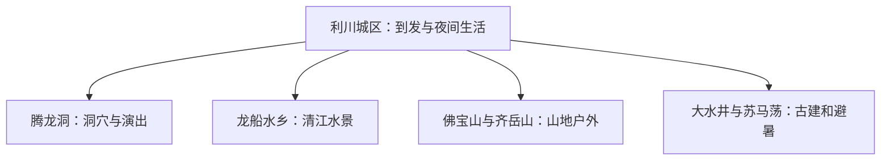
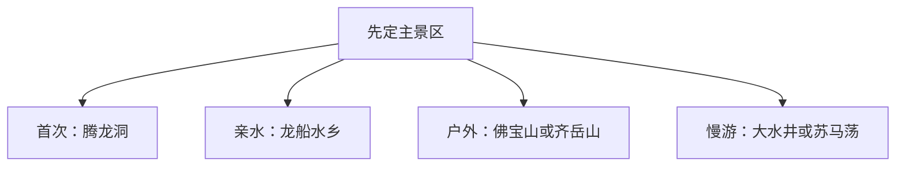

# 利川旅行指南

利川适合以城区为基地，在腾龙洞、龙船水乡、佛宝山和苏马荡之间做选择。洞穴与城区可组合一天，山地、漂流和避暑方向各自留出完整时段；高海拔天气和山路状态会直接改变路线。

> 建议停留：2–4 天 
> 旅行关键词：腾龙洞、清江、龙船调、佛宝山、避暑 
> 主要体力：城区低，洞穴与山地中等至较高 
> 无障碍提醒：设施连续性需向官方确认；洞内步道、漂流、索道与接驳分别核对

## 城市速览

| 项目 | 信息 |
|---|---|
| 主要旅行价值 | 喀斯特洞穴、清江水系、土苗文化、山地避暑与富硒饮食 |
| 建议停留 | 2 天覆盖城区和腾龙洞；3–4 天增加水乡或山地远线 |
| 较舒适季节 | 春秋适合综合游，夏季适合避暑但雨水和客流更明显 |
| 预算特点 | 城区平稳，景区门票、演出、漂流和远线车辆增加支出 |
| 步行强度 | 城区低；洞穴、峡谷和山地中等至较高 |
| 独行旅行 | 城区与成熟景区便利，远线先确认返程 |
| 亲子旅行 | 洞穴、水乡和民族文化适合亲子，漂流按年龄规则选择 |
| 长者与低体力旅行 | 每天安排一个主景区，优先景交和较短步道 |
| 主要天气风险 | 强降雨、山洪、滑坡、洞内湿滑、低温和雾 |
| 行前关键动作 | 先查洞穴、演出、漂流、山路和铁路，再组合路线 |

## 城市格局与游览区域

利川是恩施土家族苗族自治州辖县级市，法定代码 **422802**。都亭、东城等城区片区承担住宿与到发；腾龙洞靠近城区，龙船水乡、佛宝山、大水井与苏马荡分布在不同方向。

| 区域 | 主要内容 | 建议节奏 | 选择提示 |
|---|---|---|---|
| 利川城区 | 住宿、餐饮、龙船调文化与到发 | 半日至 1 天 | 适合抵离日和雨天 |
| 腾龙洞方向 | 洞穴、清江伏流与演艺 | 半日至 1 天 | 先锁定开放与演出时段 |
| 龙船水乡方向 | 清江水景、游船与溶洞 | 半日至 1 天 | 水位与天气影响较大 |
| 佛宝山、齐岳山方向 | 森林、漂流、草场与高地 | 1 天 | 按季节、道路和体力选择 |
| 大水井、苏马荡方向 | 古建筑、乡镇与避暑旅居 | 1 天 | 与城区往返时间较长 |

## 主要景点

| 景点 | 区域 | 类型 | 主要看点 | 建议用时 | 室内外 | 体力 | 预约风险 | 天气影响 | 优先级 |
|---|---|---|---|---:|---|---|---|---|---|
| 腾龙洞景区 | 城区近郊 | 洞穴、地质 | 洞穴系统、清江伏流、瀑布与当期演出 | 半日至 1 天 | 混合 | 中 | 高 | 中 | A |
| 龙船水乡景区 | 凉雾方向 | 水景、溶洞 | 清江水面、洞穴与游船体验 | 半日至 1 天 | 混合 | 中 | 高 | 高 | A |
| 佛宝山景区 | 市域东部 | 山地、森林 | 森林、峡谷、栈道与季节性漂流 | 1 天 | 室外 | 高 | 高 | 很高 | A |
| 大水井古建筑群 | 柏杨坝方向 | 古建筑 | 庄园、宗祠与土家聚落建筑 | 2–3 小时 | 混合 | 中 | 中 | 中 | B |
| 苏马荡正式开放项目 | 谋道方向 | 避暑、森林 | 高地气候、森林环境与旅居空间 | 半日至 1 天 | 室外为主 | 低至中 | 高 | 高 | B |
| 齐岳山正式开放点 | 市域山地 | 草场、户外 | 高山草场、风景道路与季节活动 | 半日至 1 天 | 室外 | 中 | 高 | 很高 | C |
| 利川城区公共文化与清江岸线 | 城区 | 城市文化 | 龙船调、地方非遗、夜间街区与清江城市景观 | 半天 | 混合 | 低 | 中 | 中 | B |

腾龙洞的洞穴、伏流与演出作为一个完整景区；佛宝山内部漂流、栈道等按当期运营选择，不重复计数。

## 美食与餐饮

城区可按合渣、土家腊肉、炕土豆、豆皮、莼菜和山珍选择。腊味盐分较高，合渣与豆制品含大豆，糍粑和面食需留意糯米与小麦；一人旅行可选小份豆皮、粉面或套餐。

## 经典行程

### 一日经典路线
**路线**：腾龙洞 → 城区休息 → 清江岸线或夜间街区。
- **串联逻辑**：核心洞穴配城区收尾，换乘少。
- **预约锚点**：腾龙洞入园与演出。
- **休息安排**：景区服务区和城区午餐。
- **时间不足时**：保留洞穴核心，删除夜间加点。

### 两日城市路线
**第 1 天**：腾龙洞与城区；**第 2 天**：龙船水乡。
- **串联逻辑**：洞穴和水乡分日，避免两套票务与游船时段互相挤压。
- **预约锚点**：两处景区开放和船班。
- **休息安排**：每天午间在游客中心休息。
- **时间不足时**：第二天改为城区半日。

### 三日深度路线
**第 1 天**：腾龙洞；**第 2 天**：龙船水乡；**第 3 天**：大水井或苏马荡。
- **串联逻辑**：从城区近郊到水景，再安排一个独立远线。
- **预约锚点**：第三天车辆和接待状态。
- **休息安排**：固定城区住宿，远线中途留正式服务点。
- **时间不足时**：先删第三天。

### 雨天路线
**路线**：城区公共文化空间 → 午餐 → 腾龙洞当期安全开放段。
- **串联逻辑**：先用城区室内内容观察天气，再决定是否前往洞穴开放段，返程仍回城区。
- **适用条件**：普通降雨且道路与洞穴正常；强降雨预警时留在城区。
- **预约锚点**：场馆与洞穴公告。
- **休息安排**：城区室内空间。
- **时间不足时**：只保留城区场馆。

### 亲子或低体力路线
**亲子路线**：腾龙洞短线 → 城区非遗；**低体力路线**：城区 → 大水井车辆可达区域。
- **串联逻辑**：亲子方案用自然科普接文化体验，低体力方案把乘车作为主连接并控制步行段长度。
- **减负方式**：亲子避开漂流与长山路；低体力方案减少台阶和连续换乘。
- **预约锚点**：儿童规则、景交和无障碍设施。
- **休息安排**：游客中心和城区餐饮。
- **时间不足时**：各保留一个核心点。

### 远郊一日路线
**路线**：利川城区 → 佛宝山或齐岳山正式开放点 → 返回。
- **串联逻辑**：两个山地方向二选一，全天围绕一处正式入口和同一条返程链路安排。
- **适用条件**：天气、道路、体力和返程均已确认。
- **预约锚点**：景区、漂流或接驳运营。
- **休息安排**：景区正式服务区。
- **时间不足时**：整段删除，改走腾龙洞或城区。

## 住宿区域

| 区域 | 优点 | 缺点 | 适合人群 | 交通特点 |
|---|---|---|---|---|
| 利川城区 | 铁路、餐饮和多方向换乘方便 | 往返远景区时间较长 | 首访、无车与多日旅行 | 适合固定基地 |
| 腾龙洞近郊 | 靠近核心景区 | 晚间选择较少 | 早入园和慢游 | 依赖景区接驳或车辆 |
| 苏马荡方向 | 夏季气候与旅居氛围 | 距城区较远、季节差异大 | 避暑与长住 | 先确认公路和返程 |

## 市内交通

利川站承担主要铁路到发。城区用公交、出租车和网约车；腾龙洞相对近，龙船水乡、佛宝山、大水井、苏马荡分散，适合官方接驳、自驾或合规包车。山路行程按天气留出弹性。

## 不同旅行者须知

洞内湿滑且温差明显，可准备防滑鞋和薄外套。亲子参加漂流、游船和高空项目时先核年龄与身高；低体力旅行优先景交和短线。保护地、河道、洞穴未开放支洞及生产道路按管理边界活动。设施连续性需向官方确认。

## 行前核对

| 核对事项 | 为什么需要重查 | 建议时间 | 官方入口 |
|---|---|---|---|
| 景区开放、演出与票务 | 场次、维护和客流会变化 | 确定日期后及前一日 | [湖北省文旅厅利川资料](https://wlt.hubei.gov.cn/bmdt/szyw/es/202505/t20250523_5660294.shtml) |
| 漂流、游船和山路 | 水位与天气直接影响运营 | 出发前三日及当天 | [湖北省文化和旅游厅](https://wlt.hubei.gov.cn/) |
| 铁路班次 | 车次与售票会调整 | 订票时及当天 | [中国铁路12306](https://www.12306.cn/) |
| 天气预警 | 山区强降雨、低温和雾具有时效性 | 出发前三日及当天 | [中国气象局](https://www.cma.gov.cn/) |

## 来源与更新记录

### 主要来源

| 来源 | 类型 | 支持内容 | 核验日期 |
|---|---|---|---|
| [湖北省文旅厅利川专题](https://wlt.hubei.gov.cn/bmdt/szyw/es/202505/t20250523_5660294.shtml) | 省文旅厅 | 腾龙洞、大水井、佛宝山、苏马荡与龙船调 | 2026-08-13 |
| [湖北省文旅厅腾龙洞案例](https://wlt.hubei.gov.cn/bmdt/ztzl/wltztwhlvj/wltztalzs/wltztwljdz/202607/t20260715_5977273.shtml) | 省文旅厅 | 腾龙洞近期文旅与运营语境 | 2026-08-13 |
| [GeoNames 1803782](https://www.geonames.org/1803782/lichuan.html) | 开放地名数据 | 固定主城点；法定市另有行政记录1803779 | 2026-08-13 |
| [Wikidata Q971230](https://www.wikidata.org/wiki/Q971230) | 开放知识库 | 法定利川市实体与粒度交叉核对 | 2026-08-13 |

### 更新记录

| 日期 | 更新内容 |
|---|---|
| 2026-08-13 | 首次完成城市格局、景点选择、路线与动态核对 |
