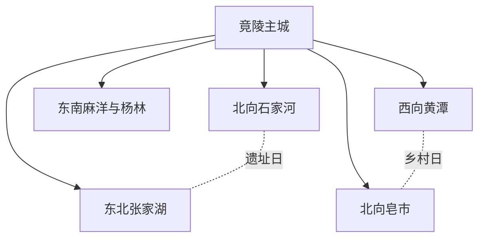
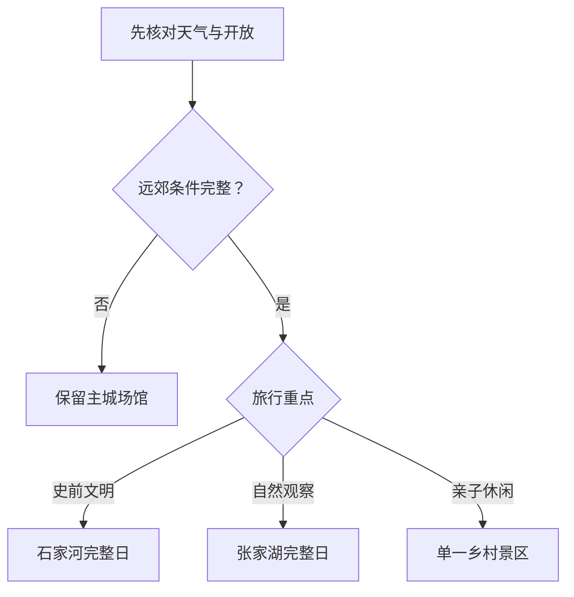

# 天门旅行指南

天门古称竟陵，是湖北省直辖的县级市，不属于武汉、荆州或荆门。主城围绕竟陵—侯口—杨林展开，茶圣故里园、胡家花园、北湖与日常餐饮适合组成城市日；石家河遗址博物馆与考古遗址公园位于北向独立片区，张家湖湿地和皂市、黄潭、麻洋等乡村景区又分属不同方向。江汉平原地形平缓，却不等于景点可以连续步行；首次到访宜先用一日认识主城，再为石家河或一个湿地、乡村方向留出完整一日。

> 建议停留：2–4 天；主城 1 天，石家河或每个远郊方向另留完整 1 天 
> 旅行关键词：石家河文明、陆羽茶文化、晚清建筑、侨乡、江汉湿地、天门蒸菜 
> 主要体力：低至中等；主城较平，遗址公园、湿地和乡村园区的尺度、日晒与接驳会增加负担 
> 最近研究：2026-08-12

## 城市速览

| 项目 | 旅行信息 |
|---|---|
| 主要旅行价值 | 在石家河遗址博物馆认识长江中游史前文明，在竟陵主城串联陆羽茶文化、胡家花园和侨乡记忆，再从张家湖湿地与乡村景区观察江汉平原的水土与当代生活 |
| 建议停留 | 1 天看主城；2 天加入石家河；3–4 天再从张家湖、海龙岛、七屋岭、长寿山原村或方舟生态庄园中选择一至两个方向 |
| 较舒适季节 | 春秋通常更适合遗址公园、湿地和乡村户外；夏季炎热潮湿且雷暴、强降雨多，冬季可能湿冷、雨雪和道路结冰 |
| 预算特点 | 整体低至中等；主城公共空间和部分场馆成本较低，主要变量是远郊车辆、经营景区票务、亲子项目与乡村住宿 |
| 步行强度 | 主城地形平缓；石家河遗址公园、张家湖和大型农旅园区面积较大，旧宅门槛、桥面、湿地栈道与不连续遮阴会增加负担 |
| 主要天气风险 | 高温高湿、雷电、短时强降雨、城市积水、湖区大风与低能见度；冬季湿冷、雨雪和桥面结冰 |
| 独行旅行 | 主城一人餐、公交和叫车较方便；远郊返程弹性较小，应先锁定正式入口、末班或合规车辆，不依赖临时揽客车船 |
| 亲子旅行 | 石家河室内展陈、茶文化场馆和服务完整的乡村景区可按年龄选择；遗址土台、临水空间、游乐设施、采摘田与动物互动需持续看护 |
| 长者与低体力旅行 | 主城一馆一园、车辆接驳的短线最容易减负；石家河只选博物馆核心展陈，湿地与大型园区不按“平地散步”估算 |
| 无障碍信息 | 新建场馆可逐点询问无障碍入口与卫生间，但公开信息不足以证明主城街巷、晚清旧宅、遗址公园、湿地和乡村景区全程连续无障碍 |

## 城市格局与游览区域

天门法定行政代码为 `429006`，市政府驻竟陵街道，属于湖北省直辖县级市。主城服务、北向石家河文明、东北张家湖湿地、东南麻洋与杨林亲子休闲、西向黄潭乡村、北向皂市丘陵各自占用不同道路方向；“武汉都市圈”是区域联系，不改变天门独立的行政、住宿和旅行边界。

| 区域 | 主要内容 | 游览特点 | 与其他区域的关系 |
|---|---|---|---|
| 竟陵—侯口—杨林主城 | 茶圣故里园、胡家花园、北湖侨乡风情馆、公共文化与住宿餐饮 | 城市日基点，片区间可用公交或叫车，旧宅与园林内部仍有门槛和较长步行 | 天门站靠近主城外围但不等于任一景点入口；主城与石家河也不是连续步行区 |
| 石家河镇方向 | 石家河国家考古遗址公园正式开放单元与遗址博物馆 | 完整文明主题日；博物馆、遗址展示区和实景活动须按当日开放范围组合 | 遗址公园是受保护的大遗址，农田、村道、考古工地和地下遗存区不因位于公园范围而全部开放 |
| 九真—张家湖方向 | 张家湖国家湿地公园正式开放区、莲文化主题区和科普设施 | 湿地半日至一日，受水位、候鸟保护、强对流和道路状态影响 | 生态保育区、养殖水面、农田、闸站与公开游览区用途不同，只进入公布开放范围 |
| 杨林—麻洋方向 | 方舟生态庄园、海龙岛等经营景区 | 亲子、采摘、游乐与乡村休闲，项目运营和年龄规则变化快 | 两处不是同一园区；沉湖、汉江岸线、农田和生产水域不作为景区内部捷径 |
| 黄潭方向 | 七屋岭、黄潭米粉与乡村文化 | 靠近主城西向，但仍需车辆；花期、采摘、活动与餐饮具有季节性 | 七屋岭内部知青农场、花田和游乐按一个景区整体，不拆成多个“必去景点” |
| 皂市方向 | 长寿山原村、陆羽茶文化研学与丘陵乡村 | 北向乡村日，适合自驾或提前确认接驳 | 与石家河虽同在北部，仍不是一座园区；林地、果园和工业走廊分别服从生产与防火管理 |

天门的遗址、湖泊、汉江岸线、港区、农田和养殖水面都兼有保护、生产、防洪或运输功能。旅行只使用正式游客中心、开放展馆、公布步道和合规经营项目；不进入考古工地、遗址保护围挡、湿地保育区、鱼塘、农机作业田、闸站、泵站、码头、堆场或铁路保护区拍摄和抄近路。

## 主要景点

优先级用于安排时间：**A** 为首访核心，**B** 为按兴趣补充，**C** 为远郊、季节性或开放波动较大的目的地。同一景区的博物馆、花田、演艺、游乐、码头和内部小景按一个整体计算；动态活动不能代替稳定开放核对。

### 主城与石家河

| 景点 | 区域 | 类型 | 主要看点 | 建议用时 | 室内外 | 体力 | 预约风险 | 天气影响 | 优先级 |
|---|---|---|---|---:|---|---|---|---|---|
| 石家河国家考古遗址公园正式开放单元（含遗址博物馆） | 石家河镇 | 考古遗址公园、博物馆 | 史前城址、玉器与陶器、聚落和考古历程；博物馆与公布遗址游线作为一个整体 | 5–7 小时，另计往返 | 室内外混合 | 中 | 高 | 中至高 | A |
| 茶圣故里园 | 竟陵主城 | 茶文化景区、城市园林 | 陆羽茶文化、西湖园林及当期开放展陈；园内多个组成部分按一座景区 | 3–5 小时 | 室内外混合 | 低至中 | 中 | 中 | A |
| 胡家花园 | 竟陵中街 | 晚清官邸、历史建筑 | 胡聘之故居、前衙后府格局和晚清建筑细部 | 1.5–2.5 小时 | 室内外混合 | 低至中 | 中 | 中 | B |
| 北湖公园与华侨风情馆公开区域 | 主城北湖 | 城市公园、侨乡文化展陈 | 天门侨乡记忆、北湖公共空间和当期展陈；公园与馆舍组合为一个主城节点 | 2–4 小时 | 室内外混合 | 低至中 | 高 | 中 | B |
| 天门剧院—群众艺术馆公共文化组团 | 陆羽大道 | 公共文化、演出 | 地方演出、非遗与群众文化活动；只按当期展览或演出安排 | 1.5–3 小时 | 室内 | 低 | 高 | 低 | C |

### 湿地与乡村方向

| 景点 | 区域 | 类型 | 主要看点 | 建议用时 | 室内外 | 体力 | 预约风险 | 天气影响 | 优先级 |
|---|---|---|---|---:|---|---|---|---|---|
| 张家湖国家湿地公园正式开放区 | 九真镇 | 国家湿地公园、自然教育 | 江汉平原浅水湖泊湿地、候鸟与莲文化主题区；不进入保育、养殖和监测空间 | 4–6 小时，另计往返 | 室外为主 | 中 | 高 | 高 | A |
| 杨林方舟生态庄园 | 杨林方向 | 农旅、亲子体验 | 当季采摘、动物观察和经营游乐；所有项目以当天开放与年龄规则为准 | 4–6 小时 | 室外为主 | 中 | 高 | 高 | B |
| 海龙岛景区 | 麻洋方向 | 主题游乐、乡村休闲 | 古风建筑、当期开放游乐与研学项目；水上设施和演出单独核对 | 4–7 小时 | 室内外混合 | 中 | 高 | 高 | B |
| 七屋岭旅游景区 | 黄潭镇 | 乡村旅游、知青文化 | 七屋岭村、知青记忆、当季花田与乡村休闲；内部园区统一安排 | 3–5 小时，另计往返 | 室外为主 | 中 | 高 | 高 | B |
| 长寿山原村景区 | 皂市镇 | 休闲农业、乡村景区 | 丘陵田园、采摘和当期休闲项目；生产大棚与游客活动区分开 | 4–6 小时，另计往返 | 室外为主 | 中 | 高 | 高 | C |

## 美食与餐饮

天门饮食以蒸菜、米粉、锅盔、鳝鱼、豆制品和卤味较有辨识度。主城成熟生活区最适合一人份、早餐和菜单清楚的正餐；乡镇节庆、宴席和农庄套餐往往份量偏大，不能把一次活动菜单当作常年供应。

| 菜品或餐饮类型 | 常见区域 | 一个人用餐与常见份量 | 风味、过敏原与饮食限制 | 排队风险与替代方法 |
|---|---|---|---|---|
| 天门九蒸与地方蒸菜 | 主城蒸菜馆、正规地方菜馆 | 多道组合通常适合多人；独行选一荤一素或询问小份 | 常见米粉、猪肉、鱼、鸡、藕、大豆及复合调味；不同店的“九蒸”并不固定 | 正餐和节庆高峰可能等位；选原料、份量和价格能清楚说明的普通蒸菜馆 |
| 炮蒸鳝鱼与鳝鱼菜 | 主城、干驿等方向正规餐馆 | 常为共享份，独行先问净肉量、小例和骨刺处理 | 水产、米粉、辣椒、猪油或植物油、大豆调味常见；共用蒸笼和厨具需确认 | 鳝鱼节庆不代表全年同价同质；改选当日水产与价格明示菜品 |
| 黄潭米粉 | 主城早餐区、黄潭镇 | 一碗适合一人，可要求少油少辣 | 稻米粉本体通常不等于无麸质；汤底可能含猪骨、牛肉、大豆、小麦酱料和花生芝麻配料 | 早餐高峰排队；在生活区寻找现煮同类店，不为单一名店绕行 |
| 天门锅盔与黄潭饼子 | 主城小吃区、黄潭方向 | 一只多为一人加餐，馅料版份量更大 | 小麦麸质、芝麻、猪肉、葱油和共用烤炉常见 | 热门时段售完；选现做、馅料标示清楚的同类饼店 |
| 蒋场干子与豆制品 | 主城特产店、蒋场方向 | 小份适合佐餐或外带，不宜替代完整一餐 | 大豆为主要过敏原，卤汁可能含小麦酱油、芝麻、辣椒和糖 | 外带看生产信息、冷藏与保质期；不买长时间暴露的无标签产品 |
| 天门酱鸭与卤味 | 主城熟食店 | 斩件或半份适合一至两人，外带注意保存 | 鸭肉、酱油、糖、香辛料及可能的酒料；砧板和卤水存在交叉接触 | 晚间可能售完；选标签、储存条件和称重价格清楚的正规店 |

严重过敏、严格素食、无麸质或不食酒料者，应把原料、汤底、蒸笼、油锅和交叉接触要求逐项说明。农庄“土菜”不代表过敏原更少，现场采摘也不代表可以进入生产田或自行处理未标识食材。

## 经典行程

在天门，最有效的行程取舍是先决定“主城、石家河、湿地或乡村”中的当天唯一主方向，再核对入口、天气与返程：

### 一日经典路线

**路线**：茶圣故里园 → 主城午餐与坐休 → 胡家花园 → 北湖公园或华侨风情馆当期开放区域

- **适用条件**：适合首访、到达日或不希望跑远郊的人，且所选场馆与馆舍正常开放。
- **串联逻辑**：全天留在竟陵主城，以陆羽茶文化、晚清建筑和侨乡记忆构成低换乘城市线。
- **预约锚点**：先确认茶圣故里园内部场馆、胡家花园和华侨风情馆的开放日、入口与最晚入场。
- **休息安排**：午餐放在成熟商业区；下午先坐休，再进入旧宅或北湖短线。
- **时间不足时**：删除北湖外围散步，只保留茶圣故里园与胡家花园；两处仍无法完成时只留开放更稳定的一处。

### 两日城市路线

**第 1 天**：竟陵主城茶文化、胡家花园与地方饮食 
**第 2 天**：天门主城 → 石家河国家考古遗址公园正式入口 → 遗址博物馆与当期开放游线 → 返回主城

- **适用条件**：石家河开放、往返车辆和返程时间均已确认；强降雨、雷电或遗址游线关闭时只看允许开放的室内部分。
- **串联逻辑**：第一天建立竟陵与陆羽线索，第二天完整交给石家河文明，不把张家湖或皂市再塞入同日。
- **预约锚点**：石家河遗址博物馆预约、实名规则、讲解、遗址公园开放边界及最晚离园时间。
- **休息安排**：第二天在游客服务设施或石家河镇成熟餐饮坐休，不在遗址土台、考古工地或农田边野餐。
- **时间不足时**：只保留遗址博物馆核心展陈，删除室外长线；若博物馆无法入场则整段改为主城公共文化。

### 三日深度路线

**第 1 天**：竟陵主城 
**第 2 天**：石家河遗址完整日 
**第 3 天**：张家湖湿地、海龙岛、七屋岭或长寿山原村四选一完整日

- **适用条件**：两个远郊日都有明确开放、正规往返和适合的天气，且不连续安排超长户外。
- **串联逻辑**：城市文化、史前文明和湿地或乡村生活分日处理，相似的“研学”标签不代表景区属于同一园区。
- **预约锚点**：石家河和第三天景区分别锁定；张家湖还要确认开放区、观鸟限制和水位，乡村景区核对项目、餐饮与返程。
- **休息安排**：远郊日都在游客中心或成熟乡镇完成午餐和坐休，避开农田、鱼塘、林地与非开放岸线。
- **时间不足时**：整段删除第三天；不要在第三天改成两个相距较远的乡村景区赶场。

### 雨天路线

**路线**：主城一处确认开放的茶文化或侨乡室内展陈 → 室内午餐与长休息 → 胡家花园可开放室内段或群众艺术馆二选一

- **适用条件**：只适用于普通降雨且城市道路正常；暴雨、雷电、积水、强风或道路结冰时缩成住宿地附近活动。
- **串联逻辑**：以主城场馆替代湿地、遗址室外区、采摘、游乐和乡村道路，避免把“雨小了”当成风险解除。
- **预约锚点**：先确认一个主馆；旧宅和第二馆不作为必须完成项。
- **休息安排**：使用正规室内餐饮和场馆座椅，每次移动前重查预警、积水与开放通知。
- **时间不足时**：删除第二馆；官方发布暴雨、雷电或积水风险时直接返回住宿地。

### 亲子或低体力路线

**亲子路线**：石家河遗址博物馆核心展陈 → 游客服务区午餐与休息 → 当期开放的短程遗址教育活动 
**低体力路线**：车辆抵达茶圣故里园最近入口 → 一处核心展陈 → 午餐长休息 → 胡家花园或华侨风情馆二选一

- **适用条件**：亲子路线须确认儿童预约、讲解、活动年龄和推车；低体力路线须询问最近落客点、门槛、电梯、座椅与卫生间。
- **串联逻辑**：亲子以一座博物馆和可退出短线完成研学，低体力全日留在主城并以车辆跨片区。
- **预约锚点**：儿童证件、活动名额、推车寄存，以及轮椅通道、无障碍卫生间和陪同要求。
- **休息安排**：两条路线午间都完整坐休；下午只保留可随时退出的一个短段。
- **时间不足时**：亲子删除室外遗址段；低体力删除第二个场馆，只保留一处最易到达的核心展陈。

### 远郊一日路线

**路线**：天门主城 → 张家湖国家湿地公园公布入口 → 莲文化主题区或当日开放科普短线 → 返回主城

- **适用条件**：适合已确认开放区、正规车辆、返程和天气的人；强降雨、雷电、湖区大风、低能见度或候鸟保护管制时不成行。
- **串联逻辑**：张家湖单独占用一个湿地日，不追加石家河、海龙岛或皂市，以保护边界和返程余量为先。
- **预约锚点**：游客入口、开放步道、停车或接驳、科普设施、候鸟季限制和最晚离开时间。
- **休息安排**：只在正式服务区休息，不进入养殖堤、农田、监测站、救护区或非开放岸线。
- **时间不足时**：整段删除，改为北湖公园与主城场馆短线；不临时寻找无标识的湖岸入口。

## 住宿区域

| 区域 | 优点 | 缺点 | 适合人群 | 交通特点 |
|---|---|---|---|---|
| 竟陵成熟城区 | 餐饮、商店、茶圣故里园与日常交通集中，适合作为多方向基点 | 临街噪声与停车差异较大，到天门站和各远郊仍需车辆 | 首访、独行、预算优先或只住一处的人 | 按具体街道和景点入口订房，不以“市中心”标签估算所有车程 |
| 北湖—杨林新区 | 较新住宿与道路条件相对集中，靠近北湖和天门站方向 | 与竟陵旧城、黄潭和南部乡镇仍有距离 | 高铁晚到、亲子、低体力或偏好较新设施者 | 确认酒店到天门站的真实道路、夜间上客点和公交时间 |
| 石家河镇正规住宿 | 减少遗址公园早晨往返，可安排慢速文明主题日 | 选择、餐饮、夜间交通和医疗资源少于主城 | 已锁定石家河为唯一锚点、自驾或合规包车者 | 必须确认经营资质、到正式入口的接送、晚餐和次日离开方式 |
| 张家湖或乡村景区周边正规住宿 | 方便观鸟、采摘或乡村慢游，减少当天长途折返 | 季节运营、退改、夜间照明和恶劣天气保障差异大 | 明确参加单一景区活动并愿意降低夜生活需求者 | 不把“湖边”“景区旁”理解为可步行；先确认道路、接送与防汛退改 |

需要无障碍客房、电梯、儿童床、安静房或深夜入住时，应直接向住宿方确认从道路落客点到客房的连续路线。乡村住宿还要重查合法经营、消防、夜间道路、供餐、医疗距离和极端天气退改。

## 市内交通

天门当前存在三个容易混淆的铁路名称。新建沪渝蓉高铁的主城门户最终以 **天门站** 对外服务，早期项目资料曾使用“天门北站”这一建设名称；同时，政府 2026 年春运资料仍分别列出天门站、天门南站和天门北站的接驳。三者不是同一站房，也不应仅凭“南、北、高铁”猜测位置。购票、订房和接驳必须同时核对票面全名、线路、地图位置与当天公交。

| 场景或枢纽 | 建议与取舍 | 行前需要重查的内容 |
|---|---|---|
| 天门站到达 | 新高铁主城门户，适合竟陵、杨林与石家河联程；到任一景点仍需公交或叫车 | 12306 票面站名、列车运行图、出站口、站前上客点、公交专线与夜间运力 |
| 天门北站与天门南站 | 属于另外两个票面门户，可能适合不同普速或区域线路；不能与天门站互换 | 实际线路、地图位置、站前接驳、到住宿地的地面时间和末班 |
| 客运中心与城乡客运 | 可连接武汉、荆门、潜江等地和部分乡镇，但时刻、票价与停运会调整 | 发车站、当天售票、末班、行李、节假日加班和农村客运停靠点 |
| 主城跨片区 | 公交适合预算优先，出租或网约车适合赶预约、携带行李与低体力移动 | 线路调整、站位、施工绕行、支付方式、夜间和恶劣天气运力 |
| 石家河、张家湖与乡村景区 | 使用当期城乡客运、合规包车或自驾；每个方向分别锁定返程 | 正式入口、末班、停车、景区接驳、道路施工、活动散场和备用车辆 |
| 航空联程 | 通常比较武汉天河机场与铁路、公路联程，不把规划或通用机场当作已开通定期客运 | 航班、机场地面交通、跨城换乘、行李、夜间到达与延误退改 |
| 自驾 | 对分散乡镇更灵活，但平原堤路、雾、积水、农机、铁路和活动管制会抵消便利 | 施工、积水、桥面结冰、停车、充电、景区预约、防汛与铁路保护区管制 |

## 不同旅行者须知

| 旅行维度 | 可行条件 | 主要取舍 | 需额外核对 |
|---|---|---|---|
| 独行旅行 | 主城早餐、单馆、公交与叫车容易组合 | 远郊末班和夜间返程弹性小，不独自进入湖岸、农田或遗址非开放区 | 开放、末班、合规车辆、住宿前台与紧急联络 |
| 亲子旅行 | 石家河展陈、茶文化和服务完整的经营景区可按年龄选短线 | 遗址土台、临水、游乐设施、动物互动和采摘田需要持续看护 | 儿童票、实名、年龄身高、推车、寄存、救生与取消规则 |
| 长者或低体力旅行 | 每日一馆一园、车辆跨片区，可覆盖主城和石家河室内核心 | 大型遗址公园、湿地和乡村园区很难完全减步行 | 最近落客点、电梯、座椅、观光车、坡度、可提前退出位置 |
| 无障碍需求 | 新高铁站与新建场馆可提前申请或询问服务 | 旧宅门槛、站外接驳、遗址土路、湿地栈道和乡村卫生间可能中断连续通行 | **设施连续性需向官方确认**；逐段问硬质路面、坡道、卫生间和轮椅借用 |
| 摄影旅行 | 主城公共空间、石家河正式展区和张家湖开放观鸟点题材清楚 | 文物展厅、无人机、居民院落、候鸟、考古工地和铁路港区有严格边界 | 三脚架、闪光灯、无人机、商业拍摄、鸟类干扰与日出日落开放 |
| 预算有限 | 主城公共空间、普通公交、米粉早餐和一日单一锚点便于控费 | 每日从主城往返远郊会增加交通成本，乡村套票可能另含项目费用 | 门票组成、接驳、活动附加费、优惠资格、停车和退改 |
| 晚出发或紧凑行程 | 只保留茶圣故里园、胡家花园或华侨风情馆中的一处 | 下午不临时启动石家河、张家湖或皂市完整日 | 最晚入场、闭馆日、末班、夜间叫车和行李寄存 |
| 高温与强对流 | 上午安排户外、午后进入场馆，并随时服从停运和疏散 | 高温、雷电和大风会同时影响湿地、花田、游乐、林地与遗址室外区 | 高温和雷电预警、饮水点、室内避险、项目停运和退票 |
| 梅雨与主汛期 | 仅在无预警、道路和景区确认正常时进入湿地、湖区与乡村 | 强降雨可引发积水、水位上涨、堤路管制和低洼道路中断；雨停不代表解除 | 雨情、水情、积水、道路封闭、湿地闭园和备用住宿 |
| 遗址与湿地旅行 | 只使用正式展馆、开放步道和许可活动 | 遗址公园不是可自由穿越的田野，湿地公园也不是全湖岸游客区 | 保护范围、考古施工、候鸟季、开放边界、讲解与摄影规则 |

## 行前核对

| 核对事项 | 为什么需要重查 | 建议核对时间 | 官方入口 |
|---|---|---|---|
| 石家河遗址博物馆与考古遗址公园 | 2026 年新开馆后预约、讲解、室外游线、实景活动与保护施工可能继续调整 | 确定日期后及到访前一日 | [天门市政府开馆公告](https://www.tianmen.gov.cn/zwgk/bmhxzxxgkml/xzbcy/sjhz/zfxxgk/fdzdgknr/gzdt/202605/t20260512_5934527.shtml)；[湖北省文旅厅开馆记录](https://wlt.hubei.gov.cn/bmdt/mtjj/202605/t20260519_5939093.shtml) |
| 茶圣故里园、胡家花园与主城场馆 | 闭馆日、馆舍分区、展览、讲解、节庆和施工会改变组合 | 排入路线前及到访前一日 | [天门市公共文化服务](https://www.tianmen.gov.cn/zwgk/zfxxgkml/gysydj/ggwhfw/)；[茶圣故里园与胡家花园认定资料](https://www.tianmen.gov.cn/zwgk/bmhxzxxgkml/bm/swhhlyj/zfxxgk/fdzdgknr/gzdt/202110/t20211028_3832450.shtml) |
| 张家湖国家湿地公园 | 开放区、候鸟保护、水位、科普设施和道路可能调整，管理范围并非全域游线 | 出发前三日及当天 | [张家湖国家湿地公园介绍](https://www.tianmen.gov.cn/zjtm/mltm/tstm/zrfg/201807/t20180716_1930426.shtml)；[张家湖湿地管理办法](https://www.tianmen.gov.cn/norms/202407/t20240715_5269059.shtml) |
| 海龙岛、七屋岭、长寿山原村与方舟生态庄园 | 经营项目、花期、采摘、游乐、餐饮和年龄规则变化快 | 订票前及当天 | [天门市 A 级景区基本情况](https://www.tianmen.gov.cn/zwgk/bmhxzxxgkml/bm/swhhlyj/zfxxgk/fdzdgknr/gysyjs/ly1/202312/t20231225_5015555.shtml)；各景区官方渠道 |
| 铁路与高铁站接驳 | 天门站、天门北站和天门南站名称易混，车次、公交、夜班与站前组织会调整 | 购票时、出发前一周及当天 | [中国铁路 12306](https://www.12306.cn/)；[天门市交通运输局](https://www.tianmen.gov.cn/zwgk/bmhxzxxgkml/bm/sjtysj/)；[高铁站公交接驳方案](https://www.tianmen.gov.cn/zwgk/bmhxzxxgkml/bm/sjtysj/zfxxgk/fdzdgknr/gysyjs/jtyslysxgkj/t_5815780.shtml) |
| 客运班线与城乡交通 | 时刻、票价、停靠、末班和节假日运力均会变化 | 出发前一周及当天 | [天门市客运班线名录](https://www.tianmen.gov.cn/zwgk/bmhxzxxgkml/bm/sjtysj/zfxxgk/fdzdgknr/qtzdgknr/ggfw/ctky/t_4257148.shtml)；当日售票窗口 |
| 暴雨、雷电、高温、雾与低温雨雪 | 会影响遗址室外区、湿地、乡村道路、游乐设施和铁路公路 | 出发前三日滚动查看，当日再查 | [湖北省气象局](http://hb.cma.gov.cn/)；[中国气象局全国预警](https://weather.cma.cn/web/alarm/map.html) |
| 遗址、湿地、农田与生产边界 | 考古、保护、养殖、防洪、港口、铁路和农机作业空间不对普通游客开放 | 进入远郊前 | [石家河遗址保护条例信息](https://www.tianmen.gov.cn/xwzx/tpxw/t_5824719.shtml)；[天门市交通运输局](https://www.tianmen.gov.cn/zwgk/bmhxzxxgkml/bm/sjtysj/) |
| 无障碍与重点旅客服务 | 轮椅、电梯、坡道、卫生间和可登乘车辆可能需预约、维护或绕行 | 订票后并在到访前再次联系 | [12306 重点旅客预约说明](https://kyfw.12306.cn/otn/view/icentre_qxyyInfo.html)；各场馆、景区与住宿官方渠道 |
| 具体餐馆、节庆与演出 | 营业、菜单、份量、食材、展演和乡村活动日期变化频繁 | 排入路线前及当天 | [天门市文化和旅游局](https://www.tianmen.gov.cn/zwgk/bmhxzxxgkml/bm/swhhlyj/)；商户、主办方和场地方官方渠道 |
| 入境、签证与安全规则 | 国际旅行者的适用规则取决于国籍、证件、入境口岸和当期政策 | 订票前及出发前 | [中国国家移民管理局](https://www.nia.gov.cn/)；本国驻华使领馆 |

## 来源与更新记录

### 主要来源

| 来源 | 类型 | 支持内容 | 核验日期 |
|---|---|---|---|
| [民政部行政区划代码查询：湖北省](https://dmfw.mca.gov.cn/xzqh/getList?code=42&trimCode=true&maxLevel=3) | 中央民政部门 | 天门市法定省直管县级市身份与行政区划代码 429006 | 2026-08-12 |
| [天门市民政局：天门市行政区划](https://www.tianmen.gov.cn/zjtm/rwls/xzqh/t_3415161.shtml) | 市民政部门 | 市政府驻竟陵街道及全市街道、乡镇和农场结构 | 2026-08-12 |
| [天门市政府：历史沿革](https://www.tianmen.gov.cn/zjtm/rwls/lsyg/201604/t20160419_1931609.shtml) | 市政府 | 撤县设市、1994 年省辖直管与现行城市身份 | 2026-08-12 |
| [天门市政府：石家河遗址博物馆开放公告](https://www.tianmen.gov.cn/zwgk/bmhxzxxgkml/xzbcy/sjhz/zfxxgk/fdzdgknr/gzdt/202605/t20260512_5934527.shtml) | 市政府／遗址管理 | 2026 年开馆、展陈组成及其作为考古遗址公园组成部分的关系 | 2026-08-12 |
| [湖北省文旅厅：来石家河遗址博物馆读懂“何以中国”](https://wlt.hubei.gov.cn/bmdt/mtjj/202605/t20260519_5939093.shtml) | 省级文旅主管部门 | 石家河遗址价值、博物馆正式开馆和展陈内容 | 2026-08-12 |
| [湖北省石家河遗址保护条例信息](https://www.tianmen.gov.cn/xwzx/tpxw/t_5824719.shtml) | 地方性法规信息 | 大遗址保护、合理利用和保护边界 | 2026-08-12 |
| [茶圣故里园、胡家花园景区认定资料](https://www.tianmen.gov.cn/zwgk/bmhxzxxgkml/bm/swhhlyj/zfxxgk/fdzdgknr/gzdt/202110/t20211028_3832450.shtml) | 市文旅部门 | 茶圣故里园整体组成、陆羽茶文化主题与胡家花园建筑身份 | 2026-08-12 |
| [2023 年天门市国家 A 级旅游景区基本情况](https://www.tianmen.gov.cn/zwgk/bmhxzxxgkml/bm/swhhlyj/zfxxgk/fdzdgknr/gysyjs/ly1/202312/t20231225_5015555.shtml) | 市文旅部门 | 海龙岛、长寿山原村、七屋岭等景区属地与长期核对入口 | 2026-08-12 |
| [天门市政府：北湖华侨风情馆](https://www.tianmen.gov.cn/xwzx/tpxw/t_5824724.shtml) | 市政府 | 华侨风情馆位于北湖公园及其侨乡文化主题 | 2026-08-12 |
| [天门市政府：张家湖国家湿地公园](https://www.tianmen.gov.cn/zjtm/mltm/tstm/zrfg/201807/t20180716_1930426.shtml) | 湿地管理机构 | 张家湖位置、湿地类型、面积与生态功能 | 2026-08-12 |
| [湖北天门张家湖国家湿地公园管理办法](https://www.tianmen.gov.cn/norms/202407/t20240715_5269059.shtml) | 市政府规范性文件 | 生态保育、合理利用、开放活动与禁止行为边界 | 2026-08-12 |
| [“湖北·景秀味美品天门”乡村旅游线路](https://www.tianmen.gov.cn/xwzx/tpxw/202409/t20240926_5349497.shtml) | 市政府／文旅信息 | 方舟生态庄园、乡村线路、天门九蒸、黄潭米粉及地方小吃 | 2026-08-12 |
| [城区公交优化与天门高铁站接驳方案](https://www.tianmen.gov.cn/zwgk/bmhxzxxgkml/bm/sjtysj/zfxxgk/fdzdgknr/gysyjs/jtyslysxgkj/t_5815780.shtml) | 市交通主管部门 | 天门站公交接驳结构；具体线路按当期公告核对 | 2026-08-12 |
| [天门市 2026 年春运交通保障](https://www.tianmen.gov.cn/hdjl/xwfbh/t_5876242.shtml) | 市交通主管部门 | 天门站、天门南站与天门北站作为不同接驳门户 | 2026-08-12 |
| [天门市客运班线名录](https://www.tianmen.gov.cn/zwgk/bmhxzxxgkml/bm/sjtysj/zfxxgk/fdzdgknr/qtzdgknr/ggfw/ctky/t_4257148.shtml) | 市交通主管部门 | 客运中心、跨城班线与动态售票提示 | 2026-08-12 |
| [GeoNames：Jingling 1805618](https://www.geonames.org/1805618/jingling.html) | 开放地理数据 | 固定竟陵主城居民点与 GeoNames 标识 | 2026-08-12 |
| [Wikidata：天门市 Q71468](https://www.wikidata.org/wiki/Q71468) | 开放结构化数据 | 天门市法定实体、行政区划代码与当前 `P1566=8643370` | 2026-08-12 |
| [Wikidata：竟陵街道 Q28794447](https://www.wikidata.org/wiki/Q28794447) | 开放结构化数据 | 固定主城点 `1805618` 对应竟陵街道，而非完整天门市行政实体 | 2026-08-12 |

GeoNames `1805618` 是固定数据集中的竟陵主城居民点，用于定位本指南的主城锚点；Wikidata `Q28794447` 对应该竟陵街道记录并精确连接该 GeoNames 标识。页面元数据采用法定天门市实体 `Q71468` 和行政代码 `429006`；该法定实体当前 `P1566=8643370`，与固定主城点 `1805618` 不同。两组标识分别表达主城驻地点与全市行政实体，不能互换，旅行范围仍以天门市法定行政边界和本页属地说明为准。

### 更新记录

| 日期 | 更新内容 |
|---|---|
| 2026-08-12 | 首次完成公开资料研究；厘清天门省直管县级市、竟陵固定主城点与法定实体的标识关系，核对石家河、茶圣故里园、胡家花园、张家湖和乡村景区的属地与交通尺度，并整理路线、餐饮、住宿、铁路门户、天气、无障碍及遗址、湿地、农田和生产设施边界 |
