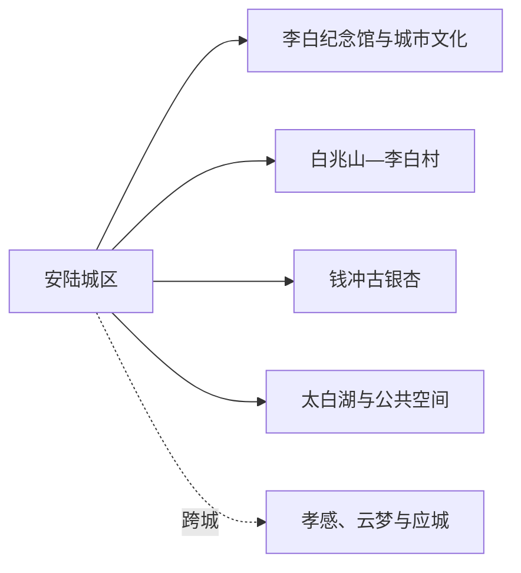
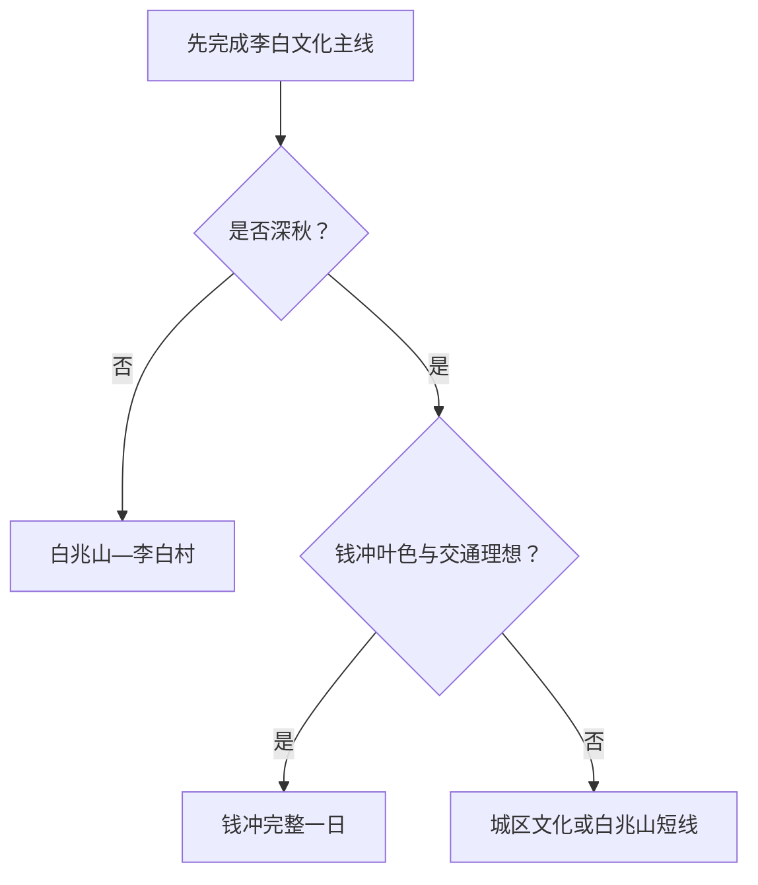

# 安陆旅行指南

安陆最鲜明的旅行线索是李白文化与银杏季。城区适合做住宿和交通基地，白兆山—李白村是一条完整文化山地线，钱冲古银杏则是季节性很强的远线。首访先完成城区与白兆山，两日以上再根据落叶进度、道路和客流决定是否去钱冲。

## 城市速览

| 项目 | 信息 |
|---|---|
| 旅行主线 | 李白纪念馆、白兆山、李白村、安陆古城文化、钱冲古银杏 |
| 建议停留 | 1 天城区与白兆山；2 天加入钱冲或城市文化活动 |
| 住宿基地 | 安陆城区，靠近安陆西站接驳和成熟餐饮 |
| 步行强度 | 城区低；白兆山中高；钱冲步行不一定难，但公路往返和旺季拥堵明显 |
| 主要天气 | 5—7 月强降雨、雷暴、山洪与地灾；夏季湿热；冬季冻雨结冰 |
| 银杏季 | 先看落叶进度、预约、停车和返程，再决定专程前往 |
| 亲子 | 李白纪念馆、文化活动和白兆山短线较易组合 |
| 低体力 | 城区单馆加太白湖或平缓公共空间，白兆山用车辆近达区域 |
| 生产边界 | 钱冲村林地、农田、蓝莓基地和普通村道按接待与生产管理范围活动 |
| 无障碍 | 设施连续性需向官方确认，重点核对山地坡道、落客、卫生间和轮椅借用 |

## 城市格局与游览区域

安陆市为孝感市代管县级市，法定代码 `420982`。固定 GeoNames `1818016` 为安陆城市点，Wikidata 法定实体 `Q557934` 的 `P1566=1818016`，名称和主城位置精确对应；行政边界仍以法定代码资料为准。应城与汉川是同属孝感代管的其他县级市，云梦是普通县，各自另作旅行安排。

| 区域 | 旅行价值 | 怎么安排 |
|---|---|---|
| 安陆城区 | 住宿、铁路、李白纪念馆、太白湖和餐饮 | 抵达日、雨天或一日核心 |
| 白兆山—李白村 | 李白文化、山地、研学和当期演艺 | 完整半日至一日，按开放与体力选线 |
| 钱冲村方向 | 古银杏、村志与红色文化背景 | 深秋季节整日，先锁交通和落叶进度 |
| 乡村农业片区 | 蓝莓、农产品与乡村活动 | 选择正式节庆或经营项目，尊重生产边界 |

## 主要景点

### 城区与李白文化

| 景点 | 所在区域 | 类型 | 核心看点 | 建议用时 | 室内/室外 | 体力 | 预约难度 | 天气敏感度 | 适合旅程 |
|---|---|---|---|---|---|---|---|---|---|
| 安陆李白纪念馆 | 城区 | 名人纪念与研究展示 | 李白在安陆经历、诗歌、研究与当期展览 | 1.5–2.5 小时 | 室内 | 低 | 中高 | 低 | A |
| 安陆城市公共文化场馆 | 城区 | 地方史与公共文化 | 郧国、德安、地方非遗与当期活动 | 1–2 小时 | 室内 | 低 | 中 | 低 | B |
| 太白湖与城区公共空间 | 城区 | 城市休闲 | 湖岸、城市活动与李白主题公共文化 | 1–2 小时 | 室外 | 低 | 低 | 高 | B |

### 白兆山与钱冲

| 景点 | 所在区域 | 类型 | 核心看点 | 建议用时 | 室内/室外 | 体力 | 预约难度 | 天气敏感度 | 适合旅程 |
|---|---|---|---|---|---|---|---|---|---|
| 白兆山李白文化旅游区 | 烟店方向 | 山地、文学文化 | 山林、李白文化阐释、纪念空间与正式游径 | 4–6 小时 | 混合 | 中高 | 高 | 高 | A |
| 李白村文化旅游度假区 | 白兆山脚 | 唐风乡村、研学、3A | 李白主题乡村、研学与当期演艺活动 | 2–4 小时 | 混合 | 中 | 高 | 高 | B |
| 钱冲古银杏国家森林公园 | 王义贞镇钱冲村 | 森林、季节景观 | 古银杏群落、乡村林地与深秋色彩 | 4–6 小时，另计往返 | 室外 | 中 | 高 | 极高 | A |
| 钱冲革命旧址公开展示 | 钱冲村 | 革命文物 | 鄂豫边区革命历史与文保背景 | 1–2 小时 | 混合 | 低至中 | 高 | 中 | C |
| 安陆音乐公路公开体验段 | 市域乡村 | 交通文旅、路线节点 | 车辆按规定速度通过时的音乐公路体验 | 0.5–1 小时 | 室外 | 低 | 中 | 高 | 路线节点 |

白兆山与李白村可以在同一方向组合，但各自的票务、演艺和开放范围分别确认。钱冲银杏的价值高度依赖叶色与落叶进度，林地、村民院落、农田和革命文物保护区依照标识活动。

## 美食与餐饮

| 类型 | 适合场景 | 份量 | 过敏与饮食提示 | 选择方法 |
|---|---|---|---|---|
| 安陆米粉 | 早餐 | 一人一碗 | 汤底可能含猪肉、牛肉、鸡汤、大豆和辣椒 | 问清汤底和浇头，素食需求单独说明 |
| 安陆白花菜 | 配菜或合菜 | 一盘分享 | 腌制品盐分高，炒制可能用动物油 | 少量尝试，问清腌制和烹饪方式 |
| 太白宴等主题餐饮 | 节庆或多人正餐 | 多道合菜 | 酒、肉、鱼、坚果和小麦可能较多 | 以当期正规经营项目为准，提前问份量和过敏原 |
| 银杏相关食品 | 深秋伴手礼 | 小包装或一盘 | 银杏果需充分处理，儿童、孕妇与特定疾病人群谨慎 | 选包装和食用说明清楚的正规产品 |
| 本地烧烤与家常菜 | 晚餐 | 适合分享 | 肉类、辣椒、花生、大豆和共用烤具 | 先点小份、蔬菜和主食，按食量追加 |

## 经典行程

### 一日经典路线

**路线**：安陆李白纪念馆 → 城区午餐 → 白兆山李白文化旅游区 → 返回城区

- **串联逻辑**：先用纪念馆建立人物与地方背景，再到山地对应文化空间。
- **预约锚点**：纪念馆、白兆山票务、景区车、讲解与最晚返程。
- **休息安排**：午间在城区长休，白兆山使用游客中心和正式座椅。
- **时间不足时**：保留纪念馆，白兆山改为近入口短线或顺延。

### 两日李白与银杏路线

**第 1 天**：李白纪念馆 → 白兆山—李白村 
**第 2 天**：城区 → 钱冲古银杏国家森林公园 → 返回

- **串联逻辑**：李白文化与季节森林分日，第二天完整留给公路和客流。
- **预约锚点**：钱冲叶色、门票、停车、景区交通、防火与返程。
- **休息安排**：钱冲使用正式游客服务和镇区餐饮，避免长时间站立候车。
- **时间不足时**：第二天只在银杏园开放核心区活动并提前返程。

### 三日深度路线

**第 1 天**：城区文博 
**第 2 天**：白兆山—李白村 
**第 3 天**：钱冲 **或** 安陆乡超／城市活动日

- **串联逻辑**：第三天依据季节选择自然或城市节庆，不为补数量强行远行。
- **预约锚点**：赛事、演出、钱冲季节信息和住宿延住。
- **休息安排**：第三天降低步行强度，午间回城区或成熟镇区。
- **时间不足时**：删去第三天，保留李白文化主线。

### 雨天路线

**路线**：李白纪念馆 → 室内午餐 → 城区公共文化场馆或当期活动 → 住宿

- **适用条件**：普通降雨且城区道路和场馆正常开放。
- **串联逻辑**：集中主城室内，山地和银杏林留到天气稳定日。
- **预约锚点**：开馆、活动、公交和暴雨预警。
- **休息安排**：场馆观众区与餐馆，减少湖岸和坡地停留。
- **时间不足时**：只保留李白纪念馆。

### 亲子路线

**路线**：李白纪念馆亲子讲解 → 午餐 → 太白湖短段 → 城区文化活动

- **适用条件**：讲解、活动年龄和天气条件适合。
- **串联逻辑**：室内历史、短户外与互动活动控制在城区。
- **预约锚点**：亲子名额、儿童座椅、推车和卫生间。
- **休息安排**：午间长休，湖岸活动放在较凉时段。
- **时间不足时**：保留纪念馆与一段湖岸散步。

### 低体力路线

**路线**：住宿 → 李白纪念馆 → 午间长休 → 太白湖近入口或城区公园短段

- **适用条件**：落客、座椅、电梯、卫生间和轮椅可达范围已确认。
- **串联逻辑**：一天一个室内主项，户外作为弹性补充。
- **预约锚点**：无障碍入口、最近停车和车辆等候。
- **休息安排**：午间至少两小时，随时可以返回住宿。
- **时间不足时**：只参观纪念馆重点展区。

### 钱冲季节主题路线

**路线**：安陆城区 → 钱冲游客服务区域 → 古银杏开放游径 → 正规餐饮或补给 → 返回

- **适用条件**：落叶进度、道路、停车和景区开放值得专程前往。
- **串联逻辑**：整天围绕一个季节性森林目的地，避免同日跨白兆山。
- **预约锚点**：票务、防火、车辆、最晚返程和摄影规则。
- **休息安排**：游客中心、镇区餐饮和车辆，保留候车缓冲。
- **时间不足时**：只走近入口银杏区域并提前离开。

## 住宿区域

| 区域 | 优点 | 取舍 | 适合人群 | 交通提示 |
|---|---|---|---|---|
| 安陆城区 | 餐饮、铁路、场馆和车辆最稳定 | 白兆山、钱冲仍需专程 | 首访、两日以上、公共交通者 | 核对到安陆西站和景区车辆 |
| 安陆西站周边 | 抵离方便 | 与城区核心和夜间餐饮有距离 | 晚到早走、行李多 | 询问夜间出租、公交和接站 |
| 白兆山或李白村正规住宿 | 便于文化山地慢游 | 与城区服务分开 | 已锁定白兆山主题者 | 核对合法经营、消防、餐食和返程 |
| 钱冲周边正规接待 | 银杏季可避开当日长途折返 | 旺季紧张，服务季节性强 | 摄影、深秋慢游 | 先确认实际地址、停车、供暖和退改 |

## 市内交通

安陆西站是主要铁路门户之一，具体停靠以 12306 为准。城区内用公交、出租和步行；白兆山、李白村和钱冲分别需要公路接驳。银杏季道路与停车比直线距离更影响可行性，提前安排返程能减少现场等待。

| 场景 | 怎么走 | 出发前确认 |
|---|---|---|
| 铁路抵达 | 从安陆西站接入城区住宿 | 车次、公交、出租、夜间接站和行李 |
| 白兆山—李白村 | 景区交通、出租、正规包车或自驾 | 入口、停车、景区车、演艺与返程 |
| 钱冲 | 整日车辆往返或正规季节旅游交通 | 花期、交通管制、停车、末班和防火 |
| 孝感、云梦、应城联程 | 铁路或道路跨城 | 站名、住宿切换和独立目的地信息 |

## 不同旅行者须知

| 旅行者 | 更合适的安排 | 重点核对 |
|---|---|---|
| 亲子家庭 | 纪念馆、太白湖与一项文化活动 | 讲解年龄、推车、湖岸看护和卫生间 |
| 长者或低体力 | 城区一日，白兆山车辆近达短线 | 坡度、落客、座椅、景区车和医疗 |
| 摄影旅行 | 钱冲深秋整日或白兆山早晚 | 叶色、客流、三脚架、无人机和防火 |
| 文学旅行者 | 纪念馆与白兆山分段深读 | 讲解、研究展览、文物与传说的区分 |

## 行前核对

| 项目 | 为什么会变 | 何时核对 | 官方入口 |
|---|---|---|---|
| 李白纪念馆与白兆山 | 开馆、演艺、建设、票务和景区车调整 | 订住宿前、前一日、当天 | [湖北省文旅厅：2025 李白文化旅游节](https://wlt.hubei.gov.cn/bmdt/szyw/xg/202511/t20251117_5814042.shtml) |
| 钱冲银杏 | 叶色、落叶、客流、停车和防火每年不同 | 出发前一周滚动查看 | [湖北省文旅厅：安陆旅游发展答复](https://wlt.hubei.gov.cn/zfxxgk/fdzdgknr/qtzdgknr/jytabl/rddbjy/202307/t20230729_4774156.shtml)及属地公告 |
| 赛事与节庆 | 日期、票务和交通管制变化 | 购票和订房前 | [武汉市政府：2026 安陆乡超](https://www.wuhan.gov.cn/ztzl/qjzx/202603/t20260312_2738892.shtml) |
| 铁路 | 车次与停靠动态变化 | 购票及出发前 | [中国铁路 12306](https://www.12306.cn/) |
| 天气与地灾 | 强降雨、冻雨与山地风险影响远线 | 出发前三日滚动查看 | [湖北省气象局](https://hb.cma.gov.cn/)及自然资源部门 |

## 来源与更新记录

| 来源 | 支持内容 | 核验日期 |
|---|---|---|
| [湖北省文旅厅：2025 李白文化旅游节](https://wlt.hubei.gov.cn/bmdt/szyw/xg/202511/t20251117_5814042.shtml) | 李白纪念馆开馆、白兆山、李白文化与当期活动 | 2026-08-13 |
| [湖北省文旅厅：古城安陆](https://wlt.hubei.gov.cn/bmdt/mtjj/202411/t20241123_5425431.shtml) | 白兆山、李白村、纪念馆和安陆文化主线 | 2026-08-13 |
| [湖北省文旅厅：安陆旅游发展答复](https://wlt.hubei.gov.cn/zfxxgk/fdzdgknr/qtzdgknr/jytabl/rddbjy/202307/t20230729_4774156.shtml) | 钱冲古银杏、交通建设与安陆文旅定位 | 2026-08-13 |
| [湖北省文旅厅：安陆乡超与餐饮](https://wlt.hubei.gov.cn/bmdt/szyw/xg/202510/t20251011_5786638.shtml) | 白兆山、钱冲、住宿餐饮与地方物产场景 | 2026-08-13 |
| [湖北省文旅厅：钱冲村志](https://wlt.hubei.gov.cn/bmdt/ztzl/zshb/202407/t20240704_5260085.shtml) | 钱冲村历史、银杏与红色文化背景 | 2026-08-13 |
| [民政部行政区划代码服务](https://dmfw.mca.gov.cn/xzqh/getList?code=42&trimCode=true&maxLevel=3) | 安陆市法定层级与代码 `420982` | 2026-08-13 |
| [GeoNames 1818016](https://www.geonames.org/1818016/anlu.html) | 固定城市点名称、坐标与要素分类 | 2026-08-13 |
| [Wikidata Q557934](https://www.wikidata.org/wiki/Q557934) | 法定安陆市实体、P1566 与行政代码交叉核对 | 2026-08-13 |
| [中国铁路 12306](https://www.12306.cn/) | 实时铁路车次 | 2026-08-13 |
| [湖北省气象局](https://hb.cma.gov.cn/) | 天气预警入口 | 2026-08-13 |

| 日期 | 更新 |
|---|---|
| 2026-08-13 | 首次完成安陆公众旅行指南；建立李白文化、白兆山与钱冲季节线，明确森林、乡村生产和跨城边界。 |
