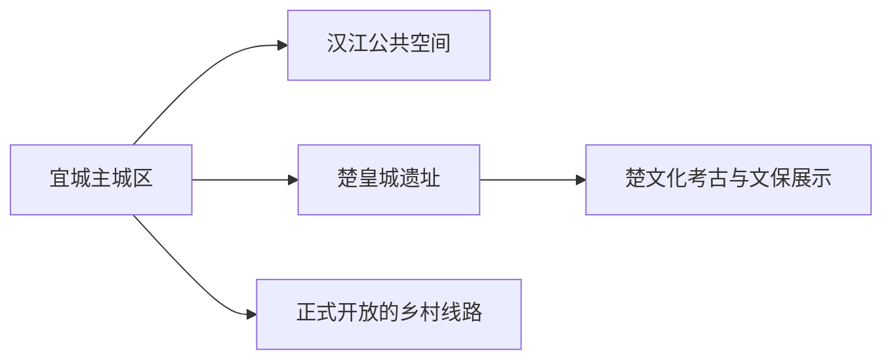
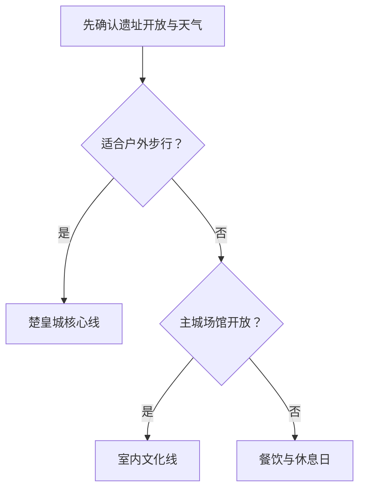

# 宜城旅行指南

宜城位于襄阳南部，适合围绕楚皇城遗址、汉江城市生活和楚文化考古线索安排一段安静的县级市旅行。第一次到访可住宜城主城区，把楚皇城遗址单独留出半天，并用地方餐饮和公共文化补足城市尺度。

## 城市速览

| 项目 | 信息 |
|---|---|
| 旅行主线 | 宜城主城、楚皇城遗址、汉江公共空间、楚文化与地方饮食 |
| 建议停留 | 1 天完成主城与楚皇城；2 天加入正式乡村或汉江主题线路 |
| 住宿基地 | 主城区适合餐饮、补给与往返；远郊通常按半日车辆行程安排 |
| 步行强度 | 主城低至中等；遗址中等，夏季高温会放大体力消耗 |
| 主要天气 | 夏季高温、强对流、暴雨与汉江汛情；冬季湿冷和大雾 |
| 预约核心 | 公共场馆、遗址开放与讲解、远郊车辆和返程 |
| 边界重点 | 考古与文保范围、汉江行洪空间、农业生产区按公告使用 |
| 标识说明 | 固定 GeoNames 点是宜城主城驻地；法定市域以代码 `420684` 为准 |

## 城市格局与游览区域

宜城市是襄阳市代管的县级市。GeoNames `1786759` 是固定清单中的宜城城市点，Wikidata `Q1199240` 的 `P1566` 指向行政记录 `1786754`；页面定位和法定区划分别采用对应标识，避免把主城居民点等同于完整市域边界。

| 区域 | 旅行价值 | 怎么安排 |
|---|---|---|
| 宜城主城区 | 到达、住宿、公共文化、餐饮和汉江城市生活 | 抵达日或半日 |
| 楚皇城遗址方向 | 楚文化、城址格局和考古历史 | 与主城组成完整一日，优先预约讲解 |
| 汉江公共空间 | 城市滨水观察与日常生活 | 选择有照明、护栏和管理的短段 |
| 市域乡村方向 | 农业、村落与季节活动 | 仅将接待明确的项目纳入第二日 |

## 主要景点

| 景点 | 所在区域 | 类型 | 核心看点 | 建议用时 | 室内/室外 | 体力 | 预约难度 | 天气敏感度 | 适合旅程 |
|---|---|---|---|---|---|---|---|---|---|
| 宜城公共文化场馆 | 主城区 | 地方史与公共文化 | 宜城历史、楚文化线索与当期展陈 | 1–2 小时 | 室内 | 低 | 中 | 低 | A |
| 楚皇城城址 | 郑集方向 | 全国重点文物保护单位 | 古城垣、遗址尺度与楚文化背景 | 2–3 小时 | 室外为主 | 中 | 高 | 高 | A |
| 汉江主城公共岸线短段 | 主城区 | 城市滨水空间 | 汉江地理、城市生活与季节水情 | 1–2 小时 | 室外 | 低 | 低 | 极高 | B |
| 正式开放的楚文化展示点 | 市域 | 考古与文化 | 出土文物背景、遗址保护与地方叙事 | 1–2 小时 | 混合 | 低至中 | 高 | 中 | B |
| 正规乡村接待项目 | 市域乡村 | 乡村与农业 | 季节农产、村落生活和地方饮食 | 2–4 小时 | 混合 | 中 | 高 | 高 | C |

楚皇城以文保范围和现场游线为准，考古工作区、封闭遗迹和保护围挡保持原有用途。汉江河滩、堤防作业区与行洪空间根据水利和防汛安排开放，汛期使用正式公共岸线。

## 美食与餐饮

| 类型 | 适合场景 | 份量 | 过敏与饮食提示 | 怎么选 |
|---|---|---|---|---|
| 宜城大虾 | 多人晚餐 | 常按份或重量 | 甲壳类过敏、辣椒、油盐与一次性手套交叉接触 | 先问规格、计价、辣度和配菜 |
| 宜城盘鳝等鳝鱼菜 | 地方正餐 | 适合分享 | 鱼刺、油炸、花椒与辣椒 | 选择明码标价餐馆并确认做法 |
| 襄阳牛肉面等面食 | 早餐或简餐 | 单人友好 | 小麦、牛肉、辣椒与汤底 | 先试小份，按口味调整辣度 |
| 汉江鱼与家常菜 | 多人正餐 | 多为共享 | 鱼刺、水产过敏和酱油 | 询问来源、重量和烹饪方式 |

## 经典行程

### 一日经典路线

**路线**：宜城公共文化场馆 → 午餐 → 楚皇城遗址 → 返回主城

- **串联逻辑**：先看地方史，再到遗址理解城址尺度。
- **预约锚点**：场馆、遗址开放、讲解和往返车辆。
- **休息安排**：午餐长休，遗址入口确认遮阴和卫生间。
- **时间不足时**：保留楚皇城与一顿地方餐。

### 两日城市路线

**第 1 天**：主城与楚皇城 
**第 2 天**：正式乡村项目 → 汉江公共岸线短段

- **串联逻辑**：历史主线与当代城乡生活分日。
- **预约锚点**：乡村接待、车辆和汉江岸线状态。
- **休息安排**：第二日午间回到有空调和卫生间的餐饮点。
- **时间不足时**：删除乡村项目。

### 三日深度路线

**第 1 天**：宜城主城 
**第 2 天**：楚皇城遗址与楚文化讲解 
**第 3 天**：一条正式乡村或汉江主题线路

- **串联逻辑**：城市、遗址和市域体验分别成日，减少高温连续暴晒。
- **预约锚点**：讲解、第三日接待、天气与车辆。
- **休息安排**：户外均拆为早晚短段。
- **时间不足时**：优先删除第三日。

### 雨天与高温路线

**路线**：主城室内场馆 → 午餐长休 → 傍晚短段城市公共空间

- **适用条件**：普通降雨或高温日；暴雨、雷电和汛情预警按公告调整。
- **预约锚点**：场馆、公共岸线和城市交通。
- **休息安排**：中午完整留在室内。
- **时间不足时**：只留场馆与午餐。

### 亲子路线

**路线**：主城场馆 → 午餐 → 楚皇城讲解短线

- **适用条件**：讲解适龄、天气舒适且现场有明确步行线。
- **预约锚点**：亲子讲解、遮阴、卫生间和车辆。
- **休息安排**：遗址每小时回入口或遮阴点休息。
- **时间不足时**：保留主城场馆。

### 低体力路线

**路线**：车辆抵达主城场馆 → 午餐长休 → 楚皇城落客点附近核心观察

- **适用条件**：落客、地面、座椅和天气条件已确认。
- **预约锚点**：无障碍入口、轮椅、卫生间与陪同。
- **休息安排**：遗址只走平缓短段。
- **时间不足时**：只留主城场馆。

### 楚皇城专题路线

**路线**：主城出发 → 楚皇城讲解 → 城址公开步行线 → 午餐 → 返回

- **适用条件**：遗址开放、天气和讲解均稳定。
- **预约锚点**：讲解、开放范围、车辆和返程。
- **休息安排**：选择凉爽时段步行，午间进入室内。
- **时间不足时**：只看核心城址和展示。

## 住宿区域

| 区域 | 优点 | 取舍 | 适合人群 | 核对项 |
|---|---|---|---|---|
| 宜城主城区 | 餐饮、补给、车辆和临时改线方便 | 前往遗址与乡村仍需接驳 | 首访、独行、公共交通旅行 | 电梯、空调、停车、早餐与夜间入住 |
| 市域正规乡村住宿 | 靠近专项乡村体验 | 服务密度和返程弹性较低 | 自驾、慢游、已确认活动者 | 证照、消防、餐食、通信和退改 |

## 市内交通

宜城可通过铁路和公路与襄阳等城市衔接。主城区用公交、出租车和短段步行；楚皇城及乡村方向需核对城乡公交、正规包车或自驾。宜城站、襄阳各铁路站和实际住宿不是同一地点，购票和接驳按完整站名安排。

| 场景 | 怎么做 | 行前核对 |
|---|---|---|
| 铁路抵达 | 按票面完整站名进入宜城，再转主城 | 车次、站前接驳、末班 |
| 主城移动 | 公交或短程车辆连接场馆、餐饮和住宿 | 首末班、施工、高温与积水 |
| 楚皇城方向 | 预先确认往返车辆与等候方式 | 开放、道路、返程和讲解 |

## 不同旅行者须知

| 旅行者 | 推荐做法 | 重点核对 |
|---|---|---|
| 独行 | 住主城，遗址采用当天可闭环的车辆方案 | 末班、返程和夜间入住 |
| 亲子 | 主城场馆加楚皇城适龄短线 | 遮阴、饮水、卫生间与过敏原 |
| 长者与低体力 | 车辆串联并把户外缩到凉爽时段 | 坡度、座椅、轮椅和医疗点 |
| 摄影 | 遗址与汉江分时段安排 | 文保、无人机、汛情与日晒 |
| 夏季旅行 | 早晚户外、中午室内 | 高温、雷电、暴雨和药物保存 |

## 行前核对

- 宜城市政府与襄阳文旅部门：场馆、楚皇城、活动和接待动态。
- 湖北文物主管部门：楚皇城保护范围、开放线和考古工作安排。
- 中国铁路 12306：宜城及襄阳方向车次、完整站名和退改。
- 湖北省气象、水利与应急部门：高温、暴雨、雷电和汉江汛情。

## 来源与更新记录

| 来源 | 支持内容 | 核验日期 |
|---|---|---|
| [宜城市人民政府](http://www.ych.gov.cn/) | 市情、交通、公共服务与当期动态入口 | 2026-08-30 |
| [湖北省文化和旅游厅：楚皇城](https://wlt.hubei.gov.cn/bmdt/ztzl/zshb/201912/t20191226_1799413.shtml) | 楚皇城历史、位置与文旅价值 | 2026-08-30 |
| [湖北省自然资源厅：楚皇城保护相关项目](https://zrzyt.hubei.gov.cn/zdwwgk/Zdgk/nzdgzs/147489/z20241219_467095.aspx?AreaCode=420600) | 遗址保护与建设边界 | 2026-08-30 |
| [Wikidata Q1199240](https://www.wikidata.org/wiki/Q1199240) | 法定宜城市与 GeoNames 标识关系 | 2026-08-30 |
| [GeoNames 1786759](https://www.geonames.org/1786759/) | 固定清单宜城城市点 | 2026-08-30 |
| [中国铁路 12306](https://www.12306.cn/) | 列车、站名与购票动态 | 2026-08-30 |

| 日期 | 更新 |
|---|---|
| 2026-08-30 | 首次完成宜城主城、楚皇城、汉江公共空间与楚文化旅行研究。 |
