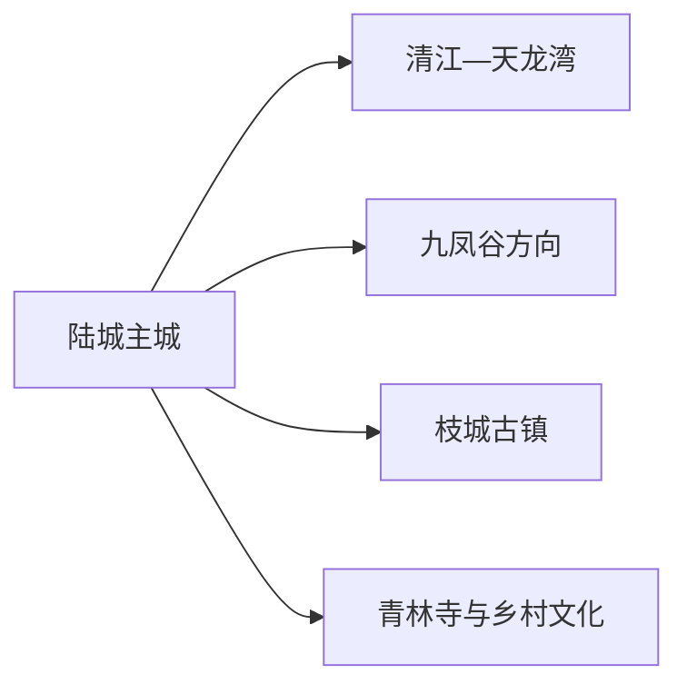
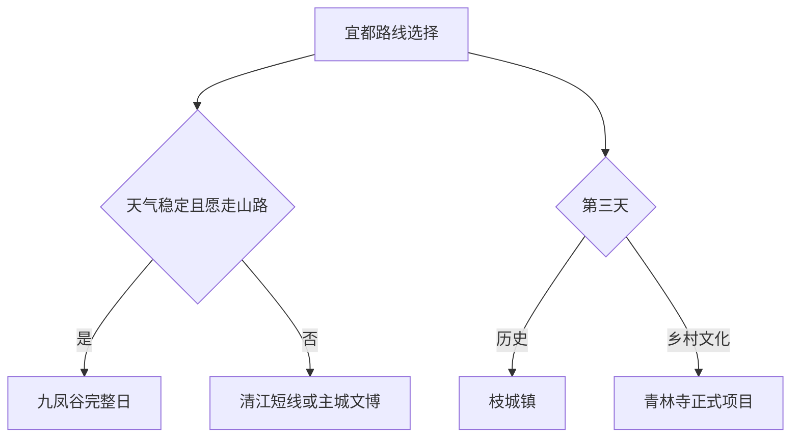

# 宜都旅行指南

宜都位于长江与清江交汇区域，旅行主题可以分成陆城主城、清江水岸、九凤谷山地和枝城古镇。每个远点方向都依赖公路和天气，最实用的安排是以陆城住宿为基点，每天选择一条完整路线。

> 建议停留：2–3 天 
> 旅行关键词：清江、三峡九凤谷、天龙湾、枝城、杨守敬 
> 主要体力：中等；山谷与水岸可达较高强度 
> 最近研究：2026-08-12

## 城市速览

| 项目 | 旅行信息 |
|---|---|
| 主要旅行价值 | 在陆城认识宜都地方文化，以九凤谷或天龙湾体验清江山水，再到枝城理解长江港镇。 |
| 建议停留 | 1 天主城加一个近点；2 天增加九凤谷或天龙湾；3 天再去枝城或一条乡村线。 |
| 较舒适季节 | 春秋适合山谷和古镇；夏季水景突出但炎热多雨，冬季关注山路结冰。 |
| 预算特点 | 主城住宿餐饮可控，景区票务、船线和跨镇车辆是主要增量。 |
| 步行强度 | 主城较低，峡谷步道、瀑布和大景区内部交通提高负担。 |
| 主要天气风险 | 高温、雷暴、强降雨、山洪、滑坡、水位调度和大雾。 |
| 独行旅行 | 主城方便，景区返程和山区通信提前落实。 |
| 亲子旅行 | 地方文博、清江科普和景区短线可选，水边与栈道持续看护。 |
| 长者与低体力旅行 | 每天一个景区，优先观光车、短线和主城午休。 |
| 无障碍信息 | 古镇、峡谷、船舶和景区交通之间的设施连续性需向官方确认。 |

### 城市身份与边界

宜都是宜昌市代管的县级市 **420581**。固定 **GeoNames 1784554** 实际对应枝城镇，法定城市实体采用 **Wikidata Q282948**，其 `P1566=1786728` 指向宜都行政记录。枝城作为宜都市内部组团由本页承接；宜昌主城、枝江市和当阳市另作独立行程。

## 城市格局与游览区域

| 区域 | 主要内容 | 游览特点 | 与其他区域的关系 |
|---|---|---|---|
| 陆城主城 | 公共文化、杨守敬文化、餐饮与住宿 | 服务最集中，适合抵达日和雨天 | 作为各远线交通基点 |
| 清江—天龙湾方向 | 水库景观、正规游船和山水体验 | 船期、水位与天气决定玩法 | 与九凤谷分日更从容 |
| 三峡九凤谷方向 | 峡谷、瀑布、步道与景区项目 | 台阶和湿滑明显，通常占完整一天 | 适合体力较好者，按开放主线游览 |
| 枝城镇 | 长江港镇、古街与工业交通历史 | 与陆城不是连续步行城区 | 适合独立半天至一天 |
| 青林寺及乡村方向 | 谜语文化、村落与季节活动 | 活动与接待动态性高 | 作为第三天兴趣线 |

## 主要景点

| 景点 | 区域 | 类型 | 主要看点 | 建议用时 | 室内外 | 体力 | 预约风险 | 天气影响 | 优先级 |
|---|---|---|---|---:|---|---|---|---|---|
| 三峡九凤谷景区 | 五眼泉方向 | 峡谷与瀑布景区 | 峡谷、瀑布、森林步道和当期开放项目 | 5–8 小时 | 户外 | 高 | 高 | 极高 | A |
| 天龙湾旅游度假区正式开放区 | 清江 | 水库山水与休闲 | 清江水面、山水景观、正规游船和度假设施 | 4–7 小时 | 混合 | 中 | 高 | 极高 | A |
| 宜都市博物馆 | 陆城 | 地方综合博物馆 | 宜都历史、杨守敬文化和临展 | 1.5–3 小时 | 室内 | 低 | 中 | 低 | A |
| 枝城古镇公共开放片区 | 枝城 | 港镇与历史街区 | 长江港镇格局、老街和交通工业记忆 | 2–5 小时 | 混合 | 中 | 中 | 高 | B |
| 青林寺谜语文化村正式项目 | 高坝洲方向 | 非遗与乡村文化 | 谜语文化、村落公共空间和当期活动 | 2–5 小时 | 混合 | 低至中 | 高 | 中 | B |
| 清江公共岸线短段 | 陆城 | 城市滨水 | 两江交汇区域的城市生活与短程慢行 | 1–2 小时 | 户外 | 低 | 低 | 高 | B |

清江水库、大坝、港区和航道是生产与水利空间；旅行使用公布的景区入口、游船和公共岸线。峡谷上游林地、防火道路和未开放溪沟不作为景区延伸线。

## 美食与餐饮

| 菜品或餐饮类型 | 常见区域 | 一个人用餐与常见份量 | 风味、过敏原与饮食限制 | 排队风险与替代方法 |
|---|---|---|---|---|
| 清江鱼菜 | 主城和正规餐馆 | 多按重量，适合分享 | 鱼刺、酱油、辣椒和来源需询问 | 先问鱼种、重量和价格 |
| 宜都土老憨等柑橘加工品 | 正规商店 | 小包装便于携带 | 关注糖、添加剂和保质期 | 以标签清楚产品替代散装 |
| 湖北家常菜与腊味 | 陆城、枝城 | 小炒适合单人 | 猪肉、盐分、辣椒和大豆常见 | 社区同类店可替代热门店 |
| 包谷饭、豆制品与面食 | 主城、乡镇 | 单人友好 | 大豆、小麦和共锅需确认 | 选择配料和价格明示餐馆 |

## 经典行程

### 一日经典路线

**路线**：宜都市博物馆 → 主城午餐 → 清江公共岸线短段 → 城市休息

- **串联逻辑**：先用室内展陈建立城市背景，再看两江城市空间。
- **预约锚点**：场馆开放和清江岸线管理。
- **休息安排**：午餐后坐休，傍晚短走。
- **时间不足时**：保留场馆，岸线缩短。

### 两日城市路线

**第 1 天**：陆城主城与清江岸线  
**第 2 天**：九凤谷或天龙湾完整日

- **串联逻辑**：城市与一条山水主线分日，避免在峡谷和水库间折返。
- **预约锚点**：第二天所选景区门票、交通和返程。
- **休息安排**：景区游客服务区完成午休。
- **时间不足时**：第二天只走官方短线。

### 三日深度路线

**第 1 天**：陆城  
**第 2 天**：九凤谷或天龙湾  
**第 3 天**：枝城古镇或青林寺正式项目二选一

- **串联逻辑**：第三天补充港镇或非遗主题，不重复山水项目。
- **预约锚点**：乡镇接待、场馆和车辆。
- **休息安排**：第三天在成熟镇区午休。
- **时间不足时**：第三天只留枝城老街短段。

### 雨天路线

**路线**：宜都市博物馆 → 室内午餐 → 青林寺室内活动或主城休息

- **适用条件**：普通降雨且道路正常；强降雨、山洪或地灾预警时留在主城。
- **串联逻辑**：减少水边、峡谷和山路，使用短程车辆。
- **预约锚点**：场馆与乡村活动开放。
- **休息安排**：下午只选一项。
- **时间不足时**：只保留主城场馆。

### 亲子或低体力路线

**亲子路线**：宜都市博物馆 → 午餐 → 天龙湾当日开放短线  
**低体力路线**：车辆到场馆最近入口 → 核心展陈 → 午休 → 清江岸线平缓短段

- **减负方式**：亲子优先正规船线和科普；低体力路线避开峡谷长步道。
- **预约锚点**：儿童救生、观光车、落客点、座椅和卫生间。
- **休息安排**：午间完整休息，户外只走短段。
- **时间不足时**：两线均保留场馆。

### 远郊一日路线

**路线**：陆城 → 九凤谷游客中心 → 当日开放主步道 → 游客中心休息 → 原路返回

- **适用条件**：天气稳定、景区开放且同行者可承担峡谷步行。
- **串联逻辑**：同一景区入口进出，避免翻越未开放山脊。
- **预约锚点**：门票、步道、景区交通、闭园和返程。
- **休息安排**：在游客中心和官方休息点分段坐休。
- **时间不足时**：使用官方短线，不压缩下撤时间。

## 住宿区域

| 区域 | 优点 | 代价 | 适合人群 | 交通提示 |
|---|---|---|---|---|
| 陆城主城 | 餐饮、住宿与车辆最集中 | 到远郊每天往返 | 首访、独行、多主题 | 以实际客运节点选房 |
| 枝城镇 | 方便港镇和南部方向 | 夜间服务少于陆城 | 枝城专题、自驾 | 确认到主城与车站的交通 |
| 正规景区住宿 | 便于山水慢游 | 季节营业和退改变化 | 度假、摄影 | 确认资质、餐饮、道路和接送 |

## 市内交通

宜都主要依靠公路客运、公交、出租和自驾。铁路票面站名、陆城主城、枝城镇和宜昌各站不在同一地点；前往景区时以入口和返程时间倒排行程。

| 场景 | 建议与取舍 | 行前需要重查的内容 |
|---|---|---|
| 从宜昌方向抵达 | 比较铁路、公路与门到门车辆 | 到发站、客运班次、施工和末班 |
| 陆城—枝城 | 公交、客运或正规车辆 | 班次、上客点和返程 |
| 景区远线 | 景区接驳、正规包车或自驾 | 入口、道路、停车、景区车和闭园 |
| 水上项目 | 使用公布码头和有资质船舶 | 船期、水位、风浪、救生和退改 |

## 不同旅行者须知

- **独行旅行**：以陆城为基点，远线先锁返程。
- **亲子旅行**：选择清江短线和科普活动，水边与船上持续看护。
- **长者与低体力旅行**：主城一馆一岸线，山地优先观光车和短线。
- **无障碍需求**：确认古镇路面、峡谷坡度、船舶上下、场馆电梯和卫生间。
- **自驾旅行**：每天一个方向，山路与水库道路留足驾驶休息。

## 行前核对

| 核对事项 | 建议时间 | 官方入口 |
|---|---|---|
| 九凤谷、天龙湾与乡村项目 | 订房订车前及前一日 | [宜都市人民政府](https://www.yidu.gov.cn/) |
| 水位、游船和岸线 | 排路线前及当天 | 景区、水利与交通主管部门正式公告 |
| 公路客运与铁路联程 | 购票时及当天 | [12306](https://www.12306.cn/) · 宜都交通主管部门 |
| 强降雨、山洪和地灾 | 出发前三日及当天 | [湖北省气象局](https://hb.cma.gov.cn/) |

## 来源与更新记录

### 主要来源

| 来源 | 支持内容 | 核验日期 |
|---|---|---|
| [民政部行政区划代码查询](https://dmfw.mca.gov.cn/) | 宜都市 420581 与宜昌代管关系 | 2026-08-12 |
| [Wikidata Q282948](https://www.wikidata.org/wiki/Q282948) | 法定宜都市与行政记录 | 2026-08-12 |
| [GeoNames 1784554](https://www.geonames.org/1784554/zhicheng.html) | 固定枝城镇点 | 2026-08-12 |
| [宜都市人民政府](https://www.yidu.gov.cn/) | 城市、文旅、交通与动态公告入口 | 2026-08-12 |
| [湖北省文化和旅游厅](https://wlt.hubei.gov.cn/) | 宜都景区名录与文旅动态入口 | 2026-08-12 |
| [湖北省气象局](https://hb.cma.gov.cn/) | 强降雨、雷暴和高温动态入口 | 2026-08-12 |

### 更新记录

| 日期 | 更新内容 |
|---|---|
| 2026-08-12 | 首次整理宜都实体、陆城—清江—九凤谷—枝城空间、路线、住宿、交通与水利边界。 |
