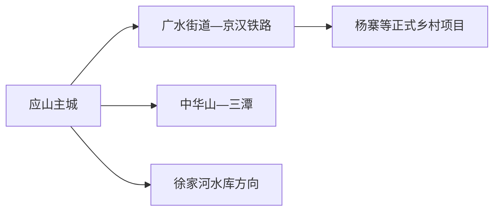
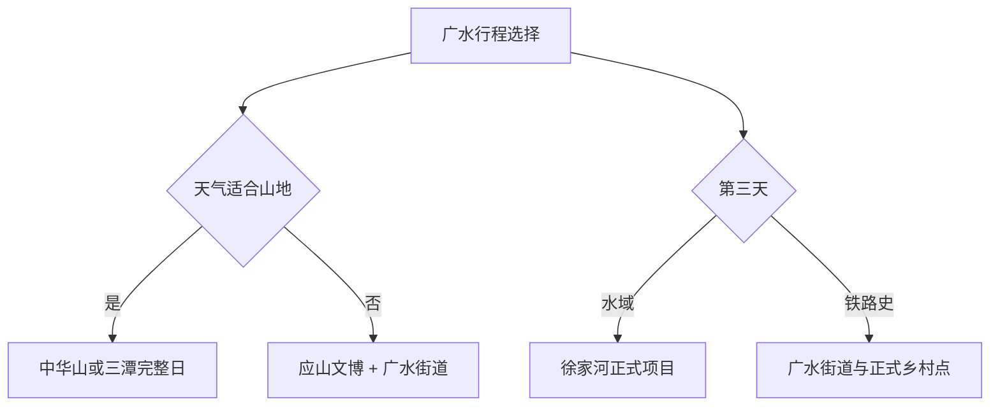

# 广水旅行指南

广水位于鄂北，主城通常指应山街道一带，而固定 GeoNames 点对应东部广水街道。旅行可按应山主城、中华山—三潭山地、徐家河水库和京汉铁路历史四个方向理解；远点之间跨度大，每天选择一条主线更稳妥。

> 建议停留：2–3 天 
> 旅行关键词：中华山、三潭、徐家河、京汉铁路、拐子饭 
> 主要体力：中等；山地路线较高 
> 最近研究：2026-08-12

## 城市速览

| 项目 | 旅行信息 |
|---|---|
| 主要旅行价值 | 以中华山—三潭认识鄂北山林，在应山与广水街道观察双中心城市和京汉铁路记忆。 |
| 建议停留 | 1 天应山主城与一个近点；2 天增加山地；3 天再选徐家河或铁路乡村线。 |
| 较舒适季节 | 春秋适合山地和水库；夏季早晚游览并防雷雨，冬季关注山路结冰。 |
| 预算特点 | 主城餐饮住宿可控，山地车辆、景区票务和远线住宿是主要增量。 |
| 步行强度 | 主城较低，中华山和三潭存在坡道、台阶和长步道。 |
| 主要天气风险 | 高温、雷暴、强降雨、山洪、滑坡、水库调度和森林火险。 |
| 独行旅行 | 应山住宿和餐饮较方便，山地返程先落实。 |
| 亲子旅行 | 城市文博、水库公共景观与景区短线可选，山水边持续看护。 |
| 长者与低体力旅行 | 一天一个片区，车辆连接，山地采用最短开放线。 |
| 无障碍信息 | 山地、乡村、车站与水岸之间的设施连续性需向官方确认。 |

### 城市身份与边界

广水是随州市代管的县级市 **421381**。固定 **GeoNames 1809879** 连接广水街道实体 **Q11062290**；法定城市采用 **Wikidata Q930230**，其 `P1566=1786589` 对应行政记录。应山与广水街道均属广水市内部组团，随州曾都主城和随县另作行程。

## 城市格局与游览区域

| 区域 | 主要内容 | 游览特点 | 与其他区域的关系 |
|---|---|---|---|
| 应山主城 | 住宿、餐饮、公共文化与城市生活 | 服务最集中，适合作为基地 | 去山地、水库和广水街道均需车辆 |
| 广水街道 | 老铁路城镇、车站与地方生活 | 与应山构成双中心，铁路历史线索较强 | 可作半日至一天，不按连续步行城区理解 |
| 中华山—三潭方向 | 森林、峡谷、瀑布和山地景区 | 步道体力和天气门槛高 | 适合独立一天 |
| 徐家河水库方向 | 水库景观、正规休闲项目 | 水位、游船、岸线和交通需核 | 与山地分日 |
| 杨寨及乡村方向 | 京汉铁路记忆、村庄规划项目和农业 | 仅把已建成且正式接待内容纳入 | 作为兴趣线，不用规划项目冒充现状开放 |

## 主要景点

| 景点 | 区域 | 类型 | 主要看点 | 建议用时 | 室内外 | 体力 | 预约风险 | 天气影响 | 优先级 |
|---|---|---|---|---:|---|---|---|---|---|
| 中华山国家森林公园正式开放区 | 北部山地 | 森林公园 | 鄂北森林、山脊景观与开放步道 | 5–8 小时 | 户外 | 高 | 高 | 极高 | A |
| 三潭风景区 | 北部山地 | 峡谷、瀑布与山地 | 山潭、瀑布、森林和景区步道 | 5–8 小时 | 户外 | 高 | 高 | 极高 | A |
| 广水市博物馆 | 应山 | 地方综合博物馆 | 广水历史、非遗、红色与铁路文化线索 | 1.5–3 小时 | 室内 | 低 | 中 | 低 | A |
| 徐家河水库正式旅游项目 | 西南方向 | 水库与休闲 | 水库景观、许可游船和岸线活动 | 4–7 小时 | 户外 | 中 | 高 | 极高 | B |
| 广水街道铁路历史片区 | 广水街道 | 城镇与铁路文化 | 京汉铁路形成的城镇格局、车站周边公共空间 | 2–4 小时 | 混合 | 低至中 | 中 | 中 | B |

中华山和三潭是两套景区入口，选其一即可形成完整山地日。徐家河水库的供水、防洪、渔业和工程空间不因邻近旅游项目而开放；水上体验使用公告明确的码头和船舶。

## 美食与餐饮

| 菜品或餐饮类型 | 常见区域 | 一个人用餐与常见份量 | 风味、过敏原与饮食限制 | 排队风险与替代方法 |
|---|---|---|---|---|
| 马坪拐子饭 | 应山、马坪及正规早餐店 | 一人份早餐或简餐 | 猪脚、肘子等部位和卤汁需确认，常含大豆小麦 | 早餐时段选择明码标价同类店 |
| 鄂北面食与早餐 | 应山、广水街道 | 单人友好 | 小麦、芝麻、肉汤和辣椒常见 | 社区店可替代热门店 |
| 水库鱼菜 | 正规餐馆 | 多按重量，适合分享 | 鱼刺、来源、酱油和时价需确认 | 先问鱼种、重量和合法来源 |
| 湖北家常菜 | 主城、镇区 | 小炒可单人 | 花生、大豆、辣椒和肉汤常见 | 点小份或套餐控制份量 |

## 经典行程

### 一日经典路线

**路线**：广水市博物馆 → 应山午餐 → 主城公共空间 → 广水街道铁路片区短段

- **串联逻辑**：先认识市域，再用双中心城镇格局补充城市史。
- **预约锚点**：场馆开放和两城区交通。
- **休息安排**：应山午餐后完整坐休。
- **时间不足时**：保留场馆，广水街道缩短或另日安排。

### 两日城市路线

**第 1 天**：应山与广水街道  
**第 2 天**：中华山或三潭完整日

- **串联逻辑**：城市与山地分日，第二天只选一个景区。
- **预约锚点**：景区开放、交通、防火和返程。
- **休息安排**：游客中心与正式休息点分段坐休。
- **时间不足时**：第二天走官方短线。

### 三日深度路线

**第 1 天**：双中心城市线  
**第 2 天**：中华山或三潭  
**第 3 天**：徐家河正式项目或杨寨铁路乡村线二选一

- **串联逻辑**：第三天按水域或铁路兴趣选择，不重复山地。
- **预约锚点**：水上运营或乡村接待。
- **休息安排**：第三天在成熟镇区午休。
- **时间不足时**：第三天改为应山慢行。

### 雨天路线

**路线**：广水市博物馆 → 室内午餐 → 广水街道一处确认开放室内点或返回住宿

- **适用条件**：普通降雨且道路正常；暴雨、山洪和地灾预警时留在主城。
- **串联逻辑**：使用室内场馆和短程车辆，避开山谷与水库。
- **预约锚点**：场馆开放与道路。
- **休息安排**：午后只选一项。
- **时间不足时**：保留主城场馆。

### 亲子或低体力路线

**亲子路线**：广水市博物馆适龄展陈 → 午餐 → 徐家河正式科普短线或主城公园  
**低体力路线**：车辆到场馆最近入口 → 核心展陈 → 午休 → 广水街道平缓短段

- **减负方式**：亲子选择有护栏和救生管理的项目；低体力路线避开山地长线。
- **预约锚点**：儿童活动、落客点、座椅、卫生间和水上规则。
- **休息安排**：午间完整坐休，下午保留短段。
- **时间不足时**：两线都只保留场馆。

### 远郊一日路线

**路线**：应山 → 中华山或三潭游客入口 → 一条开放主线 → 游客服务区休息 → 原路返回

- **适用条件**：天气、景区、道路、防火和返程均已确认。
- **串联逻辑**：同一入口进出，不翻山串联两个景区。
- **预约锚点**：门票、步道、闭园、停车与车辆。
- **休息安排**：游客中心和官方休息点分段坐休。
- **时间不足时**：走官方短环线并留足下撤时间。

## 住宿区域

| 区域 | 优点 | 代价 | 适合人群 | 交通提示 |
|---|---|---|---|---|
| 应山主城 | 餐饮、住宿和车辆最集中 | 去广水街道与远线均需接驳 | 首访、独行、多主题 | 以实际到发站和景区方向选房 |
| 广水街道 | 方便铁路历史与东部方向 | 其他景区往返较远 | 铁路专题、探亲 | 分清广水站与主城住宿距离 |
| 正规景区住宿 | 便于山地或水库慢游 | 季节营业和替代活动少 | 自驾、摄影 | 确认资质、餐饮、供暖和返程 |

## 市内交通

广水站、广水南站等铁路节点和应山主城并非同一点。购票后先核车站位置，再选择公交、出租或正规预约车辆；山地和水库按完整白天往返估算。

| 场景 | 建议与取舍 | 行前需要重查的内容 |
|---|---|---|
| 铁路抵达 | 按票面车站与住宿地址规划 | 车次、站前交通、末班和两站关系 |
| 应山—广水街道 | 公交、客运或正规车辆 | 班次、道路施工与返程 |
| 山地与水库 | 景区接驳、正规包车或自驾 | 入口、闭园、停车、水位和天气 |
| 自驾 | 适合多组团分日 | 山路、农机、充电、酒后驾驶和夜间风险 |

## 不同旅行者须知

- **独行旅行**：住应山更方便，山地路线提前约返程。
- **亲子旅行**：优先文博和有管理的水域短线，山谷按年龄体力选择。
- **长者与低体力旅行**：主城一馆一短段，山地用最短开放路线。
- **无障碍需求**：确认车站电梯、车辆空间、景区坡度、卫生间与连续落客。
- **水域与森林旅行**：遵守水库、景区和森林防火管理，按预警及时切换主城方案。

## 行前核对

| 核对事项 | 建议时间 | 官方入口 |
|---|---|---|
| 中华山、三潭与徐家河 | 订车前及前一日 | [广水市人民政府](https://www.guangshui.gov.cn/) |
| 铁路与城乡交通 | 购票时及当天 | [12306](https://www.12306.cn/) · 广水交通主管部门 |
| 天气、山洪、火险和水位 | 出发前三日及当天 | [湖北省气象局](https://hb.cma.gov.cn/) · 属地应急水利林业公告 |
| 乡村与铁路文化项目 | 排入路线前 | 乡镇政府和运营方正式公告 |

## 来源与更新记录

### 主要来源

| 来源 | 支持内容 | 核验日期 |
|---|---|---|
| [民政部行政区划代码查询](https://dmfw.mca.gov.cn/) | 广水市 421381 与随州代管关系 | 2026-08-12 |
| [Wikidata Q930230](https://www.wikidata.org/wiki/Q930230) | 法定实体与行政记录 | 2026-08-12 |
| [GeoNames 1809879](https://www.geonames.org/1809879/guangshui.html) | 固定广水街道城市点 | 2026-08-12 |
| [广水市人民政府](https://www.guangshui.gov.cn/) | 城市、景区、交通与动态公告入口 | 2026-08-12 |
| [广水丁湾村规划](https://www.guangshui.gov.cn/zwgk/xxgkml/ggzypz_12288/ghgs/202311/P020231130638414636201.pdf) | 京汉铁路记忆、乡村项目的规划与现状边界 | 2026-08-12 |
| [湖北省文化和旅游厅](https://wlt.hubei.gov.cn/) | 湖北景区与文旅动态入口 | 2026-08-12 |

### 更新记录

| 日期 | 更新内容 |
|---|---|
| 2026-08-12 | 首次整理广水实体、双中心—山地—水库结构、路线、住宿、交通与规划边界。 |
