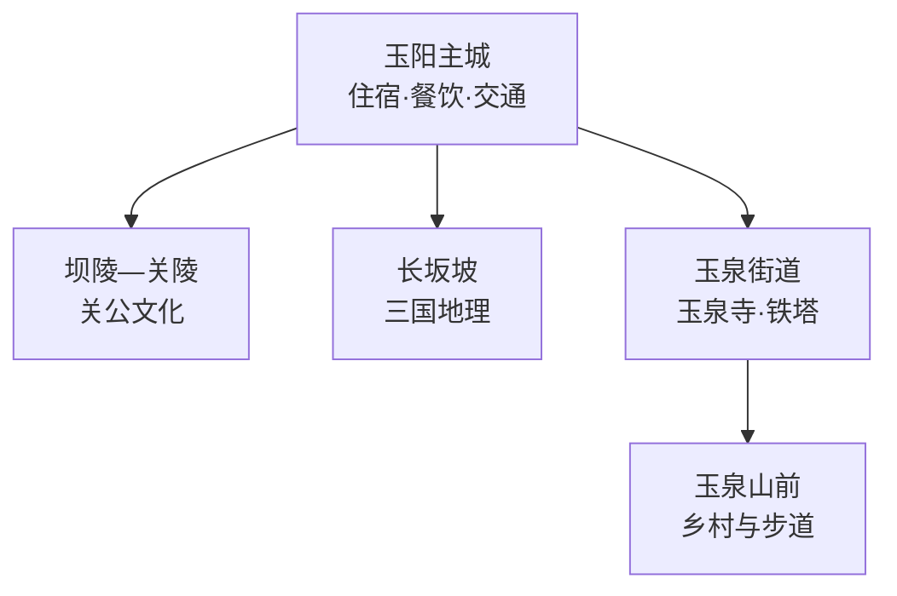
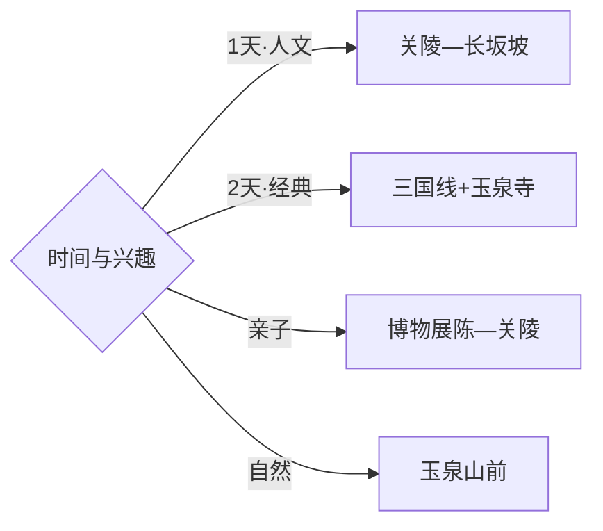

# 当阳旅行指南

当阳的旅行主线由三国文化和玉泉山共同构成：玉阳主城适合住宿与城市漫游，玉泉街道串联玉泉寺、铁塔和山前景观，关陵—长坂坡则帮助理解关羽文化与三国地理。固定快照中的 **Yuquan / GeoNames 7696240** 对应当阳玉泉街道，行政代码、坐标与核心旅行区闭合；宜昌城区、远安和荆州均按跨县市行程计算。

> 建议停留：2–3 天\
> 旅行关键词：玉泉寺、关陵、长坂坡、三国文化、沮漳河平原\
> 主要体力：主城低；寺院和玉泉山中等\
> 最近研究：2026-09-03

## 城市速览

| 项目 | 旅行信息 |
|---|---|
| 主要旅行价值 | 在关陵、长坂坡和玉泉寺之间建立三国历史、关公文化与佛教建筑的连续叙事 |
| 建议停留 | 2天覆盖主城—关陵与玉泉寺；增加乡村或河谷线可安排3天 |
| 较舒适季节 | 春秋适合户外；夏季注意高温雷雨；冬季山路湿滑和开放时间较短 |
| 预算特点 | 主城住宿消费温和，景区门票与跨片区车辆是主要变量 |
| 步行强度 | 关陵与主城较低，玉泉寺及山前路线有台阶和坡路 |
| 主要天气风险 | 高温、雷暴、短时强降雨、山洪与冬季低温湿滑 |
| 独行旅行 | 主城与关陵较易安排，玉泉山线先核对返程 |
| 亲子旅行 | 三国故事、文物建筑和乡村项目可组合，讲解能明显提升理解 |
| 长者与低体力旅行 | 选择关陵—主城—玉泉寺核心建筑短线 |
| 无障碍信息 | 城市公共空间较友好，古建筑门槛、寺院台阶和山路需逐点确认 |

## 城市格局与游览区域

| 区域 | 主要内容 | 游览特点 | 与其他区域的关系 |
|---|---|---|---|
| 玉阳主城 | 城市服务、博物展陈、长坂坡相关点位 | 适合步行与短程交通 | 作为关陵和玉泉两线共同基地 |
| 坝陵—关陵 | 关陵、庙会文化与三国主题 | 文物建筑与宗教民俗并存 | 可与主城组合为半日至一日 |
| 玉泉街道 | 玉泉寺及铁塔、山前公共空间 | 古建筑、寺院礼仪和坡路并存 | 宜留半天以上，天气好时扩展山前 |
| 王店—半月等乡村 | 柑橘、田园与公开休闲项目 | 季节性强，接待与采摘需确认 | 适合作为第三日弹性线 |
| 沮漳河及水库方向 | 河谷、水利与乡村景观 | 水情和开放边界决定可执行范围 | 只选正式开放的公共空间 |

## 主要景点

| 景点 | 区域 | 类型 | 主要看点 | 建议用时 | 室内外 | 体力 | 预约风险 | 天气影响 | 优先级 |
|---|---|---|---|---:|---|---|---|---|---|
| 玉泉寺及铁塔 | 玉泉街道 | 古建筑与宗教 | 寺院格局、铁塔、古树与玉泉山环境 | 半天 | 混合 | 中 | 法会期中 | 高 | A |
| 关陵 | 坝陵 | 文物与关公文化 | 关羽陵寝、庙宇建筑与祭祀传统 | 2–3小时 | 混合 | 低中 | 活动期中 | 中 | A |
| 长坂坡相关公开点位 | 玉阳主城 | 历史与城市 | 三国地理记忆与城市叙事 | 1–2小时 | 室外 | 低 | 低 | 中 | A |
| 当阳地方博物展陈 | 主城 | 博物馆 | 地方历史、考古与三国文化背景 | 1.5–2小时 | 室内 | 低 | 中 | 低 | B |
| 玉泉山正式开放游线 | 玉泉街道 | 山地与森林 | 山前景观、古木与寺院周边环境 | 半天 | 室外 | 中高 | 中 | 很高 | B |
| 关雎河畔公共休闲点 | 城郊 | 河岸与诗经主题 | 河岸景观和乡村休闲 | 2–3小时 | 室外 | 低 | 中 | 高 | B |
| 玉双等正规乡村旅游点 | 玉泉方向 | 乡村 | 花田、果园与村落公共体验 | 半天 | 室外 | 低 | 季节高 | 高 | C |
| 官道河等批准开放水利景观区 | 市域 | 水库与山水 | 水域、坝体外公共景观与乡村环境 | 半天 | 室外 | 低中 | 高 | 很高 | C |

## 美食与餐饮

| 菜品或餐饮类型 | 常见区域 | 一个人用餐与常见份量 | 风味、过敏原与饮食限制 | 排队风险与替代方法 |
|---|---|---|---|---|
| 郭场火锅鸡 | 主城及郭场方向 | 更适合多人；独行先问小锅或套餐 | 鸡肉、辣椒和油脂较明显 | 晚餐高峰提前到，主城有同类替代 |
| 当阳双莲鸡 | 主城、正规餐馆 | 多为共享菜 | 鸡肉、酱料与烹调油按口味选择 | 先确认份量和计价 |
| 炸胡椒与土家家常菜 | 主城与乡镇 | 小份易搭配米饭 | 发酵、辣椒和盐度较突出 | 选择明码标价家常餐馆 |
| 柑橘与季节果品 | 市场、正规采摘点 | 单份易买 | 按酸度和个人血糖情况选择 | 采摘前确认成熟度与计价 |
| 宜昌风味面食与早餐 | 玉阳主城 | 单碗友好 | 面筋、花生、芝麻和辣油先询问 | 早间选择多，错峰即可 |

## 经典行程

### 一日经典路线

**路线**：关陵 → 主城午餐 → 长坂坡相关公开点位 → 当阳地方博物展陈

- **串联逻辑**：用关陵实物建筑进入关公文化，再回主城补全三国地理和地方历史。
- **预约锚点**：关陵开放、博物场馆预约与讲解。
- **休息安排**：主城午餐，场馆内安排坐席休息。
- **时间不足时**：保留关陵与博物展陈，长坂坡做短停。

### 两日城市路线

**第 1 天**：关陵 → 长坂坡 → 主城展陈。\
**第 2 天**：玉泉寺及铁塔 → 玉泉山正式开放短线。

- **串联逻辑**：三国文化与寺院山地分日，降低信息和体力负担。
- **预约锚点**：寺院活动、山地开放与车辆。
- **休息安排**：主城连住；玉泉寺山门与正式服务点休息。
- **时间不足时**：第二日只保留寺院核心建筑。

### 三日深度路线

**第 1 天**：玉阳主城与长坂坡。\
**第 2 天**：关陵—坝陵文化线。\
**第 3 天**：玉泉寺，或按季节选择正规乡村项目。

- **串联逻辑**：城市史、关公文化和山前乡村各自展开。
- **预约锚点**：讲解、乡村接待与第三日天气。
- **休息安排**：主城连住，远线预留返程缓冲。
- **时间不足时**：先删乡村项目，再把主城与关陵合并。

### 雨天路线

**路线**：地方博物展陈 → 主城午餐 → 关陵有遮蔽建筑段 → 城市公共文化空间

- **适用条件**：普通降雨采用人文线；强降雨预警时减少河岸和山地移动。
- **预约锚点**：场馆、关陵临时关闭与交通。
- **休息安排**：场馆、主城商业区和关陵游客服务点。
- **时间不足时**：保留博物展陈和关陵一处。

### 亲子或低体力路线

**亲子路线**：地方博物展陈 → 关陵讲解 → 主城休息。\
**低体力路线**：关陵核心建筑 → 长坂坡短停 → 城市公园。

- **减负方式**：以车辆连接，用讲解替代长距离步行，玉泉山留给体力更好的一天。
- **预约锚点**：儿童讲解、无障碍入口和停车。
- **休息安排**：主城与景区正式休息区。
- **时间不足时**：保留关陵单点并安排讲解。

### 玉泉山一日路线

**路线**：主城早出发 → 玉泉寺及铁塔 → 午间休息 → 玉泉山正式开放短线 → 返回

- **适用条件**：适合天气稳定且寺院、山地正常开放的日期。
- **预约锚点**：寺院活动、防火与游线开放。
- **休息安排**：山门、寺院外正规服务点和主城。
- **时间不足时**：保留寺院与铁塔，取消上行步道。

### 三国文化路线

**路线**：长坂坡相关公开点位 → 当阳地方展陈 → 关陵 → 庙会或文化活动公开场次

- **串联逻辑**：依次理解战事地理、地方史料、关羽陵寝与当代传承。
- **预约锚点**：场馆讲解、关陵活动和演出时间。
- **休息安排**：主城午餐，关陵游客区休息。
- **时间不足时**：保留关陵和地方展陈两点。

## 住宿区域

| 区域 | 优点 | 缺点 | 适合人群 | 交通特点 |
|---|---|---|---|---|
| 玉阳主城 | 餐饮、住宿和公共交通集中 | 与玉泉山有一定距离 | 首访、独行、公共交通旅行者 | 适合作为两条主线共同基地 |
| 坝陵—关陵周边正规住宿 | 靠近关公文化点位 | 夜间选择少于主城 | 文化主题、活动期旅行者 | 订房前核对到主城和景区距离 |
| 玉泉街道正规住宿 | 便于寺院和山前早出发 | 餐饮与交通选择较少 | 山地慢游、摄影 | 依赖公路接驳 |
| 乡村正规民宿 | 安静、适合季节体验 | 位置分散、退改差异大 | 自驾、乡村休闲 | 确认具体村镇和返程路线 |

## 市内交通

| 场景 | 建议与取舍 | 行前需要重查的内容 |
|---|---|---|
| 从宜昌或荆州抵达 | 铁路、公路按到发站与总耗时选择，抵达后先落脚玉阳主城 | 车次、客运站与末班 |
| 主城—关陵 | 距离较近，可用公交、出租或自驾组合 | 活动期交通组织与停车 |
| 主城—玉泉寺 | 留半天以上，公共交通不足时落实正规车辆 | 景区接驳、返程和道路 |
| 乡村与水库方向 | 每天只选一条方向，按接待与天气取舍 | 水情、道路、防火和补给 |

## 不同旅行者须知

| 旅行维度 | 可行条件 | 主要取舍 | 需额外核对 |
|---|---|---|---|
| 独行旅行 | 主城与关陵服务较集中 | 玉泉及乡村末段交通较少 | 末班、叫车覆盖与返程 |
| 亲子旅行 | 三国故事和博物展陈易建立兴趣 | 古建筑与山路需控制时长 | 讲解、护栏与休息点 |
| 长者或低体力旅行 | 关陵—主城短线较轻松 | 寺院台阶和玉泉山负担较高 | 接驳、坡度和座椅 |
| 无障碍需求 | 主城场馆优先 | 古建筑门槛和山路连续性有限 | 无障碍入口、坡道与卫生间 |
| 摄影旅行 | 寺院、古建筑和田园题材丰富 | 宗教与文物场所规则不同 | 三脚架、人物同意与航拍 |
| 预算有限 | 主城住宿餐饮成本较稳 | 远线包车增加支出 | 公交、拼车和退改 |
| 晚出发或紧凑行程 | 关陵或主城展陈可做半日 | 玉泉山适合完整半天以上 | 最晚入场与返程 |
| 特殊天气或自然条件 | 普通小雨可转文博线 | 雷暴、暴雨和火险影响山地 | 气象、景区和道路公告 |

玉泉寺、关陵等宗教与文物场所按开放区域、祭祀礼仪和文物保护规则参访；山林、河道、水库、灌渠及水利设施使用正式景区或公共空间。坝陵化工园、农业果园和村落分别承担生产与生活功能，工业设施、仓储后场和田地选择获得许可的参观或接待范围。

## 行前核对

| 核对事项 | 为什么需要重查 | 建议核对时间 | 官方入口 |
|---|---|---|---|
| 玉泉寺与铁塔开放 | 法会、文物维护和防火会调整路线 | 出发前一周及当天 | [当阳市人民政府](http://www.dangyang.gov.cn/) |
| 关陵票务与活动 | 庙会、祭典和客流会影响参观 | 到访前一周及当天 | [湖北省文化和旅游厅](https://wlt.hubei.gov.cn/) |
| 博物展陈和讲解 | 场馆开放、预约与临展会变化 | 排入行程前及到访前一日 | [湖北当阳网](https://www.hbdangyang.com/) |
| 雷暴、地灾与森林火险 | 玉泉山和乡村线受天气直接影响 | 出发前三日及当天 | [湖北省气象局](http://hb.cma.gov.cn/) |
| 铁路与公路接驳 | 到发站、班次和末班会变化 | 购票前及当天 | [中国铁路12306](https://www.12306.cn/) |

## 来源与更新记录

### 主要来源

| 来源 | 类型 | 支持内容 | 核验日期 |
|---|---|---|---|
| [当阳市人民政府](http://www.dangyang.gov.cn/) | 政府 | 市域管理、公共服务与动态公告入口 | 2026-09-03 |
| [湖北省文化和旅游厅：长江主题旅游线路](https://wlt.hubei.gov.cn/bmdt/dtyw/202305/t20230506_4652665.shtml) | 政府部门 | 玉泉寺、关陵与宜昌区域文旅关系 | 2026-09-03 |
| [湖北省全国重点文物保护单位名录](https://wlt.hubei.gov.cn/bsfw/bmcxfw/wwbhdwml/202309/t20230928_4871978.shtml) | 政府名录 | 玉泉寺及铁塔、关陵文物身份 | 2026-09-03 |
| [GeoNames 7696240](https://www.geonames.org/7696240/) | 开放数据 | Yuquan 固定人口点、坐标与行政代码 | 2026-09-03 |

### 更新记录

| 日期 | 更新内容 |
|---|---|
| 2026-09-03 | 首次完成资料研究、空间拆分、七条路线与县级市映射 |
