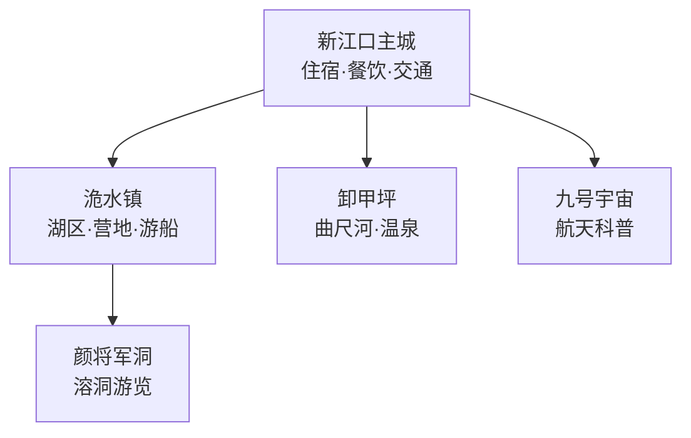
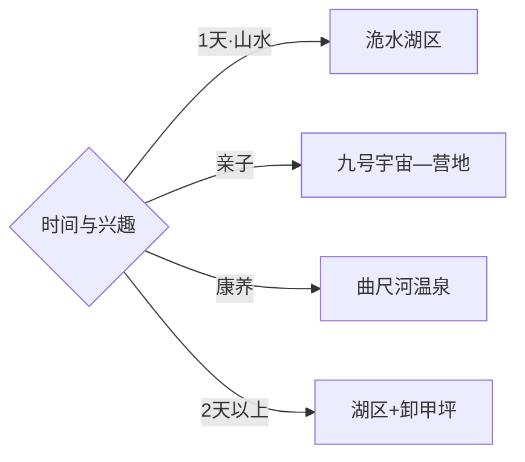

# 松滋旅行指南

松滋从江汉平原南缘延伸到武陵山余脉，路线选择很清楚：新江口主城负责住宿和补给，洈水湖适合完整的山水度假日，卸甲坪—曲尺河适合温泉与峡谷慢游，九号宇宙则偏亲子科普。固定快照中的 **Nanhai / GeoNames 7696234** 位于松滋市南海镇，行政代码和坐标均落在现行县级市范围内；荆州主城、公安县和湖南石门按跨县市行程计算。

> 建议停留：2–4 天\
> 旅行关键词：洈水湖、曲尺河、九号宇宙、颜将军洞、土家山地\
> 主要体力：主城低；湖区中等；峡谷与洞穴中等至较高\
> 最近研究：2026-09-03

## 城市速览

| 项目 | 旅行信息 |
|---|---|
| 主要旅行价值 | 在洈水百岛湖景、武陵山前峡谷、航天科普和江汉平原饮食之间组合多样路线 |
| 建议停留 | 2天覆盖洈水与主城；3–4天可加入曲尺河、九号宇宙或乡村线 |
| 较舒适季节 | 春秋适合户外；夏季水上体验丰富，同时需关注高温雷雨；冬季适合温泉 |
| 预算特点 | 主城消费温和，湖区船票、温泉住宿和远线车辆是主要变量 |
| 步行强度 | 主城较低，洈水岛屿与颜将军洞中等，曲尺峡步道按开放段增加 |
| 主要天气风险 | 高温、雷暴、山洪、地质灾害、库区大风与冬季道路湿滑 |
| 独行旅行 | 主城易安排，湖区和卸甲坪先落实返程或住宿 |
| 亲子旅行 | 九号宇宙、洈水正规游船与营地项目可组合，按年龄和天气选项目 |
| 长者与低体力旅行 | 选择主城—九号宇宙—洈水岸边短线，温泉项目先看健康提示 |
| 无障碍信息 | 新建场馆相对友好，洞穴、岛屿、峡谷和村落连续性需逐点确认 |

## 城市格局与游览区域

| 区域 | 主要内容 | 游览特点 | 与其他区域的关系 |
|---|---|---|---|
| 新江口主城 | 住宿、餐饮、城市公共文化 | 抵达与换乘最稳妥 | 作为洈水和卸甲坪两条远线共同基地 |
| 洈水镇 | 洈水景区、百岛画廊、汽车露营地 | 湖区项目多，适合完整一天 | 可与颜将军洞组合，控制同日项目数量 |
| 九号宇宙片区 | 航天科技文化旅游区 | 室内外结合，亲子与雨天适配度较高 | 可安排在抵达日或洈水前后 |
| 卸甲坪—曲尺河 | 温泉、峡谷、土家乡村 | 距主城远，山路和天气影响明显 | 适合住一晚或单独往返 |
| 南海—平原乡镇 | 湖荡、农业与地方生活 | 以公共空间和正规接待点为主 | 适合作为季节性补充 |

## 主要景点

| 景点 | 区域 | 类型 | 主要看点 | 建议用时 | 室内外 | 体力 | 预约风险 | 天气影响 | 优先级 |
|---|---|---|---|---:|---|---|---|---|---|
| 洈水景区 | 洈水镇 | 湖泊与度假 | 百岛湖景、正规游船和水上休闲 | 1天 | 室外 | 中 | 节假日高 | 很高 | A |
| 洈水汽车露营地 | 洈水镇 | 户外营地 | 房车、露营与团队活动 | 半天–1天 | 室外 | 低中 | 周末高 | 高 | A |
| 九号宇宙航天科技文化旅游区 | 市域中部 | 科普场馆 | 航天主题展陈和互动体验 | 2–4小时 | 混合 | 低 | 中高 | 低 | A |
| 颜将军洞 | 洈水方向 | 溶洞 | 喀斯特洞穴与地下景观 | 2–3小时 | 室内 | 中 | 中 | 中 | B |
| 曲尺河温泉度假区正规经营点 | 卸甲坪 | 温泉与峡谷 | 温泉、曲尺峡和山地村落 | 1天 | 混合 | 低中 | 周末高 | 高 | B |
| 樟木溪村公开接待区 | 洈水方向 | 乡村 | 民宿、村史与季节采摘 | 2–3小时 | 混合 | 低 | 季节中 | 中 | B |
| 洈水大坝公开观景区 | 洈水镇 | 水利景观 | 大坝工程与库区视野 | 1–2小时 | 室外 | 低 | 中 | 高 | B |
| 卸甲坪民俗公开展陈 | 卸甲坪 | 民俗 | 土家文化、地方生活与节庆 | 1–2小时 | 混合 | 低 | 活动期中 | 低 | C |

## 美食与餐饮

| 菜品或餐饮类型 | 常见区域 | 一个人用餐与常见份量 | 风味、过敏原与饮食限制 | 排队风险与替代方法 |
|---|---|---|---|---|
| 松滋鸡 | 主城与乡镇 | 多为共享菜，独行先问小锅或套餐 | 鸡肉、辣椒和油脂较明显 | 晚餐高峰提前到，主城同类店较多 |
| 洈水鱼 | 洈水镇正规餐馆 | 多按鱼计价，适合多人 | 淡水鱼刺与称重方式先确认 | 选明码标价店，也可点小份鱼片 |
| 土家十大碗 | 卸甲坪 | 适合多人或宴席 | 肉类较多，素食和过敏原逐道询问 | 独行改点土家家常小炒 |
| 杜婆鸡、地方卤味 | 新江口主城 | 小份或拼盘较易点 | 卤料、盐度和花生芝麻需确认 | 市场与社区餐馆可寻找同类替代 |
| 米粉与早餐 | 主城 | 单碗友好 | 面筋、辣椒、花生和肉汤先询问 | 早间选择多，错峰即可 |

## 经典行程

### 一日经典路线

**路线**：新江口早出发 → 洈水大坝 → 百岛画廊正规游船 → 湖区午餐 → 营地或岸边短线

- **串联逻辑**：围绕同一湖区安排水利、湖景和休闲，减少跨镇移动。
- **预约锚点**：游船、营地项目与景区票务。
- **休息安排**：游客中心和湖区正规餐饮点。
- **时间不足时**：保留大坝与核心湖景，营地项目作为弹性项。

### 两日城市路线

**第 1 天**：九号宇宙 → 新江口主城。\
**第 2 天**：洈水景区 → 颜将军洞或露营地。

- **串联逻辑**：科普和城市线放在轻松首日，第二日完整进入湖区。
- **预约锚点**：九号宇宙、游船和洞穴开放。
- **休息安排**：主城连住；湖区午间固定休息。
- **时间不足时**：第二日只选洈水，不再加入洞穴。

### 三日深度路线

**第 1 天**：新江口—九号宇宙。\
**第 2 天**：洈水湖区。\
**第 3 天**：卸甲坪—曲尺河温泉与峡谷公开段。

- **串联逻辑**：城市科普、湖泊度假和武陵山前康养各占一天。
- **预约锚点**：第三日车辆、温泉和住宿退改。
- **休息安排**：前两晚住主城；第三日可选择正规温泉住宿。
- **时间不足时**：先删第三日，再把首日压缩为半日。

### 雨天路线

**路线**：九号宇宙 → 主城午餐 → 地方公共文化空间 → 正规温泉点

- **适用条件**：普通降雨采用室内线；强降雨和地灾预警时留在主城。
- **预约锚点**：场馆和温泉运营。
- **休息安排**：主城商业区与场馆公共区。
- **时间不足时**：保留九号宇宙，温泉顺延。

### 亲子或低体力路线

**亲子路线**：九号宇宙 → 洈水营地正规亲子项目。\
**低体力路线**：洈水大坝观景 → 湖岸短线 → 主城休息。

- **减负方式**：亲子按年龄选择项目；低体力线用车辆连接并减少洞穴、岛屿台阶。
- **预约锚点**：儿童身高规则、营地接待与湖区车辆。
- **休息安排**：场馆、游客中心和主城。
- **时间不足时**：两类路线都保留单一核心点。

### 洈水一日路线

**路线**：大坝公开观景区 → 正规游船 → 樟木溪或颜将军洞二选一 → 返回

- **适用条件**：适合风力、水位和景区运营稳定的日期。
- **预约锚点**：游船航线、岛屿开放和洞穴维护。
- **休息安排**：游客中心与正规乡村接待点。
- **时间不足时**：保留湖区，洞穴或乡村整段删除。

### 卸甲坪康养路线

**路线**：主城出发 → 曲尺峡正式开放步道 → 午餐 → 温泉正规经营点 → 返回或住宿

- **串联逻辑**：先走山地短线，再用温泉和乡村休息收尾。
- **预约锚点**：道路、步道、温泉池与住宿。
- **休息安排**：曲尺河村正规餐饮和度假区。
- **时间不足时**：保留温泉，峡谷步道按天气和体力缩短。

## 住宿区域

| 区域 | 优点 | 缺点 | 适合人群 | 交通特点 |
|---|---|---|---|---|
| 新江口主城 | 交通、餐饮和房型集中 | 前往洈水与卸甲坪需早出发 | 首访、独行、公共交通旅行者 | 适合作为多方向共同基地 |
| 洈水景区周边 | 便于湖区早晚体验 | 周末房价与餐饮选择波动 | 湖景、亲子、自驾 | 订房前核对到景区入口距离 |
| 汽车露营地正规住宿 | 项目集中、团队活动方便 | 天气对体验影响大 | 亲子、户外与房车旅行者 | 按营地规则预约和停车 |
| 曲尺河正规住宿 | 便于温泉与峡谷慢游 | 距主城远、山路较长 | 康养、低节奏旅行者 | 适合住一晚减少当天往返 |

## 市内交通

| 场景 | 建议与取舍 | 行前需要重查的内容 |
|---|---|---|
| 从荆州或宜昌抵达 | 铁路、公路按总耗时选择，先抵新江口或松滋站再接驳 | 到发站、客运班次与末班 |
| 主城—洈水 | 留完整一天，自驾或正规车辆更灵活 | 景区专线、停车与返程 |
| 主城—卸甲坪 | 距离长且有山路，适合白天出发或换宿 | 路况、地灾预警和温泉接待 |
| 湖区内部 | 游船、步行与接驳分段组合 | 航线、风力、水位和岛屿开放 |

## 不同旅行者须知

| 旅行维度 | 可行条件 | 主要取舍 | 需额外核对 |
|---|---|---|---|
| 独行旅行 | 主城餐饮住宿方便 | 远线返程选择较少 | 末班、叫车覆盖和住宿位置 |
| 亲子旅行 | 科普、营地和湖区项目丰富 | 年龄门槛与天气影响项目选择 | 儿童票、救生设备和休息点 |
| 长者或低体力旅行 | 大坝—湖岸短线较轻松 | 洞穴、岛屿和峡谷台阶较多 | 接驳、坡度和温泉健康提示 |
| 无障碍需求 | 九号宇宙等新建设施优先 | 自然景区连续通行有限 | 电梯、无障碍卫生间和游船登乘 |
| 摄影旅行 | 湖面、峡谷和乡村题材丰富 | 风力和雾气改变能见度 | 航拍、三脚架和船上器材规则 |
| 预算有限 | 主城住宿和公共观景点成本较稳 | 远线车辆与游船增加支出 | 套票、拼车和退改 |
| 晚出发或紧凑行程 | 九号宇宙或主城可做半日 | 洈水与卸甲坪适合完整白天 | 最晚入场与返程 |
| 特殊天气或自然条件 | 普通小雨可用科普线 | 雷暴、山洪、大风影响湖区和山地 | 气象、水利、景区与道路公告 |

洈水水库、松滋河及岸线按水利、防汛和景区开放范围使用，游船与水上项目选择持证运营主体。洞穴、峡谷、山林与营地按当期开放线路和森林防火要求活动；村落、果园、工厂与白云边等生产空间只在经营主体明确开放的参观区域进入。

## 行前核对

| 核对事项 | 为什么需要重查 | 建议核对时间 | 官方入口 |
|---|---|---|---|
| 洈水票务、游船与营地 | 水位、风力、维护和客流会改变运营 | 购票前及当天 | [松滋市人民政府](http://www.hbsz.gov.cn/) |
| 九号宇宙与颜将军洞 | 场馆活动、设备和洞穴维护会变化 | 到访前一日 | [湖北省文化和旅游厅](https://wlt.hubei.gov.cn/) |
| 曲尺河温泉与道路 | 住宿、池型、山路和地灾情况需确认 | 预订前及当天 | [松滋市人民政府](http://www.hbsz.gov.cn/) |
| 雷暴、山洪与库区大风 | 湖区、峡谷和山路受天气直接影响 | 出发前三日及当天 | [湖北省气象局](http://hb.cma.gov.cn/) |
| 铁路与公路接驳 | 到发站、班次和末班会变化 | 购票前及当天 | [中国铁路12306](https://www.12306.cn/) |

## 来源与更新记录

### 主要来源

| 来源 | 类型 | 支持内容 | 核验日期 |
|---|---|---|---|
| [松滋市人民政府](http://www.hbsz.gov.cn/) | 政府 | 市域管理、交通与动态公告入口 | 2026-09-03 |
| [湖北省文化和旅游厅：松滋全域旅游推介](https://wlt.hubei.gov.cn/bmdt/szyw/jz/202303/t20230314_4583452.shtml) | 政府部门 | 洈水、九号宇宙、曲尺河、颜将军洞与乡村项目 | 2026-09-03 |
| [湖北省文化和旅游厅：荆州旅游线路](https://wlt.hubei.gov.cn/bmdt/szyw/jz/202203/t20220324_4054092.shtml) | 政府部门 | 洈水与曲尺河分区线路及活动结构 | 2026-09-03 |
| [GeoNames 7696234](https://www.geonames.org/7696234/) | 开放数据 | Nanhai 固定人口点、坐标与行政代码 | 2026-09-03 |

### 更新记录

| 日期 | 更新内容 |
|---|---|
| 2026-09-03 | 首次完成资料研究、空间拆分、七条路线与县级市映射 |
