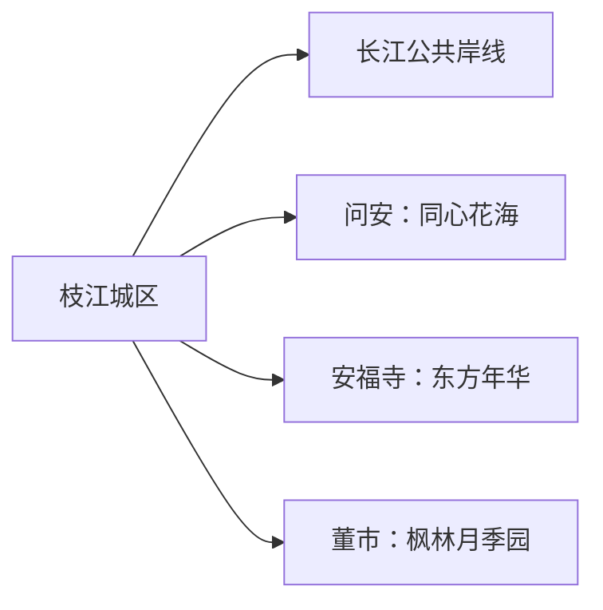
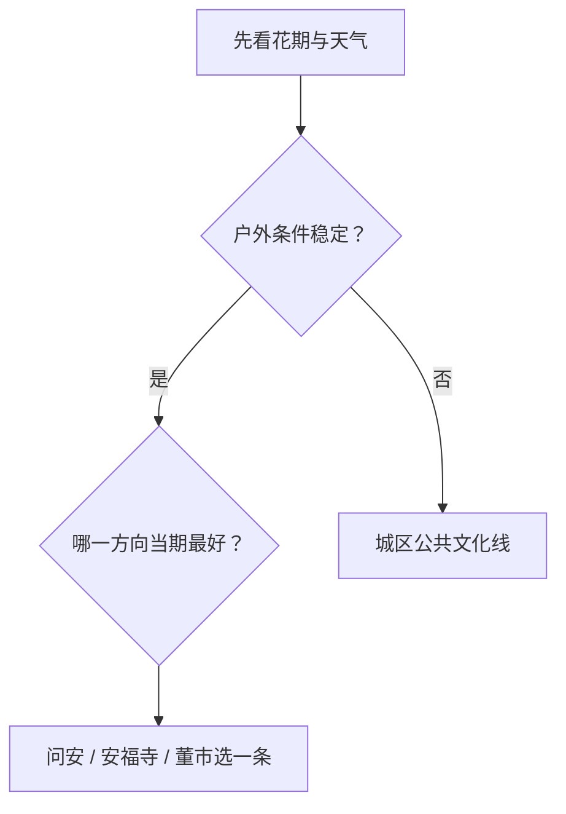

# 枝江旅行指南

枝江位于宜昌以东的长江北岸，旅行主题是河港小城、柑橘农业和分散在问安、安福寺、董市等方向的田园项目。这里更适合把城区当作住宿与补给基地，每天选择一个乡村方向；花期、采摘季和节庆对体验的影响大于固定“打卡清单”。

## 城市速览

| 项目 | 信息 |
|---|---|
| 旅行主线 | 枝江城区与公共文化、长江公共岸线、同心花海、东方年华、枫林月季园 |
| 建议停留 | 1 天选城区加一个近郊；2 天可增加另一条田园线 |
| 住宿基地 | 城区便于铁路、公路、餐饮和多方向接驳 |
| 步行强度 | 城区低至中；田园景区中等，盛夏体感较高 |
| 主要天气 | 梅雨与汛情、盛夏高温、雷暴大风、冬季湿冷 |
| 预约核心 | 花期与采摘期、景区营业、活动、县域车辆和返程 |
| 边界重点 | 长江航道、码头、堤防、水利设施、果园与农业生产地按开放范围使用 |
| 无障碍 | 先向场馆和景区核对落客点、硬化路面、卫生间与休息座椅 |

## 城市格局与游览区域

枝江市是宜昌市代管的县级市，法定代码 `420583`。GeoNames `1801455` 与 Wikidata `Q197789` 对应枝江城市实体。宜昌主城、宜都和当阳各有独立旅行尺度；枝江页负责本市城区、乡镇田园项目与属地交通。

| 区域 | 旅行价值 | 怎么安排 |
|---|---|---|
| 枝江城区 | 到达、住宿、公共文化、城市餐饮 | 抵达日或半日 |
| 长江公共岸线 | 河港城市观察与日常休闲 | 选择护栏、照明和返程明确的开放段 |
| 问安方向 | 同心花海与乡村景观 | 花期明确时留半日至一日 |
| 安福寺方向 | 东方年华与柑橘农业 | 按当期开放项目安排 |
| 董市方向 | 月季园、乡村与历史镇域 | 花期和交通都合适时选择 |

## 主要景点

| 景点 | 所在区域 | 类型 | 核心看点 | 建议用时 | 室内/室外 | 体力 | 预约难度 | 天气敏感度 | 适合旅程 |
|---|---|---|---|---|---|---|---|---|---|
| 枝江市博物馆等公共文化场馆 | 城区 | 地方史与公共文化 | 枝江历史、地方文物与当期展览 | 1–2 小时 | 室内 | 低 | 中 | 低 | A |
| 城区长江公共空间 | 城区沿江 | 城市江岸 | 长江航运、堤岸城市与日常生活 | 1–2 小时 | 室外 | 低至中 | 低 | 高 | A |
| 同心花海景区 | 问安镇 | 花田与乡村休闲 | 季节花海、乡村景观与当期活动 | 2–4 小时 | 室外 | 中 | 中高 | 极高 | A |
| 东方年华田园综合体 | 安福寺镇 | 农业与田园体验 | 柑橘农业、田园项目与季节活动 | 3–5 小时 | 室外为主 | 中 | 高 | 高 | B |
| 枫林月季园 | 董市镇 | 花卉与乡村 | 月季花期、园林与乡村景观 | 2–4 小时 | 室外 | 中 | 高 | 极高 | B |

长江公共空间以属地开放的公园、步道和观景点为准；航道、港池、装卸码头、堤防作业段和水利设施继续承担生产与防洪功能。田园项目从经营方公布的入口进入，果园、农田、温室和灌渠按生产者划定的体验范围活动。

## 美食与餐饮

| 类型 | 适合场景 | 份量 | 过敏与饮食提示 | 怎么选 |
|---|---|---|---|---|
| 枝江鱼糕与鱼丸 | 城区正餐 | 多适合分享 | 鱼类、蛋、淀粉与可能的共锅 | 先问原料、做法和小份 |
| 合规河鲜 | 城区正规餐馆 | 整鱼多为多人份 | 鱼刺、水产过敏、酱油与称重 | 看鱼种、来源、重量和总价 |
| 柑橘与果品 | 秋冬市场或正规采摘 | 按斤或果篮 | 糖分、酸度和表面处理 | 选当季、有标价和采摘规则的经营者 |
| 宜昌风味米面 | 城区早餐 | 一人份方便 | 汤底、辣椒、花生、芝麻和大豆 | 调味分开，按饮食限制询问 |

## 经典行程

### 一日经典路线

**路线**：城区公共文化 → 午餐 → 同心花海或东方年华二选一 → 返回城区

- **串联逻辑**：先认识城市，再用半日体验一个乡村方向。
- **预约锚点**：场馆开放、花期、景区营业和返程车辆。
- **休息安排**：城区午休，景区选择有遮阴与服务点的短线。
- **时间不足时**：保留城区与一个近郊核心点。

### 两日城市路线

**第 1 天**：城区公共文化与长江开放岸线 
**第 2 天**：问安、安福寺或董市选择一个完整方向

- **串联逻辑**：城市与田园分日，减少往返。
- **预约锚点**：第二日运营与天气。
- **休息安排**：两天都在成熟餐饮点安排午休。
- **时间不足时**：删除第二日。

### 花期路线

**路线**：城区 → 当期花期最稳定的正式景区 → 午餐与避晒 → 景区短线 → 返回

- **适用条件**：经营方已公布花情、入口与营业安排。
- **预约锚点**：花情、门票、停车和活动。
- **休息安排**：正午转入室内或遮阴区。
- **时间不足时**：只走主花区。

### 雨天路线

**路线**：城区公共文化场馆 → 午餐 → 商业与城市生活短段

- **适用条件**：普通降雨且交通正常；汛情或雷暴预警时按官方提示减少移动。
- **预约锚点**：场馆开放和道路积水信息。
- **休息安排**：馆内座椅与室内餐饮。
- **时间不足时**：只留一处场馆。

### 亲子路线

**路线**：城市公共文化 → 午休 → 规则清楚的田园体验短线

- **串联逻辑**：地方史与农业观察形成一个主题。
- **预约锚点**：儿童活动、采摘范围、洗手间和防晒。
- **休息安排**：户外控制在两小时左右。
- **时间不足时**：保留城区场馆。

### 低体力路线

**路线**：车辆到达城区场馆 → 午餐长休 → 江岸平缓开放段

- **串联逻辑**：用车辆连接两个服务稳定的点。
- **预约锚点**：落客、电梯、轮椅和座椅。
- **休息安排**：每处只看核心内容。
- **时间不足时**：只留场馆。

### 乡村慢游路线

**路线**：城区 → 选定乡镇景区 → 正规乡村餐饮 → 季节活动 → 返回

- **适用条件**：当天只选一个方向，运营与道路稳定。
- **预约锚点**：入口、项目、餐饮与最晚返程。
- **休息安排**：游客服务点完成补水和午休。
- **时间不足时**：删除外围项目。

## 住宿区域

| 区域 | 优点 | 取舍 | 适合人群 | 核对项 |
|---|---|---|---|---|
| 枝江城区 | 餐饮、铁路公路与多方向出发方便 | 去乡镇仍需接驳 | 首访、无车、多日旅行 | 车站接驳、停车、早餐和夜间入住 |
| 乡镇正规住宿 | 接近单一田园方向 | 供应和交通选择较少 | 自驾、花期慢游 | 合法经营、消防、供餐和退改 |

## 市内交通

枝江可利用铁路和公路抵达，城区内以公交、出租车和短步行为主。乡镇景区分布在不同方向，先确定正式入口，再选择公交、自驾或正规包车。

| 场景 | 怎么做 | 行前核对 |
|---|---|---|
| 铁路到达 | 按票面完整站名抵达，再转城区住宿 | 车次、站前交通和夜间叫车 |
| 前往乡镇 | 每天选择一个方向，预留往返 | 班次、入口、停车和末班 |
| 城区移动 | 公交、出租车与短步行组合 | 首末班、高温和道路施工 |

## 不同旅行者须知

| 旅行者 | 推荐做法 | 重点核对 |
|---|---|---|
| 独行 | 住城区，远线使用正规车辆 | 返程、司机资质和夜间到店 |
| 亲子 | 场馆加田园短线 | 农机、临水、采摘工具和卫生间 |
| 长者与低体力 | 城区与平缓江岸为主 | 台阶、遮阴、轮椅和座椅 |
| 摄影 | 花期只选一个景区 | 花情、开放时段、三脚架和无人机规则 |
| 自驾 | 每天一条乡镇线 | 停车、乡道、充电与疲劳驾驶 |

## 行前核对

- 宜昌市与枝江市文旅信息：场馆、景区、花期和活动。
- 景区运营方：入口、票务、采摘、停车和临时关闭。
- 湖北气象、水利与应急信息：高温、雷暴、汛情和长江水位。
- 中国铁路 12306：车次、完整站名与退改。

## 来源与更新记录

| 来源 | 支持内容 | 核验日期 |
|---|---|---|
| [宜昌市 A 级旅游景区名录](https://whly.yichang.gov.cn/content-61371-964057-1.html) | 同心花海、东方年华和枫林月季园的景区身份与属地 | 2026-09-01 |
| [宜昌市公共数据开放平台：枝江市博物馆](https://data.yichang.gov.cn/kf/open/table/detail/1001974) | 枝江市博物馆公共数据与文旅部门来源 | 2026-09-01 |
| [宜昌市政府：枝江夜间与亲子文旅载体](https://www.yichang.gov.cn/show-64228-1077261-1.html) | 城区夜间消费与乡村亲子项目的当前线索 | 2026-09-01 |
| [Wikidata Q197789](https://www.wikidata.org/wiki/Q197789) | 枝江市实体与 GeoNames 对齐 | 2026-09-01 |
| [GeoNames 1801455](https://www.geonames.org/1801455/) | 固定枝江城市点 | 2026-09-01 |
| [中国铁路 12306](https://www.12306.cn/) | 动态车次与购票 | 2026-09-01 |
| [湖北省气象局](http://hb.cma.gov.cn/) | 气象预警 | 2026-09-01 |

| 日期 | 更新 |
|---|---|
| 2026-09-01 | 首次完成城区、长江开放岸线与三条田园方向的旅行研究。 |
