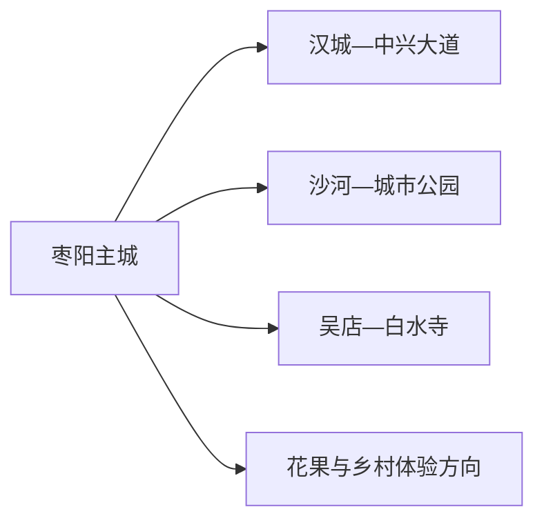
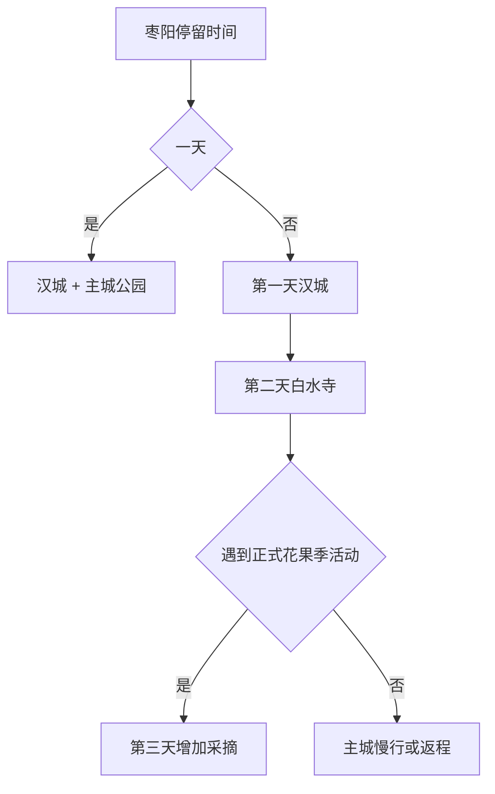

# 枣阳旅行指南

枣阳以东汉光武帝故里和汉文化为主要旅行线索，主城汉城景区适合与城市公园、地方餐饮组合；增加一天可前往吴店白水寺，并把皇桃、玫瑰等农业体验放在明确开放的季节项目里。这里适合作为襄阳与随州之间的独立县级市停留点。

> 建议停留：2 天；花果季或深度历史主题可安排 3 天 
> 旅行关键词：汉城、白水寺、光武故里、皇桃、沙河绿道 
> 主要体力：低至中等 
> 最近研究：2026-08-12

## 城市速览

| 项目 | 旅行信息 |
|---|---|
| 主要旅行价值 | 在汉城集中认识东汉主题，再到吴店白水寺连接刘秀故里历史，辅以主城公园和季节农业体验。 |
| 建议停留 | 1 天汉城与主城；2 天增加白水寺；3 天增加开放的乡村采摘或文物兴趣线。 |
| 较舒适季节 | 春秋适合户外，春夏花果季活动丰富；夏季早晚游览并避开正午高温。 |
| 预算特点 | 主城公共空间成本低，汉城票务、演出、跨镇车辆和采摘体验是主要增量。 |
| 步行强度 | 汉城面积较大，白水寺和乡村点位依赖车辆；主城绿道可按短段走。 |
| 主要天气风险 | 高温、强降雨、雷暴和乡道积水；采摘按园区与食品安全规则进行。 |
| 独行旅行 | 主城与高铁到发便利，白水寺返程先确认。 |
| 亲子旅行 | 汉城展演、城市公园和正规采摘适合亲子，演出音量、设备与水边需看护。 |
| 长者与低体力旅行 | 汉城选精华区，主城用车辆串联，白水寺安排充足坐休。 |
| 无障碍信息 | 新建景区和公共空间可能有无障碍设施，古建、台阶与乡村游线需逐点确认；设施连续性需向官方确认。 |

### 城市身份与边界

枣阳是襄阳市代管的县级市 **420683**。固定 **GeoNames 1785462** 与法定实体 **Wikidata Q147171** 的 `P1566` 精确对应。襄阳主城、老河口和宜城均是独立城市行程，枣阳页只承接本市景点、住宿与市内交通。

## 城市格局与游览区域

| 区域 | 主要内容 | 游览特点 | 与其他区域的关系 |
|---|---|---|---|
| 汉城—中兴大道 | 汉城景区、汉文化广场与商业餐饮 | 景区范围大，展演和活动决定停留时长 | 可与主城公园同日 |
| 沙河—主城公园 | 中兴公园、滨河绿道与日常生活 | 开放空间为主，适合抵达日和傍晚 | 与汉城之间短途接驳 |
| 吴店镇 | 白水寺及相关汉文化线索 | 适合完整半日，古建开放需核对 | 与主城往返，和乡村点位可条件式组合 |
| 花果农业方向 | 皇桃、玫瑰与正规采摘项目 | 季节、接待和农事生产决定可用性 | 只选正式接待园区，作为第三天兴趣线 |

## 主要景点

| 景点 | 区域 | 类型 | 主要看点 | 建议用时 | 室内外 | 体力 | 预约风险 | 天气影响 | 优先级 |
|---|---|---|---|---:|---|---|---|---|---|
| 枣阳汉城景区 | 主城 | 汉文化主题景区 | 汉代都城意象、宫殿建筑、展演与互动体验 | 4–7 小时 | 混合 | 中 | 高 | 中高 | A |
| 白水寺景区 | 吴店镇 | 历史纪念与古建 | 光武故里文化、寺院与地方历史 | 3–5 小时 | 混合 | 中 | 中至高 | 中 | A |
| 中兴公园—沙河绿道短段 | 主城 | 城市公园与滨水 | 城市汉文化元素、绿地和居民生活 | 1–2 小时 | 室外 | 低 | 低 | 高 | B |
| 汉文化广场 | 主城 | 城市广场 | 城市文化雕塑、节庆与夜间公共空间 | 1–1.5 小时 | 室外 | 低 | 低 | 中 | B |
| 枣阳城市公共文化场馆 | 主城 | 博物馆与公共文化 | 地方历史、非遗和临展 | 1.5–3 小时 | 室内 | 低 | 中 | 低 | B |
| 正规玫瑰与皇桃体验项目 | 城郊 | 季节农业体验 | 花期、采摘、农产品和乡村景观 | 2–4 小时 | 室外 | 低至中 | 高 | 高 | C |
| 九连墩等考古文化线索 | 市域 | 文物与考古 | 楚文化墓葬研究价值 | 以正式展陈为准 | 室内优先 | 低 | 高 | 低 | C |

考古遗址、果园和农业基地的旅行体验以正式展陈或接待项目为准；生产性田园优先通过预约采摘和节庆了解。

## 美食与餐饮

| 菜品或餐饮类型 | 常见区域 | 一个人用餐与常见份量 | 风味、过敏原与饮食限制 | 排队风险与替代方法 |
|---|---|---|---|---|
| 襄阳风味牛肉面与面食 | 主城 | 单人友好 | 辣油、牛肉、面筋和豆制配料需询问 | 早餐高峰选择社区同类店 |
| 皇桃与季节水果 | 正规市场、采摘园 | 少量购买更易携带 | 清洗、成熟度和糖分需注意 | 看产地与明码价，非产季选普通水果 |
| 锅盔、饼类与地方早餐 | 主城 | 一人一份 | 含小麦、芝麻或肉馅 | 选择现做熟食与清晰配料 |
| 湖北家常菜 | 主城、吴店 | 2–4 人更易组合 | 淡水鱼、肉类、花生和辣椒常见 | 单人选小炒或套餐 |

## 经典行程

### 一日经典路线

**路线**：汉城景区 → 午餐 → 中兴公园或沙河绿道 → 主城晚餐

- **串联逻辑**：完整主题景区后用低强度主城短段收尾。
- **预约锚点**：汉城门票、演出与活动。
- **休息安排**：景区内午休，傍晚再走公园。
- **时间不足时**：保留汉城，公园缩为半小时。

### 两日城市路线

**第 1 天**：汉城与主城  
**第 2 天**：白水寺 → 吴店午餐 → 返回主城

- **串联逻辑**：一日看城市化汉文化呈现，一日看故里与古建。
- **预约锚点**：白水寺开放和往返车辆。
- **休息安排**：第二天在吴店镇午休。
- **时间不足时**：第二天只保留白水寺核心。

### 三日深度路线

**第 1 天**：汉城  
**第 2 天**：白水寺与吴店  
**第 3 天**：城市文博 → 正式花果季项目或沙河慢行

- **串联逻辑**：历史主题之后，用文博和季节生活补充城市认识。
- **预约锚点**：第三天采摘或场馆开放。
- **休息安排**：采摘只安排半天，午后回城。
- **时间不足时**：第三天保留文博，取消季节远点。

### 雨天路线

**路线**：城市公共文化场馆 → 午餐 → 汉城室内展演与开放场馆

- **适用条件**：普通降雨；雷暴和道路积水时减少跨城移动。
- **串联逻辑**：以室内展陈和演出替代公园、采摘和长距离步行。
- **预约锚点**：汉城当日开放与演出。
- **休息安排**：午餐后再入景区，场馆间分段休息。
- **时间不足时**：保留一个场馆和一场确认演出。

### 亲子或低体力路线

**亲子路线**：汉城互动区 → 午餐 → 中兴公园短段  
**低体力路线**：车辆游汉城精华区 → 午餐 → 城市公共文化场馆

- **减负方式**：亲子选择适龄活动；低体力路线减少景区全环线并使用车辆落客。
- **预约锚点**：演出、儿童项目和场馆无障碍入口。
- **休息安排**：每 60–90 分钟安排座位。
- **时间不足时**：两类路线均保留汉城一项核心体验。

### 远郊一日路线

**路线**：主城 → 白水寺 → 吴店午餐 → 正式接待的花果项目或返回

- **适用条件**：花果项目处于开放期且道路稳定。
- **串联逻辑**：白水寺和吴店同向，季节项目只作确认后的补充。
- **预约锚点**：白水寺、采摘园与返程车。
- **休息安排**：吴店镇午餐和午休。
- **时间不足时**：保留白水寺，直接返城。

## 住宿区域

| 区域 | 优点 | 代价 | 适合人群 | 交通提示 |
|---|---|---|---|---|
| 主城—汉城商圈 | 景区、餐饮和商业集中 | 活动日可能拥挤 | 首访、亲子、短住 | 核对距枣阳站和汉城入口 |
| 高铁站方向 | 抵离方便 | 夜间体验较少 | 早晚列车 | 预订时确认实际车程 |
| 吴店与乡村住宿 | 靠近白水寺和季节项目 | 公共交通、餐饮选择较少 | 自驾、慢旅行 | 确认接待资质与返程 |

## 市内交通

枣阳站是主要铁路门户，车次以 12306 为准。主城到汉城距离较短，吴店和乡村体验使用公交、出租或预约车辆；花果季和节庆日提前核停车与返程。

| 方式 | 适用场景 | 核对重点 |
|---|---|---|
| 高铁与铁路 | 襄阳、武汉等方向 | 枣阳站车次和站城接驳 |
| 公交 | 主城、汉城及部分镇街 | 班次、末班和活动绕行 |
| 出租与网约车 | 白水寺、低体力路线 | 返程接单、费用和上客点 |
| 自驾 | 乡村采摘与多点组合 | 停车、雨天乡道与酒后驾驶 |

## 不同旅行者须知

- **独行者**：主城住宿最易衔接车站和汉城，吴店返程先确认。
- **亲子家庭**：汉城选适龄演出和互动，公园水边与大型活动持续看护。
- **长者与低体力旅行者**：景区精华区、车辆接驳和单馆慢看优先。
- **无障碍旅行者**：逐点确认景区坡道、场馆电梯、卫生间和停车落客。
- **农业体验**：选择正式接待园区，按园区要求采摘和购买，不进入生产田块捷径。

## 行前核对

| 核对事项 | 建议时间 | 官方入口 |
|---|---|---|
| 汉城与白水寺开放 | 订行程前及前一日 | [湖北省文旅厅汉城资料](https://wlt.hubei.gov.cn/bmdt/ztzl/mzyj/202303/t20230308_4576248.shtml)、景区正式渠道 |
| 花果与节庆 | 出发前一周及当天 | 枣阳属地和经营方正式公告 |
| 铁路和市内交通 | 购票前及当天 | [12306](https://www.12306.cn/) |
| 高温、雷暴与强降雨 | 出发前三日及当天 | [湖北省气象局](https://hb.cma.gov.cn/) |

## 来源与更新记录

### 主要来源

| 来源 | 支持内容 | 核验日期 |
|---|---|---|
| [民政部行政区划代码查询](https://dmfw.mca.gov.cn/) | 枣阳市 420683 | 2026-08-12 |
| [Wikidata Q147171](https://www.wikidata.org/wiki/Q147171) | 法定实体与 GeoNames 精确映射 | 2026-08-12 |
| [GeoNames 1785462](https://www.geonames.org/1785462/zaoyang.html) | 固定枣阳城市点 | 2026-08-12 |
| [湖北省文旅厅：枣阳汉城](https://wlt.hubei.gov.cn/bmdt/ztzl/mzyj/202303/t20230308_4576248.shtml) | 汉城景区空间与体验 | 2026-08-12 |
| [湖北省文旅厅：白水寺 4A 公告](https://wlt.hubei.gov.cn/zfxxgk/zc/qtzdgkwj/202012/t20201222_3101496.shtml) | 白水寺等级和属地 | 2026-08-12 |
| [湖北省文旅厅：2026 枣阳乡村文旅](https://wlt.hubei.gov.cn/bmdt/szyw/xy/202607/t20260713_5975253.shtml) | 白水寺、汉城、皇桃与乡村接待 | 2026-08-12 |
| [湖北省住建厅：枣阳城市文化](https://zjt.hubei.gov.cn/bmdt/dtyw/szsm/201910/t20191028_98787.shtml) | 汉城、玫瑰与主城公共空间 | 2026-08-12 |
| [中国铁路 12306](https://www.12306.cn/) | 铁路动态 | 2026-08-12 |

### 更新记录

| 日期 | 更新内容 |
|---|---|
| 2026-08-12 | 首次整理枣阳实体、汉城—白水寺主线、季节农业体验、路线、住宿交通和生产边界。 |
