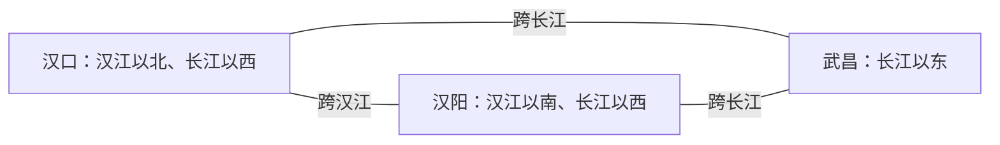

# 武汉旅行指南

长江与汉江在武汉交汇，把中心城区分成武昌、汉口、汉阳三镇；黄鹤楼和长江大桥呈现江城的历史地标，汉口街区保留近代商业城市的尺度，东湖与湖北省博物馆则需要另一种更舒展的游览节奏。武汉并不适合仅凭地图距离连续步行：跨江、绕湖和前往黄陂远郊都是独立的交通决策。按三镇与东湖分日安排，通常比一天内反复过江更从容。

> 建议停留：3–5 天\
> 旅行关键词：两江三镇、黄鹤楼、汉口街区、东湖、荆楚文物、过早\
> 主要体力：中等至较高步行，可通过分区和接驳降至中等\
> 最近研究：2026-07-30

## 城市速览

| 项目 | 旅行信息 |
|---|---|
| 主要旅行价值 | 在两江交汇的城市结构中观察武昌、汉口、汉阳的不同历史层次，并把城市地标、近代街区、湖泊绿道、博物馆与武汉饮食组合成完整体验 |
| 建议停留 | 2 天可覆盖黄鹤楼—汉口历史轴与省博—东湖；3 天能加入汉阳或古德寺；4–5 天适合放慢湖区节奏，或另留一天前往黄陂木兰景区群中的一处 |
| 较舒适季节 | 春秋通常更适合户外步行；春季天气变化较快，秋季节假日客流集中。梅雨期湿热多雨，盛夏高温高湿，冬季湿冷，均应调整室内外比例 |
| 预算特点 | 整体可做成中等预算；轨道交通、公交和本地早餐较易控制成本，住宿、热门景区票务、东湖内部交通及远郊接驳是主要变量 |
| 步行强度 | 中等至较高；黄鹤楼所在山体、历史建筑门槛、东湖长距离绿道、桥面暴露和大型换乘站会增加体力消耗 |
| 主要天气风险 | 梅雨期持续降雨与雷暴，盛夏高温热浪和强对流；暴雨可能造成积水、江滩低平台关闭、轮渡调整，北部山地还需防范山洪与地质风险 |
| 独行旅行 | 早餐、小吃、博物馆和分区步行均便于独自安排；整鱼、排骨藕汤等共享菜需寻找小份或改点单人菜，晚间跨江回程应预留公共交通余量 |
| 亲子旅行 | 湖北省博物馆与东湖短段容易组成一日；大馆参观、长绿道和盛夏户外对儿童体力要求较高，应减少点位并保留午休 |
| 长者与低体力旅行 | 可采用“一处大型场馆或景区 + 短途接驳”的节奏；不宜把黄鹤楼登高、长江大桥步行、东湖长线和跨镇换乘放在同一天 |
| 无障碍信息 | 湖北省博物馆明确提供无障碍通道、电梯及轮椅借用；地铁车站具体电梯出口、历史景点连续无障碍路线和东湖各入口衔接仍需逐处向官方确认 |

## 城市格局与游览区域

长江把武昌与汉口、汉阳分开，汉江又把汉口与汉阳分开。地图上直线距离不远的两个点，可能需要过桥、进隧道、乘地铁或轮渡；东湖虽然位于武昌一侧，但尺度远大于普通城市公园。黄陂木兰景区群更属于远郊一日游，不应作为市中心行程的顺路延伸。

| 区域 | 主要内容 | 游览特点 | 与其他区域的关系 |
|---|---|---|---|
| 武昌古城与蛇山 | 黄鹤楼、蛇山、长江大桥武昌桥头、司门口及中华路一带 | 地标密集但有坡道、台阶和人流；桥头与江景适合作为路线节点，不必为“打卡”重复折返 | 可由轮渡、地铁或公路跨江接汉口；与东湖同属武昌一侧，但仍需交通接驳 |
| 东湖文化片区 | 湖北省博物馆、湖北美术馆、听涛片区及东湖绿道 | 博物馆需预留完整时段；东湖入口多、内部尺度大，不宜把环湖全程视作普通散步 | 省博与听涛短段可同日；磨山、植物园等更深处应另减项目或加半天 |
| 汉口历史核心 | 黎黄陂路、胜利街、沿江大道、江汉关、江汉路及汉口江滩 | 历史建筑、商业街和餐饮相互衔接，适合连续步行；街区边界彼此重叠，应按一组城市体验理解 | 可由轮渡连接武昌江岸，也可乘地铁跨江；江滩和码头是开放空间与交通节点，不单独计景点完成数 |
| 汉阳近江片区 | 晴川阁、龟山近江段及琴台—月湖方向 | 历史建筑与两江视角突出；上坡、台阶和跨路衔接会影响低体力路线 | 可与武昌桥头隔江对望，但步行过桥并非最省力；与汉口之间还需跨汉江或绕行 |
| 江岸区东北部 | 古德寺及近代城区延伸 | 古德寺规模不大，但与江汉路不在同一段连续步行范围，需单独接驳 | 适合作为汉口半日补充，不宜在紧凑日程中与东湖、汉阳反复横跳 |
| 黄陂木兰片区 | 木兰山、木兰天池、木兰草原、木兰云雾山等独立景区 | 各景区方向、主题、体力与票务不同，一天通常只选一处 | 距中心城区远，应作为完整远郊日；恶劣天气时整日删除，不与市区预约锚点硬拼 |

## 主要景点

优先级用于安排时间，不代表绝对排名：**A** 为首访核心，**B** 为按兴趣补充，**C** 为远郊、季节性或通常需要独立半天以上的目的地。桥梁、江滩、码头和观景平台可以是重要路线节点，但不单独计入城市景点完成率。

### 武昌历史与文化

| 景点 | 区域 | 类型 | 主要看点 | 建议用时 | 室内外 | 体力 | 预约风险 | 天气影响 | 优先级 |
|---|---|---|---|---:|---|---|---|---|---|
| 黄鹤楼公园 | 武昌古城、蛇山 | 历史地标、公园 | 名楼意象、蛇山制高点、长江大桥与三镇关系；重点是整体地标环境，不把楼内各层和周边观景点拆成多个景点 | 2–3 小时 | 混合 | 中高 | 中高 | 中高 | A |
| 湖北省博物馆 | 东湖文化片区 | 博物馆 | 曾侯乙编钟、越王勾践剑及荆楚历史展陈；大型馆舍需要按重点展厅取舍 | 3–5 小时 | 室内 | 中 | 高 | 低 | A |
| 湖北美术馆 | 东湖文化片区 | 美术馆 | 近现代及当代艺术展览；内容随展期变化，适合与省博组合为雨天文化日 | 1.5–3 小时 | 室内 | 低至中 | 中 | 低 | B |

### 湖泊与绿道

| 景点 | 区域 | 类型 | 主要看点 | 建议用时 | 室内外 | 体力 | 预约风险 | 天气影响 | 优先级 |
|---|---|---|---|---:|---|---|---|---|---|
| 东湖风景区 | 武昌东部 | 湖泊、公园、绿道 | 听涛、磨山、湖岸绿道等多个分区；一次行程应选一段或一至两个片区，不追求环湖“全清” | 3–8 小时 | 室外为主 | 中至高，可缩短 | 低至中 | 高 | A |

### 汉口与汉阳

| 景点 | 区域 | 类型 | 主要看点 | 建议用时 | 室内外 | 体力 | 预约风险 | 天气影响 | 优先级 |
|---|---|---|---|---:|---|---|---|---|---|
| 汉口历史风貌区—江汉路 | 汉口历史核心 | 历史街区、商业街 | 黎黄陂路、胜利街、沿江近代建筑、江汉关与江汉路共同形成的城市历史商业轴；江滩为同一路线的开放空间节点 | 3–5 小时 | 室外为主 | 中 | 低 | 中高 | A |
| 晴川阁 | 汉阳近江片区 | 历史建筑、博物馆 | 龟山东麓的历史建筑群，以及隔江观察黄鹤楼、长江大桥和两江格局的视角 | 1–2 小时 | 混合 | 中 | 中 | 中高 | B |
| 古德寺 | 江岸区 | 宗教建筑 | 近代佛教建筑及独特空间风格；作为仍具宗教属性的场所，应尊重着装、礼仪和现场摄影规定 | 1–1.5 小时 | 混合 | 低至中 | 中 | 中 | B |

### 远郊与一日游

| 景点 | 区域 | 类型 | 主要看点 | 建议用时 | 室内外 | 体力 | 预约风险 | 天气影响 | 优先级 |
|---|---|---|---|---:|---|---|---|---|---|
| 木兰文化生态旅游区（单选一处景区） | 黄陂区 | 山地、湖泊、草原及文化景观群 | 木兰山、木兰天池、木兰草原、木兰云雾山是不同景区；按山水、徒步、开阔景观或季节花景选择一处 | 6–10 小时，含往返 | 室外为主 | 中高至高 | 中高 | 高 | C |

景点边界按以下原则记录：黄鹤楼公园内部楼层、碑廊和观景点只算一个项目；东湖各绿道节点属于同一大型景区，除非以后另建经过研究的分区页，否则一次访问不按节点累加；汉口江滩、江汉关外部、轮渡码头和长江大桥作为汉口历史轴或跨江路线的一部分；木兰片区的四个主要景区彼此独立，一天游览其中一处不代表完成整个景区群。

## 美食与餐饮

武汉把早餐称为“过早”，热干面、豆皮、面窝、汤包等并不只属于某条网红街。粮道街、山海关路、水塔片区、吉庆街及三镇居民区周边都可寻找早餐和小吃；户部巷位置方便、选择集中，但高峰拥挤，完全可以用同类社区店替代。正餐以湖北菜和江鲜湖鲜为主，整鱼和煨汤通常更适合共享。

| 菜品或餐饮类型 | 常见区域 | 一个人用餐与常见份量 | 风味、过敏原与饮食限制 | 排队风险与替代方法 |
|---|---|---|---|---|
| 热干面 | 全城早餐店、社区街巷及交通节点周边 | 一碗即为单人份，适合快速早餐；食量较小可少加配菜 | 常见做法含小麦面、芝麻酱及含大豆的调味料，辣椒通常可调整；芝麻、小麦和大豆过敏者应逐店确认 | 热门老店早晨排队明显；观察现烫现拌、周转快的社区店即可，不必只追一家品牌 |
| 三鲜豆皮 | 早餐集中街区、老城区小吃店 | 常按块或按份售卖，可独食，也适合与其他早餐分食 | 常见夹层含糯米、鸡蛋、肉丁和菌菇；酱料可能含大豆或小麦，“豆皮”名称不代表纯素或无麸质 | 成锅出炉时会排队；若售罄，可改找另一家现场煎制的豆皮摊，不必跨城追店 |
| 面窝 | 早餐摊、粉面店 | 单个份量小，适合作为热干面或汤粉的配餐 | 油炸、外脆内软；配方与共用油锅可能涉及米浆、小麦、大豆或其他交叉接触，需按店确认 | 早餐后段可能售罄；同类油香小吃在居民区更常见，避开热门街区可减少等待 |
| 鲜肉汤包 | 汉口传统小吃区及全城点心店 | 常以一笼为单位，单人可以完成，也可共享 | 小麦面皮、猪肉和高温汤汁是主要特征；可能含大豆、芝麻，入口先散热，素食者不适用 | 正餐前后热门门店排队；以“现蒸、有稳定出品”的同类型店替代即可 |
| 武昌鱼 | 湖北菜馆、湖鲜与家常菜馆 | 常以整鱼上桌，更适合两人以上；独行可询问小份、鱼块或其他单人河鲜菜 | 清蒸或红烧常见，鲜味为主；需注意细刺，酱汁可能含大豆和小麦 | 老字号与景区附近正餐时段较忙；优先按鲜活、明码标价和分量选择同类湖北菜馆 |
| 排骨藕汤 | 湖北菜馆、煨汤馆 | 多为共享汤，也有单人盅；单人点餐先确认容量 | 莲藕、猪排骨与长时间煨制汤底，通常不辣；不适合素食，需控制盐分者先询问 | 冬季和用餐高峰需求高；可换成同类单人煨汤，不必把某家名店作为唯一目标 |

热门餐饮区更适合作为“寻找某类食物的范围”，不等于质量保证。点单时直接确认辣椒是否可分开、汤底是否含肉、酱料与共用油锅的过敏原，并以现场菜单和厨房答复为准。

## 经典行程

### 一日经典路线

**路线**：黄鹤楼公园 → 武昌桥头与江景（路线节点）→ 司门口或中华路休息 → 轮渡或地铁跨江 → 江汉关—江汉路—汉口历史风貌区

- **串联逻辑**：先完成武昌最鲜明的地标，再只跨一次长江进入汉口；江汉关、江汉路、沿江大道与黎黄陂路属于同一历史商业系统，可按体力决定步行深度。轮渡停航时改乘地铁或公路交通，不为乘船反复等待。
- **预约锚点**：黄鹤楼公园；同时核对轮渡当日班次和水位管制，但轮渡不应成为不可替代的行程前提。
- **休息安排**：司门口、江汉路商圈和沿江大道内侧均有餐饮及室内休息选择；桥面、江滩和开阔街道缺少遮阴时应缩短暴露。
- **时间不足时**：先删长江大桥步行，再删江汉路夜间延伸；保留黄鹤楼与汉口历史街区两个核心段。

### 两日城市路线

**第 1 天**：黄鹤楼公园 → 武昌近江节点 → 跨江 → 汉口历史风貌区—江汉路\
**第 2 天**：湖北省博物馆 → 午餐与室内休息 → 东湖听涛或一段绿道

- **串联逻辑**：第一天读懂两江三镇与近代汉口，第二天集中在东湖文化片区，避免两天都来回跨江。省博与听涛方向相邻，但馆舍参观后只选东湖一小段，不追求环湖。
- **预约锚点**：湖北省博物馆是最需要先锁定的时段，黄鹤楼次之；两天顺序可按省博预约结果对调。
- **休息安排**：省博馆内有座椅、饮水和餐饮等服务信息；东湖段应选择靠近入口与补给点的路线，炎热时把午后改为室内。
- **时间不足时**：先删东湖长绿道和桥面步行，再缩短江汉路商业段；省博、黄鹤楼与汉口历史轴优先保留。

### 三日深度路线

**第 1 天**：黄鹤楼公园 → 跨江 → 汉口历史风貌区—江汉路\
**第 2 天**：湖北省博物馆 → 湖北美术馆或午休 → 东湖短段\
**第 3 天**：古德寺 → 江岸区用餐休息 → 地面交通跨至汉阳 → 晴川阁 → 龟山近江段

- **串联逻辑**：前两天分别完成城市历史轴与东湖文化轴；第三天从汉口东北部向汉阳移动，只做一次较长接驳，以晴川阁补全三镇视角。古德寺与江汉路不能当作连续步行点，必须留出交通时间。
- **预约锚点**：全程以湖北省博物馆为首要锚点；黄鹤楼、美术馆、古德寺和晴川阁的开放范围分别复核。
- **休息安排**：第二天利用馆舍休息；第三天在江岸区或汉阳用餐后再进入户外，避免把换乘当作休息。
- **时间不足时**：第三天先在古德寺与晴川阁之间二选一，避免为“补齐三镇”仓促横穿；压缩到两天时整段删除。

### 雨天路线

**路线**：湖北省博物馆 → 室内午餐 → 湖北美术馆；若只有零星小雨，再增加靠近入口的东湖短段

- **适用条件**：仅适用于普通降雨。暴雨、雷电、大风、城市内涝预警或江湖水位管制期间，应取消东湖、江滩、桥面、轮渡和木兰山地行程，服从场馆与交通部门安排。
- **预约锚点**：湖北省博物馆；美术馆的开放日、临展和入馆方式单独核对，两个场馆的预约不能互相替代。
- **休息安排**：把午餐和较长休息放在馆舍之间，不在湿滑湖岸赶路；携带湿伞时遵守存放规定。
- **时间不足时**：先删东湖户外段，再删美术馆；只保留省博重点展厅也能形成完整半日。

### 亲子或低体力路线

**亲子路线**：湖北省博物馆重点展厅 → 馆内或附近午餐 → 东湖听涛入口附近短程湖岸 → 提前返回\
**低体力路线**：湖北省博物馆无障碍入口与电梯路线 → 午休 → 车辆接驳至东湖单一入口的近距离观景段 → 原入口或预先确认的出口离开

- **减负方式**：亲子路线把文物主题控制在少数重点展厅，避免连续讲解和长绿道；低体力路线不安排黄鹤楼登高、桥面步行或跨站长换乘。省博提供轮椅和婴儿车借用，但证件、押金及库存需行前确认；东湖入口到水边的连续无障碍条件应逐段询问。
- **预约锚点**：湖北省博物馆，儿童预约、陪同与团队规则按官方当期说明办理。
- **休息安排**：省博馆内休息设施作为主要恢复点；东湖只在天气合适且出口、接驳清楚时加入。
- **时间不足时**：亲子路线先删东湖，低体力路线先删第二个地点；不通过加快脚步弥补延误。

### 远郊一日路线

**路线**：中心城区出发 → 木兰文化生态旅游区内预先选定的一处景区 → 原路或预订接驳返回

- **适用条件**：只在交通、天气与返程明确时安排；木兰山、木兰天池、木兰草原、木兰云雾山并非同一个可连续步行的园区。山地路线体力较高，草原和湖区也有长距离暴露。
- **预约锚点**：所选单一景区的票务、接驳或停车安排；先确认目的地全名，避免导航到同一“木兰”名称下的另一景区。
- **休息安排**：以游客中心、正规餐饮和遮蔽点为节点，自备饮水与防晒；返程前留足道路拥堵余量。
- **时间不足时**：整段删除，不把远郊压缩成半日后再赶回市区预约场馆；暴雨、高温预警或山洪地质风险提示下取消。

### 晚出发或紧凑路线

**路线**：江汉关外部 → 江汉路 → 胜利街或黎黄陂路 → 汉口江滩近段

- **串联逻辑**：全程留在汉口历史核心，不跨江、不加入大型场馆，适合下午抵达后建立城市印象。
- **预约锚点**：无；若加入江汉关内的场馆参观，则以该场馆当日入馆截止时间为准。
- **休息安排**：江汉路商业设施密集，适合用餐、避雨和调整路线；江滩只走靠近出口的一段。
- **时间不足时**：先删江滩和最远的街巷延伸，只保留江汉关—江汉路—一小段历史街区。

## 住宿区域

| 区域 | 优点 | 缺点 | 适合人群 | 交通特点 |
|---|---|---|---|---|
| 江汉路—汉口历史核心 | 晚间餐饮、街区步行和跨江交通选择多，抵达后容易直接游览 | 周末与节假日拥挤，临街房间可能有噪声，前往东湖仍需跨江 | 首访、独行、喜欢街区与夜间散步的旅行者 | 轨道交通和公交密集，可联系汉口站及武昌核心；去东湖需预留跨江时间 |
| 汉口站周边 | 铁路抵离方便，住宿类型多，适合早晚车次 | 不是主要景点步行区，道路尺度大，站区高峰拥堵 | 以汉口站进出、短住或带大件行李者 | 依靠地铁或出租车进入江汉路、江岸区和武昌 |
| 黄鹤楼—司门口—昙华林一带 | 靠近武昌历史核心，方便安排黄鹤楼与近江路线 | 坡道、人流和旧街道路况不一；部分地点离地铁出入口仍有步行 | 重视历史地标、希望早到黄鹤楼的旅行者 | 到汉口可用地铁、轮渡或公路交通；去东湖仍需接驳 |
| 中南路—洪山广场 | 位于武昌交通枢纽带，兼顾老城、东湖与铁路站点 | 商务城市感较强，不在任何单一景区内部 | 多日首访、需要跨片区移动者 | 轨道换乘便利，去省博、黄鹤楼及武昌站相对均衡 |
| 东湖—省博周边 | 早到省博、亲近湖区，环境相对舒展 | 餐饮与夜间活动分布较散，跨江到汉口耗时 | 博物馆、湖景、摄影或慢节奏旅行者 | 以公交、地铁加步行或短途接驳进入；选房时核对具体入口而非只看“东湖附近” |
| 汉阳琴台—钟家村方向 | 便于晴川阁、龟山、月湖及三镇交通 | 与东湖、古德寺和汉口站不在同一片步行范围 | 希望补充汉阳、偏好相对安静住宿者 | 可通过轨道和公路跨汉江、长江；低体力者应减少多次换乘 |
| 武汉站周边 | 高铁早晚到发最方便，适合次日继续铁路旅行 | 离传统城市核心较远，若每天往返会增加通勤 | 以武汉站抵离或只停留一晚者 | 可接轨道交通前往东湖和中心城区，切勿把“武汉站”与“武昌站”混为一处 |

## 市内交通

武汉的关键不是记住所有线路，而是先确认抵达枢纽和当天所在的“镇”。武汉站、汉口站、武昌站和武汉东站分处不同方向；航班使用天河机场；跨镇移动通常依赖地铁、公交、出租车或轮渡。具体线路、首末班、票价、施工与交通管制均属于动态信息。

| 场景 | 建议与取舍 | 行前需要重查的内容 |
|---|---|---|
| 天河机场抵达 | 机场位于中心城区以北，可按住宿地选择轨道交通、机场巴士、出租车或网约车；深夜抵达不要默认仍有同样的公共交通选择 | 航站楼、末班交通、机场巴士、施工、夜间上客点及行李服务 |
| 武汉站抵达 | 位于城市东部，前往东湖和武昌东部相对顺向，但到黄鹤楼、汉口历史区仍有明显通勤 | 实际车次到发站、地铁运营、站区换乘和大型活动管制 |
| 汉口站抵达 | 最适合作为汉口住宿和历史核心的铁路入口，去武昌与东湖需跨江 | 站内换乘、地铁末班、出租车上客区与高峰拥堵 |
| 武昌站抵达 | 适合进入武昌老城、中南路及黄鹤楼方向；它与武汉站不是同一座车站 | 出站口、公交或地铁衔接、周边施工与行李寄存 |
| 武汉东站抵达 | 更靠近光谷方向，不是传统景点首访的默认枢纽 | 车票所列准确站名、接驳线路和前往住宿地的时间 |
| 三镇之间移动 | 地铁通常最稳定；出租车适合减少换乘；轮渡兼具交通与观景价值，但受班次、水位、天气和临时管制影响 | 轨道线路图、首末班、具体电梯出口、轮渡航线、码头与停复航公告 |
| 汉口历史核心步行 | 江汉关、江汉路、沿江大道、胜利街和黎黄陂路可按一条轴线组合；跨大路口和炎热天气会降低步行效率 | 街区施工、活动管制、场馆闭馆日、江滩低平台开放状态 |
| 黄鹤楼与长江大桥 | 桥面步行是体验而非必要换乘；距离、日晒、风雨和出入口绕行都比地图上更费力 | 桥面维护、临时管制、极端天气和实际步行入口 |
| 东湖内部 | 先确定听涛、磨山或其他单一入口，再决定步行、骑行、景区交通或船行；不要用“绕湖一圈”估算普通步行时间 | 绿道分段、车辆与骑行规则、游船或观光交通、活动封闭和天气 |
| 黄陂木兰片区 | 公共交通、旅游接驳或自驾均可能需要多段衔接；目的地分散，返程必须预先明确 | 所选景区地址、班次、停车预约、道路状况、返程末班与天气停运 |
| 自驾 | 市中心核心景区停车和拥堵成本较高，远郊自驾价值更大；饮酒后不得驾车 | 限行、停车场开放与预约、节假日交通组织、涉水或山路风险 |

## 不同旅行者须知

| 旅行维度 | 可行条件 | 主要取舍 | 需额外核对 |
|---|---|---|---|
| 独行旅行 | 过早、小吃、馆舍和分片区路线都易独立完成；公共交通覆盖主要旅行区 | 整鱼和共享汤不易控制份量；偏远景区返程、晚间江滩和临时叫车不能完全依赖现场决定 | 小份菜、最后入场、末班交通、远郊接驳最低成行条件 |
| 亲子旅行 | 省博、东湖短段和商业区休息设施可组合；馆方提供婴儿车借用信息 | 大型展馆、桥面、长绿道和盛夏户外容易超出儿童耐力；水边需持续看护 | 儿童预约与证件、婴儿车库存、母婴室、电梯位置和亲水区域管制 |
| 长者或低体力旅行 | 每天只选一处大型场馆或景区，并使用短途接驳，可显著降低负担 | 黄鹤楼坡道台阶、桥面暴露、历史建筑门槛和地铁长换乘仍可能中断连续路线 | 景区电梯或接驳、最近下客点、轮椅借用、站内换乘距离 |
| 无障碍需求 | 湖北省博物馆有官方明确的轮椅借用、无障碍通道和电梯信息 | 历史建筑、老街地面、坡道、东湖入口和码头之间的连续性不能想当然 | 出发前直接询问每个场馆和地铁站的可用入口、升降设备、无障碍卫生间与接驳；资料不足处均需向官方确认 |
| 摄影旅行 | 两江交汇、桥塔对望、汉口近代建筑与东湖水岸提供多种城市景观 | 开阔江岸和桥面受风雨、雾霾、逆光与人流影响；宗教及展馆空间限制不同 | 日出日落时段、三脚架、闪光灯、商业拍摄、无人机和临时管制 |
| 预算有限 | 早餐、小吃、公共街区、江滩外部空间和轨道交通有利于控制成本 | 住得过远会增加通勤，远郊接驳、景区内部交通和临时打车可能高于门票成本 | 免费场馆预约、优惠证件、景区交通、寄存与退改规则 |
| 晚出发或紧凑行程 | 汉口历史核心、江汉路或单一博物馆都能构成完整半日 | 不宜临时加入东湖深处、木兰远郊或多个跨江点；晚到不等于可延后入场 | 最晚入场、闭馆日、江滩与轮渡管制、末班地铁 |
| 梅雨、高温与暴雨 | 普通雨天可转馆舍；高温时采用早晚户外、正午室内的节奏 | 雷暴、暴雨、内涝和高水位会使江滩、轮渡、湖岸及山地路线失去可行性 | 武汉气象预警、应急提示、水位和江滩公告、景区临时关闭、航班与铁路延误 |

## 行前核对

| 核对事项 | 为什么需要重查 | 建议核对时间 | 官方入口 |
|---|---|---|---|
| 黄鹤楼开放、门票与分时规则 | 节假日、夜游、维修、入园时段和优惠政策会调整 | 确定日期后、到访前一日 | [黄鹤楼公园](https://www.hhlgysl.com/) |
| 湖北省博物馆预约、展厅与编钟演出 | 放票、候补、闭馆日、临展、演出与节假日延时开放均具有时效性 | 确定日期后立即了解规则，放票时预约，到访前一日复查 | [湖北省博物馆服务](https://hbww.org.cn/fuwu/index.html)；[官方票务](https://pcticket.hbww.org.cn/) |
| 湖北美术馆展览与开放日 | 换展期、临展票务和闭馆安排会改变雨天路线 | 排入路线前及到访前一日 | [湖北美术馆](https://wlt.hubei.gov.cn/hbmoa/) |
| 东湖分区开放与内部交通 | 绿道分段、游船、观光交通、骑行和活动封闭会调整，天气也会影响湖岸 | 选择入口前、到访前一日及当天 | [武汉东湖风景区](https://www.whdonghu.gov.cn/)；[东湖游览图](https://www.whdonghu.gov.cn/ztzl_6323/wlzl/202601/t20260122_2716447.shtml) |
| 晴川阁与古德寺开放规则 | 修缮、宗教活动、节假日、礼仪与摄影规定可能改变 | 排入路线前及当天 | [武汉市文旅局：晴川阁](https://wlj.wuhan.gov.cn/zfxxgk/fdzdgknr/jgjj/zsdw/202008/t20200827_1437251.shtml)；[武汉市政府：古德寺](https://www.wuhan.gov.cn/zjwh/whly/202506/t20250628_2602209.shtml) |
| 木兰单一景区的名称、票务与接驳 | 同一片区有多个独立景区，地址、方向、体力、门票和返程不互通 | 订交通前、出发前三日及当天清晨 | [黄陂区景区名录](https://www.huangpi.gov.cn/fbjd_33/xxgkml/gysyjs/ly/202312/t20231212_2317979.html)；各景区官方渠道 |
| 地铁、公交与站区施工 | 线路、首末班、封站、换乘通道和大型活动交通组织会改变 | 出发前一周、前一日及乘车当天 | [武汉地铁集团](https://www.wuhanrt.com/)；[武汉市交通运输局](https://jtj.wuhan.gov.cn/) |
| 轮渡航线、码头和停复航 | 航线与班次会调整，高水位、大雾、风雨和客流管制可能停航 | 跨江当日，出发前再次核对 | [武汉市交通运输局：轮渡出行](https://jtj.wuhan.gov.cn/cxfw/qtcx/202001/t20200103_451526_slhxq.shtml)；运营方官方公告 |
| 铁路到发站与车次 | 武汉站、汉口站、武昌站和武汉东站不可互换，车次和检票安排会变 | 订票时、出发前一日及当日 | [中国铁路 12306](https://www.12306.cn/) |
| 天河机场航站楼与地面交通 | 航站楼、航班、机场巴士、轨道末班与夜间上客点会调整 | 订票时、抵离前一日及当天 | [武汉天河国际机场](https://www.whairport.com/)；[武汉市交通运输局：机场交通中心](https://jtj.wuhan.gov.cn/jtzx/zwdt/202601/t20260116_2712763.shtml) |
| 高温、暴雨、雷电、内涝与山地风险 | 极端天气可能关闭江滩低平台、湖岸、山地景区并影响轮渡、道路和航班 | 出发前三日、每日清晨及户外出发前 | [武汉市气象台信息入口](https://www.wuhan.gov.cn/hdjl/rdhy/)；[武汉市应急管理局](https://yjj.wuhan.gov.cn/yjgl_31/fzjz/)；[武汉市文化和旅游局安全提示](https://wlj.wuhan.gov.cn/ztzl_27/zxzt/yjgl/aqsc/) |
| 长江、汉江水位与江滩开放 | 汛期水位会改变亲水平台、闸口和轮渡运行条件 | 汛期到访前一日及当天 | [武汉市水务局](https://swj.wuhan.gov.cn/) |
| 无障碍连续路线 | 电梯可能位于特定出口，历史景点、码头和东湖入口之间可能存在门槛、坡道或中断 | 预约前直接联系场馆或运营方，当天再确认 | [湖北省博物馆服务](https://hbww.org.cn/fuwu/index.html)；武汉地铁及各景区官方客服 |
| 入境、签证与证件规则 | 仅跨境旅行需要；适用条件取决于国籍、口岸、停留方式和最新政策 | 购票前及出发前 | [国家移民管理局](https://www.nia.gov.cn/)；承运航空公司官方渠道 |
| 具体餐厅、演出与夜间活动 | 营业状态、排队、最低消费、演出日期与过敏原处理会频繁变化 | 排入路线前及当天 | 餐厅或主办方官方渠道，并以现场菜单和明示规则为准 |

## 来源与更新记录

### 主要来源

| 来源 | 类型 | 支持内容 | 核验日期 |
|---|---|---|---|
| [武汉地方志：武汉市情](https://dfz.wuhan.gov.cn/sqgk/whsq/) | 政府地方志 | 长江、汉江交汇与武昌、汉口、汉阳三镇格局 | 2026-07-30 |
| [武汉市人民政府：武汉市概况](https://www.wuhan.gov.cn/zjwh/whgk/202004/t20200414_999422.shtml) | 政府 | 城市地理、气候背景、梅雨与高温风险及汉口商业历史 | 2026-07-30 |
| [黄鹤楼公园](https://www.hhlgysl.com/) | 景区 | 景区范围、参观服务与动态公告入口 | 2026-07-30 |
| [武汉市园林和林业局：黄鹤楼公园](https://ylj.wuhan.gov.cn/zwgk/zwxxgkzl_12298/jggk_12304/xsdwszjzz_12308/202001/t20200110_726398.shtml) | 政府主管部门 | 黄鹤楼、蛇山、龟山与长江大桥的空间关系 | 2026-07-30 |
| [武汉市人民政府：武汉长江大桥](https://www.wuhan.gov.cn/ztzl/25zt/qiao/whzjdq/index.shtml) | 政府专题 | 长江大桥及其与两岸地标的关系 | 2026-07-30 |
| [武汉市文化和旅游局：晴川阁](https://wlj.wuhan.gov.cn/zfxxgk/fdzdgknr/jgjj/zsdw/202008/t20200827_1437251.shtml) | 政府文旅部门 | 晴川阁位置、历史建筑属性及与黄鹤楼隔江相望关系 | 2026-07-30 |
| [武汉市人民政府：晴川阁修缮开放](https://3g.wuhan.gov.cn/zjwh/whly/202603/t20260310_2737818.shtml) | 政府 | 场馆修缮后的开放状态与桥、塔、阁关系；具体开放安排仍需重查 | 2026-07-30 |
| [武汉市人民政府：汉口历史风貌区规划](https://www.wuhan.gov.cn/sy/whyw/202011/t20201107_1496538.shtml) | 政府 | 汉口历史风貌区范围与近代城市空间 | 2026-07-30 |
| [武汉市住房和城市更新局：汉口历史风貌区](https://zgj.wuhan.gov.cn/xxgk/xxgkml/qtzdgknr/jytabl/202409/t20240910_2452947.shtml) | 政府主管部门 | 沿江大道、江汉路、中山大道和胜利街等核心边界 | 2026-07-30 |
| [武汉市人民政府：汉口历史街区路线](https://www.wuhan.gov.cn/ztzl/25zt/zjwhxq/202505/t20250521_2584437.shtml) | 政府 | 黎黄陂路、吉庆街、里分、江汉路与沿江建筑的串联关系 | 2026-07-30 |
| [武汉市发展和改革委员会：江汉路](https://fgw.wuhan.gov.cn/xwzx/tpxw/202602/t20260214_2730521.html) | 政府主管部门 | 江汉路的商业街与历史街区属性 | 2026-07-30 |
| [武汉市人民政府：古德寺](https://www.wuhan.gov.cn/zjwh/whly/202506/t20250628_2602209.shtml) | 政府文旅信息 | 古德寺位置、历史与建筑属性；动态票务不写作长期事实 | 2026-07-30 |
| [武汉东湖风景区：机构概况](https://www.whdonghu.gov.cn/zwgk_6255/xxgkml/jgsz/dwjj/) | 景区管理机构 | 东湖景区尺度、分区与绿道属性 | 2026-07-30 |
| [武汉东湖风景区：游览图](https://www.whdonghu.gov.cn/ztzl_6323/wlzl/202601/t20260122_2716447.shtml) | 景区管理机构 | 省博、美术馆、听涛、磨山、植物园与绿道分段关系 | 2026-07-30 |
| [武汉市人民政府：东湖绿道规划](https://www.wuhan.gov.cn/zwgk/xxgk/zfwj/szfwj/202206/t20220621_1990810.shtml) | 政府 | 东湖多个景区和绿道段的连接及大型景区边界 | 2026-07-30 |
| [湖北省博物馆：观众服务](https://hbww.org.cn/fuwu/index.html) | 场馆 | 预约、交通、存包、轮椅与婴儿车借用、馆内导航和休息服务 | 2026-07-30 |
| [湖北省博物馆：官方票务](https://pcticket.hbww.org.cn/) | 场馆票务 | 动态预约入口与入馆规则 | 2026-07-30 |
| [湖北美术馆](https://wlt.hubei.gov.cn/hbmoa/) | 省级公共文化场馆 | 场馆定位、动态展览、开放公告与参观入口 | 2026-07-30 |
| [黄陂区人民政府：旅游景区名录](https://www.huangpi.gov.cn/fbjd_33/xxgkml/gysyjs/ly/202312/t20231212_2317979.html) | 区政府 | 木兰山、木兰天池、木兰草原、木兰云雾山为不同景区 | 2026-07-30 |
| [黄陂区人民政府：旅游交通指南](https://www.huangpi.gov.cn/zjhp/wlhp/whzn/202205/t20220519_1973900.html) | 区政府 | 木兰片区各景区方向与远郊交通边界 | 2026-07-30 |
| [武汉市交通运输局：轮渡出行](https://jtj.wuhan.gov.cn/cxfw/qtcx/202001/t20200103_451526_slhxq.shtml) | 交通主管部门 | 轮渡航线结构及官方查询入口 | 2026-07-30 |
| [武汉天河国际机场：公共交通](https://www.whairport.com/jttc/ggjt/) | 机场运营方 | 机场地面公共交通查询入口 | 2026-07-30 |
| [武汉市交通运输局：机场交通中心衔接](https://jtj.wuhan.gov.cn/jtzx/zwdt/202601/t20260116_2712763.shtml) | 交通主管部门 | 航站楼与综合交通中心、轨道及铁路换乘衔接 | 2026-07-30 |
| [武汉市应急管理局：自然灾害风险分析](https://yjj.wuhan.gov.cn/yjgl_31/fzjz/202606/t20260630_2814874.shtml) | 应急主管部门 | 高温、强对流、内涝、山洪和地质风险 | 2026-07-30 |
| [武汉市文化和旅游局：强降雨旅游安全提示](https://wlj.wuhan.gov.cn/ztzl_27/zxzt/yjgl/aqsc/202505/t20250528_2587220.shtml) | 文旅主管部门 | 暴雨时避开山地、峡谷和涉水景区的安全边界 | 2026-07-30 |
| [武汉市水务局：防汛与水位信息](https://swj.wuhan.gov.cn/tzdt/jcss/202406/t20240627_2421669.html) | 水务主管部门 | 长江水位、防汛响应与江滩动态管理依据 | 2026-07-30 |
| [武汉市人民政府：武汉餐饮文化](https://www.wuhan.gov.cn/ztzl/jytabl/swlj/sjytaa/202003/t20200316_950450.shtml) | 政府 | 热干面、豆皮、汤包、武昌鱼及武汉餐饮的多样性 | 2026-07-30 |
| [武汉市商务局：武汉名点](https://sw.wuhan.gov.cn/xwdt/gzdt/202505/t20250516_2582012.shtml) | 政府主管部门 | 过早文化与热干面、豆皮、面窝、鲜鱼糊汤粉等代表小吃 | 2026-07-30 |
| [GeoNames：Wuhan](https://www.geonames.org/1791247/wuhan.html) | 开放地名数据 | GeoNames 城市点 ID 及中国—湖北—武汉层级 | 2026-07-30 |
| [Wikidata：Q11746](https://www.wikidata.org/wiki/Q11746) | 开放结构化数据 | 武汉实体消歧及 GeoNames ID 对应关系 | 2026-07-30 |

### 更新记录

| 日期 | 更新内容 |
|---|---|
| 2026-07-30 | 首次完成两江三镇格局、主要景点边界、美食、可组合路线、住宿、交通、天气与防汛风险、无障碍证据及官方来源研究 |
