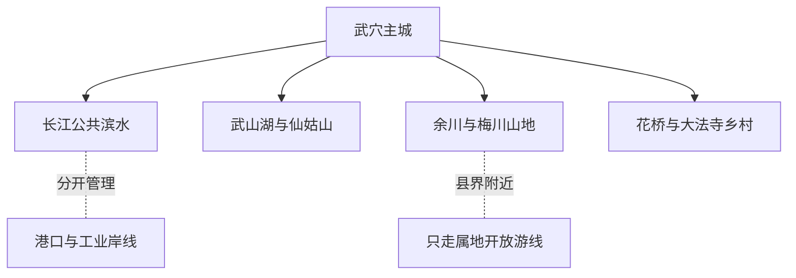
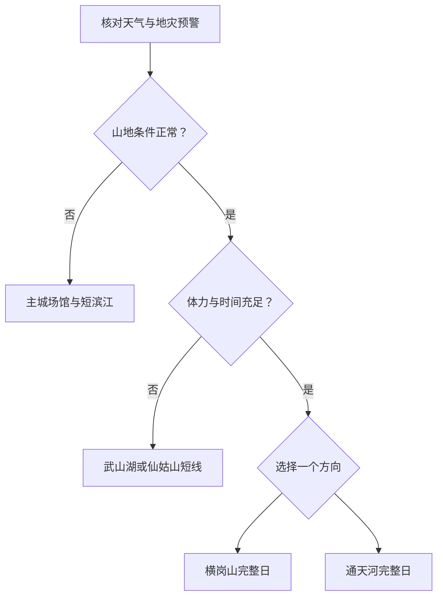

# 武穴旅行指南

武穴古称广济，是黄冈市代管的县级市，也是一座沿长江展开的港城。旅行可分成三条清楚的线：主城以广济时光、广济阁、地方文博和武山湖为核心；北部余川—梅川方向通往通天河、横岗山与希尔寨；刊江、花桥、大法寺等方向则分布仙姑山、乡村景区与季节花田。长江岸线同时承担公共休闲、航运、码头和工业生产，北部山区又与蕲春、黄梅县界相近；城市指南只覆盖武穴法定属地和正式开放区域，不把黄梅、麻城或邻县山路并入武穴行程。

> 建议停留：2–4 天；主城 1 天，每个山地或乡村方向另留完整 1 天 
> 旅行关键词：广济港埠、长江滨水、武山湖湿地、横岗山、通天河、文曲戏、佛手山药 
> 主要体力：低至较高；主城滨江较平，湿地尺度大，横岗山与通天河有山路、台阶和湿滑风险 
> 最近研究：2026-08-12

## 城市速览

| 项目 | 旅行信息 |
|---|---|
| 主要旅行价值 | 在主城认识广济港埠、地方文博和长江滨水，在武山湖观察湿地城市关系，再从横岗山、通天河、仙姑山和乡村景区选择一个山地或田园方向 |
| 建议停留 | 1 天看主城与滨江；2 天增加武山湖或仙姑山；3–4 天再从横岗山、通天河、龙门花海或希尔寨中选择一至两个完整日 |
| 较舒适季节 | 春秋通常更适合山地与滨水步行；春季花田具有时令性，夏季高温、雷暴和强降雨多，冬季山路可能湿冷或结冰 |
| 预算特点 | 整体低至中等；主城公共空间成本较低，主要变量是经营景区票务、山地接驳、正规包车和远郊住宿 |
| 步行强度 | 主城低至中等；武山湖环湖尺度大，横岗山、通天河和仙姑山为中至较高，台阶、坡路、林道与湿滑石面增加负担 |
| 主要天气风险 | 高温高湿、雷电、短时强降雨、长江与湖区大风、城市积水；北部山区还需防山洪、滑坡、落石、森林火险和冬季结冰 |
| 独行旅行 | 主城一人餐、铁路和叫车较方便；山地返程与通信可能不稳定，不独自走未标识山路、跨县岭线或夜间林道 |
| 亲子旅行 | 博物馆、广济阁、广济公园和服务完整的景区短线较适合；滨江、湖岸、峡谷、寺观香火与经营游乐需持续看护 |
| 长者与低体力旅行 | 以主城场馆、车辆可近达的滨江短段和武山湖南门户周边为主；不把横岗山、通天河或大尺度湿地作为轻松散步 |
| 无障碍信息 | 新建公共空间可逐点询问，但公开资料不足以证明老街、码头附近、山地寺观、湿地和乡村景区从停车到卫生间连续无障碍 |

## 城市格局与游览区域

武穴法定行政代码为 `421182`，属于黄冈市代管的县级市，拥有独立主城、铁路门户、住宿与市内交通。黄州是黄冈地级市驻地，但不是武穴的主城；黄梅和麻城也是各自独立的县级行政单元，不能因铁路联程、山脉相接或宣传线路而合并为武穴景点。

| 区域 | 主要内容 | 游览特点 | 与其他区域的关系 |
|---|---|---|---|
| 武穴街道主城与正街 | 武穴市博物馆、广济阁、公共文化、老街生活与住宿餐饮 | 城市日基点；老街更新与馆舍开放须动态确认 | 主城到武穴北站、武穴站和各山地入口均需地面接驳 |
| 广济时光—长江公共滨水 | 广济时光景区正式公共区、港埠文化与滨江休闲 | 适合傍晚短线，但大风、涨水、活动封控和夜间照明会改变路线 | 景区介绍同时出现码头作业与船舶制造等功能区，不代表生产区向游客开放 |
| 武山湖—仙姑山方向 | 武山湖国家湿地公园公开区域、仙姑山景区 | 主城近郊半日至一日；湿地与丘陵主题不同，不必强行一日走全 | 湿地保育、鱼塘和水库设施与公开游线分开，寺观活动也须尊重礼仪与防火管理 |
| 余川—梅川北部山地 | 通天河、横岗山、希尔寨及多彩旅游路沿线 | 每日只选一座完整景区；强降雨、地灾或森林火险时取消 | 横岗山靠近蕲春、黄梅县界，只使用武穴属地公布入口和开放游线，不凭山脊小路跨界 |
| 花桥—大法寺乡村方向 | 龙门花海、油菜花田与乡村休闲 | 花期、生产和运营波动大，适合有明确公告时补充 | 花田首先是农业生产空间；只进入设置游客通道的当期开放区，不踩田、越沟或占用机耕道 |
| 田镇—龙坪临港方向 | 武穴港、铁水联运、船舶和临港产业 | 适合从公共道路理解港城产业，不作为普通旅游景区 | 码头、堆场、装卸线、皮带廊道、船厂、专用铁路与危化工业区均是生产空间 |

武穴的公共滨江与港口生产岸线必须分开。广济时光可以提供滨江游览，但地图上相邻的货运码头、船舶制造区、锚地、堆场和铁路装卸设施不能借道进入；同样，武山湖、马口湖等湿地水域、山区水库和花田只按管理方公布的入口与游线到访。

截至 2026-08-12，武穴政府公开信息仍把“大话嘻游”称为建设中的旅游度假区项目，不能把早期预计开园时间当作已经营业的证明。本页不将其列入可执行景点；如后续正式开放，应重新核对运营主体、入口、票务、动物福利、儿童规则和应急安排。

## 主要景点

优先级用于安排时间：**A** 为首访核心，**B** 为按兴趣补充，**C** 为远郊、季节性或开放波动较大的目的地。同一景区内部的寺观、瀑布、花田、表演、夜游和游乐项目只作为一个整体；“正在建设”“计划开园”不计入可执行景点。

### 主城、滨江与湿地

| 景点 | 区域 | 类型 | 主要看点 | 建议用时 | 室内外 | 体力 | 预约风险 | 天气影响 | 优先级 |
|---|---|---|---|---:|---|---|---|---|---|
| 广济时光景区正式公共游览区 | 长江主城岸线 | 滨江景区、港埠文化 | 公共滨水、港城记忆与当期开放夜游活动；内部所有公共节点按一座景区 | 3–5 小时 | 室外为主 | 低至中 | 中至高 | 高 | A |
| 武穴市博物馆当期开放展厅 | 主城 | 地方博物馆 | 广济历史、地方文物与城市记忆；具体展陈和馆址服务动态核对 | 1.5–3 小时 | 室内 | 低 | 高 | 低 | A |
| 广济阁文化展览馆 | 主城 | 城市展览、文化地标 | 广济地域文化展陈与城市公共文化；与广济时光按不同运营入口核对 | 1–2.5 小时 | 室内为主 | 低 | 高 | 低 | B |
| 武山湖国家湿地公园正式开放区 | 主城近郊 | 国家湿地公园、自然教育 | 湖泊湿地、候鸟和公共科普空间；只走南门户等公布开放区域 | 3–5 小时 | 室外 | 中 | 中至高 | 高 | A |
| 广济公园 | 刊江大道方向 | 城市公园 | 城市绿地、日常休闲与低强度步行 | 1–2 小时 | 室外 | 低 | 低 | 中 | B |
| 正街“九街十八巷”已开放公共街巷段 | 老城正街 | 生活街区、城市更新 | 老城巷道、居民生活和当期完成的公共空间；施工围挡外游览 | 1–2 小时 | 室外 | 低至中 | 高 | 中 | C |

### 山地与乡村方向

| 景点 | 区域 | 类型 | 主要看点 | 建议用时 | 室内外 | 体力 | 预约风险 | 天气影响 | 优先级 |
|---|---|---|---|---:|---|---|---|---|---|
| 通天河景区 | 余川镇 | 峡谷、山水景区 | 潭瀑、峡谷与山地生态；水库来水、山洪和湿滑会直接影响游线 | 5–7 小时，另计往返 | 室外 | 中至高 | 高 | 高 | A |
| 横岗山景区当期开放游线 | 梅川—余川方向 | 山地、宗教文化、森林 | 大别山南麓山景、寺观与正式登山游线；不走跨县野径 | 6–8 小时，另计往返 | 室外为主 | 高 | 高 | 高 | A |
| 仙姑山景区 | 刊江方向 | 丘陵、宗教与农耕体验 | 山林、泉水、寺观文化和当期开放亲水空间 | 4–6 小时 | 室外为主 | 中至高 | 高 | 高 | B |
| 龙门花海景区当季开放区 | 花桥方向 | 花卉、乡村旅游 | 当季花海、乡村景观和正式游客通道；生产田与景区游线分开 | 3–5 小时，另计往返 | 室外 | 中 | 高 | 高 | C |
| 希尔寨生态庄园 | 梅川方向 | 农旅、乡村休闲 | 横岗山脚的田园、当期经营项目与乡村住宿 | 4–6 小时，另计往返 | 室外为主 | 中 | 高 | 高 | C |

## 美食与餐饮

武穴饮食与长江水产、稻麦、油菜、豆制品和山药关系紧密。主城成熟生活区适合一人早餐和菜单清楚的正餐；山地、乡村和景区餐饮多以共享菜或农家套餐为主，份量、营业与食材供应波动更大。

| 菜品或餐饮类型 | 常见区域 | 一个人用餐与常见份量 | 风味、过敏原与饮食限制 | 排队风险与替代方法 |
|---|---|---|---|---|
| 武穴酥糖 | 主城糕点店、正规特产店 | 一小包适合分享或加餐，甜度和能量较高 | 常见芝麻、麦芽糖与谷物原料，不同配方可能含花生、坚果或小麦；以包装标签为准 | 节庆产品可能售完；选生产信息、配料和保质期完整的正规包装 |
| 佛手山药菜 | 主城地方菜馆、余川等产区 | 清炒、炖汤可问小份；宴席整盘多适合共享 | 山药黏液可能刺激皮肤，汤底常见肉类、大豆、小麦酱油和共用油锅 | 产季和规格影响供应；选当日价格明示的普通山药菜，不把药食宣传当医疗建议 |
| 武穴豆泡 | 主城早餐与家常菜馆 | 炖汤或烧菜多为共享份，可问小碗 | 大豆为主要过敏原，油炸过程可能与小麦、花生、芝麻或肉类交叉接触 | 早餐和晚市均可能售完；换当地普通豆制品并确认油锅 |
| 龙坪油面 | 主城面馆、龙坪方向 | 一碗适合一人，可要求少油少盐 | 小麦麸质是主要限制，汤底与浇头可能含蛋、猪肉、大豆、花生和芝麻 | 早餐高峰排队；在成熟生活区找现煮同类面馆，不必专程追单店 |
| 红烧青鱼尾与长江水产 | 主城正规餐馆 | 通常为共享大份，先问称重、净肉、骨刺与小例 | 鱼类、大豆、小麦酱油、糖和复合调味常见；共用油锅可能交叉接触 | 称重水产先确认单价和成菜估价；不购买来源与冷链不清的临时水产 |
| 菜籽油地方菜与时令蔬菜 | 主城、乡镇正规餐馆 | 一荤一素适合两人，独行可选小炒或盖饭 | 菜籽油气味较明显；共用油锅、花生、芝麻、大豆和肉类高汤需确认 | 油菜花节菜单不代表全年供应；选择日常家常菜馆和当季蔬菜 |

严重芝麻、花生、坚果、大豆、鱼类或麸质过敏者，应把酥糖配料、油面汤底、豆泡油锅和水产厨具逐项确认。佛手山药是地方农产品，不替代疾病治疗；需要控制血糖、盐分或脂肪者按实际配料和份量选择。

## 经典行程

主城、湿地和北部山地之间的取舍应先看天气，再看当天唯一远郊锚点：

### 一日经典路线

**路线**：武穴市博物馆 → 主城午餐与坐休 → 广济阁文化展览馆 → 广济时光正式公共滨水短线

- **适用条件**：适合首访、到达日或不愿跑山地的人，且博物馆、广济阁和滨水公共区开放。
- **串联逻辑**：以地方历史、广济文化和长江港城形成一条主城认识线，跨片区使用公交或叫车。
- **预约锚点**：先确认博物馆、广济阁的开放日与最晚入场，傍晚再查广济时光活动、岸线管制和天气。
- **休息安排**：午餐放在成熟生活区；进入滨江前完整坐休，并预留天黑前返回交通。
- **时间不足时**：删除广济阁或滨江夜游活动，只保留博物馆与一段白天公共岸线；大风或涨水时直接删滨江。

### 两日城市路线

**第 1 天**：主城文博、广济阁与广济时光 
**第 2 天**：武穴主城 → 武山湖正式入口 → 湿地公开短线 → 仙姑山或返回主城二选一

- **适用条件**：第二天武山湖开放、天气稳定；只有在仙姑山开放、体力和返程均充足时才增加仙姑山。
- **串联逻辑**：第一天看港城，第二天把湖泊湿地作为主锚点；仙姑山是可删的附加段，不把两处视作同一景区。
- **预约锚点**：武山湖入口、公共区域和活动；如去仙姑山，再核对寺观开放、停车、最晚离园和森林防火。
- **休息安排**：在主城或正式服务区午餐，湿地与山地之间至少完整坐休一次。
- **时间不足时**：先删仙姑山，只留武山湖；若湿地因天气或保护管理关闭，则整天改主城公园与场馆。

### 三日深度路线

**第 1 天**：主城与长江公共滨水 
**第 2 天**：武山湖或仙姑山完整日 
**第 3 天**：通天河、横岗山、龙门花海或希尔寨四选一完整日

- **适用条件**：第三天目的地有明确开放、正规交通和适合的天气，山地日没有地灾、山洪或森林火险预警。
- **串联逻辑**：港城、湖山近郊和北部山地或乡村分日处理；不把余川、梅川、花桥因“都在北部”压进同一日。
- **预约锚点**：每天只锁定一个经营景区；横岗山与通天河重点确认入口、游线、景区交通、最晚离园和返程。
- **休息安排**：山地日在游客中心或成熟乡镇餐饮完整坐休，随身补水但不进入水库坝体、林业作业区或村民私地。
- **时间不足时**：整段删除第三天；花期不明、景区闭园或返程不稳时不要临时更换陌生山路。

### 雨天路线

**路线**：武穴市博物馆当期开放展厅 → 室内午餐与长休息 → 广济阁文化展览馆或返回住宿地二选一

- **适用条件**：只适用于普通降雨且主城道路正常；暴雨、雷电、长江大风、积水或地灾预警时缩成住宿地附近活动。
- **串联逻辑**：用主城室内场馆替代滨江、湿地、峡谷、花田和登山，不以雨势暂缓作为进山依据。
- **预约锚点**：先确认一个主馆；第二馆不作为必须完成项。
- **休息安排**：使用正规室内餐饮和场馆座椅，每次移动前重查预警、积水与临时闭馆。
- **时间不足时**：删除第二馆；场馆关闭或道路积水时返回住宿地，不转去港区、桥下或江堤观水。

### 亲子或低体力路线

**亲子路线**：武穴市博物馆 → 主城午餐与午休 → 广济公园或武山湖正式服务区短线二选一 
**低体力路线**：车辆抵达广济阁 → 核心展陈 → 午餐长休息 → 广济时光最近公共入口的短段或返回住宿地

- **适用条件**：亲子路线须确认推车、儿童活动和临水看护；低体力路线须确认最近下客点、座椅、坡道和无障碍卫生间。
- **串联逻辑**：亲子只加一个有正式服务的户外点，低体力全日留在主城并避免山地、长距离湖岸和港口生产区。
- **预约锚点**：儿童票、活动年龄、推车寄存，以及轮椅入口、可提前退出位置和车辆接回点。
- **休息安排**：两条路线午间都完整休息；下午只走可随时退出且有护栏、照明和卫生间的短段。
- **时间不足时**：亲子删除户外点，低体力删除滨江，只保留一个室内场馆。

### 远郊一日路线

**路线**：武穴主城 → 横岗山景区武穴属地正式入口 → 当日开放的单一核心游线 → 景区服务区休息 → 返回主城

- **适用条件**：适合能承担山地步行、已确认开放与正规返程的人；强降雨、雷电、地灾、森林火险或道路结冰时整段取消。
- **串联逻辑**：横岗山独占一日，不再加入通天河、希尔寨或邻县景点；靠近县界不等于可以沿非开放山脊跨县穿越。
- **预约锚点**：武穴属地入口、开放路线、寺观礼仪、景区交通、停车、最晚离园与返程车辆。
- **休息安排**：在游客中心或公布服务点补水、用餐与休息，不在水库坝体、林道、香火区或无护栏边坡停留。
- **时间不足时**：整段删除，改为主城文博或武山湖短线；不以夜间下山换取山顶停留。

## 住宿区域

| 区域 | 优点 | 缺点 | 适合人群 | 交通特点 |
|---|---|---|---|---|
| 武穴街道成熟城区 | 餐饮、商店、场馆、广济时光与日常叫车选择集中 | 临街、夜市与活动噪声差异大，到两座铁路站和山地仍需接驳 | 首访、独行、预算优先或只住一处的人 | 按具体街道和长江公共入口订房，不按“江景”标签推定可进入岸线 |
| 刊江—武山湖方向 | 靠近湿地、公园和仙姑山方向，较适合亲子与低强度休闲 | 与老城餐饮、广济时光和北部山地仍有距离 | 以武山湖为主要锚点、偏好安静或自驾者 | 先确认住宿到湿地正式门户、主城与铁路站的实际道路 |
| 武穴北站或武穴站接驳区 | 可减少早班、晚到和携带大件行李的压力 | 车站周边不等于主要景区或成熟夜生活区，两站也不能互换 | 铁路联程、短停、早晚班与行李较多者 | 订房前核对票面站名、地图位置、夜间上客点、餐饮和酒店接送 |
| 梅川—余川正规住宿 | 便于横岗山、通天河或希尔寨完整日 | 选择、夜间交通、医疗和恶劣天气退改弹性低 | 自驾、合规包车或已锁定单一山地景区者 | 必须确认经营资质、到正式入口的交通、晚餐和次日离开方式 |

不建议住在港区、码头或工业园周边仅为拍摄生产景观。预订任何“江景”“山景”或乡村住宿时，都应重查经营资质、消防、电梯、无障碍房、夜间前台、停车、充电、噪声、医疗距离与极端天气退改。

## 市内交通

武穴的铁路门户至少要区分 **武穴北站** 与 **武穴站**：前者主要承担高速铁路到发，后者位于既有京九铁路通道，票面、列车类型和地面接驳均不同。两站都不能仅凭“到武穴”理解为已经抵达广济时光、武山湖或横岗山入口。

| 场景或枢纽 | 建议与取舍 | 行前需要重查的内容 |
|---|---|---|
| 武穴北站到达 | 适合高速铁路联程，出站后用公交、出租或网约进入主城 | 12306 车次、出站口、公交、站前上客点、夜间运力和到住宿地时间 |
| 武穴站到达 | 适合既有铁路通道的列车，仍需安排到主城或梅川、余川方向的地面交通 | 票面站名、列车停靠、站前接驳、末班与返程叫车 |
| 主城跨片区 | 公交适合预算优先，合规叫车适合赶预约、携带行李和低体力移动 | 线路、站位、施工绕行、支付方式、活动交通管制与恶劣天气运力 |
| 武山湖与仙姑山 | 可使用当期公交、出租、合规包车或自驾；先导航至正式入口 | 开放门户、末班、停车、返程叫车、道路施工和森林防火 |
| 横岗山、通天河与乡村景区 | 公共交通可能需要城乡接驳，完整日更适合正规包车或自驾 | 发车点、末班、景区交通、最晚离园、县界道路、通信和备用住宿 |
| 航空联程 | 根据可售航班比较区域机场与铁路、公路联程，不把距离最近等同于接驳最省时 | 航班、机场客运、跨城换乘、夜间到达、行李和延误后的住宿退改 |
| 长江岸线与港口 | 只使用公布的公共滨水入口；货运港、码头和作业船舶不作为常规客运或观光交通 | 公共岸线开放、活动管制、水位、大风、航运安全和运营船舶资质 |
| 自驾 | 对分散山地更灵活，但港区重车、乡道会车、花期拥堵和雨后边坡增加压力 | 限行、施工、停车、充电、地灾、涉水路段、森林防火与保险条款 |

## 不同旅行者须知

| 旅行维度 | 可行条件 | 主要取舍 | 需额外核对 |
|---|---|---|---|
| 独行旅行 | 主城餐饮、场馆、铁路与正规叫车较容易独立安排 | 山地返程、夜间林道和湖岸安全弹性小，不独走未标识跨县路线 | 开放、末班、通信、合规车辆、住宿前台与紧急联系人 |
| 亲子旅行 | 博物馆、城市公园和服务完整的湿地短线可按年龄组合 | 临江临湖、峡谷、游乐设施、动物互动和山地台阶需持续看护 | 儿童票、身高年龄、推车、寄存、救生、护栏与活动取消规则 |
| 长者或低体力旅行 | 每日一馆一园、车辆跨片区，可覆盖主城核心 | 横岗山、通天河、仙姑山高处和长距离湖岸很难完全减负 | 最近下客点、观光车、坡度、台阶、座椅和可提前退出位置 |
| 无障碍需求 | 铁路可提前申请重点旅客服务，新建馆舍和公园可逐点询问 | 老街、站外接驳、江岸、湿地栈道、寺观和山路可能中断连续通行 | **设施连续性需向官方确认**；逐段问硬质路面、坡道、卫生间和轮椅借用 |
| 摄影旅行 | 主城公共滨水、武山湖开放区和山地正式观景点题材丰富 | 港口生产、船厂、专用铁路、文物展厅、寺观、候鸟和无人机有边界 | 三脚架、闪光灯、无人机、商业拍摄、鸟类干扰与日出日落开放 |
| 预算有限 | 主城公园、普通公交、面食小吃和一日单一锚点便于控费 | 从主城反复往返山地会增加交通成本，低价套票可能不含景区交通 | 门票组成、观光车、活动附加费、优惠资格、停车和退改 |
| 晚出发或紧凑行程 | 只保留博物馆、广济阁或广济时光白天短段中的一个 | 下午不临时启动横岗山、通天河或花田完整日 | 最晚入场、闭馆日、岸线开放、末班、夜间叫车和行李寄存 |
| 高温与强对流 | 上午安排户外、午后进入场馆，并随时服从停运与疏散 | 高温、雷电和大风会同时影响江岸、湿地、花田、峡谷和山脊 | 高温与雷电预警、饮水点、室内避险、项目停运和退票 |
| 梅雨与主汛期 | 仅在无预警、道路和景区确认正常时进入山地、湖岸与乡村 | 强降雨可引发积水、山洪、滑坡、落石和长江湖泊水位上涨；雨停不等于解除 | 雨情、水情、地灾预警、道路封闭、景区关闭和备用住宿 |
| 港口与工业主题 | 从正式公共展陈、公共道路和开放岸线理解港城 | 码头、堆场、传送廊道、船厂、专用铁路和化工园区不是旅游布景 | 公开参观资格、摄影、车辆管制、劳保和安全管理 |

## 行前核对

| 核对事项 | 为什么需要重查 | 建议核对时间 | 官方入口 |
|---|---|---|---|
| 广济时光、广济阁与主城文博 | 公共岸线、展馆、夜游、节庆、老街施工和最晚入场会调整 | 排入路线前及到访前一日 | [武穴市政府广济时光介绍](http://www.wuxue.gov.cn/content/article/11760929)；[广济阁运营信息](http://www.wuxue.gov.cn/content/article/12065359)；[武穴市政府](http://www.wuxue.gov.cn/) |
| 通天河景区 | 山水游线、票务、景区交通、山洪与最晚离园具有时效性 | 订票前、出发前三日及当天 | [武穴市政府通天河景区介绍](http://www.wuxue.gov.cn/content/article/11760935)；景区官方渠道 |
| 横岗山景区 | 开放入口、寺观、道路、森林防火、县界游线和地灾风险会变化 | 出发前三日及当天 | [武穴市政府横岗山介绍](http://www.wuxue.gov.cn/content/article/11760926)；[武穴市应急管理局](http://www.wuxue.gov.cn/zwgk/public/column/6636532?type=4&catId=7025645&action=list) |
| 武山湖与仙姑山 | 湿地开放区、活动、候鸟保护、寺观礼仪、亲水设施和天气会调整 | 出发前三日及当天 | [武山湖国家湿地公园](http://www.wuxue.gov.cn/content/article/12008253)；[仙姑山景区介绍](http://www.wuxue.gov.cn/content/article/11760938) |
| 龙门花海与希尔寨 | 花期、生产、营业、游乐、住宿和餐饮波动大 | 排入路线前及当天 | [龙门花海介绍](http://www.wuxue.gov.cn/content/article/11760932)；[希尔寨介绍](http://www.wuxue.gov.cn/content/article/11760930) |
| 大话嘻游项目状态 | 2026 年 8 月仍有官方建设调研记录，早期预计日期不能证明正式营业 | 任何计划到访前 | [2026 年 8 月项目调研](http://www.wuxue.gov.cn/content/article/12111692)；武穴市文旅与运营方正式公告 |
| 铁路、公交与城乡客运 | 武穴北站、武穴站、线路、末班、换乘点和乡镇接驳会变化 | 购票时、出发前一周及当天 | [中国铁路 12306](https://www.12306.cn/)；[武穴市交通运输局](http://www.wuxue.gov.cn/zwgk/public/column/6636508?type=4&catId=7025670&action=list) |
| 暴雨、雷电、高温、山洪与地灾 | 会影响滨江、湿地、峡谷、山路、花田和乡道 | 出发前三日滚动查看，当日再查 | [武穴市应急管理局](http://www.wuxue.gov.cn/zwgk/public/column/6636532?type=4&catId=7025645&action=list)；[中国气象局全国预警](https://weather.cma.cn/web/alarm/map.html) |
| 长江港口、码头与工业岸线 | 货运、装卸、船厂和危化工业均有生产安全边界，施工和交通组织也会变化 | 安排滨江或工业主题活动前 | [武穴港铁水联运信息](http://www.wuxue.gov.cn/content/article/12101728)；[武穴市交通运输局](http://www.wuxue.gov.cn/zwgk/public/column/6636508?type=4&catId=7025670&action=list) |
| 无障碍与重点旅客服务 | 轮椅、电梯、坡道、卫生间和可登乘车辆可能需预约、维护或绕行 | 订票后并在到访前再次联系 | [12306 重点旅客预约说明](https://kyfw.12306.cn/otn/view/icentre_qxyyInfo.html)；各场馆、景区和住宿官方渠道 |
| 具体餐馆、节庆与演出 | 营业、菜单、称重价格、演出、花期和乡村活动日期变化频繁 | 排入路线前及当天 | [武穴市人民政府](http://www.wuxue.gov.cn/)；商户、主办方和场地方官方渠道 |
| 入境、签证与安全规则 | 国际旅行者的适用规则取决于国籍、证件、入境口岸和当期政策 | 订票前及出发前 | [中国国家移民管理局](https://www.nia.gov.cn/)；本国驻华使领馆 |

## 来源与更新记录

### 主要来源

| 来源 | 类型 | 支持内容 | 核验日期 |
|---|---|---|---|
| [民政部行政区划代码查询：421100](https://dmfw.mca.gov.cn/xzqh/getList?code=421100&trimCode=false&maxLevel=3) | 中央民政部门 | 武穴市法定县级市身份、行政区划代码 421182 及与黄冈市的层级关系 | 2026-08-12 |
| [武穴市政府：行政区划](http://www.wuxue.gov.cn/content/article/11309396) | 市政府 | 武穴市镇街结构和行政沿革 | 2026-08-12 |
| [武穴市政府：自然地理](http://www.wuxue.gov.cn/content/article/11309390) | 市政府 | 武穴长江北岸、鄂皖赣交界附近与港城地理背景 | 2026-08-12 |
| [武穴文旅全域提质与 4A 景区信息](http://www.wuxue.gov.cn/content/article/12084230) | 市政府／文旅信息 | 广济时光、通天河 4A 身份，武山湖与北部旅游路，以及建设项目状态背景 | 2026-08-12 |
| [武穴市政府：广济时光景区简介](http://www.wuxue.gov.cn/content/article/11760929) | 市政府／景区信息 | 滨江景区位置、功能组成与港埠文化；公共游览区和生产功能区需分别核对 | 2026-08-12 |
| [武穴市政府：通天河景区简介](http://www.wuxue.gov.cn/content/article/11760935) | 市政府／景区信息 | 通天河属地、峡谷潭瀑与山洪水情边界 | 2026-08-12 |
| [武穴市政府：横岗山旅游风景区简介](http://www.wuxue.gov.cn/content/article/11760926) | 市政府／景区信息 | 横岗山位置、山地范围、宗教文化和景区尺度 | 2026-08-12 |
| [武穴市政府：仙姑山风景区介绍](http://www.wuxue.gov.cn/content/article/11760938) | 市政府／景区信息 | 仙姑山属地、山林泉水、宗教与农耕体验分区 | 2026-08-12 |
| [武穴市政府：武山湖国家湿地公园](http://www.wuxue.gov.cn/content/article/12008253) | 市政府／湿地信息 | 武山湖湿地公园与城市近郊关系；具体开放范围动态核对 | 2026-08-12 |
| [武穴市政府：龙门花海景区简介](http://www.wuxue.gov.cn/content/article/11760932) | 市政府／景区信息 | 龙门花海乡村景区范围和季节性游览属性 | 2026-08-12 |
| [武穴市政府：希尔寨生态庄园简介](http://www.wuxue.gov.cn/content/article/11760930) | 市政府／景区信息 | 希尔寨位于梅川、横岗山脚及其乡村休闲属性 | 2026-08-12 |
| [武穴市政府：博物馆研学活动](http://www.wuxue.gov.cn/content/article/12059037) | 市政府／公共文化 | 武穴市博物馆与地方历史展陈仍有公共活动；开放日需动态核对 | 2026-08-12 |
| [武穴市政府：广济阁运营管理](http://www.wuxue.gov.cn/content/article/12065359) | 市政府／城市文化 | 广济阁作为独立主城文化景点及其运营需动态核对 | 2026-08-12 |
| [武穴市交通运输局](http://www.wuxue.gov.cn/zwgk/public/column/6636508?type=4&catId=7025670&action=list) | 市交通主管部门 | 公路、水路、公交与客运动态核对入口 | 2026-08-12 |
| [武穴市应急管理局](http://www.wuxue.gov.cn/zwgk/public/column/6636532?type=4&catId=7025645&action=list) | 市应急管理部门 | 暴雨、防汛、生产安全与应急信息入口 | 2026-08-12 |
| [武穴港铁水联运项目](http://www.wuxue.gov.cn/content/article/12101728) | 市政府／交通产业 | 港口码头、铁水联运和生产岸线属性 | 2026-08-12 |
| [武穴酥糖](http://www.wuxue.gov.cn/zjwx/wxtc/11760944.html) | 市政府／地方特产 | 武穴酥糖的地方食品身份；具体配料回到产品标签 | 2026-08-12 |
| [佛手山药](http://www.wuxue.gov.cn/zjwx/wxtc/11309405.html) | 市政府／地方特产 | 佛手山药的武穴产地与地方物产身份 | 2026-08-12 |
| [武穴豆泡](http://www.wuxue.gov.cn/content/article/12008248) | 市政府／地方饮食 | 武穴豆泡的豆制品属性和常见烹饪方式 | 2026-08-12 |
| [龙坪油面](http://www.wuxue.gov.cn/content/article/12008239) | 市政府／地方饮食 | 龙坪油面的属地和面食属性 | 2026-08-12 |
| [GeoNames：Wuxue 1790894](https://www.geonames.org/1790894/wuxue.html) | 开放地理数据 | 固定武穴城市聚落记录与标识 | 2026-08-12 |
| [Wikidata：Q1367949](https://www.wikidata.org/wiki/Q1367949) | 开放结构化数据 | 武穴市县级市实体、行政区划代码与 GeoNames 精确连接 | 2026-08-12 |

GeoNames `1790894` 是固定数据集中的武穴城市聚落记录，用于定位主城；Wikidata `Q1367949` 对应法定武穴市实体，其当前 `P1566` 精确指向 `1790894`，行政区划代码为 `421182`。标识精确连接不表示居民点坐标可以替代县级市行政边界；本页旅行范围仍以武穴市法定属地为准，黄梅县、麻城市、蕲春县和江西省邻接地区不并入。

### 更新记录

| 日期 | 更新内容 |
|---|---|
| 2026-08-12 | 首次完成公开资料研究；厘清武穴县级市与黄冈黄州、黄梅、麻城及邻县山地的边界，核对广济时光、武山湖、横岗山、通天河、仙姑山和乡村景区的开放方向，区分公共滨江与港口、码头、船厂、专用铁路和工业岸线，并整理路线、餐饮、住宿、铁路门户、天气、无障碍、湿地和生产空间核对入口 |
