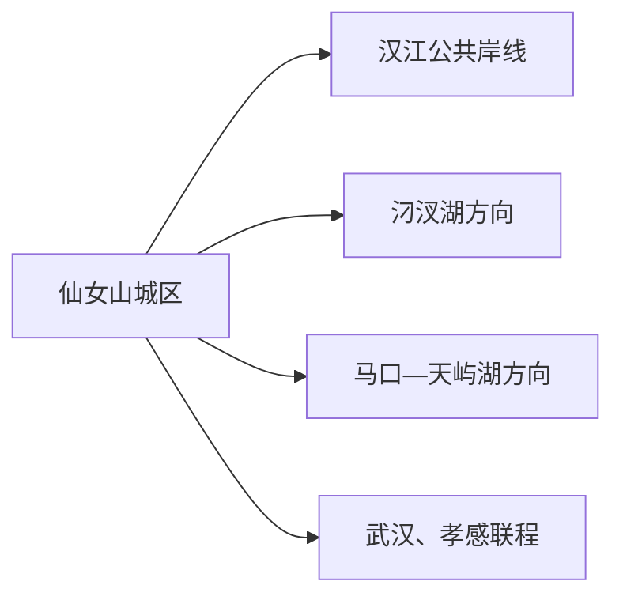
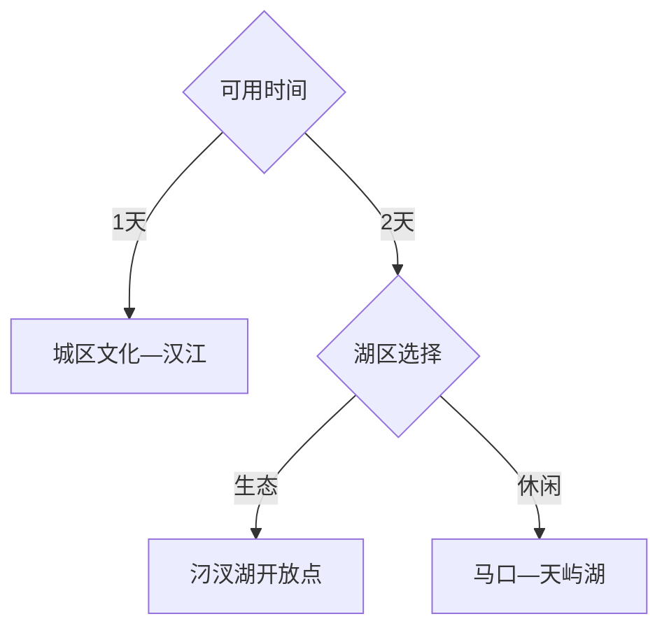

# 汉川旅行指南

汉川位于武汉都市圈西侧、汉江与江汉平原湖群之间。旅行时以仙女山城区为基地，把汈汊湖生态方向和马口—天屿湖方向分成两个选择；湖区生产堤、水利设施和养殖空间只按正式开放入口活动。

> 建议停留：城区半日至 1 天；加入一个湖区方向为 2 天 
> 旅行关键词：汉江、汈汊湖、江汉平原、湖区生态、水乡饮食 
> 无障碍说明：城区公共场馆可询问电梯与轮椅；湖岸栈道、堤防和度假区内部的设施连续性需向官方确认

## 城市速览
| 项目 | 旅行信息 |
|---|---|
| 主要旅行价值 | 汉江城市生活、湖区生态修复、江汉平原水产与农业文化 |
| 建议停留 | 1–2 天 |
| 舒适季节 | 春秋；夏季避开高温和强对流 |
| 预算特点 | 城区平实，湖区车辆与住宿增加预算 |
| 步行强度 | 城区低至中，湖区视开放线路而定 |
| 天气风险 | 暴雨、内涝、雷电、高温、大风和水位变化 |
| 独行旅行 | 城区方便，远点先锁返程 |
| 亲子旅行 | 公共文化场馆与正式湖区科普项目 |
| 长者与低体力 | 车辆到点，一天只选一个湖区 |
| 行前重点 | 湖区开放、水利调度、交通、天气和住宿 |

## 城市格局与游览区域
汉川是孝感代管的县级市，代码 `420984`。固定 GeoNames `1808977` 是城区居民点；法定实体 `Q1337056` 当前未列 P1566，页面以代码和行政资料界定市域。

| 区域 | 主要内容 | 怎么安排 | 时间 |
|---|---|---|---|
| 仙女山城区 | 城市服务、公共文化、汉江 | 抵达日或完整半日 | 半日至 1 天 |
| 汈汊湖方向 | 湿地修复、水乡与生产湖区 | 只走确认开放的观察点 | 1 天 |
| 马口—天屿湖 | 湖滨旅游区与镇区服务 | 按运营范围和住宿选择 | 半日至 1 天 |
| 其他乡镇 | 农田、养殖和水利空间 | 只参加正式接待项目 | 预约制 |

## 主要景点
### 城区与湖区
| 景点 | 区域 | 类型 | 主要看点 | 建议用时 | 室内外 | 体力 | 预约风险 | 天气影响 | 优先级 |
|---|---|---|---|---:|---|---|---|---|---|
| 汉川市博物馆或当期公共文化展馆 | 城区 | 博物馆 | 地方历史、江汉平原与民俗 | 2–3 小时 | 室内 | 低 | 高 | 低 | A |
| 汉江公共岸线代表段 | 城区 | 城市滨水 | 汉江与城市生活 | 1–2 小时 | 室外 | 低 | 低 | 很高 | B |
| 城区公园代表段 | 城区 | 城市公园 | 休息、绿地和日常生活 | 1–2 小时 | 室外 | 低 | 低 | 高 | C |
| 汈汊湖正式开放观察点 | 汈汊湖 | 湿地、生态 | 湖泊修复、鸟类和水乡景观 | 3–5 小时 | 室外 | 中 | 很高 | 很高 | A |
| 天屿湖旅游区当期开放区 | 马口方向 | 湖滨度假 | 湖滨休闲和当期活动 | 3–6 小时 | 混合 | 低至中 | 高 | 高 | B |
| 正式开放农旅项目 | 乡镇 | 农业、乡村 | 莲藕、水产或季节农事 | 2–4 小时 | 室外 | 中 | 很高 | 高 | C |

汈汊湖是兼具生态、水利和生产属性的大型湖区，观景与观鸟从正式开放观察点进入；天屿湖按一个运营单元计数。

## 美食与餐饮
| 类型 | 怎么点 | 过敏原与份量 | 选择建议 |
|---|---|---|---|
| 莲藕汤与藕菜 | 小份或多人分享 | 肉汤、花生和调味酱 | 先问汤底与份量 |
| 淡水鱼与河蟹 | 问清来源、重量、单价 | 鱼类、甲壳类和鱼刺 | 选择合法来源、明码标价餐馆 |
| 米酒、米团与粉面 | 单人友好 | 发酵、糯米、花生和小麦 | 早餐在城区解决 |
| 江汉平原家常菜 | 2–4 人分享 | 油盐、辣椒和大豆 | 以时令蔬菜搭配 |

## 经典行程

### 一日经典路线
**路线**：公共文化展馆 → 城区午餐 → 汉江公共岸线 → 城区晚餐
- **串联逻辑**：先读地方史，再看汉江城市空间。
- **预约锚点**：场馆开放。
- **休息安排**：午餐和下午室内休息。
- **时间不足时**：保留场馆和一段江岸。

### 两日城市路线
**第 1 天**：城区经典路线 
**第 2 天**：汈汊湖开放观察点或天屿湖二选一
- **串联逻辑**：城市与湖区分日。
- **预约锚点**：第二天开放、车辆和返程。
- **休息安排**：游客服务点与镇区。
- **时间不足时**：删除第二天远线。

### 三日深度路线
**第 1 天**：城区 
**第 2 天**：汈汊湖 
**第 3 天**：马口—天屿湖
- **串联逻辑**：生态修复与商业湖滨分别理解。
- **预约锚点**：两个湖区各自开放和住宿。
- **休息安排**：每天中午回到正式服务点。
- **时间不足时**：第三天优先删除。

### 雨天路线
**路线**：公共文化展馆 → 午餐 → 城区室内活动
- **适用条件**：城市道路正常。
- **串联逻辑**：减少湖岸和堤防暴露。
- **预约锚点**：场馆开放与内涝信息。
- **休息安排**：城区室内节点。
- **时间不足时**：只保留一馆。

### 亲子或低体力路线
**亲子路线**：展馆 → 午休 → 正式湖区科普短段 
**低体力路线**：车辆到展馆 → 午休 → 汉江平缓岸线
- **减负方式**：每天一个核心点，缩短栈道。
- **预约锚点**：轮椅、卫生间、落客和亲子活动。
- **休息安排**：场馆和游客中心。
- **时间不足时**：保留展馆。

### 远郊路线
**路线**：汈汊湖与天屿湖二选一
- **适用条件**：开放、车辆和返程确认。
- **串联逻辑**：生态湖区与度假区分开选择。
- **预约锚点**：管理方或运营方公告。
- **休息安排**：正式服务区。
- **时间不足时**：改走城区汉江短线。

## 住宿区域
| 区域 | 优点 | 取舍 | 适合人群 |
|---|---|---|---|
| 汉川城区 | 餐饮、交通和城市服务完整 | 去湖区需接驳 | 首访、短住 |
| 马口或正式度假住宿 | 靠近天屿湖方向 | 与城区有距离 | 休闲、亲子 |
| 武汉或孝感联程 | 干线交通选择多 | 属跨城住宿 | 多城行程 |

## 市内交通
- 购票时直接按 12306 显示的正式站名与实际车次选择，抵达后再接城区或湖区车辆。
- 城区用公交、出租和网约车；湖区提前确认返程。
- 汛期按水利、应急和道路公告调整；观光路线使用正式道路与开放入口，生产堤防保留水利与生产功能。

## 不同旅行者须知
| 情况 | 怎么安排 | 重点核对 |
|---|---|---|
| 独行 | 住城区，远线白天往返 | 末班、叫车和通信 |
| 亲子 | 展馆加短段科普 | 临水护栏、防蚊、防晒 |
| 长者与低体力 | 车辆到点、缩短湖岸 | 轮椅、座椅和卫生间 |
| 观鸟摄影 | 在开放点用长焦 | 繁殖期、无人机和团队限制 |
| 水产体验 | 选择正式经营项目 | 水质、救生、合法捕捞和保险 |

## 行前核对
| 项目 | 何时核对 | 官方入口 |
|---|---|---|
| 场馆和湖区开放 | 出发前一周及前一日 | [汉川市人民政府](https://www.hanchuan.gov.cn/) |
| 铁路与公交 | 购票时及前一日 | [中国铁路 12306](https://www.12306.cn/)及交通部门 |
| 防汛、内涝和天气 | 出发前三日起每日 | 汉川应急、水利和[中国气象局](https://www.cma.gov.cn/) |
| 无障碍条件 | 预约时 | 场馆和景区服务中心 |

## 来源与更新记录
| 来源 | 支持内容 | 核验日期 |
|---|---|---|
| [汉川市人民政府](https://www.hanchuan.gov.cn/) | 市情、公共文化、交通和动态入口 | 2026-08-13 |
| [湖北省住建厅：汈汊湖生态修复](https://zjt.hubei.gov.cn/bmdt/dtyw/szsm/202501/t20250106_5490607.shtml) | 退养还湖与生态修复边界 | 2026-08-13 |
| [湖北省文旅厅景区名单](https://wlt.hubei.gov.cn/zfxxgk/zc/qtzdgkwj/202602/t20260224_5879327.shtml) | 天屿湖当前机构状态核对 | 2026-08-13 |
| [民政部行政区划代码查询](https://dmfw.mca.gov.cn/xzqh/getList?code=42&trimCode=true&maxLevel=3) | `420984` 县级市层级 | 2026-08-13 |
| [GeoNames 1808977](https://www.geonames.org/1808977/hanchuan.html) | 固定城区点 | 2026-08-13 |
| [Wikidata Q1337056](https://www.wikidata.org/wiki/Q1337056) | 法定县级市实体 | 2026-08-13 |

| 日期 | 更新 |
|---|---|
| 2026-08-13 | 首次完成汉川市指南；区分城区、汈汊湖与马口湖滨方向。 |
