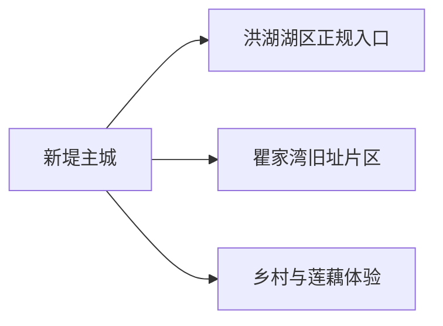
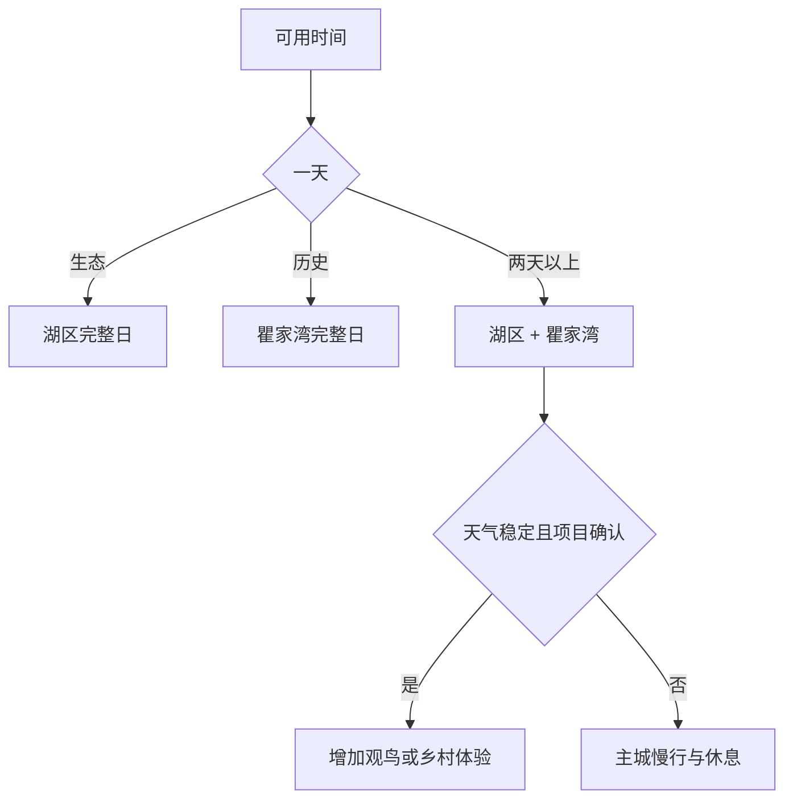

# 洪湖旅行指南

洪湖适合用“湖区生态、瞿家湾革命旧址、县级市生活”三条线索来安排。最舒服的节奏是先在主城落实交通和住宿，再把湖区与瞿家湾各作为一个完整方向；观鸟、水上活动和莲藕生产体验都以正式开放项目为准。

> 建议停留：2 天；观鸟季或慢游可安排 3 天 
> 旅行关键词：洪湖湿地、瞿家湾、水乡、莲藕、革命旧址 
> 主要体力：低至中等；湖区接驳与风浪影响较大 
> 最近研究：2026-08-12

## 城市速览

| 项目 | 旅行信息 |
|---|---|
| 主要旅行价值 | 通过正规湖区线路观察洪湖湿地与水乡环境，在瞿家湾旧址群理解湘鄂西革命史。 |
| 建议停留 | 1 天在湖区与瞿家湾二选一；2 天各留一天；3 天增加主城慢行或正式观鸟活动。 |
| 较舒适季节 | 春秋适合湿地和旧址步行；夏季荷景突出但炎热多雨，冬季观鸟需防风寒。 |
| 预算特点 | 主城餐饮住宿较易控制，景区票务、船线、跨镇车辆和旺季住宿是主要增量。 |
| 步行强度 | 旧址街巷为低至中等，湖区栈道和码头上下船更依赖天气与设施。 |
| 主要天气风险 | 强降雨、雷暴、大风、洪水调度、浓雾和高温会改变水上与湿地路线。 |
| 独行旅行 | 主城方便独立安排；湖区与瞿家湾优先选择有明确返程的公共或正规车辆。 |
| 亲子旅行 | 湿地科普和旧址展陈可分段进行，水边、码头与船上持续看护。 |
| 长者与低体力旅行 | 每天只选一个片区，优先车辆落客、短栈道与有座位的展陈。 |
| 无障碍信息 | 码头、船舶、旧建筑和栈道之间的设施连续性需向官方确认。 |

### 城市身份与边界

洪湖是荆州市代管的县级市 **421083**。固定 **GeoNames 1789137** 是新堤主城居民点；法定城市实体采用 **Wikidata Q1359268**，其 `P1566=1808115` 对应另一行政记录。两种标识用于交叉确认位置，不替代法定市域边界。石首、松滋、监利和荆州主城各自是独立行程。

## 城市格局与游览区域

| 区域 | 主要内容 | 游览特点 | 与其他区域的关系 |
|---|---|---|---|
| 新堤主城 | 住宿、餐饮、城市公共空间与交通集散 | 适合抵达日、补给和恶劣天气备用 | 前往湖区、瞿家湾均需另算道路时间 |
| 洪湖湖区正规旅游片区 | 湿地景观、荷花、水乡文化和许可船线 | 开放水域、码头和船期随季节变化 | 适合完整一天，保护区核心空间与生产水面另有管理 |
| 瞿家湾镇 | 湘鄂西革命根据地旧址群、老街与展陈 | 历史主题集中，可步行分段参观 | 可住主城往返，也可与同向已确认乡村项目组合 |
| 乡村生产与生态方向 | 莲藕、水产、观鸟和节庆活动 | 只选明确接待的项目，先问季节、集合点和返程 | 作为第三天兴趣线，不替代湖区主线 |

## 主要景点

| 景点 | 区域 | 类型 | 主要看点 | 建议用时 | 室内外 | 体力 | 预约风险 | 天气影响 | 优先级 |
|---|---|---|---|---:|---|---|---|---|---|
| 洪湖生态旅游区 | 湖区 | 湿地与水乡景区 | 正规开放水域、荷花、湿地科普与当期船线 | 5–8 小时 | 户外为主 | 中 | 高 | 极高 | A |
| 瞿家湾湘鄂西革命根据地旧址群 | 瞿家湾 | 革命旧址与历史街区 | 旧址、展陈、街镇格局与革命历史 | 3–5 小时 | 混合 | 中 | 中 | 中 | A |
| 洪湖市博物馆 | 新堤 | 地方综合博物馆 | 洪湖历史、水乡生产和地方文化展陈 | 1.5–3 小时 | 室内 | 低 | 中 | 低 | B |
| 新堤公共滨水与城市公园短段 | 主城 | 城市公共空间 | 城市生活、堤岸与日落；只走有照明护栏的开放段 | 1–2 小时 | 室外 | 低 | 低 | 高 | B |

湖区游客线路、自然保护区和生产水面按不同边界使用。观鸟选择管理方公布的观察点，船舶选择有资质的经营项目；核心保护空间、养殖网箱、采莲作业区和行洪通道只承担其本来功能。

## 美食与餐饮

| 菜品或餐饮类型 | 常见区域 | 一个人用餐与常见份量 | 风味、过敏原与饮食限制 | 排队风险与替代方法 |
|---|---|---|---|---|
| 莲藕排骨汤、藕圆 | 主城与正规湖北菜馆 | 汤锅多适合分享，可问小份 | 常含猪肉、蛋、淀粉；素食者先问汤底 | 秋冬热门时选明码标价同类店 |
| 淡水鱼与河鲜 | 主城、景区正规餐饮 | 多按重量计价，独食先问起售量 | 鱼刺、甲壳类和复合酱料需留意 | 先确认品种、重量、来源和做法 |
| 米粉、面食与早餐 | 新堤、瞿家湾镇区 | 单人友好 | 汤底可能含肉和大豆，小麦过敏需确认 | 早高峰选择社区同类店 |
| 莲子、菱角等季节产品 | 正规市场与商店 | 少量购买便于携带 | 关注加工配料、糖分和保质期 | 非产季选择标签清楚的加工品 |

## 经典行程

### 一日经典路线

**路线**：新堤出发 → 洪湖生态旅游区正式入口 → 游客服务区午餐与休息 → 当日开放主线 → 返回主城

- **串联逻辑**：整天围绕一个湖区入口，减少重复换船和跨岸折返。
- **预约锚点**：景区开放、船线、集合码头、救生与返程。
- **休息安排**：午餐和长休放在游客服务区。
- **时间不足时**：缩短开放主线，保留充足返程时间。

### 两日城市路线

**第 1 天**：湖区完整日  
**第 2 天**：瞿家湾旧址群 → 镇区午餐 → 返回新堤

- **串联逻辑**：生态与历史各自成日，体验清楚且交通可控。
- **预约锚点**：湖区船线与瞿家湾开放信息。
- **休息安排**：两天都在成熟服务区完成午休。
- **时间不足时**：第二天保留核心旧址展陈，缩短街巷步行。

### 三日深度路线

**第 1 天**：湖区  
**第 2 天**：瞿家湾  
**第 3 天**：主城文博 → 正式观鸟或农业体验二选一

- **串联逻辑**：先完成两条主线，再按季节选择补充主题。
- **预约锚点**：第三天接待资格、集合点和返程。
- **休息安排**：第三天下午回主城，不连续追赶乡村点位。
- **时间不足时**：第三天只保留主城文博。

### 雨天路线

**路线**：主城公共文化场馆 → 室内午餐 → 住宿地附近商业或休息空间

- **适用条件**：普通降雨；暴雨、雷暴、洪水或大风预警时以住宿地为基点。
- **串联逻辑**：用短程车辆和室内场馆替代码头、栈道与水上项目。
- **预约锚点**：场馆开放与道路通行。
- **休息安排**：午后保留完整室内坐休。
- **时间不足时**：只看一个场馆。

### 亲子或低体力路线

**亲子路线**：湖区自然教育短线 → 午餐 → 主城休息  
**低体力路线**：车辆到瞿家湾最近开放入口 → 核心展陈 → 镇区午休 → 返回

- **减负方式**：亲子选短线和有护栏区域；低体力路线减少船线、台阶与长街巷。
- **预约锚点**：儿童救生设备、最近落客点、座椅和卫生间。
- **休息安排**：每完成一个主题即安排坐休。
- **时间不足时**：亲子保留自然教育，低体力保留一处核心展陈。

### 远郊一日路线

**路线**：新堤 → 瞿家湾旧址群 → 镇区午餐 → 同向已确认乡村项目或直接返城

- **适用条件**：旧址开放、道路和返程已落实，乡村项目有明确接待。
- **串联逻辑**：围绕瞿家湾同一方向组织，避免横跨湖区追点。
- **预约锚点**：旧址开放、车辆与乡村接待。
- **休息安排**：镇区午餐和午休。
- **时间不足时**：保留瞿家湾，乡村项目整段删除。

## 住宿区域

| 区域 | 优点 | 代价 | 适合人群 | 交通提示 |
|---|---|---|---|---|
| 新堤主城 | 餐饮、住宿、医疗和车辆选择较多 | 每天需往返湖区或瞿家湾 | 首访、独行、公共交通旅客 | 以实际客运站和上车点选房 |
| 湖区正规住宿 | 便于早晚湿地活动 | 季节运营、餐饮与退改变化大 | 观鸟、摄影、慢游 | 确认合法接待、供电热水和离开方式 |
| 瞿家湾镇区 | 便于慢看旧址与老街 | 夜间服务与返程选择少 | 历史专题、自驾 | 订房时落实次日车辆 |

## 市内交通

洪湖以公路客运、公交、出租和预约车辆为主。选择住宿时先确认自己抵达的是哪个客运节点；湖区和瞿家湾的最后一段以景区、客运或正规车辆的当期信息为准。

| 场景 | 建议与取舍 | 行前需要重查的内容 |
|---|---|---|
| 抵达新堤主城 | 先到住宿地完成补给，再安排次日远线 | 客运班次、上客点、末班与道路施工 |
| 前往湖区 | 使用景区交通、客运或正规预约车辆 | 入口、码头、船期、停车与返程 |
| 前往瞿家湾 | 按完整半天至一天估算 | 班次、旧址开放、镇区用餐和最晚返程 |
| 自驾 | 适合两条远线分日组合 | 堤路、雾、积水、农机、停车和驾驶休息 |

## 不同旅行者须知

- **独行旅行**：住新堤更容易形成交通闭环，水上活动选择正规散客产品。
- **亲子旅行**：优先湿地科普与短线，码头和船上全程穿戴规定救生装备。
- **长者与低体力旅行**：每天一个片区，以车辆落客和短段展陈为主。
- **无障碍需求**：逐点确认码头坡度、船舶上下、旧址门槛、卫生间与车辆空间。
- **摄影与观鸟**：使用公布观察点，遵守无人机、声音、灯光和候鸟保护规则。

## 行前核对

| 核对事项 | 建议时间 | 官方入口 |
|---|---|---|
| 湖区开放、船线与保护边界 | 订房前、前一日及当天 | [洪湖生态旅游区](https://xn--t7tv60azzas7p.com/) |
| 瞿家湾旧址开放与活动 | 排入路线前及当天 | [洪湖市人民政府](https://www.honghu.gov.cn/) |
| 天气、水位与候鸟保护 | 出发前三日及当天 | [湖北省气象局](https://hb.cma.gov.cn/) · [湖北省林业局](https://lyj.hubei.gov.cn/) |
| 公路客运与返程 | 购票时、前一日及当天 | 洪湖市交通主管部门和正规承运方 |

## 来源与更新记录

### 主要来源

| 来源 | 支持内容 | 核验日期 |
|---|---|---|
| [民政部行政区划代码查询](https://dmfw.mca.gov.cn/) | 洪湖市 421083 及荆州代管关系 | 2026-08-12 |
| [Wikidata Q1359268](https://www.wikidata.org/wiki/Q1359268) | 法定实体与行政记录粒度 | 2026-08-12 |
| [GeoNames 1789137](https://www.geonames.org/1789137/xindi.html) | 固定新堤居民点 | 2026-08-12 |
| [湖北省文旅厅：A级景区信用名单](https://wlt.hubei.gov.cn/zfxxgk/zc/qtzdgkwj/202602/t20260224_5879327.shtml) | 洪湖生态旅游区在册运营线索 | 2026-08-12 |
| [国家林草局：洪湖候鸟保护](https://www.forestry.gov.cn/lyj/1/dfdt/20260303/660711.html) | 湿地生态价值、巡护和候鸟保护 | 2026-08-12 |
| [湖北省农业农村厅：洪湖莲藕](https://nyt.hubei.gov.cn/bmdt/yw/szdt/202507/t20250702_5711311_slh.shtml) | 莲藕与地域饮食线索 | 2026-08-12 |

### 更新记录

| 日期 | 更新内容 |
|---|---|
| 2026-08-12 | 首次整理洪湖实体、湖区—瞿家湾双主线、湿地与生产水面边界、路线、住宿和交通。 |
