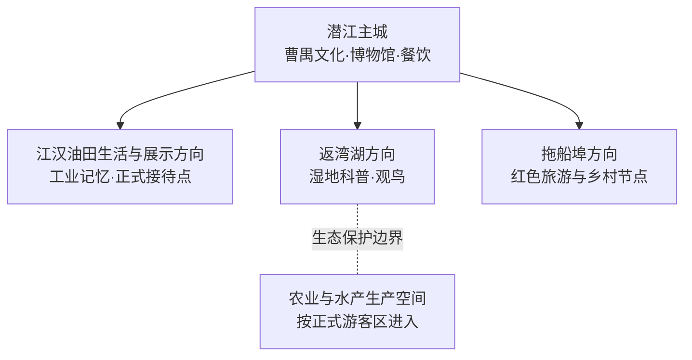
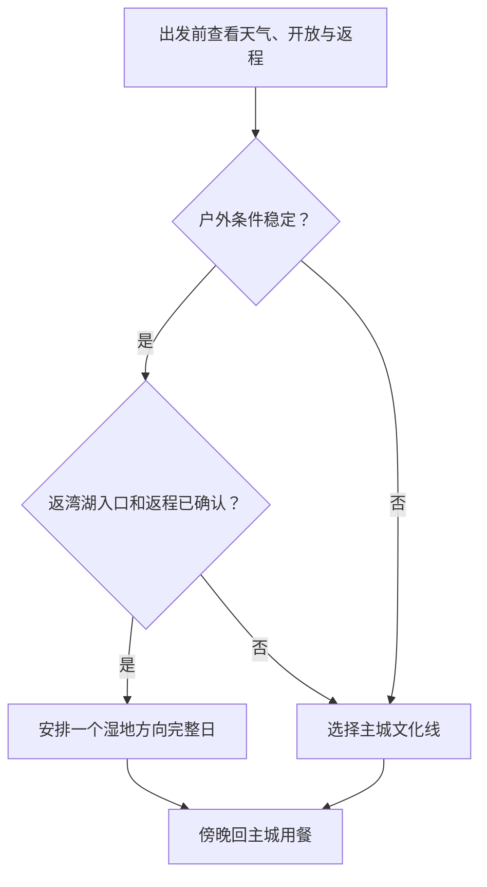

# 潜江旅行指南

潜江是湖北省直辖县级市，旅行主题集中在曹禺文化、江汉油田工业记忆、返湾湖湿地与小龙虾饮食。主城适合作为住宿和餐饮基点，周边湿地、农场、油田生产区与乡镇点位则按方向单独安排车辆。首次到访可用一日认识主城，再为返湾湖或拖船埠红色旅游区增加完整半日至一日。

> 建议停留：1–3 天；主城 1 天，湿地或远郊方向各增加半日至 1 天  
> 旅行关键词：曹禺文化、江汉油田、返湾湖、小龙虾、江汉平原  
> 主要体力：低至中等；平原地形友好，负担主要来自园区尺度、日晒和跨片区车程  
> 最近研究：2026-08-12

## 城市速览

| 项目 | 旅行信息 |
|---|---|
| 主要旅行价值 | 以曹禺文化为主城人文线，以返湾湖理解江汉湿地，以江汉油田认识工业城市背景，再用小龙虾和地方蒸菜连接夜间餐饮 |
| 建议停留 | 1 天走主城；2 天增加返湾湖；3 天再选拖船埠或一个有正式接待的乡村文旅项目 |
| 较舒适季节 | 春秋更适合户外；小龙虾消费旺季通常在暖季，但供应、价格和活动日期以当期为准 |
| 预算特点 | 主城低至中等；主要增量来自远郊车辆、经营项目票务和多人水产餐 |
| 步行强度 | 主城场馆较易控制，湿地与园区面积较大；每半天安排一段完整坐休 |
| 主要天气风险 | 高温高湿、雷电、短时强降雨、积水、湖区大风；冬季可能湿冷、雨雪或结冰 |
| 独行旅行 | 主城单馆、餐饮和叫车较方便；远郊先锁定返程与正规接待入口 |
| 亲子旅行 | 曹禺文化场馆、博物馆和正式湿地科普线较合适；临水、码头、鱼塘和道路需持续看护 |
| 长者与低体力旅行 | 以主城现代场馆为主，每日一个核心；湿地只选车辆可达且有座椅、卫生间的短段 |
| 无障碍信息 | 设施连续性需向官方确认；场馆入口、湿地步道、车辆落客点和卫生间应逐处核对 |

## 城市格局与游览区域

潜江法定行政代码为 `429005`，由湖北省直辖。主城承担住宿、餐饮和公共文化服务；返湾湖在市域湿地方向，拖船埠及乡村项目分布于外围。江汉油田与城市联系紧密，但办公、采油、管线、仓储和施工空间按生产管理边界识别，参观以公开场馆或正式活动为准。

| 区域 | 主要内容 | 游览特点 | 规划方式 |
|---|---|---|---|
| 园林—泰丰—广华寺主城 | 曹禺文化场馆、市博物馆、成熟餐饮和住宿 | 适合到达日、雨天和低体力行程 | 用公交或短途车串联，避免按行政街道名估算步行距离 |
| 江汉油田方向 | 油田城市生活、工业记忆及明确开放的展示空间 | 生产与生活空间交织，预约和接待规则优先 | 只选公开场馆或正式活动，不沿油井、管线和作业道路自行探访 |
| 返湾湖方向 | 湿地生态、观鸟和当日开放科普游线 | 适合完整半日至一日，天气与水位影响明显 | 先确认游客入口、开放步道、返程与防蚊准备 |
| 拖船埠及乡村方向 | 红色文化、乡村展示和季节性农旅 | 点位分散，适合专题日 | 以官方发布的接待点为锚，不把生产村庄整体当作景区 |

返湾湖、河渠、鱼塘、农田和泵站分别承担生态保护、防洪、养殖和农业生产功能。旅行路线以开放步道、游客中心、正规餐饮与公共道路为主，水域活动选择有资质的运营项目。

## 主要景点

### 主城文化

| 景点 | 区域 | 类型 | 主要看点 | 建议用时 | 室内外 | 体力 | 预约风险 | 天气影响 | 优先级 |
|---|---|---|---|---:|---|---|---|---|---|
| 曹禺纪念馆及曹禺文化片区 | 主城 | 纪念馆、城市文化 | 曹禺生平、戏剧文化与潜江地方记忆；同片区场馆按开放情况组合 | 2–4 小时 | 室内为主 | 低 | 中 | 低 | A |
| 潜江市博物馆 | 主城 | 综合博物馆 | 潜江历史、江汉平原考古与地方社会发展 | 1.5–3 小时 | 室内 | 低 | 中 | 低 | A |
| 潜江市图书馆或群众文化场馆当期活动 | 主城 | 公共文化 | 公益展览、阅读与地方文化活动，适合作为天气备选 | 1–2 小时 | 室内 | 低 | 中 | 低 | B |
| 龙湾遗址展示相关开放单元 | 龙湾方向 | 考古遗址、楚文化 | 章华台遗址与楚文化背景；现场开放、讲解和道路需预先确认 | 3–5 小时，另计往返 | 室内外混合 | 中 | 高 | 高 | B |

### 湿地、工业记忆与远郊

| 景点 | 区域 | 类型 | 主要看点 | 建议用时 | 室内外 | 体力 | 预约风险 | 天气影响 | 优先级 |
|---|---|---|---|---:|---|---|---|---|---|
| 返湾湖国家湿地公园正式开放区 | 返湾湖方向 | 湿地、生态科普 | 江汉平原湿地景观、鸟类与水生态；按开放步道游览 | 4–6 小时，另计往返 | 室外 | 中 | 高 | 高 | A |
| 江汉油田正式展示或研学项目 | 油田方向 | 工业文化、研学 | 石油开发史与油城生活；只采用当期有接待公告的场馆或项目 | 2–4 小时 | 室内外混合 | 低至中 | 高 | 中 | B |
| 拖船埠红色旅游区当日开放单元 | 拖船埠方向 | 红色文化、乡村旅游 | 革命历史、乡村空间与当期开放展陈 | 3–5 小时，另计往返 | 室内外混合 | 中 | 高 | 高 | B |
| 熊口红军街及纪念空间 | 熊口方向 | 历史街区、纪念空间 | 地方革命史与街区格局；居民生活、修缮和展馆开放分别核对 | 3–4 小时，另计往返 | 室内外混合 | 中 | 高 | 中 | C |
| 正式运营的小龙虾主题展示或体验 | 市域当期项目 | 饮食文化、产业展示 | 小龙虾养殖、加工和餐饮文化；以有资质、可预约项目为准 | 2–4 小时 | 室内外混合 | 低至中 | 高 | 中 | C |

## 美食与餐饮

潜江小龙虾是最鲜明的饮食主题，也适合用蒸菜、鱼糕、米食和江汉平原家常菜平衡餐次。活动报道、产业基地和加工厂不自动等于日常餐厅，选店时优先看明码标价、鲜活食材处理、加工环境和可说明的过敏原。

| 餐饮类型 | 适合场景 | 份量与点单 | 过敏原与取舍 |
|---|---|---|---|
| 潜江小龙虾 | 主城晚餐、多人分享 | 常按重量或份计价；先问净重、口味、加工费和配菜 | 甲壳类、辣椒、蒜、酒料、黄豆酱及共用油锅常见 |
| 油焖、蒜蓉或清蒸水产 | 想比较不同做法 | 独行可问小份，并加主食和蔬菜 | 水产过敏者选完全分开的锅具和餐具；痛风或控盐者控制份量 |
| 沔阳三蒸及地方蒸菜 | 正餐、家庭同行 | 多为共享份，可选一荤一素 | 米粉、猪肉、鱼、蛋、大豆及复合调味常见 |
| 鱼糕、鱼丸与淡水鱼 | 江汉平原风味补充 | 询问鱼刺、淀粉比例和小份 | 鱼类、蛋、淀粉、大豆；儿童和吞咽困难者注意质地 |
| 早餐米粉、面食与豆制品 | 独行、赶行程 | 一碗即可成餐，另加蛋或蔬菜 | 小麦、大豆、芝麻、花生和辣椒交叉接触需确认 |

## 经典行程

### 一日经典路线

**路线**：曹禺文化片区 → 主城午餐与坐休 → 潜江市博物馆 → 小龙虾或地方菜晚餐

- **适用条件**：适合初访、到达日和普通天气。
- **串联逻辑**：先以戏剧人物认识城市，再用综合博物馆补足地方史，全天保持主城尺度。
- **预约锚点**：两处场馆的开放日、入馆方式和最晚入场。
- **休息安排**：午间完整坐休，下午只保留一座主馆。
- **时间不足时**：在曹禺纪念馆和市博物馆中二选一。

### 两日城市路线

**第 1 天**：主城文化与餐饮 
**第 2 天**：主城 → 返湾湖正式入口 → 开放科普步道 → 主城

- **适用条件**：返湾湖开放、道路和返程均确认，天气适合户外。
- **串联逻辑**：人文与湿地分日安排，每天保持一个清晰主题。
- **预约锚点**：第二天重点确认开放区域、停车或接驳、返程和天气。
- **休息安排**：在游客服务设施内坐休，携带饮水与防蚊用品。
- **时间不足时**：缩短湿地步道，保留返程余量；天气转差则留在主城。

### 三日深度路线

**第 1 天**：主城文化 
**第 2 天**：返湾湖湿地 
**第 3 天**：龙湾遗址、拖船埠或江汉油田正式接待项目三选一

- **适用条件**：第三天所选项目有明确开放和正规车辆。
- **串联逻辑**：城市、生态与考古/工业/红色主题各占一日，降低跨向折返。
- **预约锚点**：第三天先锁一个核心及返程，不用历史活动替代当期接待确认。
- **休息安排**：远郊日在成熟乡镇或游客中心完整休息。
- **时间不足时**：删除第三天，不压缩湿地和远郊为同日打卡。

### 雨天路线

**路线**：曹禺纪念馆 → 室内午餐 → 潜江市博物馆或住宿地休息

- **适用条件**：普通降雨且城市交通正常；强对流、积水或暴雨预警时缩短移动。
- **串联逻辑**：以主城室内场馆替代湿地、遗址和乡村道路。
- **预约锚点**：确认一座主馆即可，第二馆作弹性项。
- **休息安排**：全程使用正规室内空间，移动前查看预警与道路。
- **时间不足时**：只保留一座场馆。

### 亲子或低体力路线

**亲子路线**：市博物馆 → 午休 → 曹禺文化片区精选一馆 
**低体力路线**：车辆抵达一座主城场馆 → 核心展厅 → 长休 → 就近正餐

- **适用条件**：亲子关注互动活动年龄，低体力旅行逐点确认落客、坡道、电梯和卫生间。
- **串联逻辑**：两条路线均保持主城、小范围、可随时退出；湿地另择天气良好的一天。
- **预约锚点**：儿童预约、讲解、轮椅、座椅与重点旅客接待。
- **休息安排**：午间长休，每完成一个核心即评估体力。
- **时间不足时**：只留一座现代场馆。

### 远郊一日路线

**路线**：主城 → 拖船埠或龙湾遗址二选一 → 正式接待点午休 → 主城

- **适用条件**：目标开放、车辆、餐饮和返程均有确认。
- **串联逻辑**：每次只走一个远郊方向，以完整理解替代跨市域赶点。
- **预约锚点**：开放单元、讲解、停车、道路与最晚返程。
- **休息安排**：在游客中心或成熟乡镇餐饮坐休。
- **时间不足时**：整段换成主城文化线。

## 住宿区域

| 区域 | 优点 | 取舍 | 适合人群 | 交通特点 |
|---|---|---|---|---|
| 园林—泰丰成熟城区 | 餐饮、商业和叫车方便 | 到湿地与远郊仍需单独车辆 | 首访、独行、多方向旅行 | 以酒店真实地址核算车站和场馆距离 |
| 广华寺—江汉油田生活区 | 适合工业文化或相关访问 | 与主城文化点及远郊方向不完全重合 | 油田主题、探亲或商务衔接 | 先确认公共交通、夜间上客与接待地点 |
| 火车站或客运节点周边 | 减少早晚到发压力 | 餐饮和夜间活动因具体片区而异 | 晚到早走、携带大件行李 | 按票面站名和实际站口选房 |
| 远郊合规住宿 | 可减少单一景区往返 | 服务、医疗、供餐和天气弹性较弱 | 自驾、慢游、已锁定单一方向者 | 核实证照、消防、夜间道路和退改 |

## 市内交通

| 场景 | 怎么选 | 行前核对 |
|---|---|---|
| 铁路到达 | 按 12306 当日可售车次与票面站名规划，再接公交、出租或网约车 | 车次、站口、末班、正规上客点和晚到交通 |
| 主城移动 | 公交适合预算优先，短途叫车适合赶场馆预约 | 线路、首末班、施工绕行、支付与无障碍车辆 |
| 返湾湖 | 正规城乡客运、自驾或合规预约车更便于锁定返程 | 开放入口、停车、末班、道路、水位和天气 |
| 龙湾、拖船埠等远郊 | 每个方向单独安排半日至一日 | 出发点、返程、讲解接待、乡村道路和夜间运力 |
| 江汉油田方向 | 按公开场馆或正式活动给出的入口抵达 | 访客登记、停车、生产区边界与摄影规则 |
| 自驾 | 对分散市域更灵活 | 积水、雾、桥面结冰、施工、停车与驾驶员休息 |

## 不同旅行者须知

| 旅行维度 | 可行选择 | 主要取舍 | 需额外核对 |
|---|---|---|---|
| 独行 | 主城单馆、早餐和一人餐容易安排 | 远郊返程与夜间叫车波动更大 | 末班、合规车辆、住宿前台和离线地图 |
| 亲子 | 现代场馆与正式湿地科普线主题清楚 | 临水、游船、鱼塘和大型园区增加照护 | 年龄、推车、救生、卫生间和陪同 |
| 长者或低体力 | 车辆直达主城场馆最易控制 | 湿地长线、日晒和跨片区车程消耗体力 | 落客、坡道、电梯、轮椅、座椅和退出路线 |
| 无障碍需求 | 可先向场馆与住宿逐点确认 | 城市级信息不代表全程连续可达 | 车辆装载、入口、卫生间、陪同与疏散 |
| 湿地与观鸟 | 正式开放步道和科普活动较稳妥 | 水位、鸟类繁殖、风雨和蚊虫改变体验 | 开放边界、天气、装备与摄影规范 |
| 饮食过敏 | 选择能说明原料和加工环境的餐厅 | 小龙虾与水产餐的交叉接触较多 | 甲壳类、鱼、酒料、辣椒、共用锅具和计价 |

## 行前核对

| 核对事项 | 为什么重查 | 时间 | 官方入口 |
|---|---|---|---|
| 曹禺文化场馆与市博物馆 | 闭馆、预约、临展和团队活动会变化 | 排线时及前一日 | [潜江市文化和旅游局](https://www.hbqj.gov.cn/swhhlyj/) |
| 返湾湖及远郊项目 | 开放边界、接驳、水位和季节活动不同步 | 订车前及当天 | [潜江市人民政府](https://www.hbqj.gov.cn/)及运营方公告 |
| 铁路与城乡交通 | 车次、线路、站位和末班具有时效性 | 购票时及当天 | [中国铁路 12306](https://www.12306.cn/)；潜江市交通运输部门公告 |
| 暴雨、雷电、高温和大风 | 会改变湿地、道路与水上项目 | 出发前三日起每日查看 | [湖北省气象局](http://hb.cma.gov.cn/) |
| 湿地、鱼塘、油田和水利边界 | 游客区、保护区和生产区用途不同 | 选点时及到场后 | 属地政府、自然资源、生态环境和现场管理公告 |
| 无障碍与重点旅客服务 | 单点设施不能证明全程连续 | 订票、订房和预约前 | 场馆、酒店、交通运营方与[12306重点旅客预约](https://kyfw.12306.cn/otn/view/icentre_qxyyInfo.html) |

## 来源与更新记录

### 标识符与范围说明

| 来源 | 结论 | 本页处理 | 核验日期 |
|---|---|---|---|
| [GeoNames 1786067 RDF](https://sws.geonames.org/1786067/about.rdf) | Qianjiang 城市点 | 作为固定覆盖键；点坐标不替代法定市域边界 | 2026-08-12 |
| [Wikidata Q71489](https://www.wikidata.org/wiki/Q71489) | 潜江市，P1566 指向 `1786067` | 作为法定城市实体交叉核对 | 2026-08-12 |
| [民政部行政区划查询](https://dmfw.mca.gov.cn/) | `429005 潜江市` | 控制省直辖县级市代码与层级 | 2026-08-12 |

### 主要来源

| 来源 | 类型 | 支持内容 | 核验日期 |
|---|---|---|---|
| [潜江市文旅局：2026 年文化旅游体育工作要点](https://www.hbqj.gov.cn/swhhlyj/zfxxgk/zc/bbmwj/202603/t20260312_5890628.html) | 文旅主管部门 | 曹禺文化、返湾湖、龙湾遗址及公共文化当期方向 | 2026-08-12 |
| [潜江市政府：文旅活动与城市文旅消费](https://www.hbqj.gov.cn/xwzx/jrqj/qjyw/202603/t20260316_5893320.html) | 市政府动态 | 城市文化、小龙虾与当期文旅活动线索 | 2026-08-12 |
| [潜江市政府：小龙虾产业与消费服务](https://www.hbqj.gov.cn/xwzx/jrqj/smsh/202606/t20260608_5954163.html) | 市政府民生动态 | 小龙虾消费、市场与服务边界 | 2026-08-12 |
| [潜江市政府：返湾湖相关市域规划](https://www.hbqj.gov.cn/xxgk/zc/qtwj/szfbwj/szfbwj2026/202604/t20260428_5924028.html) | 市政府文件 | 湿地与市域空间关系，规划内容不直接推定开放 | 2026-08-12 |
| [潜江市政府：防汛与水域管理公告](https://www.hbqj.gov.cn/xxgk/zc/qtwj/gsgg/202605/t20260528_5946075.html) | 市政府公告 | 水域、天气与防汛边界 | 2026-08-12 |
| [潜江市政府新闻发布会](https://www.hbqj.gov.cn/zmhd/xwfbh/202603/t20260313_5891912.html) | 市政府发布 | 城市公共服务与当期发展背景 | 2026-08-12 |
| [潜江市公共文化服务信息](https://www.hbqj.gov.cn/xxgk/xxgkml/qzcxxgkml/ylhq/zfxxgk/fdzdgknr/gysyjs_34501/ggwhty/202504/t20250416_5617870.html) | 属地公共文化 | 场馆与公益文化服务线索 | 2026-08-12 |
| [潜江市政府公报：市域行政与发展资料](https://www.hbqj.gov.cn/xxgk/xxgkml/szfxxgkml/qtzdgknr/zfgb/zfgb2022/_4h/202209/t20220920_4314053.html) | 市政府公报 | 市域背景与政策边界 | 2026-08-12 |
| [中国铁路 12306](https://www.12306.cn/) | 铁路运营方 | 车次、票务和重点旅客服务 | 2026-08-12 |
| [湖北省气象局](http://hb.cma.gov.cn/) | 气象主管部门 | 高温、暴雨、雷电、大风及预警 | 2026-08-12 |

### 更新记录

- 2026-08-12：完成首版研究；建立主城—返湾湖—远郊分区、六类路线、交通与动态核对框架。
