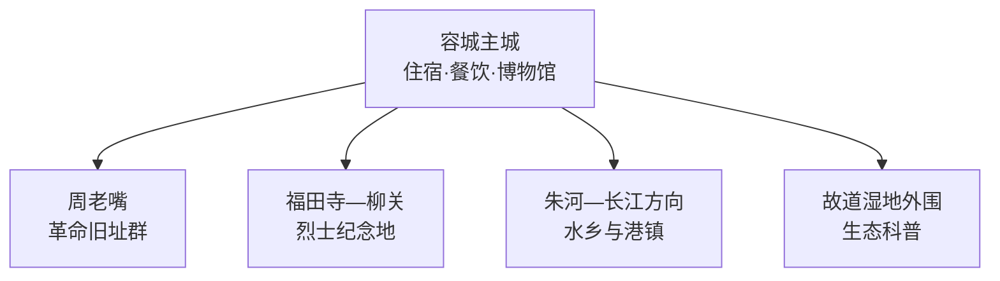
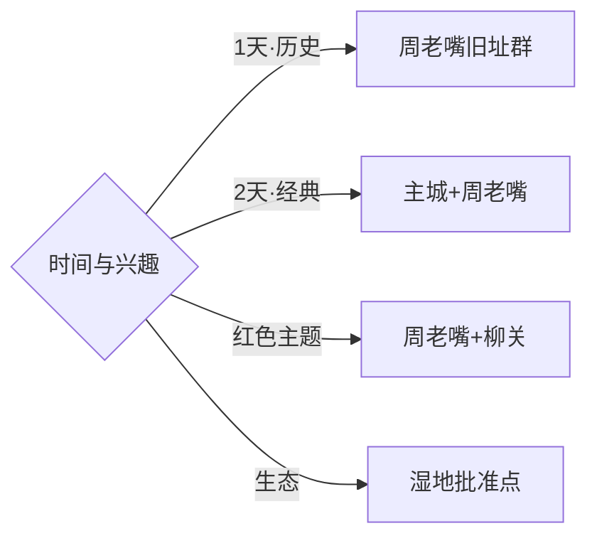

# 监利旅行指南

监利位于江汉平原南部，旅行内容分为三层：容城主城适合认识鱼米水乡与地方历史，周老嘴集中保存湘鄂西革命旧址，福田寺—柳关连接烈士纪念地和内荆河沿岸。固定快照中的 **Futiansi / GeoNames 8513606** 对应监利市福田寺镇，湖北党史资料也明确柳关烈士陵园位于该镇；洪湖市、潜江市和湖南岳阳均按跨县市行程计算。

> 建议停留：2–3 天\
> 旅行关键词：周老嘴、湘鄂西革命史、江汉平原、黄鳝、小龙虾\
> 主要体力：主城低；旧址群低至中等；湿地与乡村线依接驳而定\
> 最近研究：2026-09-03

## 城市速览

| 项目 | 旅行信息 |
|---|---|
| 主要旅行价值 | 以周老嘴革命旧址群为历史主线，结合江汉平原水乡、农业与地方饮食 |
| 建议停留 | 2天覆盖主城与周老嘴；增加福田寺—柳关或湿地科普可安排3天 |
| 较舒适季节 | 春秋适合户外；夏季水乡风貌鲜明，同时高温、暴雨和蚊虫增加 |
| 预算特点 | 主城住宿消费温和，跨镇车辆与讲解预约是主要变量 |
| 步行强度 | 主城和纪念馆较低，周老嘴旧街连续步行中等 |
| 主要天气风险 | 高温、雷暴、暴雨、洪涝、江河高水位与大雾 |
| 独行旅行 | 主城易安排，周老嘴和福田寺方向先落实返程 |
| 亲子旅行 | 博物馆和革命历史展陈适合研学，水边活动加强看护 |
| 长者与低体力旅行 | 选择主城—纪念馆—周老嘴核心旧址短线 |
| 无障碍信息 | 新建场馆相对友好，历史街巷、旧建筑门槛和乡村道路需逐点确认 |

## 城市格局与游览区域

| 区域 | 主要内容 | 游览特点 | 与其他区域的关系 |
|---|---|---|---|
| 容城主城 | 监利博物馆、城市服务与地方餐饮 | 适合抵达日和雨天 | 作为各乡镇路线共同住宿基地 |
| 周老嘴 | 湘鄂西革命旧址群、革命历史博物馆、柳直荀烈士陵园 | 旧址密集，讲解价值高 | 宜单独安排半天至一天 |
| 福田寺—柳关 | 柳关烈士陵园、内荆河与平原乡镇 | 点位分散，适合主题参访 | 与周老嘴方向不同，单独安排更稳妥 |
| 朱河及长江沿线 | 港镇、堤防外公共景观与水乡生活 | 水位和交通影响明显 | 只选择开放公共空间 |
| 故道湿地外围 | 长江故道、鸟类与湿地科普 | 保护规则和季节性突出 | 以管理机构批准的观察点为准 |

## 主要景点

| 景点 | 区域 | 类型 | 主要看点 | 建议用时 | 室内外 | 体力 | 预约风险 | 天气影响 | 优先级 |
|---|---|---|---|---:|---|---|---|---|---|
| 监利市博物馆 | 容城主城 | 博物馆 | 地方历史、江汉平原与革命文物 | 1.5–2小时 | 室内 | 低 | 中 | 低 | A |
| 周老嘴湘鄂西革命根据地旧址群 | 周老嘴镇 | 革命旧址 | 中共中央湘鄂西分局等旧址与古镇街巷 | 半天–1天 | 混合 | 低中 | 中高 | 中 | A |
| 监利市革命历史博物馆 | 周老嘴镇 | 纪念馆 | 湘鄂西革命史与旧址群背景 | 1.5–2小时 | 室内 | 低 | 中 | 低 | A |
| 柳直荀烈士陵园 | 周老嘴镇 | 纪念地 | 烈士纪念园与红色文化 | 1–2小时 | 混合 | 低 | 中 | 中 | A |
| 柳关烈士陵园 | 福田寺镇 | 纪念地 | 柳关地区革命史与烈士纪念设施 | 1–2小时 | 室外 | 低 | 中高 | 中 | B |
| 容城老城公共街区 | 容城主城 | 城市与水乡 | 县城生活、地方餐饮与滨水环境 | 2–3小时 | 室外 | 低 | 低 | 中 | B |
| 长江故道保护区批准科普点 | 市域东南 | 湿地与观鸟 | 故道湿地、候鸟与生态保护 | 半天 | 室外 | 低中 | 高 | 很高 | C |
| 正规农业与水产研学点 | 平原乡镇 | 农业体验 | 水稻、黄鳝、小龙虾与水乡生产 | 半天 | 混合 | 低 | 高 | 高 | C |

## 美食与餐饮

| 菜品或餐饮类型 | 常见区域 | 一个人用餐与常见份量 | 风味、过敏原与饮食限制 | 排队风险与替代方法 |
|---|---|---|---|---|
| 监利黄鳝 | 主城正规餐馆 | 多为共享菜，独行先问小份 | 水产、辣椒和油脂明显，鱼刺需留意 | 选明码标价店，按人数确认份量 |
| 小龙虾 | 主城与夜间餐饮区 | 常按份或重量，适合分享 | 甲壳类过敏、辣度和手部清洁需注意 | 旺季错峰，也可改点虾球小份 |
| 监利米团子 | 早餐店、市场 | 单个或小份友好 | 米制品，馅料可能含肉、豆干和辣椒 | 上午更常见，选择现制正规门店 |
| 锅盔与面点 | 主城 | 单份友好 | 面筋、芝麻和肉馅先询问 | 早餐选择多，可在社区店替代 |
| 莲藕与水乡家常菜 | 主城和乡镇 | 小炒适合共享，也可问小份 | 排骨汤等常含肉类，素食先说明 | 以当季菜单为准 |

## 经典行程

### 一日经典路线

**路线**：监利市革命历史博物馆 → 周老嘴核心旧址 → 午餐 → 柳直荀烈士陵园

- **串联逻辑**：先用展陈建立时间线，再步行看旧址和纪念空间。
- **预约锚点**：纪念馆开放、团队讲解与旧址参观安排。
- **休息安排**：周老嘴正规餐饮和纪念馆公共区。
- **时间不足时**：保留纪念馆与两处代表性旧址。

### 两日城市路线

**第 1 天**：容城主城 → 监利市博物馆 → 地方餐饮。\
**第 2 天**：周老嘴革命旧址群 → 柳直荀烈士陵园。

- **串联逻辑**：地方通史与革命史分日，阅读压力更小。
- **预约锚点**：两座博物馆及周老嘴讲解。
- **休息安排**：主城连住，第二日午间在周老嘴休息。
- **时间不足时**：首日压缩为博物馆半日，第二日保持完整。

### 三日深度路线

**第 1 天**：容城主城与监利市博物馆。\
**第 2 天**：周老嘴旧址群。\
**第 3 天**：福田寺—柳关烈士陵园，或湿地批准科普点。

- **串联逻辑**：主城、革命首府旧址和另一条纪念/生态线各占一天。
- **预约锚点**：第三日车辆、接待与保护区开放。
- **休息安排**：主城连住，远线带足饮水并预留返程。
- **时间不足时**：先删第三日，再把首日压缩为半日。

### 雨天路线

**路线**：监利市博物馆 → 主城午餐 → 革命历史博物馆 → 周老嘴有遮蔽旧址

- **适用条件**：普通降雨采用室内线；暴雨和洪涝预警时减少跨镇移动。
- **预约锚点**：场馆开放与道路通行。
- **休息安排**：两座场馆和主城商业区。
- **时间不足时**：保留就近的一座博物馆深度参观。

### 亲子或低体力路线

**亲子路线**：监利市博物馆 → 周老嘴革命历史博物馆 → 核心旧址短线。\
**低体力路线**：主城博物馆 → 柳直荀烈士陵园平缓段 → 返城。

- **减负方式**：亲子用讲解和任务单建立线索；低体力线以车辆连接并减少旧街步行。
- **预约锚点**：研学讲解、无障碍入口和停车。
- **休息安排**：场馆、纪念园和主城。
- **时间不足时**：两类路线均保留一座核心场馆。

### 周老嘴一日路线

**路线**：革命历史博物馆 → 中共中央湘鄂西分局等开放旧址 → 古镇午餐 → 柳直荀烈士陵园

- **适用条件**：适合已落实讲解、旧址开放与往返车辆的日期。
- **预约锚点**：旧址群开放清单、讲解和团体接待。
- **休息安排**：纪念馆与古镇正规餐饮点。
- **时间不足时**：按讲解建议选三处代表旧址，不追求逐点打卡。

### 福田寺与柳关路线

**路线**：容城出发 → 福田寺镇 → 柳关烈士陵园 → 内荆河沿岸公共空间 → 返回

- **串联逻辑**：围绕柳关地区革命史与平原水系安排同方向参访。
- **预约锚点**：纪念地接待、道路与汛情。
- **休息安排**：福田寺镇区正规餐饮点。
- **时间不足时**：保留柳关烈士陵园，沿河段作为弹性项。

## 住宿区域

| 区域 | 优点 | 缺点 | 适合人群 | 交通特点 |
|---|---|---|---|---|
| 容城主城 | 住宿、餐饮和交通选择集中 | 前往周老嘴和柳关需公路接驳 | 首访、独行、公共交通旅行者 | 适合作为全市共同基地 |
| 周老嘴正规住宿 | 便于旧址群早晚参访 | 房量和餐饮少于主城 | 红色文化、研学团队 | 订房前确认接待与返程 |
| 朱河等镇区正规住宿 | 靠近长江沿线与东南乡镇 | 与核心旧址方向不同 | 探亲、商务或专项旅行 | 按具体目的地选镇区 |
| 乡村正规接待点 | 贴近水乡和农业体验 | 位置分散、服务差异大 | 自驾、研学 | 先确认经营资质与道路 |

## 市内交通

| 场景 | 建议与取舍 | 行前需要重查的内容 |
|---|---|---|
| 从荆州或岳阳方向抵达 | 公路交通为主，先到容城主城再分线 | 客运班次、上下车点与末班 |
| 主城—周老嘴 | 宜留半天以上，团队讲解可与车辆一起预约 | 道路、场馆开放和返程 |
| 主城—福田寺 | 与周老嘴分属不同方向，安排独立半天 | 纪念地接待、镇际班次和汛情 |
| 湿地与长江沿线 | 使用批准入口和公共道路，按水位取舍 | 保护区公告、堤防管制与天气 |

## 不同旅行者须知

| 旅行维度 | 可行条件 | 主要取舍 | 需额外核对 |
|---|---|---|---|
| 独行旅行 | 主城住宿餐饮方便 | 乡镇返程选择较少 | 末班、叫车覆盖和接驳 |
| 亲子旅行 | 博物馆与旧址研学主线清晰 | 历史信息量大，水边需看护 | 讲解、卫生间和儿童活动 |
| 长者或低体力旅行 | 场馆与纪念园核心段较平缓 | 旧街连续步行可能疲劳 | 座椅、无障碍入口与车辆 |
| 无障碍需求 | 新建场馆优先 | 历史建筑门槛和乡村道路连续性有限 | 坡道、电梯和无障碍卫生间 |
| 摄影旅行 | 水乡、旧街与纪念建筑题材丰富 | 纪念场所和人物拍摄需尊重规则 | 三脚架、航拍和团队拍摄 |
| 预算有限 | 主城住宿与公共场馆成本较稳 | 跨镇包车增加支出 | 班车、拼车与退改 |
| 晚出发或紧凑行程 | 主城博物馆可做半日 | 周老嘴适合完整半天以上 | 最晚入馆与返程 |
| 特殊天气或自然条件 | 普通小雨可走博物馆线 | 暴雨、洪涝和大雾影响乡镇与水边 | 气象、水利、交通和场馆公告 |

革命旧址、烈士陵园与纪念馆按开放清单、讲解秩序和文物保护要求参访。长江、内荆河、故道湿地、堤防与水利设施按防汛和保护区规则使用；水稻田、水产养殖塘、加工厂和居民院落选择明确开放的研学或接待区域。

## 行前核对

| 核对事项 | 为什么需要重查 | 建议核对时间 | 官方入口 |
|---|---|---|---|
| 周老嘴旧址与讲解 | 旧址开放、团体接待和讲解时段会变化 | 预约前及到访前一日 | [监利市人民政府](http://www.jianli.gov.cn/) |
| 两座博物馆开放 | 闭馆、维护和临展会调整路线 | 排入行程前及到访前一日 | [湖北省文化和旅游厅](https://wlt.hubei.gov.cn/) |
| 柳关烈士陵园接待 | 纪念活动和团体参访可能影响时段 | 出发前一周 | [湖北党史网](https://www.hbdsw.org.cn/) |
| 洪涝、水位与大雾 | 平原道路、堤防和湿地受水情影响 | 出发前三日及当天 | [湖北省气象局](http://hb.cma.gov.cn/) |
| 公路客运与镇际接驳 | 班次、站点和末班会变化 | 购票前及当天 | [荆州市人民政府](https://www.jingzhou.gov.cn/) |

## 来源与更新记录

### 主要来源

| 来源 | 类型 | 支持内容 | 核验日期 |
|---|---|---|---|
| [监利市人民政府](http://www.jianli.gov.cn/) | 政府 | 市域管理、公共服务与动态公告入口 | 2026-09-03 |
| [湖北省文化和旅游厅：周老嘴红色旅游答复](https://wlt.hubei.gov.cn/zfxxgk/fdzdgknr/qtzdgknr/jytabl/rddbjy/202008/t20200805_2742124.shtml) | 政府部门 | 周老嘴旧址群、革命历史博物馆和旅游设施 | 2026-09-03 |
| [湖北省文化和旅游厅：监利市革命历史博物馆](https://wlt.hubei.gov.cn/bsfw/bmcxfw/ssjysbwgmd/202205/t20220517_4131535.shtml) | 政府名录 | 场馆名称与博物馆名录身份 | 2026-09-03 |
| [湖北党史网：柳关烈士陵园](https://www.hbdsw.org.cn/hsdb/201909/t4542276.shtml) | 省委党史机构 | 柳关烈士陵园位于监利福田寺镇 | 2026-09-03 |
| [GeoNames 8513606](https://www.geonames.org/8513606/) | 开放数据 | Futiansi 固定人口点、坐标与行政代码 | 2026-09-03 |

### 更新记录

| 日期 | 更新内容 |
|---|---|
| 2026-09-03 | 首次完成资料研究、空间拆分、七条路线与县级市映射 |
