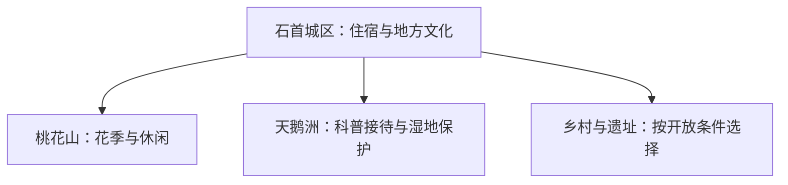
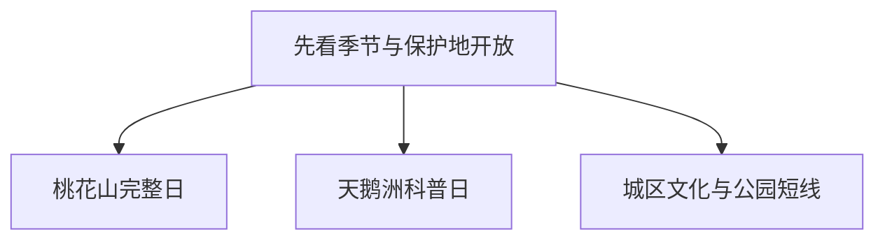

# 石首旅行指南

石首的核心选择是长江湿地科普、桃花山休闲和城区地方文化。春季可把桃花山作为完整一天；观察麋鹿、江豚时以江豚苑、麋鹿苑等正式科普接待空间为准，把保护区核心区留给科研与保护。

> 建议停留：2–3 天 
> 旅行关键词：天鹅洲、麋鹿、江豚、桃花山、长江湿地 
> 主要体力：城区低至中等，桃花山中等 
> 无障碍提醒：设施连续性需向官方确认；科普展馆、游船、步道与下客点分别核对

## 城市速览

| 项目 | 信息 |
|---|---|
| 主要旅行价值 | 在长江故道与平原山地之间理解珍稀动物保护、湿地恢复和地方生活 |
| 建议停留 | 2 天完成城区与桃花山；3 天再加天鹅洲正式科普线 |
| 较舒适季节 | 春秋；桃花、候鸟和水位均受年度气候影响 |
| 预算特点 | 城区较低，桃花山项目、湿地接驳和包车增加支出 |
| 步行强度 | 城区低，湿地低至中，桃花山中等 |
| 独行旅行 | 城区容易安排；湿地和乡镇方向先确认往返车辆 |
| 亲子旅行 | 江豚苑、麋鹿苑与湿地科普适合亲子，先问开放与讲解 |
| 长者与低体力旅行 | 选择展馆和车辆可近达观景点，桃花山只走短线 |
| 主要天气风险 | 长江水位、暴雨、雷电、高温、雾和乡道积水 |
| 行前关键动作 | 先确认科普场馆开放、保护区边界、桃花山活动和返程 |

## 城市格局与游览区域

石首是荆州市代管的县级市，法定代码 **421081**。绣林街道与城区承担住宿、餐饮和交通；桃花山位于市域南部，天鹅洲故道及麋鹿、江豚保护方向位于长江沿线，三者不构成连续步行区。

| 区域 | 主要内容 | 建议节奏 | 边界 |
|---|---|---|---|
| 石首城区 | 住宿、餐饮、南岳山及公共文化 | 半日至 1 天 | 适合抵离日和雨天 |
| 桃花山 | 桃源小镇、山地休闲与季节花景 | 1 天 | 活动、项目和道路按当期公告 |
| 天鹅洲方向 | 江豚苑、麋鹿苑、湿地科普 | 半日至 1 天 | 只进入正式公众接待区 |
| 三菱湖与乡村方向 | 湿地、农业和乡村活动 | 半日至 1 天 | 水域、农田和村庄按管理与接待边界活动 |

## 主要景点

| 景点 | 区域 | 类型 | 主要看点 | 建议用时 | 室内外 | 体力 | 预约风险 | 天气影响 | 优先级 |
|---|---|---|---|---:|---|---|---|---|---|
| 桃花山景区与桃源小镇 | 桃花山镇 | 山地、乡村休闲 | 桃花山自然环境、季节花景、度假与当期活动 | 0.5–1 天 | 室外为主 | 中 | 高 | 高 | A |
| 长江江豚苑 | 天鹅洲方向 | 生态科普 | 江豚保护、长江生态修复与科普展陈 | 1–2 小时 | 混合 | 低 | 高 | 中至高 | A |
| 天鹅洲麋鹿苑 | 天鹅洲方向 | 生态科普 | 麋鹿恢复、湿地栖息地与保护工作 | 1–2 小时 | 混合 | 低 | 高 | 中至高 | A |
| 南岳山森林公园 | 城区 | 城市公园 | 城市绿地、登高与本地休闲 | 1–2 小时 | 室外 | 低至中 | 低 | 高 | B |
| 石首市公共文化场馆 | 城区 | 文博、地方史 | 以当期开放展览认识石首历史与长江文化 | 2–3 小时 | 室内 | 低 | 中 | 低 | B |
| 走马岭遗址相关开放展示 | 市域乡镇 | 考古、遗址 | 新石器时代城址与江汉平原考古线索 | 1–2 小时 | 室外为主 | 中 | 高 | 高 | C |
| 三菱湖国家湿地公园正式游览区 | 市域东部 | 湿地、湖泊 | 湖泊湿地、生态教育与季节水景 | 半天 | 室外 | 低至中 | 高 | 很高 | C |

江豚苑与麋鹿苑是面向公众的科普接待点；保护区核心范围、监测点和野生动物活动区按保护要求管理。

## 美食与餐饮

城区可按荆楚家常菜、鱼糕、藕汤、蒸菜和米面选择。长江及故道水产先确认合法来源、品种、重量和时价；野生保护动物及来源不明水产品不进入餐桌。鱼类、甲壳类、大豆、小麦、芝麻和共油是常见过敏风险。

## 经典行程

### 一日经典
- **路线**：城区出发 → 桃花山景区与桃源小镇 → 午休 → 返回城区。
- **串联逻辑**：把山地、花景和休闲项目放在同一方向完成。
- **预约锚点**：景区开放、活动、停车与返程。
- **休息安排**：游客服务区完成午餐和补水。
- **时间不足时**：走核心短线后返回。

### 两日组合
- **路线**：第 1 天城区文化与南岳山；第 2 天桃花山完整日。
- **串联逻辑**：城市历史与山地休闲分日，减少跨向移动。
- **预约锚点**：第二日景区规则。
- **休息安排**：第一天午休充足，第二天使用正式服务点。
- **时间不足时**：第一天保留单馆加公园短段。

### 三日深度
- **路线**：前两日按上；第 3 天江豚苑 → 麋鹿苑 → 返程。
- **串联逻辑**：前两天完成城区与山地，第三天再集中处理天鹅洲方向的两个保护科普接待点。
- **适用条件**：两个科普点均确认开放并落实车辆。
- **预约锚点**：保护机构接待、讲解和入场时段。
- **休息安排**：在正式接待区和乡镇餐饮点休息。
- **时间不足时**：两苑按开放与兴趣二选一。

### 雨天路线
- **路线**：城区公共文化场馆 → 坐席午餐 → 当期开放室内展览。
- **串联逻辑**：全程留在城区，把参观与餐饮放在短距离接驳范围内。
- **适用条件**：城区道路正常，无暴雨或防汛响应影响。
- **预约锚点**：闭馆日与临时活动。
- **休息安排**：车辆接驳并保留午休。
- **时间不足时**：单馆慢游。

### 亲子与低体力路线
- **路线**：江豚苑或麋鹿苑单点科普 → 午餐 → 城区休息。
- **串联逻辑**：科普点只选一处，把交通和观察时间留足，下午回城区恢复体力。
- **减负方式**：用展馆和近距离观察替代长距离湿地步行。
- **预约锚点**：讲解、轮椅、卫生间和最近下客点。
- **休息安排**：参观前后均留坐席时间。
- **时间不足时**：只保留一个科普点。

### 湿地与遗址远线
- **路线**：城区 → 正式开放的三菱湖或走马岭展示点二选一 → 返回。
- **串联逻辑**：湿地与遗址方向二选一，全天使用同一往返车辆和明确开放入口。
- **适用条件**：水位、道路和接待条件稳定。
- **预约锚点**：开放入口、讲解与返程车辆。
- **休息安排**：在乡镇或游客服务点午餐。
- **时间不足时**：取消远线，改走城区公园。

## 住宿区域

| 区域 | 优点 | 取舍 | 适合人群 |
|---|---|---|---|
| 石首城区 | 餐饮、补给和交通稳定 | 去桃花山、天鹅洲仍需车辆 | 首访、公共交通、雨天备选 |
| 桃花山周边正式住宿 | 方便早晚活动 | 花季价格、退改和夜间服务波动 | 花季、摄影、自驾 |
| 天鹅洲方向乡镇 | 减少科普日往返 | 住宿选择少，接待需确认 | 已预约保护科普活动者 |

## 市内交通

石首以公路到发为主，铁路可结合荆州、岳阳等周边枢纽转乘。城区到桃花山、天鹅洲和乡镇远点优先使用客运公告、正规出租或合规包车；长江水域交通只按批准运营项目安排。

## 不同旅行者须知

- 生态观察以望远镜和讲解替代追逐、投喂与近距离干扰。
- 花季旅行先看花情、客流和交通组织，再决定住宿区域。
- 亲子与低体力旅行每天只选一个科普点或一条山地短线。
- 汛期按长江水位、防汛和道路公告调整湿地、湖岸与乡道行程。

## 行前核对

| 项目 | 何时确认 | 官方入口 |
|---|---|---|
| 江豚苑、麋鹿苑接待与保护边界 | 排入路线前及到访前一日 | [湖北省文旅厅：石首生态旅游](https://wlt.hubei.gov.cn/bmdt/mtjj/202506/t20250610_5685439.shtml) |
| 桃花山项目、花期和交通 | 订房前、前三日和当天 | [湖北省文旅厅](https://wlt.hubei.gov.cn/)；石首市政府公告 |
| 公路客运与返程 | 购票时和出发当天 | 石首交通运输部门与客运站公告 |
| 暴雨、水位与高温 | 前三日滚动确认 | [湖北省气象局](http://hb.cma.gov.cn/)；属地防汛公告 |

## 来源与更新记录

### 主要来源

| 来源 | 支持内容 | 核验日期 |
|---|---|---|
| [民政部行政区划代码查询：421081](https://dmfw.mca.gov.cn/xzqh/getCodeList?placeCode=421081) | 县级市代码与荆州代管关系 | 2026-08-13 |
| [湖北省文旅厅：荆州乡村旅游线路](https://wlt.hubei.gov.cn/bmdt/szyw/jz/202203/t20220324_4054092.shtml) | 天鹅洲、桃源小镇、三菱湖、走马岭、南岳山等市域节点 | 2026-08-13 |
| [湖北省文旅厅：石首文旅体融合](https://wlt.hubei.gov.cn/bmdt/mtjj/202506/t20250610_5685439.shtml) | 桃花山、江豚与麋鹿科普接待及生态保护 | 2026-08-13 |
| [湖北省文旅厅：麋鹿恢复](https://wlt.hubei.gov.cn/bmdt/ztzl/zshb/201912/t20191226_1799576.shtml) | 天鹅洲麋鹿种群和保护背景 | 2026-08-13 |
| [GeoNames 1788268](https://www.geonames.org/1788268/) | 固定清单中的 Xiulin 城市点 | 2026-08-13 |
| [Wikidata Q1359319](https://www.wikidata.org/wiki/Q1359319) | 法定石首市、代码及行政记录 1795004 | 2026-08-13 |

固定 GeoNames **1788268** 是石首主城绣林方向的居民点记录；法定石首市实体 **Q1359319** 的 P1566 指向行政记录 **1795004**。本页以固定点作为工程键，以法定代码 **421081** 确定市域边界。

### 更新记录

| 日期 | 更新内容 |
|---|---|
| 2026-08-13 | 首次完成石首旅行研究；整理城区、桃花山、天鹅洲科普、湿地远线与保护边界，并解释固定城市点和法定实体粒度 |
