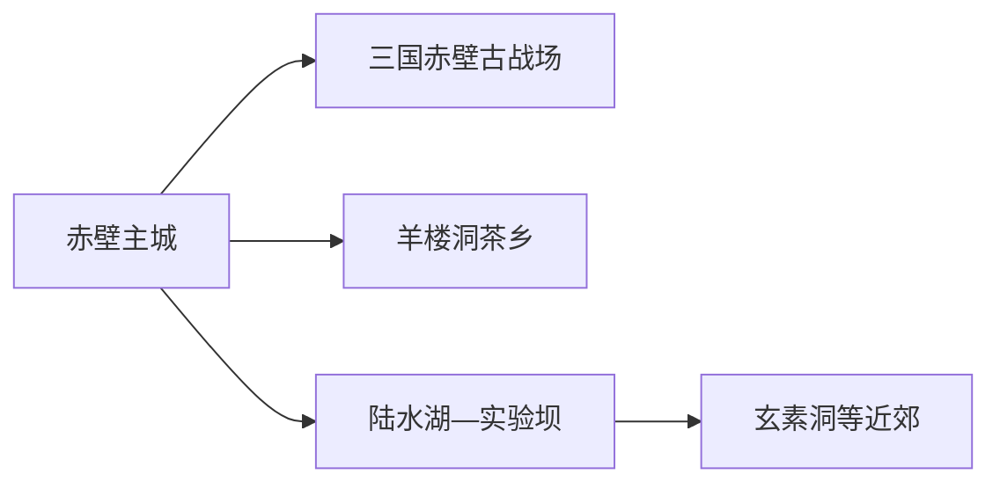
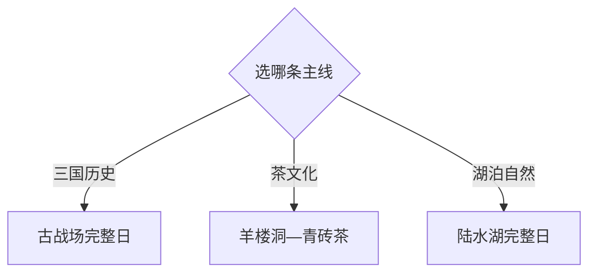

# 赤壁旅行指南

赤壁是咸宁代管的县级市，旅行重点分布在三国赤壁古战场、羊楼洞青砖茶古镇、陆水湖与主城几个方向。名称“赤壁”容易让人误以为景点都在城区，实际三条主线彼此相距较远；两天最实用，一天古战场，一天在羊楼洞与陆水湖之间按兴趣选择。

> 建议停留：2–3 天 
> 旅行关键词：三国赤壁古战场、羊楼洞、青砖茶、陆水湖、玄素洞、陆水实验枢纽 
> 主要体力：中等；湖区、洞穴和古镇石路按项目增加 
> 最近研究：2026-08-13

## 城市速览

| 项目 | 旅行信息 |
|---|---|
| 主要旅行价值 | 把三国历史、万里茶道青砖茶和陆水湖水利生态放在同一座城市中理解 |
| 建议停留 | 1 天只选古战场或羊楼洞—陆水湖一线；2 天覆盖两条主线；3 天加入洞穴或茶园 |
| 较舒适季节 | 春秋适合古镇与湖区；盛夏以早晚户外加午间室内，汛期关注水位与强对流 |
| 预算特点 | 主城住宿餐饮易控；景区门票、湖区船艇、古战场接驳和远线车辆是主要变量 |
| 步行强度 | 古战场园区和羊楼洞石板街中等，湖区项目依赖码头与船艇，玄素洞有湿滑台阶 |
| 主要天气风险 | 高温、暴雨、雷电、湖区大风、水位变化与山洪 |
| 独行旅行 | 主城与铁路门户方便；远线先锁返程，湖上项目按运营方统一安排 |
| 亲子旅行 | 古战场历史主题或陆水湖自然主题各自可成日；按年龄选择船艇与洞穴 |
| 长者与低体力旅行 | 羊楼洞核心街区或古战场游客中心短线更稳，湖区优先确认接驳与上下船条件 |
| 无障碍信息 | 新建游客中心可询问服务；古镇石路、历史遗址、码头与洞穴连续性需向官方确认 |

## 城市格局与游览区域

赤壁市法定行政代码为 `421281`。固定 GeoNames `1798473` 使用旧名 Puqi/蒲圻，是主城居民点；Wikidata 法定实体 `Q615021` 的 `P1566` 指向行政记录 `1798467`。本页保留固定居民点索引，并以现行赤壁市全域为旅行范围。

| 区域 | 主要内容 | 游览特点 | 与其他区域的关系 |
|---|---|---|---|
| 赤壁主城 | 住宿、餐饮、铁路与城市公共服务 | 适合作为多日基地 | 到三条主线均需专程交通 |
| 三国赤壁古战场方向 | 古战场完整景区与长江沿线历史空间 | 大型历史主题景区，留完整一天 | 与主城和羊楼洞距离较远 |
| 羊楼洞—赵李桥 | 古镇、青砖茶与万里茶道线索 | 石板街、茶文化和镇区生活结合 | 可与茶园或同方向正式项目组合 |
| 陆水湖—实验坝 | 湖区、岛屿、码头与水利工程背景 | 船艇、水位和天气决定当日线路 | 与玄素洞可择一组合，不追求全包 |
| 玄素洞及近郊 | 洞穴、岩溶与季节性自然 | 湿滑、照明和开放风险较高 | 作为半日补充 |

古战场作为一个完整父级景区记录，内部碑刻、建筑和演艺不重复计数。陆水湖水面、实验设施、坝区和岛屿具有不同管理属性；游客按正式码头、船线和公开参观范围活动。羊楼洞居民院落、茶厂生产线和茶园也应分别看待，体验以正式开放场所为主。

## 主要景点

### 历史与茶道

| 景点 | 区域 | 类型 | 主要看点 | 建议用时 | 室内外 | 体力 | 预约风险 | 天气影响 | 优先级 |
|---|---|---|---|---:|---|---|---|---|---|
| 三国赤壁古战场 | 长江沿线 | 5A历史文化景区 | 赤壁之战主题、遗址叙事与完整园区展陈 | 1 天 | 混合 | 中高 | 高 | 高 | A |
| 羊楼洞古镇 | 羊楼洞 | 历史街区与茶文化 | 万里茶道、青石街、茶庄与青砖茶历史 | 4–6 小时 | 混合 | 中 | 中高 | 中高 | A |
| 青砖茶正式展示与体验点 | 羊楼洞、赵李桥 | 非遗与产业展示 | 制茶历史、砖茶工艺与茶道贸易 | 2–3 小时 | 室内为主 | 低 | 高 | 低 | B |

### 湖区、水利与岩溶

| 景点 | 区域 | 类型 | 主要看点 | 建议用时 | 室内外 | 体力 | 预约风险 | 天气影响 | 优先级 |
|---|---|---|---|---:|---|---|---|---|---|
| 陆水湖风景区 | 陆水湖 | 湖泊与岛屿景区 | 湖面、岛屿、生态与当期船线 | 4–6 小时 | 室外为主 | 中 | 高 | 很高 | A |
| 陆水实验枢纽公开参观内容 | 湖区 | 水利科普 | 水利工程史与实验坝背景 | 1–2 小时 | 混合 | 低至中 | 很高 | 中 | B |
| 玄素洞正式开放区 | 近郊 | 岩溶洞穴 | 洞穴地貌、地下空间与科普 | 2–3 小时 | 室内 | 中高 | 高 | 中 | B |
| 葛仙山或茶园当期开放项目 | 市域 | 山地与季节自然 | 樱花、茶园或乡村季节活动 | 半日至一日 | 室外 | 中高 | 高 | 很高 | C |

## 美食与餐饮

主城适合解决日常正餐，羊楼洞适合茶点与镇区午餐。湖鲜优先选择来源、称重和菜单清楚的正规餐馆，青砖茶按冲泡量体验，不以“越浓越好”作为标准。

| 菜品或餐饮类型 | 常见区域 | 一个人用餐与常见份量 | 风味、过敏原与饮食限制 | 排队风险与替代方法 |
|---|---|---|---|---|
| 赤壁青砖茶与茶点 | 羊楼洞、主城 | 可按壶或小份分享 | 茶碱、咖啡因、糖和坚果按产品确认 | 选明码标价茶馆，先问冲泡与购买规格 |
| 陆水湖鱼菜 | 主城、湖区正规餐馆 | 常按条或多人份 | 鱼刺、淡水鱼过敏、酱汁大豆小麦 | 先问重量、时价和加工费；单人改点例份鱼片 |
| 鄂南腊味与家常菜 | 主城、镇区 | 多人共享，先问小份 | 高盐、烟熏、辣椒与亚硝酸盐摄入 | 换蒸菜、时蔬和米饭组合 |
| 米粉、面食和早餐 | 主城生活街区 | 适合独行 | 汤底、花生、芝麻和小麦按店确认 | 早餐高峰换邻近社区店 |

## 经典行程

### 一日经典路线

**路线**：三国赤壁古战场游客中心 → 完整主游线 → 园区午餐与休息 → 当期开放演艺或展陈 → 返回主城

- **串联逻辑**：古战场自身尺度足够大，一天只围绕一个父级景区。
- **预约锚点**：门票、演艺、接驳与最晚入园。
- **休息安排**：使用园区游客服务区和正规餐饮。
- **时间不足时**：保留核心历史线，删除演艺或外围段。

### 两日城市路线

**第 1 天**：古战场完整日 
**第 2 天**：羊楼洞古镇 → 镇区午餐 → 青砖茶正式展示体验

- **串联逻辑**：两天分别承担三国史与万里茶道，不跨到湖区赶场。
- **预约锚点**：古战场、茶文化展示与讲解。
- **休息安排**：第二天在羊楼洞镇区午餐和休息。
- **时间不足时**：第二天只走古镇核心街，删除茶园或厂区体验。

### 三日深度路线

**第 1 天**：古战场 
**第 2 天**：羊楼洞—青砖茶 
**第 3 天**：陆水湖正式船线 → 湖区休息 → 返回

- **串联逻辑**：第三天独立给湖区，以水位和船线决定游览内容。
- **预约锚点**：船票、码头、岛屿开放和天气。
- **休息安排**：使用正式码头与游客服务区。
- **时间不足时**：两天时删除湖区；第三天半日只留岸上公共段。

### 雨天路线

**路线**：青砖茶室内展示 → 羊楼洞镇区午餐 → 主城公共文化场馆或玄素洞按开放二选一

- **适用条件**：普通降雨；暴雨、雷电或山洪预警时留在主城。
- **预约锚点**：茶馆、洞穴与场馆开放。
- **休息安排**：镇区与主城室内空间。
- **时间不足时**：只保留青砖茶展示和午餐。

### 亲子或低体力路线

**亲子路线**：陆水湖游客中心 → 适龄正式船线或岸上科普 → 午休 
**低体力路线**：羊楼洞入口核心街 → 茶馆休息 → 车辆返回主城

- **减负方式**：亲子按救生与年龄规则选择项目；低体力线缩短石板街并减少换乘。
- **预约锚点**：船艇年龄规则、茶馆接待、最近下客点。
- **休息安排**：游客中心和茶馆作为固定休息点。
- **时间不足时**：亲子线改岸上科普，低体力线只留茶馆附近短段。

### 远郊一日路线

**路线**：主城出发 → 葛仙山或正式茶园项目二选一 → 镇区午餐 → 原路返回

- **适用条件**：花期或活动明确、天气和返程车辆稳定。
- **预约锚点**：运营方接待、停车与活动时间。
- **休息安排**：镇区正规餐馆与游客服务点。
- **时间不足时**：整段取消，改为羊楼洞半日。

## 住宿区域

| 区域 | 优点 | 缺点 | 适合人群 | 交通特点 |
|---|---|---|---|---|
| 赤壁主城 | 铁路、餐饮、叫车和跨方向出发方便 | 到各景区都需专程 | 首访、独行、三线组合 | 默认基地 |
| 羊楼洞周边 | 便于清晨古镇与茶文化 | 夜间服务和返程选择较少 | 摄影、茶文化、慢住 | 订房前确认正规经营和交通 |
| 陆水湖周边 | 便于早班船或湖区休闲 | 水位与项目停运时替代较少 | 湖泊、亲子、度假 | 核对实际码头、接驳和退改 |
| 古战场周边 | 减少完整景区日往返 | 与主城、羊楼洞和湖区不顺路 | 历史专题、自驾 | 先确认入口距离和夜间交通 |

## 市内交通

| 场景 | 建议与取舍 | 行前需要重查的内容 |
|---|---|---|
| 铁路抵达 | 按车票确认赤壁站或赤壁北站，再接主城住宿 | 到发站、公交、出租上客点与末班 |
| 主城到古战场 | 客运、景区交通、正规车辆或自驾 | 发车点、返程、停车与活动管制 |
| 主城到羊楼洞 | 公路远线，先确定回程 | 城乡班次、镇区下客点、节庆交通 |
| 主城到陆水湖 | 先定位正式码头或游客入口 | 船班、水位、风力、停车与末班 |
| 自驾 | 多方向组合更灵活 | 道路施工、雨雾、停车和疲劳驾驶 |

## 不同旅行者须知

| 旅行维度 | 可行条件 | 主要取舍 | 需额外核对 |
|---|---|---|---|
| 独行旅行 | 主城铁路餐饮方便 | 远点先锁返程，湖鲜看份量 | 末班、夜间叫车、船艇资格 |
| 亲子旅行 | 古战场或湖区各可成日 | 洞穴、船艇和演艺按年龄选择 | 救生、身高、儿童票与医务点 |
| 长者或低体力旅行 | 古镇核心加茶馆休息 | 大园区、石路和上下船需减量 | 接驳、台阶、座椅与最近下客点 |
| 无障碍需求 | 游客中心可先询问 | 古镇、遗址、码头和洞穴连续性不同 | 设施连续性需向官方确认 |
| 摄影旅行 | 古镇、湖面和历史场景丰富 | 无人机、文保和人物拍摄有规则 | 风力、日出返程、三脚架与航拍 |
| 预算有限 | 主城住宿与古镇公共街区可控 | 船艇、演艺和远线车费增加 | 套票、必选项目、接驳和退改 |
| 特殊天气 | 普通雨天可做茶文化 | 暴雨大风时减少湖区和山地 | 气象、水位、船线和闭园公告 |

## 行前核对

| 核对事项 | 为什么需要重查 | 建议核对时间 | 官方入口 |
|---|---|---|---|
| 古战场票务与演艺 | 项目、接驳和演出会变化 | 订票前及当天 | [湖北省文化和旅游厅](https://wlt.hubei.gov.cn/) |
| 羊楼洞展示与活动 | 古镇公共街区、收费展陈和茶企接待不同 | 排入路线前 | [赤壁市政府](https://www.chibi.gov.cn/) |
| 陆水湖船线与水位 | 码头、船艇和岛屿开放受天气水情影响 | 出发前三日及当天 | [赤壁市政府](https://www.chibi.gov.cn/) |
| 铁路与公路交通 | 站名、班次、末班会变化 | 订票时及当天 | [中国铁路 12306](https://www.12306.cn/) |
| 暴雨、雷电与高温 | 湖区、洞穴和山地行程敏感 | 出发前三日及当天 | [湖北省气象局](https://hb.cma.gov.cn/) |

## 来源与更新记录

### 主要来源

| 来源 | 类型 | 支持内容 | 核验日期 |
|---|---|---|---|
| [湖北省文旅厅：赤壁文旅发展](https://wlt.hubei.gov.cn/bmdt/szyw/xn/202504/t20250430_5637435.shtml) | 省文旅厅 | 古战场、羊楼洞、陆水湖、葛仙山、玄素洞与茶园结构 | 2026-08-13 |
| [湖北品质旅游线路](https://wlt.hubei.gov.cn/bmdt/ztzl/lyhyfwzlts/202408/P020240827395248386214.pdf) | 省文旅厅 | 羊楼洞、玄素洞、陆水湖和实验坝线路组合 | 2026-08-13 |
| [赤壁文明旅游活动](https://wlt.hubei.gov.cn/bmdt/ztzl/wltztwmlv/wltztwmlydt/202606/t20260612_5957184.shtml) | 省、市文旅部门 | 赤壁景区文明游览与当期活动入口 | 2026-08-13 |
| [GeoNames 1798473](https://www.geonames.org/1798473/) | 开放地理数据 | Puqi 固定主城点与坐标 | 2026-08-13 |
| [Wikidata Q615021](https://www.wikidata.org/wiki/Q615021) | 开放结构化数据 | 法定赤壁市、代码与行政 GeoNames 记录 | 2026-08-13 |

### 更新记录

| 日期 | 更新内容 |
|---|---|
| 2026-08-13 | 首次完成赤壁市独立旅行研究；明确蒲圻旧名点与法定市粒度，建立古战场、羊楼洞、陆水湖三条主线并补足水情、船艇、茶厂和文保边界 |
