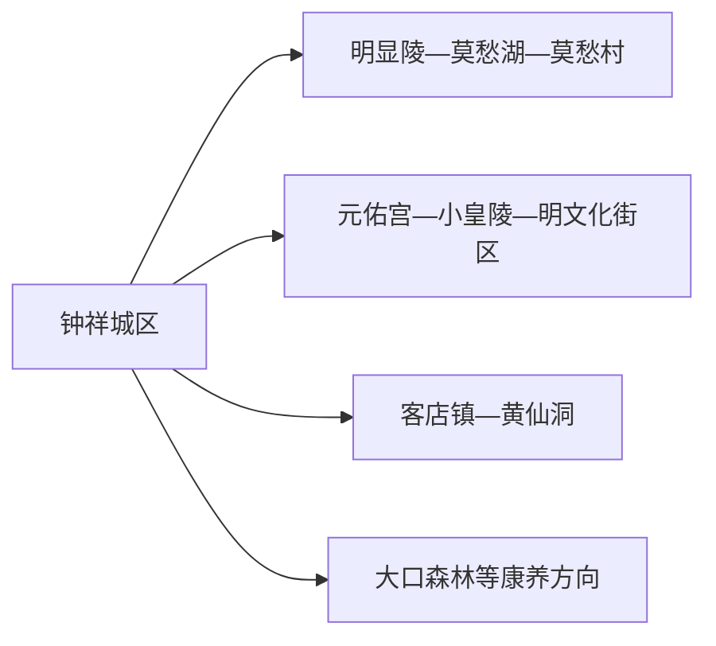
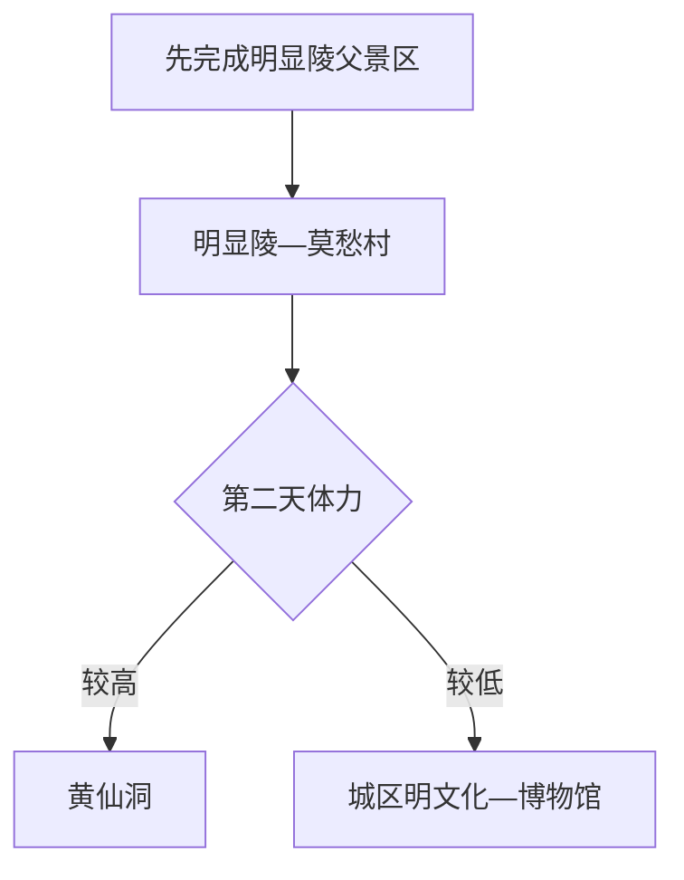

# 钟祥旅行指南

钟祥第一次来先把明显陵文化旅游景区留足一天：明显陵、莫愁湖、莫愁村和明文化展示共同构成一个完整父景区。第二天再向大洪山方向选择黄仙洞，或留在城区看元佑宫、小皇陵等明文化遗迹。沿江高铁改善了抵达效率，但黄仙洞等远点仍需要独立车辆和返程计划。

> 建议停留：2–3 天 
> 旅行关键词：明显陵、莫愁村、明文化、黄仙洞、长寿饮食、蟠龙菜 
> 主要体力：陵区中等；黄仙洞较高 
> 最近研究：2026-08-13

## 城市速览

| 项目 | 旅行信息 |
|---|---|
| 主要旅行价值 | 看世界文化遗产与明代陵寝格局，再以莫愁村民俗、黄仙洞地质和长寿饮食扩展 |
| 建议停留 | 1 天明显陵父景区；2 天加入黄仙洞；3 天增加城区明文化或森林康养 |
| 较舒适季节 | 春秋适合遗产与山地；夏季洞内外温差、暴雨和高温需留意 |
| 预算特点 | 中等，景区票务、远线车辆和旺季住宿是主要成本 |
| 步行强度 | 明显陵范围大且有石路；黄仙洞有长距离洞穴台阶 |
| 主要天气风险 | 高温、暴雨、山洪、雷电、洞穴湿滑、森林火险和冬季结冰 |
| 独行旅行 | 城区与明显陵较易；黄仙洞优先正规车辆 |
| 亲子旅行 | 莫愁村、明文化展示和短陵区路线较适合 |
| 长者与低体力旅行 | 在明显陵父景区中选核心段，黄仙洞按体力谨慎选择 |
| 无障碍信息 | 现代游客中心可咨询，陵区、古建和洞穴设施连续性需向官方确认 |

## 城市格局与游览区域

钟祥市是荆门市代管的县级市，法定代码 `420881`；GeoNames `1786546` 与 Wikidata `Q197919` 精确对应。旅行服务以钟祥城区和钟祥南站为枢纽，明显陵位于城区东郊，黄仙洞在大洪山客店镇方向。

| 区域 | 主要内容 | 怎么安排 | 与其他区域的关系 |
|---|---|---|---|
| 钟祥城区 | 住宿、餐饮、公共文化和明文化遗迹 | 半日至一日 | 交通基地 |
| 明显陵文化旅游景区 | 明显陵、莫愁湖、莫愁村、明文化展示 | 完整一日 | 四板块按一个父景区理解 |
| 客店—黄仙洞 | 溶洞、山地和乡镇服务 | 完整一日 | 车辆与体力门槛高 |
| 大口森林等方向 | 森林康养与正式景区 | 半日至一日 | 与黄仙洞二选一更轻松 |
| 汉江、水库与农业空间 | 水利、航运、农业和村落 | 只在正式开放点活动 | 港区、堤防、取水、林场和农田保留管理功能 |

## 主要景点

### 明文化与城区

| 景点 | 区域 | 类型 | 主要看点 | 建议用时 | 室内外 | 体力 | 预约风险 | 天气影响 | 优先级 |
|---|---|---|---|---:|---|---|---|---|---|
| 明显陵文化旅游景区 | 城东郊 | 世界遗产与综合景区 | 明显陵、莫愁湖、莫愁村和明文化展示四板块 | 1 天 | 混合 | 中高 | 很高 | 高 | A |
| 元佑宫—小皇陵等明文化遗迹 | 城区 | 古建筑与遗址 | 嘉靖时期城市史、历史街区与修缮后的公开空间 | 2–3 小时 | 混合 | 中 | 高 | 中 | B |
| 钟祥市博物馆及公共文化场馆 | 城区 | 博物馆 | 地方历史、文物和当期展览 | 1–2 小时 | 室内 | 低 | 高 | 低 | B |
| 钟祥城区滨水与生活街区 | 城区 | 公共空间 | 日常生活、地方饮食和休息 | 1–2 小时 | 室外 | 低 | 低 | 高 | B |

### 山地与自然

| 景点 | 区域 | 类型 | 主要看点 | 建议用时 | 室内外 | 体力 | 预约风险 | 天气影响 | 优先级 |
|---|---|---|---|---:|---|---|---|---|---|
| 黄仙洞景区 | 客店镇 | 溶洞与地质 | 洞穴地貌、灯光游线和大洪山山地景观 | 5–7 小时含往返 | 室内外 | 高 | 很高 | 高 | A |
| 大口国家森林公园正式开放区 | 大洪山方向 | 森林 | 森林、溪谷和康养步道 | 4–6 小时 | 室外 | 高 | 很高 | 很高 | B |
| 葛文化等正式乡村康养项目 | 客店沿线 | 农业与乡村 | 葛产品、乡村生活和季节活动 | 半日 | 混合 | 中 | 很高 | 高 | C |

明显陵、莫愁村、莫愁湖和明文化展示馆属于同一 5A 父景区，不重复拆成四个景点。黄仙洞内部灯光、洞厅和地质节点也按一条完整游线安排。

## 美食与餐饮

钟祥最有辨识度的是蟠龙菜、米茶、石牌豆腐和客店葛粉。城区适合稳定品尝，景区节庆摊位更适合作为补充。

| 菜品或餐饮类型 | 常见区域 | 一个人用餐与常见份量 | 风味、过敏原与饮食限制 | 排队风险与替代方法 |
|---|---|---|---|---|
| 蟠龙菜 | 城区与地方菜馆 | 多为冷盘或合菜，可问小份 | 常含猪肉、鱼肉和鸡蛋 | 在城区选明码标价的小份或拼盘 |
| 钟祥米茶 | 早餐店、城区家常餐馆 | 一碗适合一人 | 以炒米为主，配菜可能含花生、肉和小麦 | 早餐高峰后可能售罄，改选粥粉面 |
| 石牌豆腐 | 城区和石牌方向 | 豆腐菜易做小份 | 含大豆，汤底可能含肉、虾皮和辣椒 | 在正规餐馆确认汤底 |
| 客店葛粉 | 客店镇与正规商店 | 小碗或包装产品 | 配料可能含糖、坚果或奶 | 选择标签完整产品 |
| 淡水鱼与家常菜 | 城区、乡镇餐馆 | 多为合菜 | 鱼刺、酒和大豆酱常见 | 独行选择小份鱼或时蔬 |

## 经典行程

### 一日经典路线

**路线**：钟祥城区/钟祥南站 → 明显陵 → 景区服务区午餐 → 明文化展示与莫愁村当期开放区 → 返回城区

- **串联逻辑**：全天围绕同一父景区，减少重复进出和跨山地换乘。
- **预约锚点**：景区门票、演出和夜间活动。
- **休息安排**：游客中心、正式餐饮和莫愁村休息区。
- **时间不足时**：保留明显陵核心陵区，缩短民俗和夜游段。

### 两日城市路线

**第 1 天**：明显陵文化旅游景区。  
**第 2 天**：钟祥城区 → 黄仙洞 → 客店镇休息 → 返回。

- **串联逻辑**：世界遗产和溶洞各用一天，体力与交通最清楚。
- **预约锚点**：两景区票务、黄仙洞接驳和返程车辆。
- **休息安排**：第一天景区内；第二天客店镇正式服务点。
- **时间不足时**：删黄仙洞，改做城区明文化半日。

### 三日深度路线

**第 1 天**：明显陵父景区。  
**第 2 天**：黄仙洞。  
**第 3 天**：元佑宫—小皇陵—博物馆或大口森林二选一。

- **串联逻辑**：第三天按历史与自然兴趣选择，避免再叠加一条远线。
- **预约锚点**：遗迹开放、博物馆和森林防火。
- **休息安排**：连续住城区更方便。
- **时间不足时**：先删第三天。

### 雨天路线

**路线**：钟祥市博物馆 → 城区午餐 → 明文化室内展陈 → 莫愁村有顶公共区域

- **适用条件**：普通降雨且景区正常；暴雨和山洪预警时留在城区。
- **预约锚点**：场馆和景区公告。
- **休息安排**：城区与景区室内服务点。
- **时间不足时**：只保留博物馆和一顿地方餐。

### 亲子与低体力路线

**亲子路线**：明文化展示 → 莫愁村适龄活动 → 明显陵短段。  
**低体力路线**：景区车辆到核心入口 → 明显陵平缓主线 → 游客中心午休 → 城区。

- **减负方式**：亲子路线减少陵区长走；低体力路线取消黄仙洞和森林。
- **预约锚点**：景区车辆、儿童活动和无障碍设施。
- **休息安排**：游客中心与城区午休。
- **时间不足时**：两类路线均保留一个明文化展示和一段遗产主线。

### 远郊一日路线

**路线**：钟祥城区 → 客店镇 → 黄仙洞正式游线 → 客店镇休息 → 返回

- **适用条件**：洞穴游线开放、道路正常且体力适合长台阶。
- **预约锚点**：门票、景区交通和返程车辆。
- **休息安排**：游客中心和客店镇。
- **时间不足时**：整段改为城区明文化一日。

## 住宿区域

| 区域 | 优点 | 缺点 | 适合人群 | 交通特点 |
|---|---|---|---|---|
| 钟祥城区 | 餐饮、公共服务和跨方向车辆方便 | 去黄仙洞仍需较长车程 | 首访、独行和多日旅行者 | 最适合作为基地 |
| 明显陵—莫愁村附近 | 早入景区和夜间活动方便 | 旺季拥挤，离铁路站有距离 | 遗产深度游和亲子旅行者 | 先确认景区交通和夜间返程 |
| 客店镇/黄仙洞方向 | 靠近溶洞和山地 | 住宿餐饮选择较少 | 自驾、摄影和慢游者 | 提前确认次日车辆 |

## 市内交通

| 场景 | 建议与取舍 | 行前需要重查的内容 |
|---|---|---|
| 高铁抵达 | 钟祥南站是重要门户，到城区和景区仍需接驳 | 12306、景区专线和末班 |
| 城区—明显陵 | 公交、旅游车辆、出租或自驾 | 节假日管制、停车和夜间散场 |
| 城区—黄仙洞 | 正规包车、自驾或当期专线 | 山路、返程、票务和通信 |
| 景区内 | 使用正式步道与景区车辆 | 运营时间、维护和高峰分流 |

## 不同旅行者须知

| 旅行维度 | 可行条件 | 主要取舍 | 需额外核对 |
|---|---|---|---|
| 独行旅行 | 城区和明显陵方便 | 黄仙洞先锁定返程 | 上客点、末班和通信 |
| 亲子旅行 | 明文化展示、莫愁村和短陵区线 | 洞穴按年龄体力选择 | 儿童票、台阶和演出音量 |
| 长者或低体力旅行 | 景区车辆与核心遗产段 | 取消黄仙洞长台阶 | 接驳、电梯、座椅和医疗距离 |
| 无障碍需求 | 现代游客中心可咨询 | 陵区、古建和洞穴连续通行资料有限 | 设施连续性需向官方确认 |
| 世界遗产访问 | 沿正式游线理解整体格局 | 文物本体与封闭区按保护要求参观 | 拍摄、维护与清场 |
| 山地洞穴 | 正式景区装备与照明 | 洞内湿滑、温差和长台阶增加负担 | 防滑鞋、气象和救援 |

## 行前核对

| 核对事项 | 为什么需要重查 | 建议核对时间 | 官方入口 |
|---|---|---|---|
| 明显陵父景区 | 票务、演出、夜游和接驳会调整 | 订票前及当天 | [湖北省政府 5A 景区资料](https://media.hubei.gov.cn/zyxmt/push/weixin/202402/t20240207_5080912.shtml) |
| 黄仙洞与森林 | 洞穴、山路和防火受天气影响 | 出发前三日及当天 | [湖北省文化和旅游厅](https://wlt.hubei.gov.cn/) |
| 高铁 | 车次和景区接驳按日期变化 | 出发前一周及当天 | [中国铁路 12306](https://www.12306.cn/) |
| 天气 | 暴雨、高温和结冰影响遗产与山地 | 出发前三日及当天 | [湖北省气象局](https://hb.cma.gov.cn/) |

## 来源与更新记录

### 主要来源

| 来源 | 类型 | 支持内容 | 核验日期 |
|---|---|---|---|
| [民政部行政区划代码服务](https://dmfw.mca.gov.cn/xzqh/getList?code=420000&trimCode=false&maxLevel=3) | 政府开放接口 | 钟祥代码 `420881` 与荆门代管关系 | 2026-08-13 |
| [湖北省政府：明显陵文化旅游景区](https://media.hubei.gov.cn/zyxmt/push/weixin/202402/t20240207_5080912.shtml) | 省级政府 | 5A 父景区由明显陵、莫愁湖、莫愁村、明文化展示馆组成 | 2026-08-13 |
| [湖北省文旅厅：明显陵世界遗产](https://wlt.hubei.gov.cn/bmdt/ztzl/lszt/sjwhyc/sjyzcd/mxl/201911/t20191121_1366118.shtml) | 省级文旅主管部门 | 陵寝格局、遗产价值和保护范围 | 2026-08-13 |
| [湖北省文旅厅：钟祥全域旅游](https://wlt.hubei.gov.cn/bmdt/szyw/jm/202605/t20260519_5939197.shtml) | 省级文旅主管部门 | 明显陵、莫愁村、黄仙洞与多日路线 | 2026-08-13 |
| [GeoNames 1786546](https://www.geonames.org/1786546/) | 开放地名库 | 城市记录与坐标 | 2026-08-13 |
| [Wikidata Q197919](https://www.wikidata.org/wiki/Q197919) | 开放知识库 | 法定城市实体与 GeoNames 精确映射 | 2026-08-13 |

### 更新记录

| 日期 | 更新内容 |
|---|---|
| 2026-08-13 | 首次建立钟祥独立指南；以明显陵父景区为核心，黄仙洞和森林分日，明确世界遗产、洞穴、森林、汉江与农业生产边界。 |
