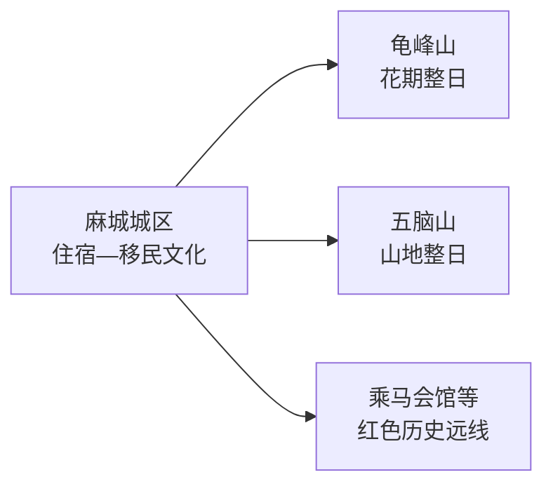
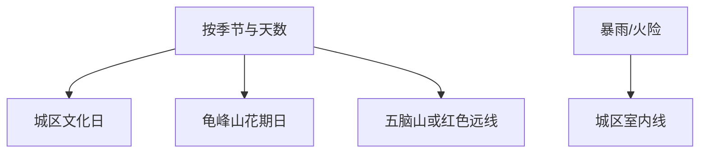

# 麻城旅行指南

麻城的选择很清楚：春季把完整一天留给龟峰山杜鹃，其他季节可用城区和孝感乡文化认识移民史，再从五脑山、乘马会馆等方向选一条。山地景区与城区分日，会比一天跨多个乡镇更稳妥。

> 建议停留：2–3 天  
> 关键词：龟峰山、杜鹃、孝感乡、移民文化、红色历史、大别山  
> 主要体力：城区低至中等；龟峰山和五脑山中至高  
> 最近研究：2026-08-13

## 城市速览

| 项目 | 信息 |
|---|---|
| 主要价值 | 大别山杜鹃景观、孝感乡移民文化与革命史 |
| 建议停留 | 1天城区；2天加龟峰山；3天再选五脑山或红色远线 |
| 舒适季节 | 春季花期最热门；秋季适合山地；夏季注意高温暴雨 |
| 预算 | 城区较低；景区票务、索道或接驳和花期住宿增加支出 |
| 体力 | 城区平缓，山地台阶与爬升明显 |
| 天气风险 | 雷暴、强降雨、山洪、滑坡、森林火险和低能见度 |
| 独行 | 城区方便；远郊先确认返程 |
| 亲子 | 移民文化展陈较易理解；山地选短线 |
| 低体力 | 城区场馆为主，龟峰山咨询观光车与短线 |
| 无障碍 | 城区新馆可咨询；古建和山地设施连续性需向官方确认 |

## 城市格局与游览区域

GeoNames `1801582` 是麻城主城居民点，关联薄聚居点实体 `Q28794705`；法定县级麻城市使用 `Q1016939`、代码 `421181`，其 `P1566` 指向行政记录 `1801578`。本页按完整市域组织，麻城虽由黄冈市代管，仍是独立城市目的地。

| 区域 | 看什么 | 怎么选 | 边界 |
|---|---|---|---|
| 麻城城区 | 博物馆、孝感乡文化、餐饮与交通 | 抵达日或雨天 | 作为多方向基地 |
| 龟峰山 | 杜鹃群落、山体和景区游线 | 花期优先，完整一日 | 以景区正式入口和公告为准 |
| 五脑山 | 森林、山地与城市近郊 | 非花期山地备选 | 防火期和天气决定开放 |
| 红色远线 | 乘马会馆等革命史节点 | 选择一条同方向线路 | 场馆开放与乡镇接驳先确认 |
| 农林生产区 | 茶园、菊花、林场和村落 | 进入明确接待的园区或活动 | 生产田块、林业作业区不作公共游线 |

## 主要景点

| 景点 | 片区 | 类型 | 核心看点 | 用时 | 环境 | 体力 | 预约 | 天气 | 优先级 |
|---|---|---|---|---|---|---|---|---|---|
| 龟峰山景区 | 龟山镇方向 | 山地与花海 | 大别山地貌、古杜鹃群落和完整景区 | 6–8小时 | 室外 | 高 | 高 | 很高 | A |
| 麻城孝感乡文化公园 | 城区 | 文化园区 | 湖广填四川移民文化和地方记忆 | 2–3小时 | 混合 | 低至中 | 中 | 中 | A |
| 麻城市博物馆 | 城区 | 综合博物馆 | 地方历史、文物与城市发展 | 1.5–2小时 | 室内 | 低 | 中 | 低 | B |
| 五脑山国家森林公园 | 近城山地 | 森林与山地 | 森林步道、山景和季节生态 | 4–6小时 | 室外 | 中至高 | 高 | 很高 | B |
| 乘马会馆 | 远郊 | 革命遗址 | 革命史、旧址建筑和乡村环境 | 2–3小时 | 混合 | 中 | 高 | 中 | B |
| 麻城烈士陵园或当期开放纪念场馆 | 城区 | 纪念空间 | 地方革命史和纪念展陈 | 1–2小时 | 混合 | 低 | 中 | 中 | B |

龟峰山按完整父景区计数，花海、索道和各观景点不拆成多个目的地。花期客流、预约、交通管制与实际花况都需临行核对。

## 美食与餐饮

| 类型 | 场景 | 份量 | 注意 | 怎么选 |
|---|---|---|---|---|
| 麻城肉糕 | 正餐或宴席 | 多人共享 | 猪肉、鱼糜、淀粉、鸡蛋 | 先问原料和小份 |
| 鱼面 | 汤食或配菜 | 一人小碗 | 鱼类、小麦或淀粉 | 对鱼类过敏者确认原料 |
| 吊锅 | 山区多人餐 | 2–4人 | 腊味、辣椒、盐分较高 | 按人数点小锅并配蔬菜 |
| 菊花与乡村农产品 | 季节伴手礼 | 少量购买 | 来源、加工和储存 | 选标识清楚的正规销售点 |

## 经典行程

### 一日经典
- **路线**：孝感乡文化公园 → 午餐 → 麻城市博物馆 → 城区晚餐。
- **串联逻辑**：先移民文化，再用地方史补全背景。
- **预约锚点**：以两馆较严格者为准。
- **休息安排**：午餐后留一小时。
- **时间不足时**：只留孝感乡文化公园。

### 两日花季
- **路线**：第1天城区；第2天龟峰山完整游览。
- **串联逻辑**：文化与山地分日。
- **预约锚点**：优先锁花期票务、交通和住宿。
- **休息安排**：山地中段长休息，错峰午餐。
- **时间不足时**：只走官方推荐核心短线。

### 三日深度
- **路线**：前两日按上；第3天五脑山或乘马会馆二选一。
- **适用条件**：道路、天气和场馆开放明确。
- **预约锚点**：核远线入口与返程。
- **休息安排**：乡镇坐席午餐。
- **时间不足时**：取消跨方向第二点。

### 雨天路线
- **路线**：市博物馆 → 午餐 → 孝感乡文化公园室内部分。
- **适用条件**：城区交通正常。
- **预约锚点**：核闭馆和临时调整。
- **休息安排**：车辆接驳并留午休。
- **时间不足时**：单馆慢游。

### 亲子与低体力
- **路线**：孝感乡文化公园核心展 → 午餐 → 城区平缓公园短段。
- **减负方式**：亲子用故事化展陈；低体力删山地。
- **预约锚点**：问讲解、轮椅和卫生间。
- **休息安排**：每段设坐席休息。
- **时间不足时**：保留核心展。

### 山地远线
- **路线**：龟峰山或五脑山单点整日。
- **适用条件**：天气、火险和道路稳定。
- **预约锚点**：景区票务、索道或接驳。
- **休息安排**：游客中心和正式服务区。
- **时间不足时**：按运营方短线返回。

## 住宿区域

| 区域 | 优点 | 取舍 | 适合 | 建议 |
|---|---|---|---|---|
| 麻城城区 | 餐饮、铁路和叫车集中 | 花期需早出发 | 首次到访 | 选交通便利且安静的位置 |
| 麻城北站周边 | 高铁抵离方便 | 城市体验较弱 | 晚到早走 | 核夜间接驳 |
| 龟峰山周边 | 花期早入园 | 房量、价格和餐饮波动 | 摄影、自驾 | 核资质、停车、退改和供餐 |

## 市内交通

麻城站与麻城北站服务车次不同，购票使用完整站名。城区到龟峰山、五脑山和红色远线分属不同方向，远郊以自驾、正规包车或当期景区接驳为主。

| 场景 | 怎么走 | 核对 |
|---|---|---|
| 铁路 | 按票面站名抵达后转城区 | 车次、夜间交通、重点旅客服务 |
| 龟峰山 | 景区专线、自驾或正规车辆 | 花期管制、停车、入口、末班 |
| 其他远线 | 一日一方向 | 路况、返程、通信和开放 |

## 不同旅行者须知

| 人群 | 推荐 | 留意 | 核对 |
|---|---|---|---|
| 独行 | 城区基地加一条远线 | 末班与信号 | 车辆、住宿电话 |
| 亲子 | 移民文化和博物馆 | 山地护栏与花期人流 | 讲解、卫生间、走失预案 |
| 长者低体力 | 城区场馆 | 山地台阶 | 落客、轮椅、座椅 |
| 山地摄影 | 花期龟峰山 | 客流、雷电、禁飞、防火 | 花况、天气、拍摄规则 |

## 行前核对

| 事项 | 原因 | 时间 | 入口 |
|---|---|---|---|
| 龟峰山 | 花况、票务和交通动态 | 订房前及当天 | [龟峰山景区](https://www.mcgfsly.com/) |
| 城区场馆 | 开放日和讲解变化 | 前一日 | [麻城市人民政府](http://www.macheng.gov.cn/) |
| 铁路 | 车次变化 | 购票及出发前 | [12306](https://www.12306.cn/) |
| 山地天气 | 暴雨、地灾和火险 | 前三日及当天 | [湖北省气象局](http://hb.cma.gov.cn/) |

## 来源与更新记录

### 主要来源

| 来源 | 类型 | 支持内容 | 日期 |
|---|---|---|---|
| [龟峰山景区官网](https://www.mcgfsly.com/) | 景区官方 | 票务、花期、线路和公告 | 2026-08-13 |
| [湖北省文旅厅：龟峰山5A](https://wlt.hubei.gov.cn/bmdt/mtjj/202501/t20250121_5512528.shtml) | 省文旅部门 | 2024年创建5A及景区身份 | 2026-08-13 |
| [湖北省文旅厅：麻城文旅布局](https://wlt.hubei.gov.cn/bmdt/szyw/hg/202203/t20220309_4031332.shtml) | 省文旅部门 | 龟峰山、孝感乡等空间线索 | 2026-08-13 |
| [民政部行政区划查询](https://dmfw.mca.gov.cn/xzqh/getList?code=421181&trimCode=false&maxLevel=3) | 国家数据 | 法定代码421181 | 2026-08-13 |
| [GeoNames 1801582](https://www.geonames.org/1801582/) | 开放数据 | 固定主城点 | 2026-08-13 |
| [Wikidata Q1016939](https://www.wikidata.org/wiki/Q1016939) | 开放数据 | 法定市与行政记录粒度 | 2026-08-13 |

### 更新记录

| 日期 | 更新内容 |
|---|---|
| 2026-08-13 | 首次完成麻城独立研究；按城区移民文化、龟峰山花季与山地红色远线组织，并补充花期、森林防火、生产空间和交通边界。 |
