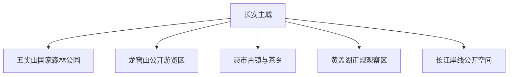
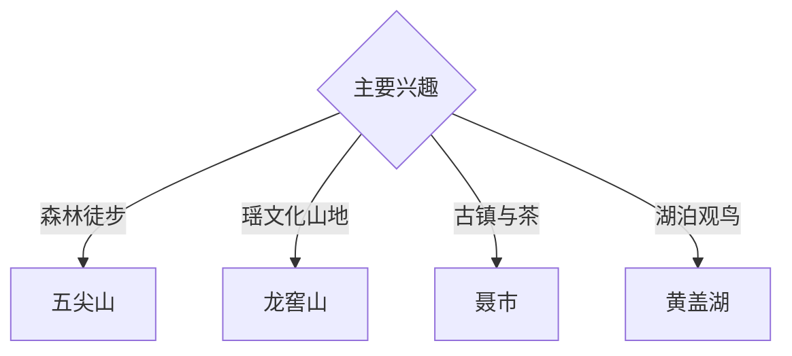

# 临湘旅行指南

临湘位于湘北长江南岸，以长安主城、五尖山森林、龙窖山瑶文化、聂市茶乡和黄盖湖湿地构成山水与边地文化组合。固定快照中的 **Chang’an / GeoNames 1803325** 锚定长安主城；山区、湖区和长江岸线需要分方向安排。

## 城市速览

| 项目 | 信息 |
|---|---|
| 主线 | 长安主城—五尖山—龙窖山—聂市—黄盖湖 |
| 停留 | 主城与五尖山 1 天；龙窖山或湖区各加 1 天 |
| 住宿 | 长安主城综合便利；山乡选择正规住宿 |
| 交通 | 铁路、公路抵达，远郊宜约车或自驾 |
| 季节 | 春秋适合山地；夏季关注暴雨，冬季关注结冰 |
| 预算 | 主城灵活，包车、讲解与山地住宿增加预算 |

## 城市格局与游览区域

长安主城承担铁路接驳、住宿和城市服务；五尖山靠近主城，龙窖山强调山地与瑶文化，聂市适合茶乡和古镇专题，黄盖湖连接湿地生态。森林保护地、未开放山径、湿地核心区、长江航道、军事管理区与工业生产区按公告保持边界。

## 主要景点

| 景点 | 区域 | 类型 | 核心体验 | 用时 | 环境 | 体力 | 研究价值 | 拥挤 | 优先级 |
|---|---|---|---|---:|---|---|---|---|---|
| 五尖山国家森林公园开放区 | 主城近郊 | 森林与山岳 | 森林步道、登高和近郊生态 | 半天至 1 天 | 室外 | 中高 | 高 | 周末中 | A |
| 龙窖山正规游览区 | 羊楼司方向 | 山地与文化 | 千家峒传说、瑶文化和山村景观 | 1 天 | 混合 | 高 | 很高 | 季节性 | A |
| 聂市古镇公开区 | 聂市 | 古镇与茶乡 | 老街、水运记忆与茶文化 | 半天 | 混合 | 低中 | 高 | 节假日中 | B |
| 黄盖湖正规观察点 | 黄盖方向 | 湖泊与湿地 | 湖区水文、候鸟与滨湖乡村 | 半天 | 室外 | 低 | 高 | 鸟季中 | B |
| 长安主城公共文化空间 | 长安 | 城市文化 | 地方史、商业街区与城市生活 | 2–3 小时 | 混合 | 低 | 中 | 晚间中 | B |
| 羊楼司竹木产业公开展示 | 羊楼司 | 产业文化 | 竹木资源、加工传统与边贸 | 半天 | 室内 | 低 | 中高 | 预约制 | B |
| 正规浮标产业展示点 | 主城及园区 | 工业文化 | 钓具浮标制造与产业集群 | 2–3 小时 | 室内 | 低 | 高 | 预约制 | B |

## 美食与餐饮

临湘茶、湘北腊味、湖区水产、竹笋和家常蒸菜适合按山湖线路体验。水产选择正规市场来源，茶园与加工点按接待安排进入；山地日携带饮水和简餐。

## 经典行程

### 主城五尖山线
**路线**：长安主城—五尖山正式入口—开放步道—返城。**逻辑**：用一天完成城市与近郊森林切换。**预约锚点**：公园和天气公告。**休息**：游客服务点。**删除条件**：雷雨、大风或防火封控时改主城。

### 龙窖山一日线
**路线**：主城—正规入口—瑶文化公开点—开放山径—返程。**逻辑**：独立一天理解山地聚落与地方文化。**预约锚点**：社区接待和道路。**休息**：正规接待点。**删除条件**：山洪、落石或无接待时顺延。

### 聂市茶乡线
**路线**：主城—聂市古镇公开区—正规茶园或展厅—返程。**逻辑**：把水运老街与茶产业放在同一方向。**预约锚点**：茶园接待。**休息**：聂市镇。**删除条件**：企业无接待时保留古镇。

### 黄盖湖生态线
**路线**：主城—正规湿地观察点—滨湖公共空间—返程。**逻辑**：以低干扰方式观察湖区生态。**预约锚点**：水位、鸟讯和开放。**休息**：管理服务点。**删除条件**：洪水、浓雾或湿地管制时取消。

### 产业观察线
**路线**：主城—预约制浮标展示—羊楼司竹木公开展示。**逻辑**：从特色制造理解临湘产业结构。**预约锚点**：企业接待。**休息**：主城或羊楼司。**删除条件**：无企业接待时改城市公共文化空间。

### 亲子低体力线
**路线**：主城文化空间—午餐—五尖山入口附近短步道。**逻辑**：室内学习与轻量自然体验结合。**预约锚点**：场馆和公园开放。**休息**：主城。**删除条件**：雨天保留室内部分。

### 三日组合线
**路线**：首日主城与五尖山；次日龙窖山；第三日聂市或黄盖湖。**逻辑**：森林、文化和湖区分日。**预约锚点**：山湖天气与接待。**休息**：长安主城连续住宿。**删除条件**：两天时删第三日。

## 住宿区域

长安主城适合铁路、公路接驳和多方向出发；龙窖山、聂市等地的正规住宿适合专题慢游。订房核对夜间交通、消防、停车、早餐与极端天气退改。

## 市内交通

临湘站等铁路节点与主城住宿距离不同，购票后核对接驳。五尖山、龙窖山、聂市和黄盖湖分属不同方向，按日组织车辆；山区与湖区分别关注落石、临水和临时管制。

## 不同旅行者须知

徒步者按体力在五尖山和龙窖山之间选择；文化旅行者优先龙窖山和聂市；亲子和长者选择主城及短步道；产业研究者提前联系展厅。森林保护区、湿地核心范围、长江航道、军事管理区、工厂生产线和仓储作业区保留明确限制。

## 行前核对

- 核对五尖山、龙窖山、聂市和黄盖湖开放公告。
- 核对茶园、竹木与浮标产业展示接待安排。
- 核对铁路站点、城乡班次、返程和山地住宿。
- 核对暴雨、山洪、地质灾害、森林防火与湖区水位。

## 来源与更新记录

| 来源 | 支持内容 | 核验日期 |
|---|---|---|
| [临湘市政府：五尖山国家森林公园](https://www.linxiang.gov.cn/24778/content_612423.html) | 五尖山森林公园与自然游览主题 | 2026-09-03 |
| [临湘市政府：龙窖山旅游概况](https://www.linxiang.gov.cn/yyjc/jc_lxs/156/458/content_17028.html) | 龙窖山、瑶文化与山地旅游资源 | 2026-09-03 |
| [GeoNames 1803325](https://www.geonames.org/1803325/) | Chang'an 固定人口点与临湘主城位置 | 2026-09-03 |

