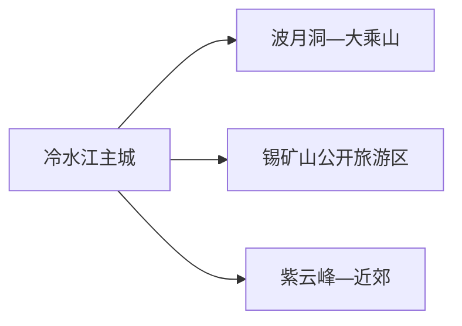
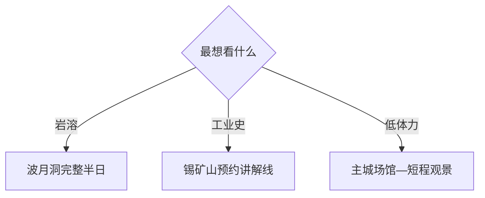

# 冷水江旅行指南

冷水江最适合按“岩溶洞穴”和“世界锑都工业文化”二选一，再用主城半日补足地方生活。波月洞是一条洞穴日，锡矿山则是工业遗产、红色记忆与生态修复专题；两者都需要先确认开放入口和返程，安排两天会比同日赶场更完整。

> 建议停留：1–2 天；工业文化深度线可增加半天 
> 旅行关键词：波月洞、锡矿山、锑工业、工业遗产、紫云峰、资江城市 
> 主要体力：城区低至中等；洞穴和矿区公开游线中至高 
> 最近研究：2026-08-13

## 城市速览

| 项目 | 旅行信息 |
|---|---|
| 主要旅行价值 | 用波月洞理解湘中岩溶，以锡矿山公开展陈认识锑工业、工人运动与生态修复 |
| 建议停留 | 1 天只选波月洞或锡矿山；2 天可分别完成两条主题 |
| 较舒适季节 | 春秋适合城市与户外；洞内全年偏凉湿；雨季重点核对洞穴水位、道路与矿区开放 |
| 预算特点 | 城区中低；景区票务、讲解、车辆和可能的换宿是增量 |
| 步行强度 | 城区可分段步行，洞穴湿滑和矿区坡路增加体力 |
| 主要天气风险 | 暴雨、山洪、滑坡、洞内水位、盛夏高温、冬季湿冷和矿山地质风险 |
| 独行旅行 | 城区和波月洞较易组织；工业线优先使用明确接待与讲解 |
| 亲子旅行 | 波月洞地质观察和公开陈列馆可选，洞内防滑与儿童陪护优先 |
| 长者与低体力旅行 | 主城场馆或车辆抵达的短段更合适，洞穴台阶和矿区坡道按体力减量 |
| 无障碍信息 | 场馆可逐处咨询，洞穴、旧工业建筑和坡地的设施连续性需向官方确认 |

## 城市格局与游览区域

冷水江市是娄底市代管的县级市，法定代码 `431381`。GeoNames `1804169` 是主城居民点，Wikidata `Q1344661` 同时关联 `1804169` 与较广行政记录 `1804168`；主城点用于到发，法定边界用于核定锡矿山、波月洞和乡镇属地。

| 区域 | 主要内容 | 怎么安排 | 与其他区域的关系 |
|---|---|---|---|
| 冷水江主城 | 城市公共文化、资江与生活服务 | 到发半日或住宿基地 | 到洞穴和矿区均需车辆 |
| 波月洞—大乘山 | 岩溶洞穴与风景名胜区公开游线 | 作为半日至一日核心 | 洞内与山地入口按运营公告组合 |
| 锡矿山 | 工业遗产、纪念设施与生态修复 | 只走明确开放展馆和讲解线 | 生产冶炼、矿井和修复作业区有独立边界 |
| 紫云峰与近郊 | 森林公园、城市近郊休闲 | 天气稳定时做短线 | 不与矿区工业线混作徒步捷径 |

锡矿山至今兼有工业生产、遗产保护和生态治理功能。参观集中在明确开放的陈列馆、遗址公园和规定线路；矿井、冶炼厂、尾矿库、排土场、运输专线和修复施工区属于生产或治理空间。

## 主要景点

### 岩溶与城市近郊

| 景点 | 区域 | 类型 | 主要看点 | 建议用时 | 室内外 | 体力 | 预约风险 | 天气影响 | 优先级 |
|---|---|---|---|---:|---|---|---|---|---|
| 波月洞景区 | 大乘山方向 | 岩溶洞穴 | 多层洞厅、钟乳石和正式照明游线；所有洞内节点按一个景区 | 2–4 小时 | 室内为主 | 中 | 高 | 中高 | A |
| 大乘山—波月洞风景名胜区公开段 | 城区近郊 | 山地与风景名胜 | 山体、林地和洞穴周边景观 | 半日 | 室外 | 中高 | 高 | 很高 | B |
| 紫云峰森林公园公开游线 | 主城近郊 | 森林与城市观景 | 近郊森林、城市视野与季节植被 | 2–4 小时 | 室外 | 中 | 中 | 很高 | B |

### 工业文化

| 景点 | 区域 | 类型 | 主要看点 | 建议用时 | 室内外 | 体力 | 预约风险 | 天气影响 | 优先级 |
|---|---|---|---|---:|---|---|---|---|---|
| 锡矿山老采矿场遗址和陈列馆 | 锡矿山 | 工业遗产与展馆 | 锑业开发、工人运动、矿石标本和工业转型 | 2–3 小时 | 混合 | 中 | 很高 | 中 | A |
| 锡矿山红军长征公园与公开纪念线 | 锡矿山 | 红色纪念与工业文化 | 纪念设施、公开遗址和生态修复景观 | 半日 | 室外为主 | 中 | 高 | 高 | A |
| 羊牯岭碉楼等公开文保点 | 锡矿山 | 工业与革命文物 | 矿区历史建筑和工人运动背景 | 1–2 小时 | 混合 | 中 | 很高 | 高 | B |
| 生态修复展示节点 | 锡矿山 | 环境治理与工业转型 | 矿山治理、植被恢复和产业更新 | 1–2 小时 | 室外 | 中 | 很高 | 高 | C |

## 美食与餐饮

冷水江主城更方便选择三合汤、嗦螺、豆腐和湘菜小炒。去洞穴或矿区前先在城区或正式服务点完成正餐；辛辣、动物内脏和大份合菜按个人饮食需求调整。

| 类型 | 常见区域 | 份量 | 饮食提示 | 替代选择 |
|---|---|---|---|---|
| 冷水江三合汤 | 主城 | 一人一碗或共享 | 常含牛肉、牛血或牛肚，辣度和内脏可询问 | 换清汤粉面或普通肉汤 |
| 嗦螺与湘味小炒 | 主城夜间餐饮区 | 适合共享 | 辣椒、油盐、螺类和交叉接触 | 选蒸菜、青菜和小份主食 |
| 麻辣豆腐 | 主城、乡镇 | 可小份 | 豆制品、肉末、辣椒和酱油常见 | 提前说明素食、少辣或过敏需求 |
| 红杨梅及季节水果 | 正规市场 | 小份购买 | 花期和成熟期随天气变化 | 选有来源标签的当季水果 |

## 经典行程

### 一日经典路线

**路线**：主城出发 → 波月洞正式入口 → 洞内开放游线 → 城区晚餐

- **串联逻辑**：以一个完整洞穴景区为核心，往返和休息留足余量。
- **预约锚点**：票务、最后入洞、设备检修和洞内游线。
- **休息安排**：入洞前与出洞后各一次坐休。
- **时间不足时**：只完成核心洞厅，不追加山地段。

### 两日城市路线

**第 1 天**：波月洞 
**第 2 天**：锡矿山公开陈列馆 → 纪念线 → 城区

- **串联逻辑**：自然地貌与工业文化各占一天，避免洞穴和矿区跨片赶场。
- **预约锚点**：第二天接待、讲解、开放点和车辆。
- **休息安排**：矿区正式服务点和城区餐厅。
- **时间不足时**：第二天只保留陈列馆与一处纪念点。

### 三日深度路线

**第 1 天**：主城与紫云峰短线 
**第 2 天**：波月洞 
**第 3 天**：锡矿山工业文化线

- **串联逻辑**：由城市环境进入岩溶，再理解工业史与治理转型。
- **预约锚点**：三处开放、矿区讲解和天气。
- **休息安排**：每天午间返回城区或正式服务点。
- **时间不足时**：删除第一天近郊，保留两个核心主题。

### 雨天路线

**路线**：主城公共文化场馆 → 坐席午餐 → 当期开放室内展览

- **适用条件**：普通降雨且无地质灾害、积水或洞穴停运提示。
- **预约锚点**：场馆开放与城区交通。
- **休息安排**：全程使用室内坐席。
- **时间不足时**：只保留一座场馆；暴雨时暂停洞穴和矿区线路。

### 亲子与低体力路线

**亲子路线**：波月洞核心开放段 → 午休 → 主城短程公共空间 
**低体力路线**：车辆到陈列馆 → 坐席讲解 → 城区午餐

- **减负方式**：亲子减少洞内连续时长；低体力路线取消山地和长坡。
- **预约锚点**：儿童陪护、湿滑路段、电梯坡道、最近下客点。
- **休息安排**：游客中心、场馆与餐厅。
- **时间不足时**：分别只保留洞穴核心或陈列馆。

### 工业文化一日路线

**路线**：冷水江城区 → 锡矿山正式接待点 → 陈列馆 → 公开纪念线 → 返回

- **适用条件**：接待主体确认散客或团队开放，车辆与返程明确。
- **预约锚点**：讲解、集合点、拍摄和安全规定。
- **休息安排**：陈列馆与游客服务点坐休。
- **时间不足时**：只保留陈列馆，不临时进入外围生产区。

## 住宿区域

| 区域 | 优点 | 取舍 | 适合人群 | 交通特点 |
|---|---|---|---|---|
| 冷水江主城 | 铁路、公路、餐饮和医疗集中 | 到景区仍需车辆 | 首访与两日游 | 默认住宿基地 |
| 波月洞周边正式住宿 | 早进洞、减少往返 | 选择和夜间服务少于城区 | 洞穴慢游 | 核对景区入口距离与返程 |
| 锡矿山周边 | 便于预约工业文化项目 | 生产环境、夜间交通和配套差异大 | 有组织工业专题 | 以接待方确认的住宿和车辆为准 |

## 市内交通

| 场景 | 建议与取舍 | 行前核对 |
|---|---|---|
| 铁路到达 | 冷水江东站等票面站点到主城后再转景区 | 12306 车次、站口、公交与叫车 |
| 主城内部 | 公交、出租和短程步行 | 施工、坡道、末班与夜间车辆 |
| 波月洞 | 正规公交、出租或合规包车到官方入口 | 最后入园、停车、道路和返程 |
| 锡矿山 | 按接待方给出的集合点和路线进入 | 预约、车辆、生产调度和讲解时段 |

## 不同旅行者须知

| 旅行者 | 怎么选 | 主要取舍 | 额外核对 |
|---|---|---|---|
| 独行 | 主城加波月洞或有接待的工业线 | 矿区零散点位不适合自行拼接 | 集合、返程、通信与紧急联系人 |
| 亲子 | 洞穴地质和陈列馆 | 湿滑、台阶与工业场地看护 | 儿童规则、防滑鞋、讲解和卫生间 |
| 长者或低体力 | 陈列馆、主城公共空间 | 洞穴和矿区坡道累积体力 | 下客点、座椅、轮椅和折返 |
| 摄影 | 洞穴、工业遗产和修复景观 | 光线、湿度和拍摄边界差异大 | 三脚架、闪光灯、无人机和商业拍摄 |
| 预算有限 | 主城公共空间与单一核心景区 | 合规车辆和讲解费用保留 | 票务、接驳、优惠与退改 |

## 行前核对

| 事项 | 何时核对 | 官方入口 | 怎么处理 |
|---|---|---|---|
| 波月洞开放 | 购票前及当天 | [湖南省文旅厅波月洞资料](https://whhlyt.hunan.gov.cn/whhlyt/news/sxxw/202408/t20240819_33434522.html) | 按洞内游线和水位安排 |
| 锡矿山工业旅游 | 预约前及前一日 | [湖南省文旅厅答复](https://whhlyt.hunan.gov.cn/whhlyt/zxta/202509/t20250929_33817790.html) | 只排确认接待的展馆和线路 |
| 铁路 | 购票时及当天 | [中国铁路 12306](https://www.12306.cn/) | 按票面站名组织接驳 |
| 天气与地灾 | 前三日及当天 | [湖南省气象局](https://hn.cma.gov.cn/) | 暴雨预警时改城区方案 |

## 来源与更新记录

### 主要来源

| 来源 | 类型 | 支持内容 | 核验日期 |
|---|---|---|---|
| [湖南省文旅厅：波月洞](https://whhlyt.hunan.gov.cn/whhlyt/news/sxxw/202408/t20240819_33434522.html) | 省级文旅部门 | 洞穴游线、设施与当前接待背景 | 2026-08-13 |
| [湖南省政府：锡矿山陈列馆](https://www.hunan.gov.cn/hnszf/c101483/202108/t20210830_20411612.html) | 省政府 | 陈列馆、工业史与交通线索 | 2026-08-13 |
| [湖南省文旅厅：锡矿山工业旅游](https://whhlyt.hunan.gov.cn/whhlyt/zxta/202509/t20250929_33817790.html) | 省级文旅部门 | 工业遗产、公开旅游线与生态修复 | 2026-08-13 |
| [湖南省林业局：紫云峰森林公园](https://lyj.hunan.gov.cn/lyj/tslm_71206/slly/slgy/201512/t20151227_2587652.html) | 省级林业部门 | 紫云峰位置与森林公园属性 | 2026-08-13 |
| [GeoNames 1804169](https://www.geonames.org/1804169/) | 开放地理数据 | 固定主城点 | 2026-08-13 |
| [Wikidata Q1344661](https://www.wikidata.org/wiki/Q1344661) | 开放结构化数据 | 法定冷水江市与双 GeoNames 粒度 | 2026-08-13 |

### 更新记录

| 日期 | 更新内容 |
|---|---|
| 2026-08-13 | 首次完成冷水江独立旅行研究，建立波月洞、锡矿山与主城选择框架，并补充生产矿区、生态修复、雨季与无障碍边界 |
