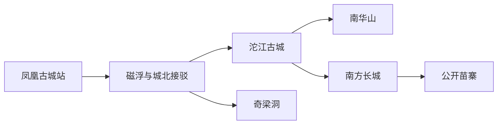
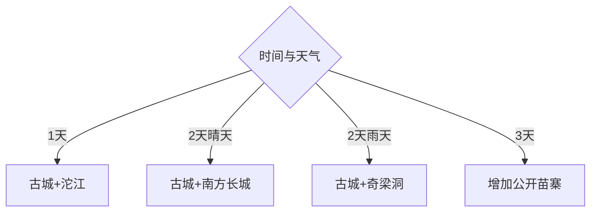

# 凤凰旅行指南

凤凰的核心是沱江两岸古城，但县域旅行还包括南华山、奇梁洞、南方长城和苗乡。第一次来可把古城日景、夜景与一条郊外线组合成2—3天；旺季先锁定住宿与交通，再按天气挑山地或洞穴。

## 城市速览

| 项目 | 信息 |
|---|---|
| 主线 | 凤凰古城—沱江—南华山—奇梁洞—南方长城—苗乡 |
| 停留 | 古城1天；加一条郊外线共2天，深游3天 |
| 住宿 | 古城外围交通方便；沱江沿岸看夜景；高铁站周边适合早晚到达 |
| 交通 | 凤凰古城站接磁浮、公交或合规车辆，郊外景点按方向包车 |
| 风险 | 石板路湿滑、临水夜游、山地雷雨、节假日客流与商业项目价格 |
| 边界 | 古城文保建筑、苗疆边墙、宗祠民居和村寨生活空间按开放范围参观 |

## 城市格局与游览区域

固定 **Fenghuang / GeoNames 7304020** 位于湘西土家族苗族自治州凤凰县，本页以县级实体 `Q664864` 锁定范围。古城适合步行，奇梁洞在城北，南方长城与村寨需要公路交通；把门票景点、公共街巷和商业演艺分开预算，会比购买模糊套票更清楚。

## 主要景点

| 景点 | 区域 | 类型 | 核心体验 | 用时 | 环境 | 体力 | 研究价值 | 拥挤 | 优先级 |
|---|---|---|---|---:|---|---|---|---|---|
| 凤凰古城公共街巷 | 沱江两岸 | 历史街区 | 城门、石板巷、吊脚楼外观与生活街区 | 半日至1天 | 室外 | 中 | 很高 | 旺季很高 | A |
| 沱江公开步道与桥梁 | 古城 | 滨水景观 | 两岸步行、晨雾与夜景 | 2–4小时 | 室外 | 中 | 高 | 夜间高 | A |
| 古城九景开放点位 | 古城 | 文博古建 | 沈从文故居、城楼等联票点位 | 半日 | 混合 | 中 | 很高 | 高 | A |
| 南华山景区 | 古城南侧 | 山地观景 | 俯瞰古城与森林步道 | 3–5小时 | 室外 | 中高 | 高 | 中 | B |
| 奇梁洞 | 城北 | 溶洞 | 地下河、钟乳石与洞穴空间 | 2–3小时 | 室内 | 中 | 高 | 旺季高 | B |
| 南方长城开放景区 | 阿拉营方向 | 防御遗产 | 苗疆边墙格局与山岭视野 | 半日 | 室外 | 中高 | 很高 | 中 | B |
| 凤凰县博物馆或县级展陈 | 县城 | 地方文博 | 县史、民族文化与文物脉络 | 1.5–3小时 | 室内 | 低 | 很高 | 低 | B |
| 正规运营苗寨 | 县域乡村 | 社区文化 | 建筑、银饰、服饰与节庆解说 | 半日至1天 | 混合 | 中 | 高 | 团队时高 | C |

## 美食与餐饮

古城可选血粑鸭、酸汤、腊肉、社饭和米豆腐，先问份量、辣度与价格，再决定堂食或小份试吃。沿河主街适合体验，古城外围更方便比较家常菜与早餐；购买姜糖、腊味等手信时查看配料、保质期和正规标签。

## 经典行程

### 两日基础线
**路线**：古城街巷—九景选点—沱江夜景—次日南华山或奇梁洞。**逻辑**：先完成核心，再按天气选郊外。**预约锚点**：住宿、九景联票与第二日景区。**休息**：沱江两岸茶馆。**删除条件**：雨天删南华山。

### 古城深读线
**路线**：县级展陈—沈从文故居等开放点—城门—沱江。**逻辑**：先建立历史线索，再读街区。**预约锚点**：场馆与联票开放。**休息**：北门或虹桥附近。**删除条件**：客流过高时减少室内小点位。

### 晨昏摄影线
**路线**：清晨沱江—古城巷道—下午南华山—夜间两岸。**逻辑**：避开正午客流并利用光线。**预约锚点**：山景开放与日落时间。**休息**：午后回住宿。**删除条件**：雨雾或雷电时删山顶。

### 奇梁洞半日线
**路线**：城北接驳—奇梁洞开放游线—返回古城。**逻辑**：用室内自然景观平衡天气。**预约锚点**：门票、末班接驳与洞内开放。**休息**：游客中心。**删除条件**：景区临时关闭时改县级展陈。

### 苗疆边墙线
**路线**：南方长城—沿线正式观景点—古城。**逻辑**：理解凤凰区域防御体系。**预约锚点**：车辆、开放段与讲解。**休息**：景区服务区。**删除条件**：强风、雷雨或道路管控时取消。

### 苗乡文化线
**路线**：县城—正规运营苗寨—公开展演或工艺体验—返城。**逻辑**：把社区文化放在有授权的接待场景中。**预约锚点**：运营资质、价格与返程。**休息**：村寨游客中心。**删除条件**：活动信息不透明时改古城文博。

### 低体力线
**路线**：磁浮观景—古城近入口—沱江短段—县级展陈。**逻辑**：用接驳与短步行保留代表体验。**预约锚点**：电梯、落客点与场馆无障碍。**休息**：每站服务区。**删除条件**：石板路湿滑时缩短沿河段。

## 住宿区域

沱江沿岸适合夜景，但需核对台阶、隔音和车辆落客点；古城外围适合公交、餐饮和拉杆箱；高铁站周边更适合晚到早走。节假日订房时确认房型实景、消防通道、退改、接送收费与从落客点到客栈的实际步行距离。

## 市内交通

高铁抵达凤凰古城站后，可比较磁浮、公交、出租与住宿接送的总时间和费用。古城内部以步行为主，行李宜从最近落客点进入；奇梁洞、南方长城和苗寨分属不同方向，合规包车要写明等待、停车、返程和是否含门票。

## 不同旅行者须知

历史兴趣者优先古城展陈与苗疆边墙；摄影者安排清晨、黄昏与高处视角；亲子家庭选磁浮、奇梁洞和短段古城；长者住外围并减少石板台阶；文化体验者选择明码标价的正规村寨项目。拍摄居民、仪式、服饰和室内空间前先征得同意，文保建筑只进入正式开放区域。

## 行前核对

- 核对古城收费点、磁浮、奇梁洞、南方长城、展馆和演艺的当日开放及真实价格。
- 核对高铁末班接驳、住宿落客点、古城客流、降雨、山路与夜间返程。
- 套票逐项确认包含内容，消费保留订单与票据，村寨活动遵循社区拍摄与参观规则。

## 来源与更新记录

| 来源 | 支持内容 | 核验日期 |
|---|---|---|
| [湖南政务：凤凰文旅与县域景点](https://zwfw-new.hunan.gov.cn/hnzwfw/1/15/257/258/content_129440.html) | 古城、奇梁洞、苗寨、边墙与县域交通 | 2026-09-01 |
| [湖南文旅厅：凤凰磁浮交通](https://whhlyt.hunan.gov.cn/whhlyt/news/mtjj/202308/t20230831_29473755.html) | 高铁、磁浮、古城接驳与观景关系 | 2026-09-01 |
| [湖南文旅厅：凤凰线路诚信指导](https://whhlyt.hunan.gov.cn/whhlyt/news/sxxw/201909/t20190910_5472492.html) | 景点体系与旅游消费核对 | 2026-09-01 |
| [GeoNames 7304020](https://www.geonames.org/7304020/) | Fenghuang 固定人口点及坐标 | 2026-09-01 |
| [Wikidata Q664864](https://www.wikidata.org/wiki/Q664864) | 凤凰县实体与跨库标识 | 2026-09-01 |

| 日期 | 更新 |
|---|---|
| 2026-09-01 | 首次完成凤凰旅行研究，按古城、沱江、山洞、边墙和苗乡组织。 |
